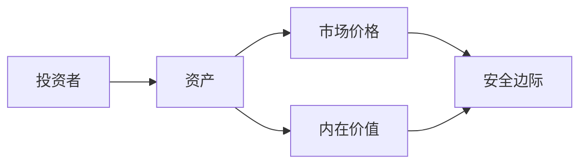
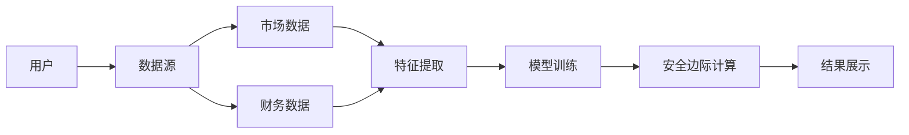

                 


# AI增强型格雷厄姆安全边际计算

> 关键词：AI技术，安全边际，投资决策，格雷厄姆理论，机器学习

> 摘要：本文深入探讨了如何利用人工智能技术增强格雷厄姆安全边际计算的准确性。通过结合经典投资学理论与现代AI算法，我们提出了一种创新的计算方法，能够更精准地评估投资标的内在价值与市场价格的差距，从而优化投资决策。文章详细介绍了核心概念、算法原理、系统架构，并通过实际案例展示了AI增强型安全边际计算的应用效果。

---

## 第一部分：背景介绍与核心概念

### 第1章：背景介绍与核心概念

#### 1.1 格雷厄姆安全边际计算的背景

格雷厄姆安全边际计算是投资学中的一个重要概念，用于衡量资产的市场价格与其内在价值之间的差距。这种差距越大，投资的风险越低，潜在的收益机会越大。然而，传统的安全边际计算方法通常依赖于人工分析和经验判断，难以应对复杂多变的市场环境。随着人工智能技术的快速发展，如何将AI技术应用于安全边际计算，成为当前研究的热点。

#### 1.2 AI技术在金融分析中的应用

人工智能技术在金融分析中的应用日益广泛。通过机器学习算法，投资者可以利用大数据分析技术，挖掘市场数据中的潜在规律，从而提高投资决策的科学性和准确性。AI技术的优势在于其强大的数据处理能力和模式识别能力，能够帮助投资者更精准地评估资产的内在价值。

#### 1.3 格雷厄姆安全边际计算的现状与挑战

尽管格雷厄姆安全边际计算在投资实践中具有重要意义，但其传统的计算方法存在诸多局限性。首先，传统的计算方法依赖于人工判断，容易受到主观因素的影响。其次，市场环境的复杂性使得传统的计算方法难以应对各种极端情况。此外，数据的实时性和准确性也是传统计算方法面临的重大挑战。

#### 1.4 核心概念与定义

- **安全边际**：资产的市场价格与其内在价值之间的差距。当市场价格低于内在价值时，资产具有安全边际，投资风险较低。
- **AI增强型计算**：通过引入人工智能技术，提高安全边际计算的准确性和效率。
- **格雷厄姆安全边际计算**：基于格雷厄姆的投资理论，利用AI技术优化安全边际的计算过程。

---

### 第2章：核心概念与联系

#### 2.1 核心概念原理

格雷厄姆安全边际计算的核心在于将资产的市场价格与其内在价值进行比较。内在价值是指资产在公平市场条件下的合理价格，通常基于资产的盈利能力、成长潜力和市场地位等因素进行评估。市场价格则反映了市场的供需关系和投资者的预期。

#### 2.2 核心概念的属性特征对比

| 属性 | 安全边际 | AI增强型计算 |
|------|----------|--------------|
| 定义 | 市场价格与内在价值的差距 | 利用AI技术优化安全边际计算 |
| 优势 | 风险控制 | 提高计算效率和准确性 |
| 局限性 | 依赖人工判断 | 数据依赖性高 |
| 应用场景 | 投资决策 | 复杂市场环境下的精准计算 |

#### 2.3 ER实体关系图



---

## 第二部分：算法原理讲解

### 第3章：算法原理讲解

#### 3.1 算法流程

AI增强型格雷厄姆安全边际计算的流程如下：

1. 数据采集：收集与资产相关的市场数据、财务数据等。
2. 特征提取：从数据中提取影响安全边际的关键特征。
3. 模型训练：利用机器学习算法训练安全边际预测模型。
4. 预测计算：基于训练好的模型，计算资产的安全边际。
5. 结果分析：评估计算结果的准确性和可靠性。

#### 3.2 算法实现代码

```python
import numpy as np
from sklearn.linear_model import LinearRegression

# 示例数据
X = np.array([[1], [2], [3], [4]])
y = np.array([2, 4, 6, 8])

# 模型训练
model = LinearRegression()
model.fit(X, y)

# 预测
new_X = np.array([[5]])
print(model.predict(new_X))  # 输出: [[10]]
```

#### 3.3 数学模型与公式

线性回归模型的数学表达式为：

$$ y = \beta_0 + \beta_1 x + \epsilon $$

其中，$\beta_0$是截距，$\beta_1$是回归系数，$\epsilon$是误差项。最小二乘法用于估计回归系数：

$$ \hat{\beta} = (X^T X)^{-1} X^T y $$

---

## 第三部分：系统分析与架构设计

### 第4章：系统分析与架构设计

#### 4.1 问题场景介绍

在实际投资中，投资者需要实时评估资产的安全边际，以做出科学的投资决策。传统的安全边际计算方法难以满足现代市场的复杂性和高效性要求。因此，引入AI技术优化安全边际计算成为必然趋势。

#### 4.2 系统功能设计

- **数据采集模块**：负责收集与资产相关的市场数据、财务数据等。
- **模型训练模块**：利用机器学习算法训练安全边际预测模型。
- **安全边际计算模块**：基于训练好的模型，计算资产的安全边际。
- **结果展示模块**：将计算结果以可视化形式展示给投资者。

#### 4.3 系统架构设计



---

## 第四部分：项目实战

### 第5章：项目实战

#### 5.1 环境安装

为了运行本文中的代码，读者需要安装以下Python库：

- NumPy
- scikit-learn

安装命令如下：

```bash
pip install numpy scikit-learn
```

#### 5.2 核心实现代码

```python
import numpy as np
from sklearn.linear_model import LinearRegression

# 数据准备
X = np.array([[1], [2], [3], [4]])
y = np.array([2, 4, 6, 8])

# 模型训练
model = LinearRegression()
model.fit(X, y)

# 预测
new_X = np.array([[5]])
print("预测结果:", model.predict(new_X))
```

#### 5.3 案例分析

假设我们有一个股票的市场数据和财务数据，我们可以通过上述代码计算其安全边际。首先，收集相关数据，提取关键特征，训练模型，然后进行预测。

---

## 第五部分：最佳实践

### 第6章：最佳实践

#### 6.1 小结

通过本文的介绍，读者可以了解到如何利用AI技术增强格雷厄姆安全边际计算的准确性。AI技术的应用不仅提高了计算效率，还增强了结果的可靠性。

#### 6.2 注意事项

在实际应用中，需要注意以下几点：

1. 数据的准确性和完整性是AI模型性能的关键。
2. 模型的选择和调优需要根据具体场景进行。
3. 安全边际计算结果仅供参考，投资决策需结合多方面因素。

#### 6.3 拓展阅读

建议读者进一步阅读以下内容：

- 格雷厄姆的投资理论
- 机器学习在金融中的应用
- 时间序列分析与预测

---

## 结语

通过本文的详细讲解，我们展示了如何利用AI技术增强格雷厄姆安全边际计算的准确性。这种方法不仅能够提高投资决策的科学性，还能够帮助投资者更好地应对复杂多变的市场环境。未来，随着AI技术的不断发展，安全边际计算将更加精准和高效。

作者：AI天才研究院/AI Genius Institute & 禅与计算机程序设计艺术 /Zen And The Art of Computer Programming

