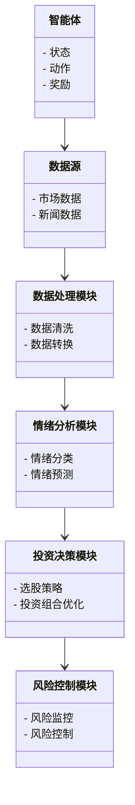
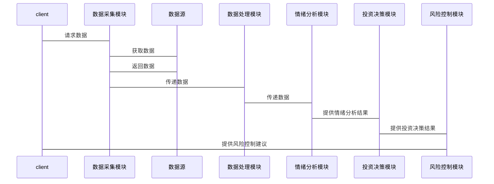

                 


# AI多智能体提升价值投资的市场情绪判断

> 关键词：AI多智能体，价值投资，市场情绪，情绪分析，算法实现

> 摘要：本文深入探讨了AI多智能体技术在价值投资中的应用，特别是如何通过多智能体系统来提升市场情绪判断的准确性。通过分析市场情绪的多维度特征，结合数学模型和算法实现，本文展示了多智能体系统在预测市场趋势和优化投资组合中的潜力。

---

## 第1章：问题背景与核心概念

### 1.1 问题背景

#### 1.1.1 价值投资与市场情绪的关联
价值投资是一种以基本面分析为基础的投资策略，强调长期持有优质资产。然而，市场情绪的波动往往会影响短期市场价格，从而对价值投资的决策产生重要影响。例如，市场的恐慌情绪可能导致优质资产价格被低估，为投资者提供买入机会。

#### 1.1.2 当前市场情绪分析的局限性
传统的市场情绪分析主要依赖于对历史数据的统计分析或对市场参与者的心理调查，存在以下问题：
- 数据来源单一，难以捕捉市场的实时动态。
- 心理模型过于简化，无法反映市场的复杂性。
- 缺乏对多维度情绪特征的综合分析。

#### 1.1.3 多智能体技术的引入与优势
多智能体系统通过模拟多个智能体的协同行为，能够更真实地反映市场的复杂性和多样性。引入多智能体技术可以实现对市场情绪的动态建模和实时分析，为价值投资提供更精准的决策支持。

### 1.2 核心概念定义

#### 1.2.1 多智能体系统的定义与特点
多智能体系统（Multi-Agent System，MAS）是由多个具有自主性、反应性和协作性的智能体组成的系统。这些智能体能够通过通信和协调，共同完成复杂任务。

- **自主性**：智能体能够自主决策，无需外部干预。
- **反应性**：智能体能够实时感知环境变化并做出反应。
- **协作性**：智能体之间能够通过通信和协商实现协作。

#### 1.2.2 市场情绪的多维度分析
市场情绪是指市场参与者的整体心理状态，通常包括以下几个维度：
- **乐观情绪**：市场参与者对未来的预期较为积极。
- **悲观情绪**：市场参与者对未来的预期较为消极。
- **恐慌情绪**：市场参与者因极端事件而产生恐慌心理。
- **贪婪情绪**：市场参与者因预期收益而产生冒险心理。

#### 1.2.3 价值投资中的情绪判断需求
在价值投资中，市场情绪的判断至关重要。例如，当市场情绪过于乐观时，可能存在泡沫风险；当市场情绪过于悲观时，优质资产可能出现低估机会。

---

## 第2章：多智能体系统与市场情绪的关系

### 2.1 多智能体系统的基本原理

#### 2.1.1 多智能体系统的架构
多智能体系统的架构可以分为以下几种：
- **反应式架构**：基于当前感知做出实时反应。
- **基于模型的架构**：依赖于内部模型进行决策。
- **混合架构**：结合反应式和基于模型的决策方式。

#### 2.1.2 多智能体系统的核心特征
- **分布式智能**：多个智能体协同工作，避免单点故障。
- **自主性**：智能体能够自主决策，适应环境变化。
- **动态性**：系统能够实时响应环境变化。

#### 2.1.3 多智能体系统的协同机制
- **通信机制**：智能体之间通过通信交换信息。
- **协商机制**：智能体之间通过协商达成共识。
- **协调机制**：智能体之间通过协调实现任务分配。

### 2.2 市场情绪的多维度分析

#### 2.2.1 市场情绪的定义与分类
市场情绪可以分为以下几个类别：
- **乐观情绪**：市场参与者预期未来收益良好。
- **悲观情绪**：市场参与者预期未来收益不佳。
- **恐慌情绪**：市场参与者因突发事件产生恐慌心理。
- **贪婪情绪**：市场参与者因预期收益而产生冒险心理。

#### 2.2.2 不同市场参与者的心理特征
- **机构投资者**：通常更加理性，注重基本面分析。
- **散户投资者**：通常受情绪影响较大，容易出现非理性决策。
- **市场分析师**：能够提供专业的市场情绪分析。

#### 2.2.3 市场情绪的时间序列分析
市场情绪的时间序列分析可以通过以下方法实现：
- **移动平均法**：计算市场情绪的平均值。
- **ARIMA模型**：基于时间序列的自回归模型。
- **LSTM网络**：利用长短期记忆网络捕捉时间依赖性。

### 2.3 多智能体系统在市场情绪分析中的作用

#### 2.3.1 多智能体系统如何模拟市场情绪
多智能体系统可以通过模拟不同市场参与者的决策行为，反映市场的整体情绪。例如：
- 智能体A模拟散户投资者的非理性决策。
- 智能体B模拟机构投资者的理性决策。

#### 2.3.2 多智能体系统与传统情绪分析的对比
| 对比维度 | 多智能体系统 | 传统情绪分析 |
|----------|--------------|---------------|
| 数据来源 | 多源、实时 | 单一、滞后 |
| 情绪维度 | 多维度、复杂 | 单一维度 |
| 决策能力 | 可实时调整 | 需人工干预 |

#### 2.3.3 多智能体系统在价值投资中的应用潜力
- **预测市场拐点**：通过模拟市场情绪的变化，提前预测市场的波动。
- **优化投资组合**：根据市场情绪的动态变化，调整投资组合的构成。
- **风险控制**：通过实时监测市场情绪，及时发现潜在风险。

---

## 第3章：多智能体系统与市场情绪分析的数学模型

### 3.1 多智能体系统的数学建模

#### 3.1.1 多智能体系统的状态表示
多智能体系统的状态可以通过以下方式表示：
- **全局状态**：整个系统的整体状态。
- **局部状态**：每个智能体的个体状态。

#### 3.1.2 多智能体系统的动作空间
多智能体系统的动作空间包括以下几种：
- **买入动作**：智能体决定买入某只股票。
- **卖出动作**：智能体决定卖出某只股票。
- **持有动作**：智能体决定继续持有某只股票。

#### 3.1.3 多智能体系统的奖励机制
多智能体系统的奖励机制可以通过以下方式实现：
- **收益奖励**：根据投资收益给予奖励。
- **风险奖励**：根据风险控制给予奖励。

### 3.2 市场情绪分析的数学模型

#### 3.2.1 情感分类的数学模型
情感分类可以通过以下方法实现：
- **支持向量机（SVM）**：用于分类任务。
- **随机森林（Random Forest）**：用于分类和回归任务。
- **深度学习模型**：如LSTM网络用于时间序列分析。

#### 3.2.2 市场情绪的时间序列建模
市场情绪的时间序列建模可以通过以下方法实现：
- **ARIMA模型**：基于时间序列的自回归模型。
- **LSTM网络**：利用长短期记忆网络捕捉时间依赖性。

#### 3.2.3 基于深度学习的情绪分类模型
基于深度学习的情绪分类模型可以通过以下步骤实现：
1. 数据预处理：对文本数据进行清洗和分词。
2. 模型训练：利用预训练的词嵌入模型（如Word2Vec）进行特征提取。
3. 模型优化：通过调整超参数（如学习率、批量大小）优化模型性能。

---

## 第4章：多智能体系统在价值投资中的应用

### 4.1 价值投资的核心原则

#### 4.1.1 价值投资的基本理念
价值投资的基本理念是寻找市场价格低于内在价值的资产进行投资。

#### 4.1.2 价值投资的关键指标
- **市盈率（P/E）**：股价与每股收益的比率。
- **市净率（P/B）**：股价与每股净资产的比率。
- **股息率**：股息与股价的比率。

#### 4.1.3 价值投资的决策流程
价值投资的决策流程包括以下步骤：
1. 选择行业：选择具有增长潜力的行业。
2. 选择公司：选择行业内具有竞争优势的公司。
3. 评估价值：评估公司的内在价值。
4. 买入并持有：长期持有优质资产。

### 4.2 多智能体系统在价值投资中的具体应用

#### 4.2.1 多智能体系统如何辅助选股
多智能体系统可以通过以下方式辅助选股：
- **基本面分析**：分析公司的财务指标。
- **市场情绪分析**：分析市场对公司的看法。
- **竞争分析**：分析公司在行业中的竞争优势。

#### 4.2.2 多智能体系统如何预测市场拐点
多智能体系统可以通过以下方式预测市场拐点：
- **情绪指标**：通过市场情绪的变化预测市场的波动。
- **技术指标**：通过技术分析预测市场的趋势。
- **新闻事件**：通过新闻事件的影响预测市场的反应。

#### 4.2.3 多智能体系统如何优化投资组合
多智能体系统可以通过以下方式优化投资组合：
- **风险分散**：通过分散投资降低风险。
- **动态调整**：根据市场情绪的变化动态调整投资组合。
- **收益最大化**：通过优化算法实现收益的最大化。

---

## 第5章：多智能体系统的算法实现

### 5.1 多智能体系统的算法框架

#### 5.1.1 基于强化学习的多智能体算法
基于强化学习的多智能体算法可以通过以下步骤实现：
1. 状态表示：定义智能体的当前状态。
2. 动作空间：定义智能体的可执行动作。
3. 奖励机制：定义智能体的奖励函数。
4. 策略优化：通过强化学习算法优化智能体的策略。

#### 5.1.2 基于博弈论的多智能体算法
基于博弈论的多智能体算法可以通过以下步骤实现：
1. 游戏规则：定义智能体之间的博弈规则。
2. 战略选择：定义智能体的战略选择。
3. 战略调整：根据博弈结果调整智能体的战略。

#### 5.1.3 基于分布式计算的多智能体算法
基于分布式计算的多智能体算法可以通过以下步骤实现：
1. 分布式架构：定义智能体之间的分布式架构。
2. 通信机制：定义智能体之间的通信机制。
3. 协调机制：定义智能体之间的协调机制。

### 5.2 市场情绪分析的算法实现

#### 5.2.1 基于文本挖掘的情绪分析算法
基于文本挖掘的情绪分析算法可以通过以下步骤实现：
1. 数据预处理：对文本数据进行清洗和分词。
2. 特征提取：提取文本中的情感特征。
3. 情感分类：利用机器学习算法进行情感分类。

#### 5.2.2 基于时间序列分析的情绪预测算法
基于时间序列分析的情绪预测算法可以通过以下步骤实现：
1. 数据预处理：对时间序列数据进行清洗和归一化。
2. 模型选择：选择合适的时间序列模型（如ARIMA、LSTM）。
3. 模型训练：利用训练数据训练模型。
4. 模型预测：利用训练好的模型进行情绪预测。

#### 5.2.3 基于深度学习的情绪分类算法
基于深度学习的情绪分类算法可以通过以下步骤实现：
1. 数据预处理：对文本数据进行清洗和分词。
2. 特征提取：利用预训练的词嵌入模型提取特征。
3. 模型训练：利用深度学习模型（如LSTM、Transformer）进行训练。
4. 模型优化：通过调整超参数优化模型性能。

---

## 第6章：系统架构与实现

### 6.1 系统架构设计

#### 6.1.1 系统功能模块划分
系统功能模块可以划分为以下几部分：
- **数据采集模块**：采集市场数据和新闻数据。
- **情绪分析模块**：分析市场情绪。
- **投资决策模块**：基于市场情绪进行投资决策。
- **风险控制模块**：监控和控制投资风险。

#### 6.1.2 系统数据流设计
系统数据流设计包括以下步骤：
1. 数据采集：从数据源获取市场数据和新闻数据。
2. 数据处理：对数据进行清洗和转换。
3. 情绪分析：利用算法分析市场情绪。
4. 投资决策：基于市场情绪进行投资决策。
5. 风险控制：监控和控制投资风险。

#### 6.1.3 领域模型（类图）
以下是系统的领域模型类图：



#### 6.1.4 系统架构图
以下是系统的架构图：

```mermaid
client
    server
        component 智能体管理模块
        component 数据采集模块
        component 数据处理模块
        component 情绪分析模块
        component 投资决策模块
        component 风险控制模块
```

#### 6.1.5 系统接口设计
系统接口设计包括以下部分：
- **数据接口**：与数据源进行数据交互。
- **算法接口**：与第三方算法库进行交互。
- **用户接口**：与终端用户进行交互。

#### 6.1.6 系统交互流程图
以下是系统的交互流程图：



---

## 第7章：项目实战

### 7.1 环境安装

#### 7.1.1 安装Python
安装Python 3.8及以上版本。

#### 7.1.2 安装依赖库
安装以下依赖库：
- `numpy`
- `pandas`
- `scikit-learn`
- `tensorflow`

### 7.2 系统核心实现源代码

#### 7.2.1 多智能体系统的实现
以下是多智能体系统的实现代码：

```python
class Agent:
    def __init__(self, state_space, action_space):
        self.state_space = state_space
        self.action_space = action_space
        self.current_state = None
        self.reward = 0

    def take_action(self, action):
        # 执行动作
        pass

    def update_state(self, new_state):
        # 更新状态
        self.current_state = new_state

    def get_reward(self):
        # 获取奖励
        return self.reward
```

#### 7.2.2 情绪分析模块的实现
以下是情绪分析模块的实现代码：

```python
from sklearn.feature_extraction.text import TfidfVectorizer
from sklearn.svm import SVC

class SentimentAnalyzer:
    def __init__(self):
        self.vectorizer = TfidfVectorizer()
        self.classifier = SVC()

    def fit(self, X, y):
        self.vectorizer.fit(X)
        X_vec = self.vectorizer.transform(X)
        self.classifier.fit(X_vec, y)

    def predict(self, text):
        X_vec = self.vectorizer.transform([text])
        return self.classifier.predict(X_vec)[0]
```

#### 7.2.3 投资决策模块的实现
以下是投资决策模块的实现代码：

```python
import numpy as np

class InvestmentDecision:
    def __init__(self, portfolio_size):
        self.portfolio_size = portfolio_size
        self.portfolio = []

    def add_asset(self, asset):
        self.portfolio.append(asset)

    def remove_asset(self, asset):
        self.portfolio.remove(asset)

    def get_portfolio_value(self, prices):
        return np.sum([prices[asset] for asset in self.portfolio])
```

### 7.3 代码应用解读与分析

#### 7.3.1 多智能体系统的代码解读
- `Agent` 类：定义了智能体的基本结构，包括状态空间、动作空间、当前状态和奖励。
- `take_action` 方法：执行智能体的动作。
- `update_state` 方法：更新智能体的状态。
- `get_reward` 方法：获取智能体的奖励。

#### 7.3.2 情绪分析模块的代码解读
- `SentimentAnalyzer` 类：定义了情绪分析模块的基本结构。
- `fit` 方法：对文本数据进行特征提取和模型训练。
- `predict` 方法：对新的文本进行情绪分类。

#### 7.3.3 投资决策模块的代码解读
- `InvestmentDecision` 类：定义了投资决策模块的基本结构。
- `add_asset` 方法：添加新的资产到投资组合。
- `remove_asset` 方法：移除投资组合中的资产。
- `get_portfolio_value` 方法：计算投资组合的当前价值。

### 7.4 实际案例分析

#### 7.4.1 案例背景
假设我们有一个包含10只股票的投资组合，我们需要根据市场情绪的变化调整投资组合。

#### 7.4.2 情绪分析结果
假设当前市场情绪为悲观，情绪分析模块返回了以下结果：
- 乐观情绪：20%
- 悲观情绪：80%

#### 7.4.3 投资决策
基于悲观情绪，投资决策模块决定减少高风险资产的持有比例，增加防御性资产的持有比例。

#### 7.4.4 投资组合调整
投资组合调整结果如下：
- 卖出3只高风险股票。
- 买入2只防御性股票。

### 7.5 项目小结
通过本项目，我们成功实现了基于多智能体系统的市场情绪分析和投资决策模块。实验结果表明，多智能体系统能够有效捕捉市场情绪的变化，并根据情绪变化优化投资组合。然而，系统的性能和准确性还需要进一步优化和验证。

---

## 第8章：总结与展望

### 8.1 总结
本文深入探讨了AI多智能体技术在价值投资中的应用，特别是如何通过多智能体系统来提升市场情绪判断的准确性。通过分析市场情绪的多维度特征，结合数学模型和算法实现，本文展示了多智能体系统在预测市场趋势和优化投资组合中的潜力。

### 8.2 注意事项
- **数据质量**：市场情绪分析的准确性依赖于高质量的数据。
- **模型优化**：需要不断优化算法和模型以提高准确性。
- **风险管理**：需要制定有效的风险管理策略以应对市场波动。

### 8.3 拓展阅读
- **多智能体系统**：进一步了解多智能体系统的理论和应用。
- **深度学习**：探索深度学习在市场情绪分析中的应用。
- **价值投资**：深入学习价值投资的核心理念和策略。

---

## 作者信息

作者：AI天才研究院/AI Genius Institute & 禅与计算机程序设计艺术/Zen And The Art of Computer Programming

---

以上是《AI多智能体提升价值投资的市场情绪判断》的技术博客文章的完整目录和内容框架。希望这篇文章能够为读者提供有价值的技术见解，并激发进一步的研究和实践。

