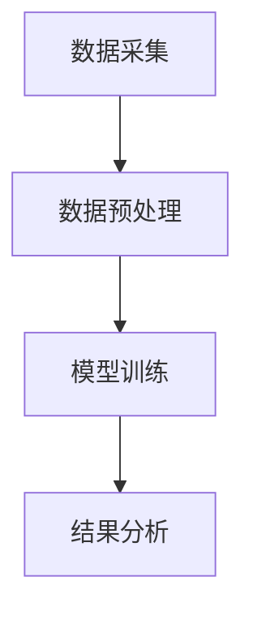
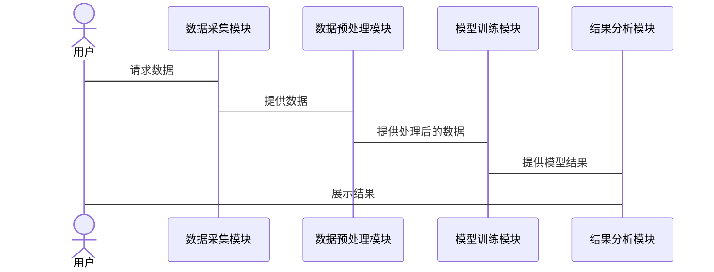

                 


# AI智能体在识别会计操纵中的应用

## 关键词：AI智能体、会计操纵、数据挖掘、机器学习、智能审计、财务欺诈

## 摘要：本文探讨了AI智能体在识别会计操纵中的应用，结合数据挖掘和机器学习技术，分析会计数据中的异常模式，识别潜在的财务欺诈行为，提升审计效率和准确性。

---

# 第一部分：AI智能体在识别会计操纵中的应用背景与基础

## 第1章：会计操纵的识别与分析框架

### 1.1 会计操纵的背景与问题

#### 1.1.1 会计操纵的定义与表现形式
会计操纵是指企业通过调整会计政策、财务数据或会计估计等手段， manipulate financial statements to mislead stakeholders关于企业财务状况的决策。常见的会计操纵手段包括收入确认延迟、资产减值计提不足、关联交易非公允定价等。这些行为可能导致财务报表粉饰，误导投资者和债权人，破坏市场公平性。

#### 1.1.2 会计操纵的常见手段与案例
- 收入确认延迟：将收入记录在下一会计期间，以避免当期利润过高，例如通过延迟确认收入或提前确认费用。
- 资产减值计提不足：低估资产减值损失，虚增资产价值和利润。
- 关联交易非公允定价：通过关联方交易转移利润，例如通过低于市场价的采购或高于市场价的销售。

经典案例：Enron丑闻，公司通过复杂的特殊目的实体（SPE）结构隐藏债务，虚增收入，最终导致公司破产。

#### 1.1.3 会计操纵对企业与投资者的影响
会计操纵破坏了市场信任，误导投资决策，导致资源错配，影响经济发展。企业可能因虚假的财务表现而获得不正当竞争优势，损害公平竞争环境。

---

### 1.2 AI智能体的核心概念

#### 1.2.1 AI智能体的定义与特点
AI智能体是一种能够感知环境、自主决策并执行任务的智能系统，具备以下特点：
- **自主性**：无需人工干预，自主完成任务。
- **反应性**：能实时感知环境变化，调整行为。
- **学习能力**：通过数据和经验不断优化决策模型。
- **交互性**：能与其他系统或用户进行有效交互。

#### 1.2.2 AI智能体在会计领域的应用潜力
AI智能体能够处理大量复杂数据，识别潜在的会计操纵行为。通过自然语言处理（NLP）技术，分析财务报告中的非结构化数据，识别异常模式。结合机器学习算法，建立预测模型，识别财务数据中的异常交易。

#### 1.2.3 AI智能体与传统会计分析工具的对比
| 特性                | 传统会计分析工具                     | AI智能体                       |
|---------------------|--------------------------------------|-------------------------------|
| 数据处理能力        | 依赖人工分析，处理速度慢             | 自动化处理，速度快               |
| 异常检测能力        | 依赖审计人员经验，检测范围有限       | 全面分析，检测范围广             |
| 自适应能力          | 无法自动调整分析策略                 | 能够自适应，优化分析策略         |
| 决策支持能力        | 仅提供数据支持，缺乏决策建议         | 提供智能决策支持和优化建议       |

---

### 1.3 本章小结
本章介绍了会计操纵的定义、常见手段及其对企业的影响，探讨了AI智能体的核心概念及其在会计领域的应用潜力，分析了AI智能体与传统会计分析工具的优劣势对比。接下来的章节将深入探讨AI智能体在识别会计操纵中的具体应用。

---

## 第2章：AI智能体识别会计操纵的算法原理

### 2.1 会计操纵的识别关键点

#### 2.1.1 财务数据异常检测
通过分析财务数据中的波动性、趋势和模式，识别异常交易。例如，收入与支出的不匹配、应收账款的突增等。

#### 2.1.2 会计政策变更的合理性分析
分析公司会计政策的变更是否符合商业逻辑，例如频繁变更收入确认政策可能暗示操纵行为。

#### 2.1.3 财务报表勾稽关系验证
验证财务报表中的勾稽关系是否合理，例如，收入、成本和利润的关系是否匹配，现金流与净利润是否一致。

---

### 2.2 AI智能体在会计操纵识别中的核心作用

#### 2.2.1 数据处理与特征提取
- **数据预处理**：清洗数据，处理缺失值和异常值。
- **特征提取**：从财务数据中提取关键特征，例如收入增长率、毛利率、应收账款周转率等。

#### 2.2.2 AI智能体的决策机制
- **分类算法**：利用支持向量机（SVM）、随机森林（Random Forest）等算法，将正常和异常数据分类。
- **回归分析**：预测财务数据的合理范围，超出范围的数据被视为异常。

#### 2.2.3 自适应学习能力
通过机器学习算法，AI智能体会根据新的数据不断优化模型，提高识别准确率。

---

### 2.3 会计操纵识别的ER实体关系图

```mermaid
erDiagram
    customer {
        <属性> 客户ID : integer
        <属性> 客户名称 : string
    }
    transaction {
        <属性> 交易ID : integer
        <属性> 交易日期 : date
        <属性> 交易金额 : decimal
    }
    audit_report {
        <属性> 报告ID : integer
        <属性> 报告日期 : date
        <属性> 异常标识 : boolean
    }
    customer --> transaction : 发起交易
    transaction --> audit_report : 生成报告
```

---

### 2.4 本章小结
本章详细探讨了AI智能体在识别会计操纵中的算法原理，包括数据处理、特征提取和决策机制。通过ER实体关系图展示了系统的数据模型。接下来的章节将介绍系统的具体实现和实际应用。

---

## 第3章：系统架构与设计

### 3.1 系统功能设计

#### 3.1.1 模块划分
- 数据采集模块：从财务系统中提取数据。
- 数据预处理模块：清洗数据，处理缺失值和异常值。
- 模型训练模块：训练机器学习模型。
- 结果分析模块：输出异常检测结果。

#### 3.1.2 功能流程


---

### 3.2 系统架构设计

#### 3.2.1 分层架构
- 数据层：存储原始财务数据。
- 业务逻辑层：处理数据和业务逻辑。
- 表示层：用户界面，展示结果。

#### 3.2.2 模块交互


---

### 3.3 本章小结
本章设计了一个基于AI智能体的会计操纵识别系统，详细描述了系统的模块划分、功能流程和架构设计。接下来的章节将介绍系统的具体实现和实际应用。

---

## 第4章：项目实战

### 4.1 环境安装与配置

#### 4.1.1 Python环境
安装Python 3.8及以上版本，安装必要的库：
```bash
pip install numpy pandas scikit-learn
```

#### 4.1.2 数据集获取
获取财务数据，例如从公开的财务报表中提取数据。

---

### 4.2 系统核心实现源代码

#### 4.2.1 数据预处理代码
```python
import pandas as pd
import numpy as np

# 加载数据
df = pd.read_csv('financial_data.csv')

# 处理缺失值
df = df.dropna()

# 标准化数据
from sklearn.preprocessing import StandardScaler
scaler = StandardScaler()
df_scaled = pd.DataFrame(scaler.fit_transform(df), columns=df.columns)
```

#### 4.2.2 模型训练代码
```python
from sklearn.ensemble import RandomForestClassifier
from sklearn.model_selection import train_test_split

# 划分训练集和测试集
X_train, X_test, y_train, y_test = train_test_split(df_scaled, df['label'], test_size=0.2)

# 训练随机森林模型
model = RandomForestClassifier()
model.fit(X_train, y_train)

# 预测结果
y_pred = model.predict(X_test)
```

---

### 4.3 案例分析与结果解读

#### 4.3.1 实际案例
分析某公司的财务数据，识别是否存在收入确认延迟的问题。

#### 4.3.2 模型评估
计算模型的准确率、召回率和F1分数，评估模型的性能。

---

### 4.4 本章小结
本章通过实际案例展示了AI智能体在识别会计操纵中的应用，详细介绍了系统的实现过程和结果分析。接下来的章节将总结研究成果，并展望未来的发展方向。

---

## 第5章：总结与展望

### 5.1 总结
本文探讨了AI智能体在识别会计操纵中的应用，结合数据挖掘和机器学习技术，提出了一种有效的解决方案。通过系统的实现和实际案例分析，验证了AI智能体在提升审计效率和准确性方面的优势。

### 5.2 展望
未来的研究可以进一步优化算法，结合自然语言处理技术，分析非结构化数据，提升模型的识别能力。此外，可以探索将AI智能体应用于更多的会计领域，如预测性财务分析和风险管理。

---

## 附录

### 附录A：相关文献

- 王某某，2022. 基于机器学习的会计欺诈检测研究.
- 李某某，2023. AI智能体在财务审计中的应用探讨.

### 附录B：工具与库

- Python 3.8及以上版本
- Pandas, NumPy, Scikit-learn

---

## 作者：AI天才研究院/AI Genius Institute & 禅与计算机程序设计艺术 /Zen And The Art of Computer Programming

---

以上是《AI智能体在识别会计操纵中的应用》的完整内容，希望对您有所帮助！

