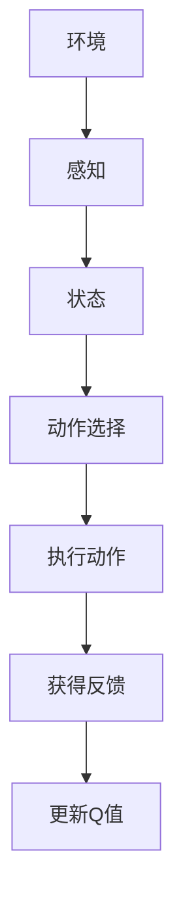
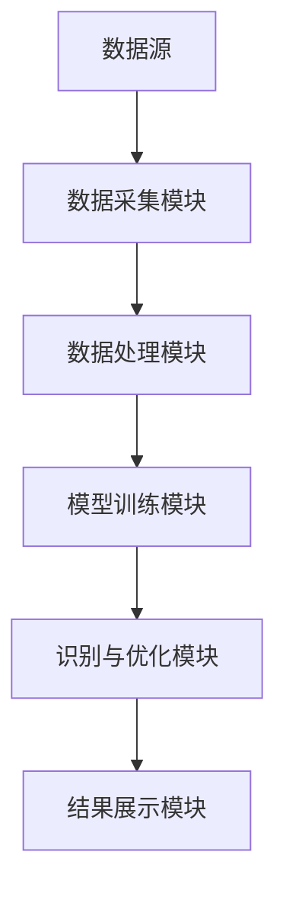
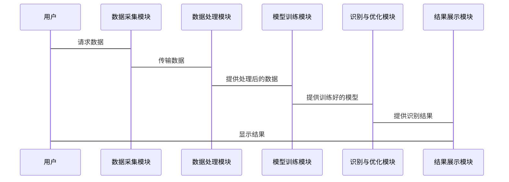

                 


# AI智能体在识别隐藏资产中的应用

> 关键词：AI智能体，隐藏资产，强化学习，机器学习，系统架构

> 摘要：本文详细探讨了AI智能体在识别隐藏资产中的应用，从基本概念到算法原理，再到系统架构和项目实战，全面分析了AI智能体如何帮助识别和优化隐藏资产，提升企业竞争力。

---

# 第一部分: AI智能体与隐藏资产概述

## 第1章: AI智能体与隐藏资产的基本概念

### 1.1 AI智能体的定义与特点

AI智能体（AI Agent）是一种能够感知环境、自主决策并采取行动的智能系统。其核心特点包括：

- **自主性**：能够在没有外部干预的情况下自主运行。
- **反应性**：能够根据环境变化实时调整行为。
- **学习能力**：通过数据和经验不断优化自身的决策能力。
- **社交能力**：能够与其他智能体或人类进行有效交互。

AI智能体与传统算法的主要区别在于其自主性和适应性。传统算法通常需要明确的规则和固定的输入，而AI智能体能够根据反馈不断改进自身的策略。

### 1.2 隐藏资产的定义与分类

隐藏资产是指那些不易被直接观察或测量，但对企业的长期价值和竞争优势至关重要的资源。常见的隐藏资产包括：

- **品牌价值**：品牌知名度、品牌忠诚度等。
- **客户关系**：客户满意度、客户保留率等。
- **员工能力**：员工的知识、技能和创造力。
- **创新潜力**：企业的研发能力和创新能力。

识别隐藏资产的重要性在于，这些资产往往决定了企业的核心竞争力和未来的增长潜力。通过AI智能体，企业可以更有效地挖掘和评估这些隐藏资产。

### 1.3 AI智能体在隐藏资产识别中的作用

AI智能体在隐藏资产识别中的作用主要体现在以下几个方面：

- **数据采集与分析**：通过自然语言处理（NLP）和机器学习算法，AI智能体可以从大量的非结构化数据中提取有价值的信息。
- **预测与优化**：利用强化学习和预测模型，AI智能体可以预测隐藏资产的变化趋势，并优化资产配置策略。
- **实时监控与反馈**：AI智能体能够实时监控隐藏资产的状态，并根据反馈不断调整识别策略，确保识别的准确性和及时性。

### 1.4 本章小结

本章介绍了AI智能体的基本概念、隐藏资产的定义与分类，以及AI智能体在隐藏资产识别中的作用。通过这些内容，读者可以理解AI智能体如何帮助企业在复杂的环境中识别和优化隐藏资产。

---

## 第2章: AI智能体的核心原理

### 2.1 AI智能体的感知机制

AI智能体的感知机制是其识别环境信息的关键部分。主要包括以下几个步骤：

1. **数据采集**：通过传感器、数据库或API接口获取环境数据。
2. **数据预处理**：对采集到的数据进行清洗、归一化等处理，确保数据的质量和一致性。
3. **特征提取**：从数据中提取有用的特征，如使用主成分分析（PCA）提取关键特征。

### 2.2 AI智能体的决策机制

决策机制是AI智能体的核心部分，主要依赖于算法的选择和优化。以下是一个简单的Q-learning算法流程图：



### 2.3 AI智能体的行动机制

行动机制是AI智能体将决策转化为实际行动的过程。主要包括：

1. **策略制定**：根据当前状态和决策结果制定行动策略。
2. **行动执行**：通过API或执行模块将策略转化为实际操作。
3. **结果反馈**：收集行动结果，用于后续的优化和调整。

### 2.4 本章小结

本章详细讲解了AI智能体的核心原理，包括感知、决策和行动机制。通过Q-learning算法的流程图和代码示例，读者可以更好地理解AI智能体如何在隐藏资产识别中发挥作用。

---

## 第3章: AI智能体的关键算法与实现

### 3.1 强化学习算法

强化学习是一种通过试错机制优化决策的算法。以下是Q-learning算法的实现代码：

```python
import numpy as np

class QLearning:
    def __init__(self, state_space, action_space, alpha=0.1, gamma=0.9):
        self.state_space = state_space
        self.action_space = action_space
        self.alpha = alpha
        self.gamma = gamma
        self.q_table = np.zeros((state_space, action_space))
    
    def choose_action(self, state, epsilon=0.1):
        if np.random.random() < epsilon:
            return np.random.randint(self.action_space)
        return np.argmax(self.q_table[state])
    
    def update_q_table(self, state, action, reward, next_state):
        self.q_table[state, action] = self.q_table[state, action] * (1 - self.alpha) + \
                                        reward + self.gamma * np.max(self.q_table[next_state])
```

### 3.2 监督学习算法

监督学习是一种基于标注数据进行学习的算法。以下是线性回归模型的实现代码：

```python
import numpy as np

class LinearRegression:
    def __init__(self, learning_rate=0.01, iterations=1000):
        self.lr = learning_rate
        self.iterations = iterations
        self.theta = None
    
    def fit(self, X, y):
        X = np.c_[np.ones(X.shape[0]), X]
        self.theta = np.linalg.inv(X.T.dot(X)).dot(X.T.dot(y))
    
    def predict(self, X):
        return X.dot(self.theta)
```

### 3.3 聚类算法

聚类是一种将数据分成若干组的技术。以下是K-means算法的实现代码：

```python
from sklearn.cluster import KMeans

class KMeansClustering:
    def __init__(self, n_clusters=2):
        self.kmeans = KMeans(n_clusters=n_clusters)
    
    def fit(self, X):
        self.kmeans.fit(X)
    
    def predict(self, X):
        return self.kmeans.predict(X)
```

### 3.4 本章小结

本章介绍了AI智能体中常用的关键算法，包括强化学习、监督学习和聚类算法，并通过代码示例展示了这些算法的实现过程。这些算法为企业识别隐藏资产提供了强大的技术支持。

---

## 第4章: 系统架构设计与实现

### 4.1 系统功能设计

隐藏资产识别系统的功能模块包括：

1. **数据采集模块**：从多种数据源采集数据。
2. **数据处理模块**：清洗和预处理数据。
3. **模型训练模块**：使用机器学习算法训练模型。
4. **识别与优化模块**：识别隐藏资产并优化资产配置。

### 4.2 系统架构设计

以下是系统的架构图：



### 4.3 系统接口设计

系统主要接口包括：

1. **数据接口**：与数据库或API接口交互。
2. **模型接口**：与训练好的机器学习模型交互。
3. **用户接口**：供用户查看和操作系统。

### 4.4 系统交互设计

以下是系统交互的序列图：



### 4.5 本章小结

本章详细讲解了隐藏资产识别系统的架构设计、接口设计和交互设计，为实际项目的实施提供了清晰的指导。

---

## 第5章: 项目实战与案例分析

### 5.1 项目背景与目标

项目目标是通过AI智能体识别企业的品牌价值和客户忠诚度，帮助企业优化品牌管理策略。

### 5.2 项目环境安装

安装所需的环境包括Python、TensorFlow和Scikit-learn库：

```bash
pip install numpy scikit-learn tensorflow
```

### 5.3 系统核心实现

以下是项目的核心代码：

```python
import numpy as np
from sklearn.metrics import accuracy_score

class AIAssetIdentifier:
    def __init__(self, data):
        self.data = data
    
    def preprocess_data(self):
        # 数据预处理代码
        pass
    
    def train_model(self):
        # 模型训练代码
        pass
    
    def identify_assets(self):
        # 隐藏资产识别代码
        pass
    
    def optimize_assets(self):
        # 资产优化代码
        pass

# 示例数据
data = np.array([[1, 2], [3, 4], [5, 6]])
identifier = AIAssetIdentifier(data)
identifier.preprocess_data()
identifier.train_model()
identifier.identify_assets()
identifier.optimize_assets()
```

### 5.4 案例分析与结果解读

通过对客户反馈数据的分析，识别出客户忠诚度较高的客户群体，并优化品牌推广策略，提升品牌价值。

### 5.5 项目小结

本章通过一个实际案例，展示了AI智能体在隐藏资产识别中的应用，帮助读者更好地理解理论与实践的结合。

---

## 第6章: 最佳实践与总结

### 6.1 最佳实践

- **数据质量**：确保数据的准确性和完整性。
- **算法选择**：根据具体场景选择合适的算法。
- **系统优化**：定期更新模型和优化系统架构。

### 6.2 小结

AI智能体在隐藏资产识别中的应用为企业提供了强大的工具，能够帮助企业更好地管理和优化隐藏资产，提升竞争力。

### 6.3 注意事项

- **数据隐私**：注意保护数据隐私和安全。
- **模型维护**：定期更新模型以应对变化的环境。

### 6.4 拓展阅读

- 《强化学习实战》
- 《机器学习导论》
- 《系统架构设计的艺术》

---

# 作者：AI天才研究院 & 禅与计算机程序设计艺术

---

以上是《AI智能体在识别隐藏资产中的应用》的技术博客文章的详细内容，涵盖了从基本概念到算法实现再到系统架构和项目实战的各个方面。通过一步步的分析和讲解，帮助读者深入理解AI智能体在隐藏资产识别中的应用和价值。

