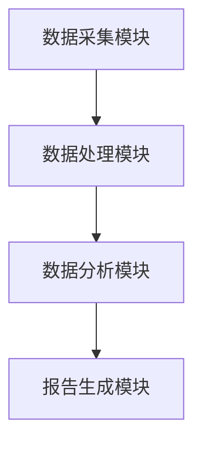

                 


# AI辅助企业品牌声誉管理与危机公关

## 关键词
- 人工智能
- 品牌声誉管理
- 危机公关
- 情感分析
- 自然语言处理

## 摘要
随着数字化时代的到来，企业品牌声誉管理变得越来越复杂，尤其是在危机公关方面。AI技术的应用为企业提供了强大的工具，能够实时监控和分析海量数据，快速识别潜在危机，并制定有效的应对策略。本文将详细探讨AI在品牌声誉管理与危机公关中的应用，涵盖核心算法、系统架构和项目实战，为读者提供深入的技术分析和实践指导。

---

## 第1章：AI与企业声誉管理的背景

### 1.1 企业品牌声誉管理的重要性
企业品牌声誉是企业在市场中的形象和信誉的体现，直接影响客户信任度和市场表现。在数字化时代，消费者通过社交媒体、新闻平台等渠道快速传播信息，品牌的声誉可能在短时间内受到重大影响。传统的声誉管理方法依赖人工分析，效率低下且容易遗漏关键信息。AI技术的引入为企业提供了自动化、智能化的解决方案，能够实时监测和分析海量数据，帮助企业在声誉危机发生前做好准备。

### 1.2 危机公关的核心概念
危机公关是指企业在面临突发事件或负面舆论时，通过有效的沟通和应对策略来减轻负面影响，恢复品牌形象的过程。AI技术在危机公关中的应用主要体现在以下几个方面：
- **预测危机**：通过分析社交媒体和新闻数据，AI能够识别潜在的危机信号。
- **快速响应**：AI可以在短时间内生成应对策略，帮助企业在危机发生时快速行动。
- **监控恢复**：AI持续监测舆论变化，评估危机应对的效果，优化后续策略。

---

## 第2章：AI辅助声誉管理的核心概念与联系

### 2.1 品牌声誉管理的AI技术框架
品牌声誉管理的AI技术框架包括以下几个核心模块：
- **数据采集**：从社交媒体、新闻网站、论坛等渠道收集相关数据。
- **数据处理**：清洗、转换和标注数据，提取关键信息。
- **数据分析**：使用自然语言处理（NLP）技术进行情感分析、主题建模和实体识别。
- **结果输出**：生成报告、预警和应对策略。

### 2.2 AI技术与危机公关的结合
AI技术在危机公关中的应用可以显著提高企业的应对能力。例如，通过情感分析算法，企业可以快速识别负面评论，预测潜在危机。此外，AI还可以自动生成应对方案，帮助企业在危机发生时快速采取行动。

---

## 第3章：AI辅助声誉管理的核心算法与原理

### 3.1 情感分析算法
情感分析是品牌声誉管理中的关键技术，用于判断文本的情感倾向（正面、中性、负面）。常用的情感分析算法包括：
- **基于机器学习的情感分析**：使用支持向量机（SVM）或随机森林（Random Forest）模型，通过特征提取和训练数据进行分类。
- **基于深度学习的情感分析**：使用循环神经网络（RNN）或 transformers（如BERT）模型，能够更好地捕捉上下文信息。

#### 示例代码：
```python
from textblob import TextBlob
text = "The product is excellent!"
blob = TextBlob(text)
print(blob.sentiment.polarity)  # 输出：0.8
```

### 3.2 主题模型与文本聚类
主题模型（如LDA）和文本聚类技术可以帮助企业识别舆论中的主要话题和趋势。例如，通过主题建模，企业可以了解消费者对产品的主要反馈方向，从而有针对性地调整产品策略。

#### 示例代码：
```python
from gensim import corpora, models
import os
import re
import numpy as np
from sklearn.feature_extraction.text import CountVectorizer
from sklearn.decomposition import NMF

# 加载数据
data = [...]  # 具体文本数据

# 特征提取
vectorizer = CountVectorizer(max_features=1000)
X = vectorizer.fit_transform(data)

# 主题建模
nmf = NMF(n_components=5)
nmf.fit_transform(X)

# 可视化主题
for topic in nmf.components_:
    print(f"Topic {i}: {', '.join([vectorizer.get_feature_names()[idx] for idx in topic.argsort()[::-1][:5]])}")
```

---

## 第4章：AI辅助声誉管理的系统架构与设计

### 4.1 系统功能设计
AI辅助声誉管理系统的功能模块包括：
- **数据采集模块**：实时采集社交媒体、新闻等渠道的数据。
- **数据处理模块**：清洗、转换和标注数据。
- **数据分析模块**：使用情感分析、主题建模等算法进行分析。
- **报告生成模块**：生成可视化报告和预警信息。

### 4.2 系统架构设计
系统的架构设计可以采用微服务架构，分为数据采集、数据处理、数据分析和报告生成四个部分。各模块之间通过API进行交互，确保系统的高效运行。

#### 系统架构图（Mermaid）


---

## 第5章：AI辅助声誉管理的项目实战

### 5.1 项目背景与目标
本项目旨在开发一个基于AI的企业声誉管理系统，能够实时监控社交媒体和新闻数据，识别潜在危机，并生成应对策略。

### 5.2 项目实施与代码实现
#### 5.2.1 环境配置与工具安装
- Python 3.8+
- Jupyter Notebook
- gensim、textblob、nltk等库

#### 5.2.2 核心算法实现
- 情感分析：使用TextBlob库进行情感分类。
- 主题建模：使用gensim库进行LDA主题建模。

#### 5.2.3 系统功能实现
- 数据采集：使用API或爬虫技术获取数据。
- 数据处理：清洗数据并提取关键词。
- 数据分析：使用NLP算法进行分析。
- 报告生成：生成可视化报告。

---

## 第6章：AI辅助声誉管理的最佳实践与总结

### 6.1 最佳实践与注意事项
- 数据质量是关键，确保数据的准确性和完整性。
- 模型调优需要结合业务需求，选择合适的算法和参数。
- 系统设计要注重可扩展性和可维护性。

### 6.2 项目小结
通过本项目，我们展示了AI技术在企业品牌声誉管理与危机公关中的应用。从数据采集到系统设计，再到算法实现，AI为企业提供了强大的工具，能够有效提升品牌声誉管理的效率和效果。

---

## 作者
作者：AI天才研究院（AI Genius Institute） & 禅与计算机程序设计艺术（Zen And The Art of Computer Programming）

---

以上是《AI辅助企业品牌声誉管理与危机公关》的技术博客文章的完整内容，涵盖了背景、核心概念、算法、系统架构和项目实战等多个方面，为读者提供了深入的技术分析和实践指导。

