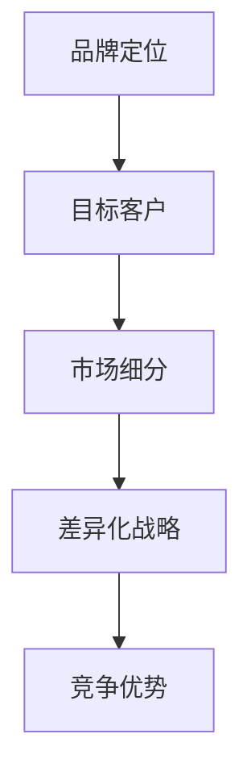
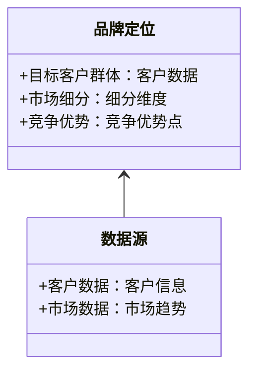

                 


# AI辅助企业品牌定位与差异化战略制定

> 关键词：AI, 品牌定位, 差异化战略, 机器学习, 系统架构, 项目实战

> 摘要：  
本文深入探讨了如何利用人工智能技术辅助企业进行品牌定位与差异化战略的制定。通过分析传统品牌定位的挑战，结合AI技术的优势，本文提出了基于聚类分析和机器学习的定位方法，并详细阐述了系统的架构设计与项目实现。文章内容涵盖背景分析、核心概念、算法原理、系统架构、项目实战及最佳实践，为企业的数字化转型提供了理论支持与实践指导。

---

## 第1章：问题背景与核心概念

### 1.1 问题背景
企业品牌定位是市场竞争中的关键环节，传统方法依赖人工分析，耗时且难以量化。随着数据量的爆炸式增长，AI技术为企业提供了更高效的解决方案。

### 1.2 核心概念与问题描述
品牌定位的核心在于确定目标客户群体和市场定位。差异化战略则是通过独特的产品或服务，在竞争中脱颖而出。

### 1.3 问题解决与边界
AI通过数据挖掘和机器学习，帮助企业在海量数据中发现潜在客户和市场机会，解决传统方法的低效问题。

### 1.4 核心概念的结构与组成
品牌定位的层次模型包括目标客户、市场细分和竞争优势三个层次。

---

## 第2章：核心概念与联系

### 2.1 核心概念的原理
AI通过聚类分析和机器学习模型，帮助企业识别目标客户群体。

### 2.2 核心概念的属性对比
对比分析表明，AI辅助定位在效率和精准度上优于传统方法。

### 2.3 实体关系图


---

## 第3章：AI辅助品牌定位的算法原理

### 3.1 算法原理
聚类分析用于识别市场细分，机器学习模型预测目标客户。

### 3.2 算法实现
使用Python实现聚类分析：

```python
from sklearn.cluster import KMeans

# 数据预处理
X = df[['特征1', '特征2']].values

# 聚类模型
kmeans = KMeans(n_clusters=3, random_state=0)
kmeans.fit(X)
```

---

## 第4章：系统分析与架构设计

### 4.1 领域模型


---

## 第5章：项目实战

### 5.1 项目环境
安装必要的库：`pip install scikit-learn pandas numpy`

### 5.2 核心代码实现
```python
import pandas as pd
from sklearn.cluster import KMeans

# 数据加载
df = pd.read_csv('客户数据.csv')

# 数据预处理
X = df[['年龄', '收入']].values

# 聚类分析
kmeans = KMeans(n_clusters=3)
kmeans.fit(X)

# 可视化
print('簇中心:', kmeans.cluster_centers_)
```

---

## 第6章：最佳实践与小结

### 6.1 最佳实践
定期更新模型，结合市场反馈优化定位策略。

### 6.2 小结
本文通过理论与实践结合，展示了AI在品牌定位中的应用潜力。

---

# 作者：AI天才研究院  
# Zen And The Art of Computer Programming

