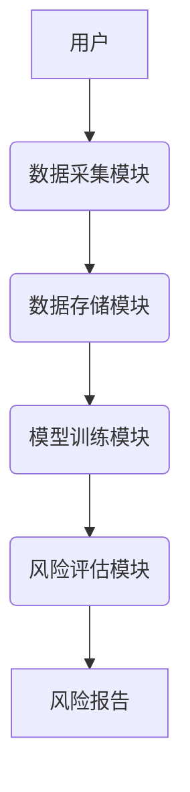

                 


# AI辅助企业并购估值：多维度协同效应量化与风险评估

> 关键词：企业并购，人工智能，协同效应，风险评估，估值模型

> 摘要：本文探讨了人工智能在企业并购估值中的应用，重点分析了协同效应的量化方法和风险评估模型。通过详细的技术分析和实际案例，展示了如何利用AI技术提高并购决策的准确性和效率。

---

## 第一部分: 企业并购与估值概述

### 第1章: 企业并购的基本概念

#### 1.1 企业并购的定义与分类

企业并购（Mergers and Acquisitions, M&A）是指一家企业合并或收购另一家企业，以实现资源整合和价值提升。常见的并购类型包括：

1. **横向并购**：同一行业内的企业合并，旨在扩大市场份额。
2. **纵向并购**：产业链上下游企业的合并，以增强垂直整合能力。
3. **混合并购**：与自身业务无直接关联的企业合并，通常是为了 diversification。

#### 1.2 并购的动机与目标

企业进行并购的动机多种多样，主要包括：

- **市场扩展**：进入新市场或区域。
- **成本节约**：通过规模经济降低成本。
- **技术获取**：获取关键技术或专利。
- **战略防御**：防止竞争对手的扩张。

#### 1.3 并购的流程与关键环节

并购流程通常包括以下几个关键环节：

1. **战略规划**：明确并购目标和动机。
2. **目标筛选**：识别潜在并购目标。
3. **尽职调查**：评估目标企业的财务、法律和运营状况。
4. **估值与定价**：确定目标企业价值。
5. **交易结构设计**：设计并购交易的法律和财务结构。
6. **整合计划**：制定并购后的整合策略。

### 第2章: 企业估值的基本方法

企业估值是并购过程中至关重要的一环，常用的估值方法包括：

#### 1.2.1 市场法

市场法基于市场可比交易数据，通过比较分析确定目标企业价值。公式如下：

$$ 价值 = \frac{目标企业EBITDA}{可比企业平均EBITDA倍数} $$

#### 1.2.2 收益法

收益法基于企业未来现金流折现进行估值：

$$ 价值 = \sum_{t=1}^{n} \frac{CF_t}{(1 + r)^t} $$

其中，\( CF_t \) 是第 \( t \) 年的现金流，\( r \) 是折现率。

#### 1.2.3 资产法

资产法基于企业资产负债表进行估值：

$$ 价值 = \text{净资产价值} = \text{资产价值} - \text{负债价值} $$

#### 1.2.4 各种方法的优缺点对比

| 方法 | 优点 | 缺点 |
|------|------|------|
| 市场法 | 快速、基于市场数据 | 需要有可比交易 |
| 收益法 | 精确、考虑未来现金流 | 需要准确预测现金流 |
| 资产法 | 简单、直接 | 忽略企业价值创造能力 |

---

## 第二部分: 协同效应的定义与重要性

### 第3章: 协同效应的定义与度量

#### 3.1 协同效应的定义

协同效应是指并购后企业通过资源整合实现的价值提升，通常表现为成本节约或收入增加。

#### 3.2 协同效应的类型

1. **成本协同效应**：通过合并运营降低成本。
2. **收入协同效应**：通过产品组合扩展增加收入。

#### 3.3 协同效应的度量方法

协同效应的度量可以通过以下公式：

$$ \text{协同效应} = \text{并购后价值} - (\text{企业A价值} + \text{企业B价值}) $$

---

## 第三部分: AI辅助企业并购估值的核心技术

### 第4章: AI在企业并购中的应用

#### 4.1 数据收集与处理

AI技术通过自然语言处理和机器学习，可以从新闻、财报等非结构化数据中提取关键信息。

#### 4.2 协同效应的预测与量化

使用机器学习模型预测协同效应的实现情况：

$$ \text{预测协同效应} = f(\text{历史数据}, \text{行业趋势}, \text{企业战略}) $$

---

## 第四部分: 系统分析与架构设计

### 第5章: 系统架构设计

#### 5.1 系统功能设计

- **数据采集模块**：收集企业数据。
- **模型训练模块**：训练协同效应预测模型。
- **风险评估模块**：评估并购风险。

#### 5.2 系统架构图



---

## 第五部分: 项目实战

### 第6章: 项目实现

#### 6.1 环境安装

安装必要的库：

```bash
pip install numpy pandas scikit-learn
```

#### 6.2 核心代码实现

```python
import numpy as np
from sklearn import linear_model

# 示例数据
X = np.array([[1], [2], [3], [4]])
y = np.array([1, 2, 3, 4])

# 训练模型
model = linear_model.LinearRegression()
model.fit(X, y)

# 预测
print(model.predict([[5]]))
```

---

## 第六部分: 总结与展望

### 第7章: 总结

人工智能通过数据驱动的方式，显著提升了企业并购估值的准确性和效率。协同效应的量化和风险评估的优化，为企业决策提供了有力支持。

---

作者：AI天才研究院 & 禅与计算机程序设计艺术

