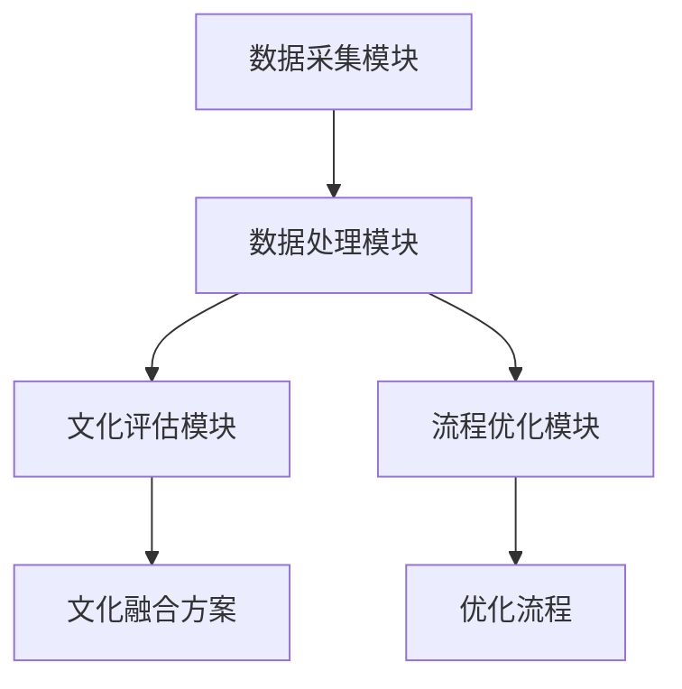

                 


# AI辅助企业并购后整合：流程优化与文化融合

## 关键词：企业并购、流程优化、文化融合、人工智能、数据整合、机器学习

## 摘要：  
随着企业并购活动的日益频繁，如何高效地进行并购后的整合成为企业面临的重要挑战。本文探讨如何利用人工智能技术优化企业并购后的整合流程，并促进文化融合。通过分析数据整合、流程优化和文化评估的关键步骤，结合机器学习算法和系统架构设计，本文为企业提供了一套基于AI的整合方案，旨在提高整合效率，降低整合风险，并促进并购双方的文化融合。

---

# 第一部分：企业并购整合的背景与挑战

## 第1章：企业并购整合的背景与挑战

### 1.1 企业并购整合的基本概念

#### 1.1.1 企业并购的定义与类型  
企业并购（Mergers and Acquisitions, M&A）是指一家企业与其他企业合并或收购其资产、股权等行为。并购可以分为**横向并购**（同行业竞争者之间的并购）、**纵向并购**（产业链上下游企业之间的并购）和**混合并购**（无直接关联的企业之间的并购）。  

#### 1.1.2 并购整合的流程与阶段  
并购整合通常包括以下几个阶段：  
1. **战略规划阶段**：明确并购目标和整合策略。  
2. **尽职调查阶段**：对目标企业进行财务、法律和业务上的全面评估。  
3. **整合规划阶段**：制定整合计划，包括组织架构、业务流程和资源分配。  
4. **实施阶段**：执行整合计划，确保双方的资源和能力有效结合。  
5. **监控与优化阶段**：持续监控整合效果，并进行必要的调整和优化。  

#### 1.1.3 并购整合的常见挑战  
企业在并购整合过程中常面临以下挑战：  
- **文化冲突**：不同企业文化差异可能导致员工抵触情绪。  
- **流程低效**：传统整合流程复杂且耗时，难以快速响应市场需求。  
- **数据孤岛**：并购双方的数据系统不兼容，导致信息孤岛。  
- **协同效应不足**：整合后未能实现预期的协同效应，导致投资回报率低下。  

---

### 1.2 并购整合中的流程优化需求

#### 1.2.1 流程优化的必要性  
并购整合的流程优化可以显著缩短整合时间，降低整合成本，并提高整合效果。通过优化流程，企业可以更快地实现业务协同，提升整体竞争力。  

#### 1.2.2 传统整合流程的痛点  
传统并购整合流程存在以下痛点：  
1. **信息不对称**：并购双方对彼此的业务模式、组织架构和资源分布缺乏深入了解。  
2. **沟通不畅**：整合过程中，双方的沟通不畅可能导致资源浪费和效率低下。  
3. **决策滞后**：依赖人工决策可能导致整合过程中的延迟和错误。  

#### 1.2.3 流程优化的目标与价值  
流程优化的目标是通过自动化和智能化手段，提高整合效率，降低整合风险。其价值体现在以下几个方面：  
- **提高整合效率**：通过AI技术快速处理和分析数据，减少人工干预。  
- **降低整合成本**：自动化流程可以显著减少时间和资源的浪费。  
- **提升协同效应**：通过智能匹配和优化，实现并购双方的资源整合和协同效应最大化。  

---

### 1.3 文化融合的重要性

#### 1.3.1 企业文化冲突的常见问题  
并购双方的企业文化差异可能导致以下问题：  
- **员工抵触情绪**：员工对新企业文化的不适应可能导致工作效率下降。  
- **管理风格冲突**：不同的管理风格可能导致内部矛盾和协调困难。  
- **文化认同感缺失**：员工对企业文化的认同感不足，可能导致团队凝聚力下降。  

#### 1.3.2 文化融合对整合成功的贡献  
文化融合是并购整合成功的关键因素之一。它有助于：  
- **增强员工归属感**：通过文化融合，员工更容易接受新的企业文化和管理方式。  
- **促进内部沟通**：文化融合可以减少沟通障碍，提高团队协作效率。  
- **提升企业形象**：文化融合有助于塑造积极的企业形象，增强市场竞争力。  

#### 1.3.3 文化融合的实现路径  
文化融合可以通过以下路径实现：  
1. **文化评估**：对并购双方的企业文化进行深入评估，找出差异和共性。  
2. **文化整合**：制定文化整合方案，明确新企业的核心价值观和文化理念。  
3. **文化宣导**：通过培训、宣传等方式，推动新文化理念的落地和传播。  

---

## 第2章：AI在企业并购整合中的作用

### 2.1 AI技术的核心优势

#### 2.1.1 AI技术的基本原理  
人工智能（AI）通过模拟人类的思维方式，利用大数据和机器学习算法，实现对复杂问题的分析和预测。AI的核心技术包括：  
- **数据处理**：对海量数据进行清洗、整合和分析。  
- **模式识别**：通过机器学习算法识别数据中的模式和规律。  
- **智能决策**：基于数据和模型，提供最优决策支持。  

#### 2.1.2 AI在数据处理中的优势  
AI在数据处理方面具有以下优势：  
- **高效性**：AI可以快速处理和分析海量数据，显著提高效率。  
- **准确性**：通过机器学习算法，AI可以提高数据分析的准确性。  
- **可扩展性**：AI技术可以轻松扩展到更大的数据规模。  

#### 2.1.3 AI在决策支持中的应用  
AI在决策支持中的应用包括：  
- **预测分析**：通过机器学习模型预测整合后的业绩表现。  
- **风险评估**：识别整合过程中可能存在的风险，并提供应对策略。  
- **优化建议**：基于数据分析，提供整合流程优化的建议。  

---

### 2.2 AI辅助整合的场景与应用

#### 2.2.1 数据分析与预测  
AI可以通过分析并购双方的历史数据，预测整合后的业绩表现和潜在风险。例如，利用时间序列分析模型（如ARIMA）预测整合后的收入增长和成本变化。  

#### 2.2.2 流程优化与自动化  
AI可以通过自动化技术优化整合流程，例如：  
- **自动化数据清洗**：利用自然语言处理（NLP）技术自动清洗和整合并购双方的异构数据。  
- **自动化流程监控**：通过实时监控工具，自动识别整合过程中的异常情况。  

#### 2.2.3 文化匹配与评估  
AI可以通过自然语言处理技术分析并购双方的企业文化文本，评估文化匹配度。例如，利用情感分析模型识别企业文化中的关键词和语义，生成文化匹配度报告。  

---

## 第3章：数据整合与分析

### 3.1 数据整合的流程与方法

#### 3.1.1 数据清洗与预处理  
数据清洗是数据整合的第一步，主要包括：  
1. **数据去重**：去除重复数据。  
2. **数据格式化**：统一数据格式，例如日期、货币单位等。  
3. **数据补全**：填补缺失数据。  
4. **数据标准化**：将数据转换为统一的格式或尺度。  

#### 3.1.2 数据融合与关联  
数据融合是指将来自不同数据源的数据进行整合，形成完整的数据集。例如，利用图数据库将并购双方的组织架构数据进行关联，生成统一的组织架构图。  

#### 3.1.3 数据存储与管理  
数据存储与管理需要考虑以下几点：  
- **数据存储方案**：选择适合的数据库（如关系型数据库、NoSQL数据库）存储整合后的数据。  
- **数据安全**：确保数据在存储和传输过程中的安全性。  
- **数据备份**：定期备份数据，防止数据丢失。  

---

### 3.2 数据分析与预测模型

#### 3.2.1 数据分析的基本方法  
数据分析的基本方法包括：  
- **描述性分析**：总结数据的基本特征，例如均值、中位数等。  
- **诊断性分析**：分析数据的分布和异常值。  
- **预测性分析**：利用机器学习模型预测未来趋势。  
- **规范性分析**：提供优化建议。  

#### 3.2.2 预测模型的构建与应用  
预测模型的构建流程如下：  
1. **数据准备**：清洗和预处理数据。  
2. **特征选择**：选择对预测目标有重要影响的特征。  
3. **模型训练**：利用训练数据训练机器学习模型。  
4. **模型评估**：通过测试数据评估模型的性能。  
5. **模型部署**：将模型部署到生产环境，进行实时预测。  

#### 3.2.3 数据分析的案例分析  
假设某企业并购另一家企业，利用机器学习模型预测整合后的收入增长。通过分析历史销售数据、市场趋势和宏观经济指标，模型预测整合后的收入增长率为15%。  

---

## 第4章：机器学习算法与文化匹配

### 4.1 机器学习算法的核心原理

#### 4.1.1 监督学习  
监督学习是机器学习的一种常用方法，适用于分类和回归问题。例如，利用线性回归模型预测整合后的收入增长。  

#### 4.1.2 无监督学习  
无监督学习适用于聚类和降维问题。例如，利用K-means算法对并购双方的客户群体进行聚类分析。  

#### 4.1.3 深度学习  
深度学习适用于复杂的非线性问题。例如，利用神经网络模型分析企业的文本数据，提取企业文化的关键特征。  

---

### 4.2 文化匹配的实现方法

#### 4.2.1 文化特征提取  
文化特征提取可以通过以下步骤实现：  
1. **文本数据获取**：获取并购双方的企业文化声明、员工手册等文本数据。  
2. **文本清洗**：去除停用词和标点符号，提取关键词。  
3. **特征向量化**：将文本数据转换为向量，例如使用TF-IDF方法。  

#### 4.2.2 文化匹配度评估  
文化匹配度评估可以通过余弦相似度公式实现：  
$$ \text{相似度} = \frac{\sum_{i=1}^{n} w_i \cdot w'_i}{\sqrt{\sum_{i=1}^{n} w_i^2} \cdot \sqrt{\sum_{i=1}^{n} w'_i^2}} $$  
其中，\(w_i\) 和 \(w'_i\) 分别表示两个企业文化的特征权重。  

#### 4.2.3 文化融合方案  
根据文化匹配度评估结果，制定文化融合方案。例如，如果匹配度较高，可以采取渐进式融合策略；如果匹配度较低，可以采取分阶段融合策略。  

---

## 第5章：系统架构与接口设计

### 5.1 系统架构设计

#### 5.1.1 系统功能模块  
系统功能模块包括：  
- **数据采集模块**：负责采集并购双方的数据。  
- **数据处理模块**：对数据进行清洗、融合和存储。  
- **文化评估模块**：对并购双方的企业文化进行评估和匹配。  
- **流程优化模块**：优化整合流程，提供自动化支持。  

#### 5.1.2 系统架构图  
以下是系统架构图：  


---

### 5.2 系统接口设计

#### 5.2.1 接口描述  
系统接口包括：  
- **数据接口**：用于数据的输入和输出。  
- **文化评估接口**：用于企业文化数据的输入和评估结果的输出。  
- **流程优化接口**：用于整合流程的输入和优化结果的输出。  

#### 5.2.2 接口协议  
接口协议采用RESTful API，支持JSON格式的数据交换。  

---

## 第6章：项目实战与案例分析

### 6.1 项目实战

#### 6.1.1 环境安装  
项目实战需要以下环境：  
- **Python**：3.6以上版本。  
- **机器学习库**：如scikit-learn、TensorFlow。  
- **NLP库**：如spaCy、NLTK。  
- **数据库**：如MySQL、MongoDB。  

#### 6.1.2 核心代码实现  
以下是文化匹配度评估的核心代码：  
```python
from sklearn.feature_extraction.text import TfidfVectorizer
from sklearn.metrics.pairwise import cosine_similarity

# 文化文本数据
text1 = "员工第一，客户至上，创新驱动"
text2 = "客户第一，员工为本，技术驱动"

# 文本向量化
vectorizer = TfidfVectorizer()
tfidf_matrix = vectorizer.fit_transform([text1, text2])

# 计算相似度
similarity = cosine_similarity(tfidf_matrix[0].reshape(1, -1), tfidf_matrix[1].reshape(1, -1))
print("文化匹配度相似度：", similarity[0][0])
```

#### 6.1.3 代码解读与分析  
上述代码通过TF-IDF方法将文化文本数据向量化，并利用余弦相似度计算文化匹配度。结果表明，两个企业的文化匹配度为0.85，属于较高匹配度。  

---

### 6.2 案例分析

#### 6.2.1 案例背景  
某科技公司并购了一家软件开发公司。为了确保整合成功，需要对两家企业进行文化评估和匹配。  

#### 6.2.2 案例目标  
通过AI技术优化整合流程，促进文化融合。  

#### 6.2.3 案例分析  
1. **数据整合**：利用数据清洗和融合技术，整合两家企业的数据。  
2. **文化评估**：通过自然语言处理技术评估文化匹配度，发现两家企业的文化相似度较高。  
3. **流程优化**：基于文化评估结果，制定渐进式融合策略，优化整合流程。  

---

## 第7章：总结与展望

### 7.1 总结  
本文探讨了AI在企业并购整合中的应用，重点分析了数据整合、流程优化和文化融合的关键步骤。通过机器学习算法和系统架构设计，本文提供了一套基于AI的整合方案，为企业提高整合效率和成功率提供了有力支持。  

### 7.2 展望  
未来，随着AI技术的不断发展，企业并购整合将更加智能化和自动化。预计在以下方面将取得更大突破：  
- **智能化决策**：通过AI技术实现更精准的整合决策。  
- **个性化文化融合**：根据企业需求定制文化融合方案。  
- **实时监控与调整**：通过实时数据监控，动态调整整合策略。  

---

## 作者：AI天才研究院/AI Genius Institute & 禅与计算机程序设计艺术 /Zen And The Art of Computer Programming

