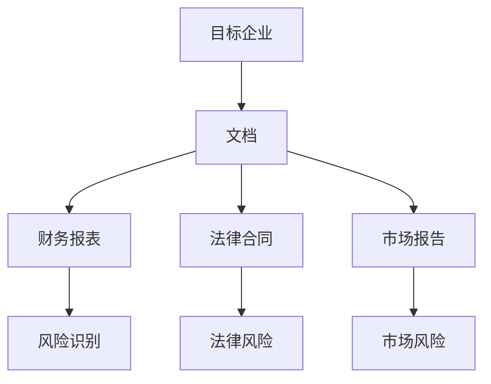
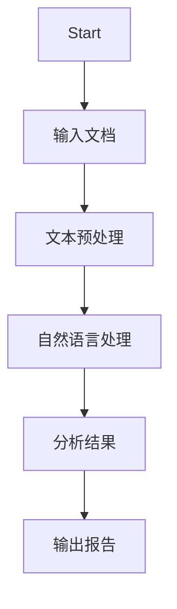
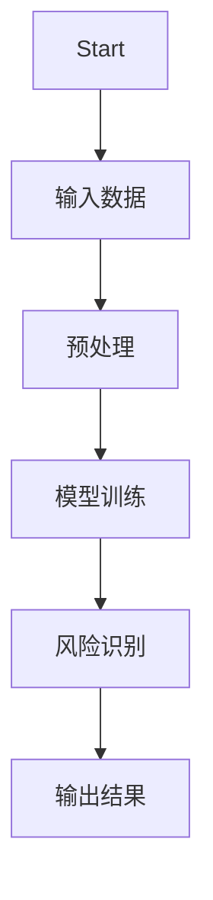
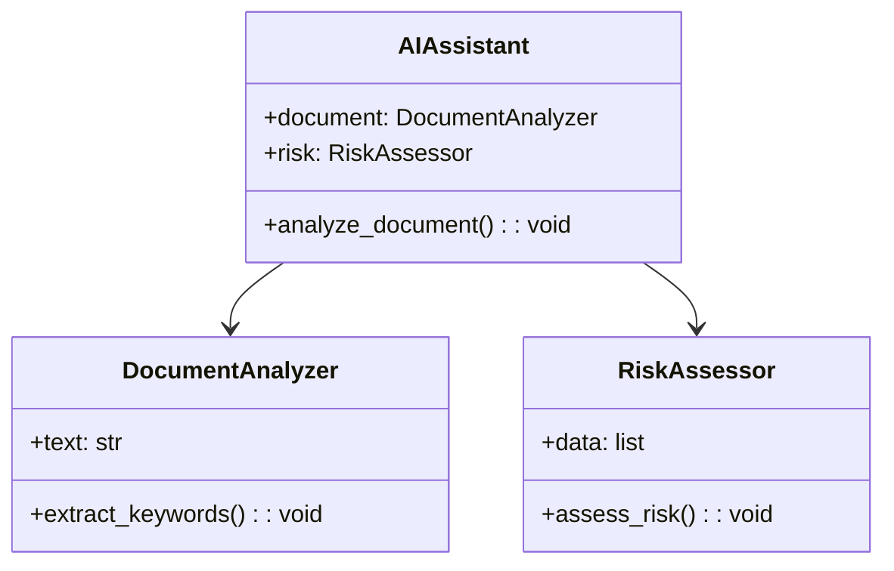

                 


# AI辅助企业并购尽职调查：自动化文档分析与风险识别

> 关键词：AI辅助、企业并购、尽职调查、文档分析、风险识别

> 摘要：随着企业并购活动的日益频繁，尽职调查的重要性愈发凸显。传统的尽职调查方法依赖人工分析，效率低下且容易出错。本文探讨如何利用人工智能技术，特别是自然语言处理和机器学习，来自动化文档分析和风险识别，从而提高企业并购过程的效率和准确性。

---

# 第一章: AI辅助企业并购尽职调查的背景与问题分析

## 1.1 企业并购与尽职调查的概述

### 1.1.1 企业并购的基本概念

企业并购（Mergers and Acquisitions, M&A）是指两个或多个企业之间的合并或收购行为。这一过程通常涉及复杂的法律、财务和战略决策。尽职调查是企业并购中的关键步骤，旨在评估目标企业的财务状况、法律风险和潜在问题。

### 1.1.2 尽职调查的核心作用

尽职调查的主要目的是识别和评估目标企业可能存在的风险和问题，从而为并购决策提供依据。传统的方法依赖于人工审查大量文档，耗时且容易出错。

### 1.1.3 传统尽职调查的局限性

- **低效**：人工审查文档耗时长，尤其是在处理大量文件时。
- **误差率高**：人为错误可能导致关键风险被遗漏。
- **资源消耗大**：需要大量专业人员参与。

## 1.2 AI技术在企业并购中的应用潜力

### 1.2.1 AI技术对企业并购的赋能

人工智能（AI）技术，尤其是自然语言处理（NLP）和机器学习（ML），能够显著提高尽职调查的效率和准确性。AI可以快速分析大量文档，识别潜在风险，并提供数据支持的决策建议。

### 1.2.2 自动化文档分析的必要性

通过自动化文档分析，AI可以在短时间内处理大量的财务报表、合同和法律文件，提取关键信息，减少人为错误。

### 1.2.3 风险识别的智能化趋势

AI驱动的风险识别系统可以实时分析目标企业的财务数据、市场表现和法律记录，帮助并购方识别隐藏风险。

---

# 第二章: AI辅助尽职调查的核心概念与体系结构

## 2.1 核心概念与定义

### 2.1.1 AI辅助尽职调查的定义

AI辅助尽职调查是指利用人工智能技术，包括自然语言处理和机器学习，来自动化分析文档、识别风险并提供决策支持。

### 2.1.2 自动化文档分析的实现方式

- **文本挖掘**：从文档中提取关键信息。
- **模式识别**：识别文档中的模式和异常。
- **分类与聚类**：将文档按主题分类。

### 2.1.3 风险识别的算法原理

基于机器学习的算法，通过训练模型识别文档中的风险点，并进行风险评估。

## 2.2 核心概念的属性对比

| **技术**       | **特征**                     |
|----------------|------------------------------|
| 自然语言处理   | 文本理解、关键词提取         |
| 机器学习       | 数据分析、模式识别           |
| 文本挖掘       | 信息提取、主题建模           |

### 2.2.2 实体关系图



---

# 第三章: 自动化文档分析的算法原理

## 3.1 算法原理概述

### 3.1.1 预训练语言模型的原理

预训练语言模型（如BERT）通过大量数据预训练，能够理解上下文，提取文本信息。

### 3.1.2 文档分析的流程图



## 3.2 算法实现

### 3.2.1 Python代码实现

```python
import spacy

# 加载预训练模型
nlp = spacy.load("en_core_web_sm")

# 文本处理
text = "The company's revenue increased by 10% last year."
doc = nlp(text)

# 提取关键信息
for token in doc:
    print(token.text, token.pos_)
```

### 3.2.2 算法的数学模型与公式

自然语言处理中的词嵌入模型，如Word2Vec，使用以下公式：

$$ \text{Word Embedding} = f(\text{Context}) $$

### 3.2.3 示例与解释

通过上述代码，我们可以提取文本中的关键词和词性，帮助识别文档中的重要信息。

---

# 第四章: 风险识别的算法原理

## 4.1 风险识别的定义与目标

### 4.1.1 风险识别的范围

包括财务风险、法律风险和市场风险。

### 4.1.2 风险识别的关键指标

- 财务指标：如利润率、负债率。
- 法律指标：如合同合规性。
- 市场指标：如市场占有率。

## 4.2 风险识别的算法实现

### 4.2.1 Mermaid流程图：风险识别的算法流程



### 4.2.2 Python代码实现

```python
import pandas as pd
from sklearn.ensemble import RandomForestClassifier

# 数据处理
data = pd.read_csv("data.csv")
X = data.drop('target', axis=1)
y = data['target']

# 模型训练
model = RandomForestClassifier()
model.fit(X, y)

# 预测
predictions = model.predict(X)
```

### 4.2.3 数学模型与公式

随机森林模型的预测概率公式：

$$ P(y=1|x) = \sum_{i=1}^{n} \text{Tree}(x) \times \text{Weight}_i $$

---

# 第五章: 系统分析与架构设计

## 5.1 问题场景分析

### 5.1.1 企业并购中的文档分析场景

目标企业文档的分析，包括财务报表、法律合同等。

### 5.1.2 风险识别的典型场景

识别财务风险、法律风险和市场风险。

## 5.2 系统功能设计

### 5.2.1 领域模型图



## 5.3 系统架构设计

### 5.3.1 系统架构图

```mermaid
graph TD
    Client --> API Gateway
    API Gateway --> AIService
    AIService --> Database
```

---

# 第六章: 项目实战

## 6.1 环境安装与配置

### 6.1.1 Python环境的安装

安装Python 3.8及以上版本。

### 6.1.2 相关库的安装

```bash
pip install spacy transformers scikit-learn
```

## 6.2 核心代码实现

### 6.2.1 文档分析代码

```python
import spacy

nlp = spacy.load("en_core_web_sm")
text = "The company's revenue increased by 10% last year."
doc = nlp(text)
for token in doc:
    print(token.text, token.pos_)
```

### 6.2.2 风险识别代码

```python
import pandas as pd
from sklearn.ensemble import RandomForestClassifier

data = pd.read_csv("data.csv")
X = data.drop('target', axis=1)
y = data['target']
model = RandomForestClassifier()
model.fit(X, y)
```

## 6.3 实际案例分析

### 6.3.1 案例背景

分析一家目标企业的财务报表和法律合同，识别潜在风险。

### 6.3.2 数据分析与结果

使用AI模型识别出财务风险和法律风险，并提供相应的建议。

## 6.4 项目小结

通过AI辅助，企业并购中的尽职调查效率显著提高，风险识别更加准确。

---

# 总结

通过本文的探讨，我们可以看到AI技术在企业并购尽职调查中的巨大潜力。自动化文档分析和风险识别不仅提高了效率，还降低了人为错误的风险，为企业决策提供了有力支持。

---

作者：AI天才研究院 & 禅与计算机程序设计艺术

