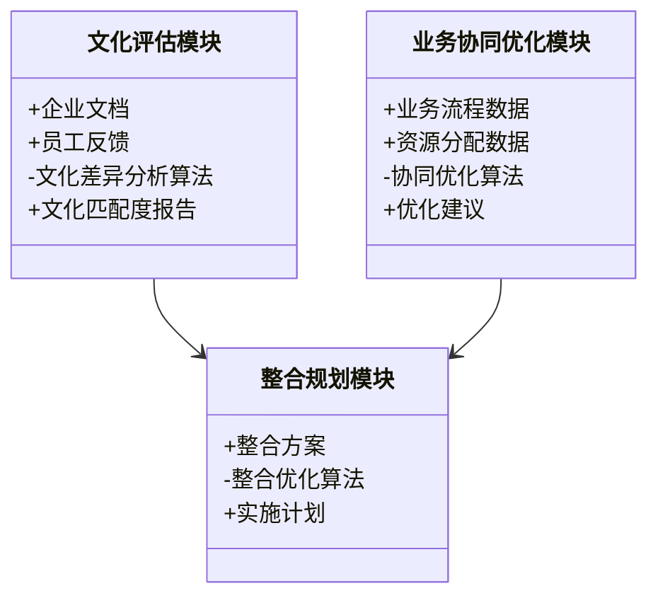
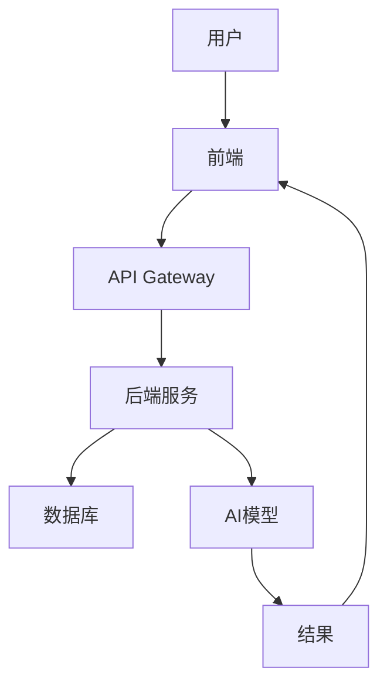
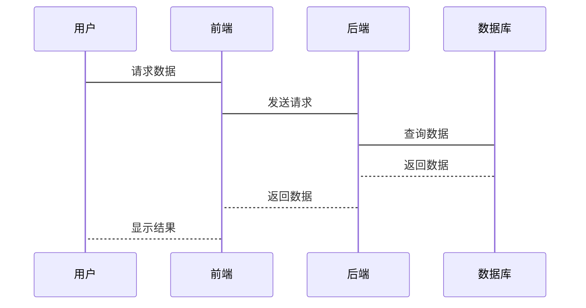

                 


# AI辅助企业并购整合规划：文化融合与业务协同路径设计

## 关键词
- AI技术、企业并购、文化融合、业务协同、整合规划

## 摘要
随着企业并购活动的日益频繁，文化融合与业务协同成为整合过程中最关键的因素。本文通过分析AI技术在企业并购整合中的应用，探讨如何利用AI技术优化文化融合和业务协同的路径设计。文章从背景与概述、文化融合与业务协同的路径设计、技术实现、系统架构、项目实战等多方面展开，结合实际案例，详细阐述AI在企业并购整合中的具体应用和实现方案。最后，本文总结了AI辅助企业并购整合的核心要点，并展望了未来的发展趋势。

---

## 第一部分: AI辅助企业并购整合规划的背景与概述

### 第1章: AI辅助企业并购整合规划的背景与意义

#### 1.1 企业并购整合的背景与挑战
企业并购是企业发展的常见策略之一，通过并购整合资源、拓展市场、提升竞争力。然而，并购整合过程中常常面临诸多挑战，包括文化冲突、业务协同困难、管理混乱等问题。这些问题可能导致并购失败或整合效果不佳。

**问题背景：**  
企业并购整合的核心问题在于如何实现文化融合与业务协同。文化差异可能导致员工抵触情绪，影响团队协作；业务协同不畅可能导致效率低下，甚至引发资源浪费。传统的企业整合方法依赖于人工经验，效率低且难以量化评估。因此，如何利用AI技术解决这些问题成为研究热点。

**问题描述：**  
AI技术可以通过数据分析、模式识别和自动化优化，帮助企业更好地理解文化差异，优化业务流程，提升整合效率。AI技术的应用可以将文化融合与业务协同从“经验驱动”转变为“数据驱动”，从而提高整合的成功率。

**问题解决：**  
AI技术在企业并购整合中的应用主要体现在以下几个方面：  
1. **文化评估：** 通过自然语言处理（NLP）技术分析企业文化和价值观，量化文化差异。  
2. **协同优化：** 利用机器学习算法预测业务协同中的潜在问题，并提出优化建议。  
3. **整合规划：** 基于AI模型生成整合方案，包括组织架构、流程优化、资源分配等。

**边界与外延：**  
本文主要关注AI技术在企业并购整合中的应用，范围限定在文化融合与业务协同领域。不涉及企业并购的其他方面，如财务评估、法律合规等。

**核心要素组成：**  
- 数据采集与处理  
- 文化评估模型  
- 业务协同优化算法  
- 整合规划系统  

---

### 1.2 AI辅助企业并购整合的核心概念

#### 1.2.1 文化融合的定义与重要性
文化融合是指在企业并购后，将双方的文化、价值观和管理方式整合为统一的企业文化。文化融合的成功与否直接影响员工的凝聚力和企业的长期发展。

**重要性：**  
- 文化冲突可能导致员工士气低落、工作效率下降。  
- 文化融合可以提升团队协作效率，增强企业凝聚力。  
- 文化融合是企业长期战略的重要组成部分。

#### 1.2.2 业务协同的定义与实现路径
业务协同是指在企业并购后，双方在业务流程、资源分配、市场拓展等方面的协同合作。业务协同的成功可以显著提升企业的整体效率和市场竞争力。

**实现路径：**  
- **流程优化：** 通过分析现有流程，消除冗余，提升效率。  
- **资源分配：** 合理分配资源，避免浪费。  
- **市场拓展：** 利用双方的优势，开拓新市场。  

#### 1.2.3 AI技术在文化融合与业务协同中的应用
AI技术可以通过数据分析、模式识别和自动化优化，帮助企业更好地实现文化融合和业务协同。

**应用场景：**  
- 文化评估：通过NLP技术分析企业文档、员工反馈，量化文化差异。  
- 业务协同优化：利用机器学习算法预测协同中的潜在问题，并提出优化建议。  
- 整合规划：基于AI模型生成整合方案，包括组织架构、流程优化、资源分配等。  

---

### 1.3 本章小结
本章从企业并购整合的背景与挑战出发，介绍了AI技术在文化融合与业务协同中的应用，明确了文化融合与业务协同的核心概念。接下来，我们将深入探讨文化融合与业务协同的具体路径设计。

---

## 第二部分: 文化融合与业务协同的路径设计

### 第2章: 文化融合的路径设计

#### 2.1 企业文化的定义与评估
企业文化是企业在长期发展过程中形成的独特价值观、管理方式和行为准则。文化评估是文化融合的第一步，需要对企业文化的核心要素进行量化分析。

**文化评估模型：**  
我们设计了一个文化评估模型，包括以下几个维度：  
1. **企业愿景与使命：** 分析双方的企业愿景是否一致。  
2. **管理风格：** 分析双方的管理风格是否互补。  
3. **员工价值观：** 通过员工反馈分析员工对企业文化的认同度。  

**文化匹配度评估：**  
通过量化分析，我们可以得出双方文化的匹配度，从而为文化融合提供数据支持。

---

#### 2.2 AI辅助文化融合的实现路径
AI技术可以通过数据分析和模型优化，帮助企业在文化融合过程中实现以下目标：  
1. **文化差异识别：** 通过NLP技术分析企业文档，识别文化差异。  
2. **文化融合方案设计：** 基于文化差异分析，提出融合方案。  
3. **文化融合实施：** 通过培训、政策调整等方式推动文化融合。  

**案例分析：**  
某跨国企业并购一家本土企业，通过AI技术分析双方的文化差异，设计了文化融合方案，最终实现了双方文化的有机结合。

---

### 第3章: 业务协同的路径设计

#### 3.1 业务协同的定义与关键要素
业务协同是指在企业并购后，双方在业务流程、资源分配、市场拓展等方面的协同合作。业务协同的关键要素包括：  
1. **业务流程优化：** 分析现有流程，消除冗余。  
2. **资源分配优化：** 合理分配资源，避免浪费。  
3. **市场拓展协同：** 利用双方的优势，开拓新市场。  

---

#### 3.2 AI辅助业务协同的设计方法
AI技术可以通过数据分析和模式识别，帮助企业实现业务协同的优化。具体方法包括：  
1. **业务流程分析：** 利用机器学习算法分析业务流程，识别瓶颈。  
2. **协同优化建议：** 基于分析结果，提出优化建议。  
3. **协同实施：** 通过自动化工具实现业务协同。  

---

## 第三部分: 技术实现与系统架构

### 第4章: 技术实现

#### 4.1 文化融合的算法实现
我们设计了一个基于NLP的文化融合算法，具体步骤如下：  
1. **数据采集：** 收集企业文档、员工反馈等数据。  
2. **数据预处理：** 清洗数据，提取关键词。  
3. **文化差异分析：** 利用NLP技术分析文化差异。  
4. **文化融合方案设计：** 基于分析结果，设计融合方案。  

**数学模型：**  
我们设计了一个文化融合指数模型，公式如下：  
$$ CFI = \sum_{i=1}^{n} w_i \cdot d_i $$  
其中，\(w_i\) 是第i个文化维度的权重，\(d_i\) 是第i个文化维度的差异值。

---

#### 4.2 业务协同的算法实现
我们设计了一个基于协同过滤的业务协同优化算法，具体步骤如下：  
1. **数据采集：** 收集业务流程数据、资源分配数据等。  
2. **数据预处理：** 清洗数据，提取特征。  
3. **协同优化：** 利用协同过滤算法优化业务流程。  
4. **协同实施：** 通过自动化工具实现业务协同。  

**数学模型：**  
我们设计了一个协同优化模型，公式如下：  
$$ CO = \sum_{i=1}^{m} w_i \cdot o_i $$  
其中，\(w_i\) 是第i个优化维度的权重，\(o_i\) 是第i个优化维度的优化值。

---

### 第5章: 系统架构

#### 5.1 系统功能设计
我们设计了一个AI辅助企业并购整合系统，包括以下几个功能模块：  
1. **文化评估模块：** 用于评估企业文化的匹配度。  
2. **业务协同优化模块：** 用于优化业务流程。  
3. **整合规划模块：** 用于生成整合方案。  

**领域模型：**  
以下是领域模型的类图：  


#### 5.2 系统架构设计
以下是系统架构图：  


#### 5.3 系统接口设计
以下是系统接口设计：  


---

## 第四部分: 项目实战

### 第6章: 项目实战

#### 6.1 环境安装
以下是项目实战所需的环境安装步骤：  
1. 安装Python：`pip install python`  
2. 安装NLP库：`pip install nltk`  
3. 安装机器学习库：`pip install scikit-learn`  

#### 6.2 核心代码实现
以下是文化融合算法的核心代码：  
```python
import nltk

def文化融合算法(企业文档, 员工反馈):
    # 数据预处理
    keywords = 提取关键词(企业文档)
    feedback = 分析员工反馈(员工反馈)
    
    # 文化差异分析
    文化差异 = 计算差异(keywords, feedback)
    
    # 文化融合方案设计
    融合方案 = 生成方案(文化差异)
    
    return 融合方案
```

#### 6.3 案例分析
以下是某跨国企业并购案例的分析：  
1. **背景：** 某跨国企业并购一家本土企业，希望通过AI技术实现文化融合。  
2. **数据采集：** 收集企业文档、员工反馈。  
3. **数据预处理：** 提取关键词，分析员工反馈。  
4. **文化差异分析：** 识别文化差异，生成融合方案。  
5. **实施：** 推动文化融合，提升员工凝聚力。  

---

## 第五部分: 总结与展望

### 第7章: 总结与展望

#### 7.1 本章小结
本文从企业并购整合的背景与挑战出发，探讨了AI技术在文化融合与业务协同中的应用。通过设计文化评估模型、业务协同优化算法和整合规划系统，提出了一个完整的AI辅助企业并购整合解决方案。

#### 7.2 未来展望
未来，随着AI技术的不断发展，企业并购整合将更加智能化和数据化。我们可以进一步优化文化评估模型和业务协同优化算法，提升整合效率和效果。

---

## 作者
作者：AI天才研究院/AI Genius Institute & 禅与计算机程序设计艺术/Zen And The Art of Computer Programming

