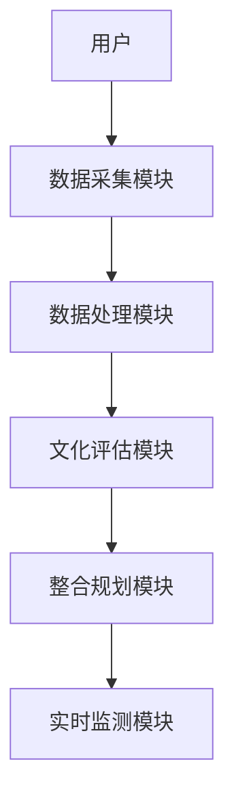

                 


# AI辅助企业并购整合规划：文化融合路径设计与效果实时监测

> 关键词：企业并购整合、AI辅助、文化融合路径、效果实时监测、机器学习算法、系统架构设计、数据驱动决策

> 摘要：本文详细探讨了如何利用人工智能技术辅助企业并购整合过程中的文化融合路径设计与效果实时监测。通过分析企业并购整合的核心挑战，结合AI技术的优势，提出了一种基于机器学习的文化融合路径设计方法，并构建了实时监测系统，为企业并购整合提供了高效、智能的解决方案。

---

## 第一部分：企业并购整合与文化融合的背景

### 第1章：企业并购整合的基本概念

#### 1.1 企业并购的定义与类型
企业并购是企业之间通过资产重组、股权收购等方式实现资源优化配置的重要手段。常见的并购类型包括：
- **横向并购**：同一行业内的企业并购。
- **纵向并购**：产业链上下游企业的并购。
- **混合并购**：跨行业或跨领域的并购。

#### 1.2 并购整合的必要性与挑战
- **必要性**：通过并购整合，企业可以快速扩大规模、优化资源、提升竞争力。
- **挑战**：文化差异、组织整合、战略协同等问题常常导致并购失败。

#### 1.3 文化融合在并购整合中的重要性
文化融合是并购整合成功的关键因素之一。文化差异可能导致团队冲突、效率低下，甚至引发员工流失。通过AI技术辅助文化融合，可以提高整合效率，降低失败风险。

---

### 第2章：AI技术在企业并购中的应用潜力

#### 2.1 AI技术的核心优势
- **数据处理能力**：AI能够快速处理海量数据，提取关键信息。
- **预测能力**：基于历史数据，AI可以预测并购后的整合效果。
- **自动化能力**：AI可以自动化执行任务，提高效率。

#### 2.2 AI在企业并购整合中的应用场景
- **文化评估**：通过自然语言处理（NLP）技术分析企业文化的匹配度。
- **整合规划**：利用机器学习模型预测整合效果，优化整合方案。
- **实时监测**：通过数据流分析实时监控整合进展。

#### 2.3 AI辅助文化融合的创新价值
- **个性化匹配**：AI可以根据企业文化特征进行精准匹配。
- **动态调整**：AI能够实时调整文化融合策略，确保整合顺利进行。

---

## 第二部分：AI辅助文化融合路径设计

### 第3章：文化融合路径的设计原则

#### 3.1 文化融合的目标与关键因素
- **目标**：实现企业文化的协同发展。
- **关键因素**：企业愿景、价值观、管理风格、员工文化适应性等。

#### 3.2 基于AI的文化融合路径模型
- **输入**：企业文化数据、员工反馈、并购目标数据。
- **输出**：文化融合路径方案、整合策略建议。

#### 3.3 文化融合路径的阶段划分
- **评估阶段**：分析企业文化的匹配度。
- **匹配阶段**：确定文化融合的可行性。
- **融合阶段**：制定并执行文化融合策略。

---

### 第4章：文化融合路径的AI实现方法

#### 4.1 数据采集与特征提取
- **数据源**：企业内部文档、员工反馈、市场报告。
- **特征提取**：利用NLP技术提取企业文化关键词。

#### 4.2 基于机器学习的文化匹配算法
- **算法选择**：支持向量机（SVM）或随机森林（Random Forest）。
- **实现步骤**：
  1. 数据预处理：清洗、归一化。
  2. 特征提取：提取企业文化关键特征。
  3. 模型训练：训练文化匹配模型。
  4. 结果输出：生成文化匹配报告。

#### 4.3 文化融合效果的实时监测机制
- **监测指标**：员工满意度、团队协作效率、企业文化一致性。
- **实时监测**：通过数据流分析，动态调整融合策略。

---

## 第三部分：AI辅助文化融合的算法原理与系统架构

### 第5章：文化融合路径的数学模型与算法原理

#### 5.1 文化融合路径的数学模型
- **模型输入**：企业A和企业B的文化特征向量。
- **模型输出**：文化融合可行性评分。
- **公式**：
  $$ \text{融合评分} = \frac{\sum_{i=1}^{n} w_i x_i}{n} $$
  其中，$w_i$为特征权重，$x_i$为特征值。

#### 5.2 基于机器学习的文化匹配算法
- **算法流程**：
  1. 数据预处理：去除噪声数据。
  2. 特征选择：提取关键特征。
  3. 模型训练：使用训练数据训练分类器。
  4. 模型评估：验证模型准确性。

#### 5.3 文化融合效果的实时监测模型
- **监测指标**：员工满意度、团队协作效率。
- **监测流程**：
  1. 数据采集：实时采集员工反馈数据。
  2. 数据分析：利用时间序列分析预测趋势。
  3. 结果输出：生成实时监测报告。

---

### 第6章：系统架构设计与实现

#### 6.1 系统功能设计
- **功能模块**：
  - 数据采集模块：收集企业文化数据。
  - 文化评估模块：评估文化匹配度。
  - 整合规划模块：制定文化融合策略。
  - 实时监测模块：监控整合效果。

#### 6.2 系统架构图


#### 6.3 系统接口设计
- **输入接口**：企业数据接口、员工反馈接口。
- **输出接口**：文化评估报告、整合规划方案。

---

## 第四部分：项目实战与总结

### 第7章：项目实战

#### 7.1 项目背景与目标
- **背景**：某跨国企业并购一家本土企业，需进行文化融合。
- **目标**：利用AI技术优化文化融合路径。

#### 7.2 系统实现
- **环境配置**：Python 3.8、TensorFlow 2.0、Pandas。
- **核心代码**：
  ```python
  import pandas as pd
  from sklearn.ensemble import RandomForestClassifier

  # 数据加载
  data = pd.read_csv('culture_data.csv')
  # 特征提取
  X = data.drop('label', axis=1)
  y = data['label']
  # 模型训练
  model = RandomForestClassifier().fit(X, y)
  # 预测结果
  print(model.predict(X))
  ```

#### 7.3 案例分析
- **案例分析**：通过具体案例展示AI技术在文化融合中的应用。
- **结果展示**：生成文化融合路径方案、实时监测报告。

---

### 第8章：总结与展望

#### 8.1 最佳实践
- **数据质量**：确保数据的准确性和完整性。
- **模型优化**：持续优化机器学习模型，提高预测精度。
- **实时监测**：动态调整文化融合策略。

#### 8.2 未来展望
- **技术发展**：AI技术在企业并购中的应用将更加广泛。
- **研究方向**：探索更智能的文化融合方法。

---

## 作者信息

作者：AI天才研究院/AI Genius Institute & 禅与计算机程序设计艺术 /Zen And The Art of Computer Programming

---

以上是《AI辅助企业并购整合规划：文化融合路径设计与效果实时监测》的技术博客文章的完整目录和内容框架。如需进一步调整或补充，请随时告知！

