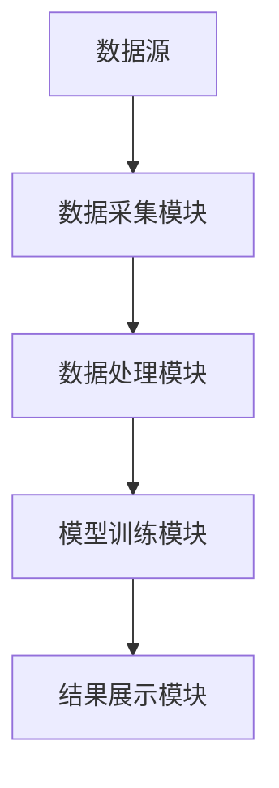

                 


# AI辅助企业并购目标筛选与估值分析

> 关键词：人工智能，企业并购，目标筛选，估值分析，机器学习，文本挖掘，时间序列分析

> 摘要：本文探讨了人工智能在企业并购中的应用，重点分析了目标筛选与估值分析的核心算法与系统架构。通过文本挖掘、机器学习和时间序列分析等技术，企业可以更高效、准确地进行并购决策。文章详细讲解了各个算法的原理与实现，并通过实际案例展示了系统的搭建与应用。

---

## 第一部分：AI辅助企业并购背景与基础

### 第1章：企业并购概述

#### 1.1 企业并购的基本概念
企业并购（Mergers and Acquisitions，简称M&A）是指一家企业与其他企业（目标企业）合并或收购其资产、股权的过程。并购可以分为横向并购、纵向并购和混合并购，其主要动机包括扩大市场份额、获取技术资源、降低运营成本等。

#### 1.2 并购的动机与目标
- **动机**：企业并购的主要动机包括战略协同、成本节约、市场扩展和风险分散等。
- **目标**：通过并购获取目标企业的资源、技术或市场，提升自身竞争力。

#### 1.3 并购的基本流程
1. 确定战略目标
2. 寻找潜在目标
3. 尽职调查
4. 估值分析
5. 并购决策
6. 交易执行
7. 整合与监控

### 第2章：AI技术发展与企业并购

#### 2.1 AI技术的定义与特点
人工智能（AI）是指模拟人类智能的计算机系统，具有学习、推理、自我改进等能力。AI技术的特点包括数据驱动、自动化、高效率和强适应性。

#### 2.2 AI技术在金融领域的应用
AI在金融领域的应用包括股票预测、风险评估、欺诈检测等。AI技术通过处理大量数据，提供更精准的分析结果。

#### 2.3 AI技术对企业并购的影响
- 提高目标筛选效率
- 准确评估企业价值
- 优化并购决策

### 第3章：AI在企业并购中的应用场景

#### 3.1 目标筛选的AI应用
- **数据收集与处理**：从多种来源收集企业数据，包括财务数据、市场数据和新闻数据。
- **相似企业匹配算法**：使用机器学习算法，如K-近邻算法，匹配与目标企业相似的企业。
- **风险评估模型**：通过构建风险评估模型，识别潜在风险。

#### 3.2 估值分析的AI应用
- **财务数据预测**：使用时间序列分析预测企业的未来财务状况。
- **市场价值评估**：结合市场数据和机器学习模型，评估企业的市场价值。
- **协同效应分析**：预测并购后的协同效应，评估整体价值。

---

## 第二部分：AI辅助企业并购的核心算法与模型

### 第4章：文本挖掘与企业信息分析

#### 4.1 文本挖掘的基本原理
文本挖掘是从文本数据中提取有用信息的过程，包括文本预处理、关键词提取和情感分析。

#### 4.2 企业信息分析的文本挖掘应用
- **新闻数据处理**：从新闻中提取关键词，分析企业声誉。
- **竞争分析**：通过分析竞争对手的新闻，识别市场趋势。

#### 4.3 实例分析
使用Python的NLTK库进行文本预处理和关键词提取，代码示例如下：

```python
import nltk
from nltk.corpus import stopwords

text = "The company has been performing well in the market."
tokens = nltk.word_tokenize(text)
stop_words = set(stopwords.words('english'))
filtered_tokens = [word for word in tokens if word not in stop_words]
print(filtered_tokens)
```

---

### 第5章：机器学习模型在估值中的应用

#### 5.1 机器学习基础
- **监督学习**：用于分类和回归问题。
- **无监督学习**：用于聚类和降维。

#### 5.2 常见机器学习算法
- **线性回归**：用于预测连续变量。
- **决策树**：用于分类和回归。
- **随机森林**：通过多棵决策树进行集成学习。

#### 5.3 模型优化与评估
- **交叉验证**：评估模型的泛化能力。
- **网格搜索**：优化模型超参数。

#### 5.4 实例分析
使用随机森林模型预测企业价值：

```python
from sklearn.ensemble import RandomForestRegressor
from sklearn.model_selection import train_test_split

# 假设X为特征矩阵，y为目标变量
X_train, X_test, y_train, y_test = train_test_split(X, y, test_size=0.2)
model = RandomForestRegressor(n_estimators=100)
model.fit(X_train, y_train)
print(model.score(X_test, y_test))
```

---

### 第6章：时间序列分析与并购预测

#### 6.1 时间序列分析的基本原理
时间序列分析是通过历史数据预测未来趋势的方法，常用模型包括ARIMA和LSTM。

#### 6.2 并购预测的算法实现
- **ARIMA模型**：用于平稳时间序列的预测。
- **LSTM网络**：用于长期依赖关系的预测。

#### 6.3 实例分析
使用LSTM预测企业并购的时间：

```python
from keras.layers import LSTM, Dense
from keras.models import Sequential

# 假设data为时间序列数据
model = Sequential()
model.add(LSTM(50, input_shape=(timesteps, features)))
model.add(Dense(1))
model.compile(loss='mean_squared_error', optimizer='adam')
model.fit(X_train, y_train, epochs=50, batch_size=32)
```

---

## 第三部分：系统架构与项目实战

### 第7章：系统架构设计

#### 7.1 系统功能模块划分
- **数据采集模块**：从多种来源收集企业数据。
- **数据处理模块**：清洗和预处理数据。
- **模型训练模块**：训练机器学习模型。
- **结果展示模块**：可视化分析结果。

#### 7.2 系统架构图


---

### 第8章：项目实战与代码实现

#### 8.1 环境搭建
- **Python**：安装Anaconda或Miniconda。
- **库安装**：使用pip安装numpy、pandas、scikit-learn、keras等库。

#### 8.2 核心代码实现
- **数据预处理**：
```python
import pandas as pd
import numpy as np

# 加载数据
data = pd.read_csv('企业数据.csv')

# 数据清洗
data = data.dropna()
```

- **模型训练**：
```python
from sklearn.model_selection import train_test_split
from sklearn.ensemble import RandomForestRegressor

X = data.drop('目标变量', axis=1)
y = data['目标变量']

X_train, X_test, y_train, y_test = train_test_split(X, y, test_size=0.2)
model = RandomForestRegressor(n_estimators=100)
model.fit(X_train, y_train)
```

#### 8.3 实例分析
通过实际案例分析，展示如何使用AI技术进行企业并购的目标筛选和估值分析。

---

## 总结与展望

### 总结
本文详细探讨了AI在企业并购中的应用，包括目标筛选和估值分析的核心算法与系统架构。通过文本挖掘、机器学习和时间序列分析等技术，企业可以更高效、准确地进行并购决策。

### 展望
未来，随着AI技术的不断发展，企业并购的AI辅助将更加智能化和自动化。建议读者深入学习相关技术，探索更多创新应用。

---

## 最佳实践 Tips

1. **数据质量**：确保数据的准确性和完整性，避免噪声数据影响模型性能。
2. **模型优化**：通过交叉验证和网格搜索优化模型参数，提升预测精度。
3. **结果解释**：在实际应用中，模型结果需要结合业务背景进行解释，避免机械化的应用。

---

作者：AI天才研究院 & 禅与计算机程序设计艺术

