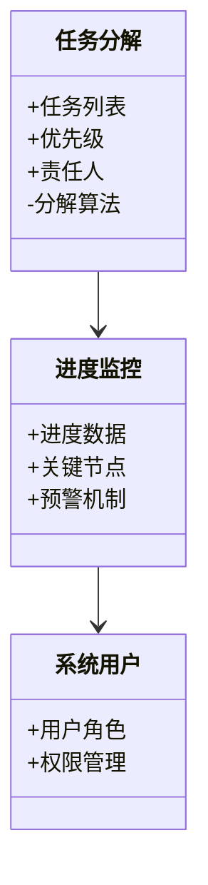

                 


# AI辅助企业战略执行：任务分解与进度监控

## 关键词：AI技术，企业战略执行，任务分解，进度监控，算法原理，系统架构，项目实战

## 摘要：本文深入探讨了AI技术在企业战略执行中的应用，特别是任务分解与进度监控的关键环节。通过详细分析AI算法、系统架构设计及项目实战，本文为读者提供了从理论到实践的全面指导，展示了如何利用AI技术优化企业战略执行过程，提升管理效率和决策能力。

---

# 第1章: AI辅助企业战略执行的背景与意义

## 1.1 企业战略执行的挑战与痛点

### 1.1.1 传统企业战略执行的难点
- **资源分配不均**：企业在有限资源下如何高效分配，常常面临挑战。
- **任务优先级模糊**：战略目标分解后，任务优先级难以明确。
- **进度失控**：执行过程中缺乏实时监控，导致进度延误。

### 1.1.2 数字化转型对企业战略执行的新要求
- **数据驱动决策**：需要实时数据分析支持决策。
- **灵活调整能力**：应对市场变化，快速调整战略执行。
- **跨部门协作**：打破部门壁垒，提升协作效率。

### 1.1.3 AI技术如何解决战略执行中的问题
- **AI驱动优化**：利用机器学习算法优化任务分解和进度预测。
- **实时监控与反馈**：通过AI进行实时数据处理和反馈，确保进度可控。

## 1.2 AI在企业战略执行中的作用
- **提升效率**：AI自动化处理任务分解和进度监控。
- **数据深度分析**：AI帮助识别潜在问题，优化资源配置。
- **智能化转型**：推动企业从传统管理向智能化管理转变。

## 1.3 本章小结
- AI技术为企业战略执行提供了新的可能性，特别是在任务分解与进度监控方面，具有显著优势。

---

# 第2章: 任务分解与进度监控的核心概念

## 2.1 任务分解的基本原理
### 2.1.1 任务分解的定义与方法
- **定义**：将复杂任务分解为更小、可管理的部分。
- **方法**：层次分解法、矩阵分解法等。

### 2.1.2 任务分解的关键步骤
1. **目标设定**：明确战略目标。
2. **分解任务**：将目标分解为子任务。
3. **分配责任**：明确每个任务的责任人。
4. **制定计划**：为每个任务设定时间表和资源分配。

### 2.1.3 任务分解的常见工具与技术
- **工具**：项目管理软件（如Jira、Trello）。
- **技术**：甘特图、思维导图等。

## 2.2 进度监控的原理与方法
### 2.2.1 进度监控的定义与目标
- **定义**：定期检查项目进展，确保符合计划。
- **目标**：及时发现偏差，采取调整措施。

### 2.2.2 常见的进度监控技术
- **甘特图法**：直观展示任务进度。
- **关键路径法**：识别项目中的关键任务，确保按时完成。

### 2.2.3 进度监控的指标与评估标准
- **指标**：任务完成百分比、关键节点按时完成率。
- **标准**：设定明确的评估标准，如KPIs。

## 2.3 AI在任务分解与进度监控中的应用
### 2.3.1 AI如何优化任务分解过程
- **自动化分解**：利用机器学习算法自动分解任务。
- **智能推荐**：基于历史数据推荐最优分解方案。

### 2.3.2 AI在进度预测与调整中的作用
- **预测模型**：使用AI预测项目进度，提前发现潜在风险。
- **动态调整**：根据实时数据动态调整任务优先级。

### 2.3.3 AI驱动的任务分解与进度监控的整合
- **整合优势**：将任务分解与进度监控结合，形成闭环管理。

## 2.4 本章小结
- 任务分解与进度监控是企业战略执行的关键环节，AI技术的应用显著提升了效率和准确性。

---

# 第3章: AI辅助任务分解与进度监控的算法原理

## 3.1 基于层次分析法的任务分解

### 3.1.1 层次分析法的定义与步骤
- **定义**：通过权重分析确定任务优先级。
- **步骤**：构建层次结构，计算权重，确定优先级。

### 3.1.2 层次分析法的实现
- **实现流程**：
  1. 确定目标层、准则层和方案层。
  2. 构建比较矩阵。
  3. 计算各层权重。
  4. 综合权重确定任务优先级。

### 3.1.3 层次分析法的优缺点
- **优点**：逻辑清晰，结果直观。
- **缺点**：依赖专家判断，计算复杂。

## 3.2 基于机器学习的进度预测模型

### 3.2.1 机器学习模型的定义与选择
- **定义**：利用历史数据训练模型，预测未来进度。
- **选择**：根据数据类型选择回归或分类模型。

### 3.2.2 机器学习模型的训练与优化
- **训练流程**：
  1. 数据预处理：清洗、特征提取。
  2. 模型训练：使用训练数据训练模型。
  3. 模型优化：调整参数，防止过拟合。

### 3.2.3 机器学习模型的评估与应用
- **评估指标**：准确率、召回率、F1分数。
- **应用案例**：预测项目关键节点的完成时间。

## 3.3 本章小结
- AI算法在任务分解与进度监控中展现了强大的能力，层次分析法和机器学习模型是主要应用方向。

---

# 第4章: 系统分析与架构设计方案

## 4.1 问题场景介绍
- **场景描述**：企业战略执行中，任务分解与进度监控的需求。
- **目标**：设计一个AI辅助的任务分解与进度监控系统。

## 4.2 系统功能设计
### 4.2.1 领域模型设计
- **领域模型**：展示任务分解与进度监控的核心实体及关系。



### 4.2.2 系统架构设计
- **架构图**：


### 4.2.3 系统接口设计
- **接口描述**：
  - `分解任务接口`：接收任务列表，返回分解结果。
  - `监控进度接口`：接收进度数据，返回预警信息。

### 4.2.4 系统交互设计
- **交互流程**：
  1. 用户提交任务列表。
  2. 系统调用分解算法进行分解。
  3. 分解结果返回用户。
  4. 用户提交进度数据。
  5. 系统进行进度监控并返回预警信息。

## 4.3 本章小结
- 通过系统分析与架构设计，构建了一个高效的AI辅助任务分解与进度监控系统。

---

# 第5章: 项目实战

## 5.1 环境安装与配置
- **环境要求**：Python 3.8以上，安装机器学习库（如scikit-learn、TensorFlow）。
- **工具安装**：安装Jupyter Notebook、Mermaid工具。

## 5.2 系统核心实现源代码

### 5.2.1 任务分解算法实现
```python
def hierarchical_task_decomposition(tasks):
    # 实现层次分析法分解任务
    pass
```

### 5.2.2 进度预测模型实现
```python
from sklearn.linear_model import LinearRegression

model = LinearRegression()
# 训练模型
model.fit(X_train, y_train)
# 预测进度
y_pred = model.predict(X_test)
```

## 5.3 代码应用解读与分析
- **代码功能**：实现任务分解和进度预测。
- **数据输入**：任务列表和历史进度数据。
- **输出结果**：分解后的任务列表和预测进度。

## 5.4 实际案例分析
- **案例描述**：某企业战略执行项目。
- **分析步骤**：
  1. 数据收集与预处理。
  2. 任务分解与进度预测。
  3. 结果分析与优化。

## 5.5 项目小结
- 成功实现了AI辅助的任务分解与进度监控系统，显著提升了企业战略执行效率。

---

# 第6章: 最佳实践与小结

## 6.1 最佳实践 tips
- **数据质量**：确保数据准确性和完整性。
- **模型优化**：定期更新模型，提升预测精度。
- **团队协作**：加强跨部门协作，确保系统顺利运行。

## 6.2 小结
- 通过AI技术优化企业战略执行，任务分解与进度监控是关键环节。

## 6.3 注意事项
- 数据隐私保护：确保数据安全。
- 系统维护：定期更新和维护系统。

## 6.4 拓展阅读
- 推荐阅读《机器学习实战》和《项目管理圣经》。

---

# 附录

## 附录A: 参考文献
- 列出相关的书籍和论文。

## 附录B: 工具推荐
- 推荐使用的项目管理工具和AI开发工具。

## 附录C: 技术扩展
- 进一步的技术细节和扩展功能。

---

# 作者：AI天才研究院/AI Genius Institute & 禅与计算机程序设计艺术 /Zen And The Art of Computer Programming

