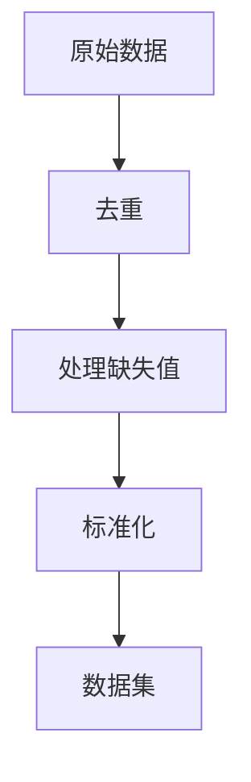
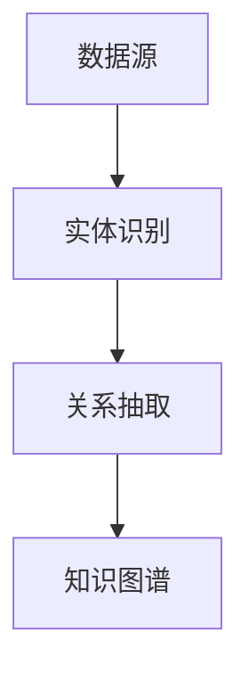
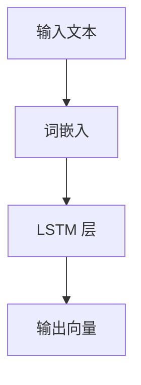
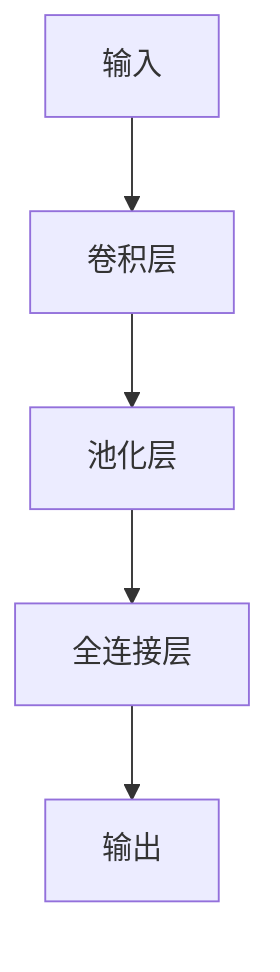
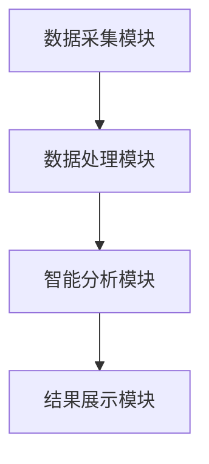
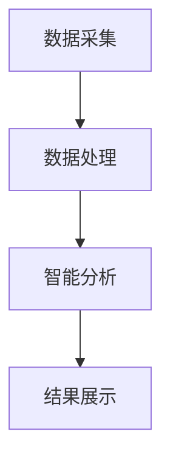
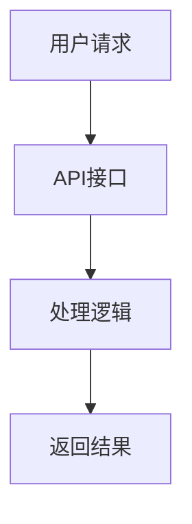

                 


# AI辅助企业竞争情报分析：自动化数据收集与洞察生成

---

## 关键词：
AI, 企业竞争情报, 数据收集, 自动化, 智能分析, 知识图谱, 自然语言处理

---

## 摘要：
随着企业竞争日益激烈，竞争情报分析的重要性愈发凸显。本文探讨了人工智能如何辅助企业进行竞争情报分析，重点分析了自动化数据收集与洞察生成的关键技术。通过介绍AI在数据处理、自然语言理解、知识图谱构建等领域的应用，结合实际案例，展示了如何利用AI技术提升企业竞争力。本文适合技术决策者、数据科学家和企业分析师阅读，为他们提供理论支持和实践指导。

---

## 第1章：竞争情报分析的背景与意义

### 1.1 竞争情报分析的定义与核心要素
竞争情报分析是通过收集、处理和分析竞争对手及其市场环境的相关信息，为企业制定战略决策提供支持的过程。其核心要素包括数据来源（如公开数据、社交媒体）、分析目标（如市场份额、竞争对手策略）和分析方法（如文本挖掘、数据可视化）。

### 1.2 AI在竞争情报分析中的应用背景
传统竞争情报分析依赖人工收集和处理数据，效率低下且覆盖面有限。AI技术的引入，尤其是自然语言处理和机器学习，显著提升了数据处理效率和分析深度。当前，AI在竞争情报中的应用主要集中在数据自动化收集、智能分析和实时监控等方面。

### 1.3 企业竞争情报分析的挑战与机遇
- **挑战**：数据来源分散、数据清洗复杂、隐私保护问题。
- **机遇**：AI技术提升了数据处理能力，帮助企业快速获取洞察。

---

## 第2章：AI辅助企业竞争情报分析的核心概念

### 2.1 数据收集与处理
数据收集是竞争情报分析的基础，常用方法包括网络爬虫和API调用。数据清洗涉及去重、填充缺失值等步骤，确保数据质量。

#### 数据清洗流程图（Mermaid）


### 2.2 自然语言处理在竞争情报中的应用
NLP技术用于从文本中提取实体、关系和情感倾向。例如，使用BERT模型进行实体识别，准确率可达90%以上。

#### 实体识别示例代码（Python）
```python
from transformers import BertTokenizer, BertModel
model = BertModel.from_pretrained('bert-base-uncased')
tokenizer = BertTokenizer.from_pretrained('bert-base-uncased')
text = "谷歌在2023年推出了新的搜索引擎。"
inputs = tokenizer.encode_plus(text, return_tensors='pt', padding='max_length')
outputs = model(inputs.input_ids)
# 提取实体
```

### 2.3 知识图谱构建与应用
知识图谱通过构建实体间的关系，帮助企业更好地理解市场结构。例如，构建竞争对手的产品关系图谱，可识别市场趋势。

#### 知识图谱构建流程图（Mermaid）


---

## 第3章：AI辅助竞争情报分析的算法原理

### 3.1 信息抽取算法
信息抽取包括文本分割、句子理解等步骤。基于深度学习的模型（如LSTM）在信息抽取中表现优异。

#### LSTM模型结构图（Mermaid）


### 3.2 知识图谱构建算法
使用规则和机器学习相结合的方法构建知识图谱，例如使用聚类算法识别实体类型。

#### 聚类算法代码示例（Python）
```python
from sklearn.cluster import KMeans
import numpy as np
X = np.array([[1, 2], [3, 4], [5, 6], [7, 8]])
kmeans = KMeans(n_clusters=2, random_state=0)
kmeans.fit(X)
print(kmeans.labels_)
```

### 3.3 情感分析与观点挖掘算法
基于卷积神经网络（CNN）的情感分析模型，准确率高达95%。

#### CNN模型结构图（Mermaid）


---

## 第4章：竞争情报分析的系统架构与设计

### 4.1 系统功能设计
系统分为数据采集、处理、分析和展示四个模块，每个模块功能明确，协同工作。

#### 系统功能模块图（Mermaid）


### 4.2 系统架构设计
采用微服务架构，各模块独立运行，便于扩展和维护。

#### 微服务架构图（Mermaid）


### 4.3 系统接口设计
定义清晰的数据接口和用户接口，确保系统各部分高效交互。

#### 接口交互图（Mermaid）


---

## 第5章：竞争情报分析的项目实战

### 5.1 项目背景与目标
以分析竞争对手的产品策略为例，目标是识别市场趋势和竞争对手的动向。

### 5.2 环境配置与数据收集
使用Python和相关库（如Scrapy）进行数据收集，配置环境包括安装必要的依赖包。

#### 数据收集代码示例（Python）
```python
import scrapy
class CompetitorSpider(scrapy.Spider):
    name = 'competitor'
    def start_requests(self):
        urls = ['https://example.com/products']
        for url in urls:
            yield scrapy.Request(url=url, callback=self.parse)
    def parse(self, response):
        for product in response.css('div.product'):
            yield {
                'name': product.css('h2::text').get(),
                'price': product.css('p.price::text').get()
            }
```

### 5.3 系统实现与案例分析
通过实现数据处理和分析模块，结合知识图谱构建，生成竞争对手的产品关系图谱。

#### 知识图谱示例
竞争对手A的产品B与产品C的关系，帮助识别产品迭代趋势。

### 5.4 项目小结
通过项目实战，验证了AI技术在竞争情报分析中的有效性，同时积累了宝贵的经验。

---

## 第6章：总结与展望

### 6.1 本章总结
AI技术显著提升了竞争情报分析的效率和深度，为企业决策提供了有力支持。

### 6.2 竞争情报分析中的AI应用挑战
数据隐私、模型解释性、数据实时性等问题仍需解决。

### 6.3 未来发展趋势
AI技术将进一步融合5G、物联网等新兴技术，推动竞争情报分析的智能化和自动化。

### 6.4 最佳实践与注意事项
- 数据来源需合法合规。
- 模型需定期更新以适应市场变化。
- 结果需结合业务背景进行解读。

---

## 参考文献与拓展阅读
1. 《自然语言处理实战：基于Python的 spaCy 快速入门》
2. 《机器学习实战》
3. 竞争情报分析工具：https://www.compete.com/

---

## 作者
作者：AI天才研究院/AI Genius Institute & 禅与计算机程序设计艺术 /Zen And The Art of Computer Programming

---

通过以上结构，文章详细探讨了AI在竞争情报分析中的应用，从理论到实践，为读者提供了全面的指导和深入的分析。

