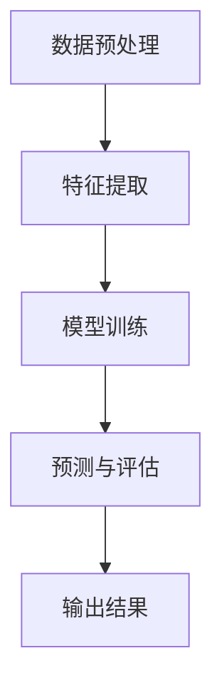
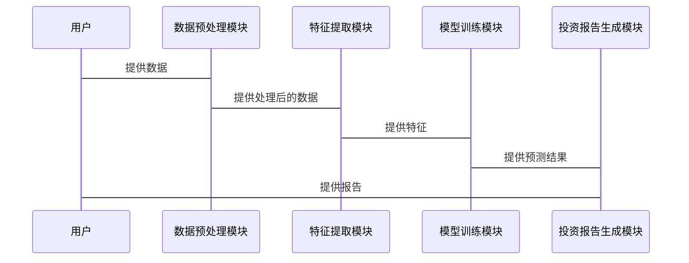

                 


# AI辅助发现新兴市场价值投资标的

> 关键词：人工智能，价值投资，新兴市场，投资标的，机器学习，数据驱动，市场分析

> 摘要：本文探讨了如何利用人工智能技术辅助发现新兴市场的价值投资标的。从背景介绍到算法原理，再到系统设计和项目实战，详细阐述了AI在投资中的应用。通过对比分析和案例研究，展示了如何利用AI技术提升投资决策的效率和准确性。

---

# 第一部分: AI辅助发现新兴市场价值投资标的背景与概念

## 第1章: 问题背景与概念介绍

### 1.1 问题背景

#### 1.1.1 传统投资方式的局限性

传统投资方式依赖于人工分析和经验判断，存在效率低、覆盖面有限、难以应对复杂市场环境等问题。尤其是在新兴市场，信息不透明、波动性大、数据复杂，传统方法难以捕捉潜在的投资机会。

#### 1.1.2 新兴市场的特点与挑战

新兴市场具有高增长潜力，但也伴随着高风险。市场参与者众多，信息分散，数据质量参差不齐，传统的数据收集和分析方法难以有效提取有价值的信息。

#### 1.1.3 AI技术在投资领域的应用潜力

AI技术通过大数据分析、机器学习和自然语言处理等手段，能够快速处理大量数据，发现隐藏的模式和趋势，为投资决策提供支持。特别是在新兴市场，AI能够帮助投资者发现潜在的价值标的，提高投资效率。

### 1.2 核心概念

#### 1.2.1 价值投资标的的定义

价值投资标的是指那些市场价格低于其内在价值的股票或资产，具有长期增长潜力。通过AI技术，可以更精准地识别这些标的。

#### 1.2.2 AI辅助投资的核心原理

AI通过分析海量数据，构建预测模型，识别市场趋势和潜在投资机会。其核心在于利用算法从数据中提取有用的特征，进行分类和预测。

#### 1.2.3 新兴市场的价值发现机制

新兴市场中，价值投资标的往往被低估，AI可以通过分析财务数据、市场情绪、行业趋势等因素，发现这些标的。

---

## 第2章: AI辅助投资的现状与挑战

### 2.1 现有技术的应用现状

#### 2.1.1 数据分析技术的应用

通过大数据分析技术，投资者可以快速处理和分析海量数据，提取有用的信息。

#### 2.1.2 机器学习在投资中的应用

机器学习模型可以用于预测股票价格、识别市场趋势等。

#### 2.1.3 自然语言处理在市场分析中的应用

自然语言处理技术可以分析新闻、社交媒体等非结构化数据，提取市场情绪。

### 2.2 当前面临的主要挑战

#### 2.2.1 数据质量与完整性问题

数据的质量和完整性直接影响模型的准确性。新兴市场数据往往不完整或存在偏差。

#### 2.2.2 模型的泛化能力不足

AI模型在新兴市场中的表现可能不佳，因为这些市场的数据量有限，模型难以泛化。

#### 2.2.3 市场波动与不确定性的影响

新兴市场波动性大，AI模型需要能够适应快速变化的市场环境。

---

# 第二部分: AI辅助投资的核心概念与联系

## 第3章: 核心概念与联系

### 3.1 核心概念原理

#### 3.1.1 数据驱动的投资决策

通过分析大量数据，AI能够提供基于数据的投资决策支持。

#### 3.1.2 AI模型的特征提取能力

模型能够从数据中提取有用的特征，如波动率、市盈率等，用于预测和分类。

#### 3.1.3 市场情绪与趋势预测

通过分析市场情绪，AI可以预测市场趋势，帮助投资者做出决策。

### 3.2 核心概念属性对比表

| 概念       | 描述                                                                 |
|------------|----------------------------------------------------------------------|
| 数据源     | 包括历史价格、财务数据、新闻 sentiment 等                                  |
| 特征       | 如波动率、市盈率、市场情绪等               

### 3.3 ER实体关系图

```mermaid
erd
  entity 投资标的 {
    key: 标的ID
    attribute: 名称, 行业, 财务数据
  }
  entity 数据源 {
    key: 数据ID
    attribute: 时间戳, 数据类型
  }
  entity 特征 {
    key: 特征ID
    attribute: 特征名称, 特征值
  }
  投资标的 <-- 关联关系 --> 数据源
  数据源 <-- 关联关系 --> 特征
```

---

## 第4章: 算法原理

### 4.1 算法原理讲解

#### 4.1.1 因子分析

因子分析用于提取影响股票价格的关键因素，如市盈率、市净率等。

#### 4.1.2 聚类分析

聚类分析用于将相似的股票分组，识别具有相似特征的投资标的。

#### 4.1.3 时间序列分析

时间序列分析用于预测股票价格的未来走势。

### 4.2 算法流程图



### 4.3 Python代码示例

```python
import pandas as pd
from sklearn.cluster import KMeans

# 数据预处理
data = pd.read_csv('market_data.csv')
data = data.dropna()

# 特征提取
features = data[['市盈率', '市净率', '波动率']]

# 模型训练
model = KMeans(n_clusters=3)
model.fit(features)

# 预测与评估
predictions = model.predict(features)
print("预测结果:", predictions)
```

---

## 第5章: 系统分析与架构设计

### 5.1 系统架构图


### 5.2 接口设计

- 数据输入接口：接收市场数据和财务数据。
- 模型调用接口：调用机器学习模型进行预测。
- 报告生成接口：生成投资报告并输出结果。

### 5.3 交互流程图



---

## 第6章: 项目实战

### 6.1 环境安装

```bash
pip install pandas scikit-learn matplotlib
```

### 6.2 核心代码实现

```python
import pandas as pd
from sklearn import preprocessing
from sklearn.cluster import KMeans

# 数据预处理
data = pd.read_csv('market_data.csv')
data = data.dropna()

# 特征提取
features = data[['市盈率', '市净率', '波动率']]
scaler = preprocessing.StandardScaler()
features_scaled = scaler.fit_transform(features)

# 模型训练
model = KMeans(n_clusters=3)
model.fit(features_scaled)

# 可视化
import matplotlib.pyplot as plt
plt.scatter(features_scaled[:,0], features_scaled[:,1], c=model.labels_)
plt.xlabel('市盈率')
plt.ylabel('市净率')
plt.show()
```

### 6.3 案例分析

以某新兴市场的数据为例，通过上述代码进行分析，识别出具有潜力的价值投资标的。

### 6.4 项目小结

通过项目实战，验证了AI辅助投资的有效性，同时也发现了需要进一步优化的地方，如数据质量和模型调优。

---

## 第7章: 最佳实践与总结

### 7.1 最佳实践

- 重视数据质量，确保数据的完整性和准确性。
- 定期调优模型，适应市场变化。
- 结合人工分析，提升投资决策的准确性。

### 7.2 小结

AI技术在发现新兴市场价值投资标的过程中发挥着重要作用，但需要结合实际情况，合理应用。

### 7.3 注意事项

- 数据隐私和安全问题需要重视。
- 避免过度依赖模型，保持理性分析。
- 定期监控模型表现，及时调整策略。

### 7.4 拓展阅读

- 《机器学习实战》
- 《Python机器学习》

---

作者：AI天才研究院/AI Genius Institute & 禅与计算机程序设计艺术/Zen And The Art of Computer Programming

