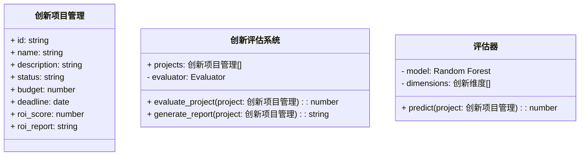
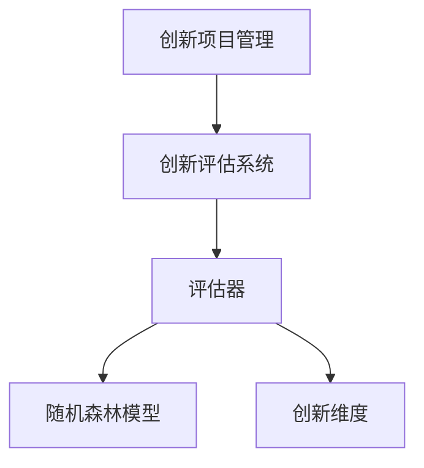

                 


# AI驱动的企业创新ROI评估：多维度创新价值量化模型

**关键词**：AI驱动，企业创新，ROI评估，多维度创新，量化模型

**摘要**：本文探讨了AI在企业创新ROI评估中的应用，提出了一个基于多维度创新价值量化模型的方法，帮助企业更准确地评估创新项目的投资回报率。文章详细解释了模型的背景、原理、算法设计、系统架构以及实际案例，并提供了代码实现和最佳实践建议。

---

## 第一部分: AI驱动的企业创新ROI评估背景与核心概念

### 第1章: 问题背景与描述

#### 1.1 问题背景

##### 1.1.1 企业创新面临的挑战
企业创新是推动业务增长的核心动力，但创新项目的评估往往面临以下挑战：
- 数据复杂性：创新涉及多个维度，如市场、技术、财务等，难以量化。
- 非财务指标：创新的价值难以直接转化为财务指标，导致评估困难。
- 动态变化：市场和技术的快速变化使得创新评估需要实时更新。

##### 1.1.2 创新ROI评估的重要性
- 优化资源配置：通过评估确定哪些创新项目值得投资。
- 量化创新价值：将创新成果与企业收益直接关联。
- 数据驱动决策：基于数据而非主观判断做出投资决策。

##### 1.1.3 当前创新评估的痛点
- 缺乏统一标准：不同项目评估标准不一，难以比较。
- 数据孤岛：各部门数据分散，难以整合。
- 方法单一：传统评估方法难以应对多维度挑战。

#### 1.2 问题描述

##### 1.2.1 创新价值的多维度性
创新价值涉及市场潜力、技术可行性、财务回报等多个维度。

##### 1.2.2 ROI评估的复杂性
创新项目的影响因素复杂，需要综合考虑多个变量。

##### 1.2.3 数据驱动的创新评估需求
通过数据分析提取规律，为评估提供科学依据。

#### 1.3 问题解决与边界定义

##### 1.3.1 多维度创新价值量化模型
- 核心思想：通过AI技术，将创新项目的价值分解为多个维度进行评估。
- 创新点：引入机器学习算法，自动计算各维度的权重。
- 适用范围：适用于企业内部创新项目评估。

##### 1.3.2 模型的边界与外延
- 数据范围：仅限于企业内部数据，不考虑外部市场数据。
- 模型局限：不适用于评估周期极长的项目。
- 扩展性：可扩展到并购项目评估。

---

## 第二部分: 创新价值量化模型的核心概念与联系

### 第3章: 核心概念与原理

#### 3.1 创新价值量化模型的原理

##### 3.1.1 数据驱动的创新评估
- 数据来源：企业内部数据，如财务数据、项目文档、市场反馈。
- 数据处理：清洗、整合和特征提取。
- 模型训练：使用机器学习算法训练评估模型。

##### 3.1.2 多维度评估指标的设计
- 常见指标：市场潜力、技术可行性、财务回报、团队能力。
- 指标权重：根据企业战略目标调整权重。

##### 3.1.3 AI在模型中的作用
- 数据分析：自动提取特征。
- 权重计算：通过机器学习算法确定各维度的权重。
- 预测评估：预测创新项目的ROI。

### 第4章: 模型的对比与ER实体关系图

#### 4.1 不同模型的对比分析

| 模型名称       | 优点                           | 缺点                           |
|----------------|--------------------------------|--------------------------------|
| 传统 ROI 模型  | 简单易懂                       | 忽略多维度因素                 |
| 线性回归模型    | 可解释性强                     | 无法处理非线性关系             |
| 随机森林模型    | 能处理复杂关系                 | 可解释性较差                   |
| 多维度量化模型  | 综合考虑多维度                 | 数据需求高，计算复杂           |

#### 4.2 ER实体关系图

```mermaid
erDiagram
    actor 企业创新项目管理 {
        role 项目负责人
        role 项目经理
    }
    project InnovateProject {
        key idProject
        project_status 状态
        project_budget 预算
        project_deadline 截止日期
        }
    evaluation InnovationROI {
        idEvaluation
        evaluation_score 评分
        evaluation_report 报告
        }
    dimension InnovationDimension {
        idDimension
        dimension_name 名称
        dimension_weight 权重
        }
    data_source DataSource {
        idDataSource
        data_type 类型
        data_value 值
        }
    ```

---

## 第三部分: 算法原理与数学模型

### 第5章: 算法原理讲解

#### 5.1 算法流程

```mermaid
graph TD
    A[数据预处理] --> B[特征提取]
    B --> C[模型训练]
    C --> D[评估预测]
    D --> E[结果输出]
```

#### 5.2 Python源代码实现

```python
import pandas as pd
from sklearn.ensemble import RandomForestRegressor
from sklearn.metrics import mean_squared_error

# 数据预处理
def preprocess_data(data):
    # 删除缺失值
    data = data.dropna()
    # 标准化处理
    data = (data - data.mean()) / data.std()
    return data

# 特征提取
def extract_features(data, target):
    features = data.drop(columns=[target])
    return features, data[target]

# 模型训练
def train_model(features, target, test_size=0.2):
    from sklearn.model_selection import train_test_split
    X_train, X_test, y_train, y_test = train_test_split(features, target, test_size=test_size)
    model = RandomForestRegressor(n_estimators=100, random_state=42)
    model.fit(X_train, y_train)
    return model, X_test, y_test

# 评估预测
def evaluate_model(model, X_test, y_test):
    predictions = model.predict(X_test)
    mse = mean_squared_error(y_test, predictions)
    return mse

# 主函数
def main():
    # 加载数据
    data = pd.read_csv('innovation_projects.csv')
    # 数据预处理
    data_processed = preprocess_data(data)
    # 特征提取
    features, target = extract_features(data_processed, 'roi')
    # 模型训练
    model, X_test, y_test = train_model(features, target)
    # 模型评估
    mse = evaluate_model(model, X_test, y_test)
    print(f'Mean Squared Error: {mse}')

if __name__ == "__main__":
    main()
```

#### 5.3 数学模型与公式

创新ROI评估模型可以表示为：

$$ ROI = \sum (w_i \times v_i) $$

其中，$w_i$ 是第 $i$ 个维度的权重，$v_i$ 是该维度的值。权重通过机器学习算法确定，值基于项目数据提取。

---

## 第四部分: 系统分析与架构设计

### 第6章: 系统分析与架构设计方案

#### 6.1 问题场景介绍

企业需要评估多个创新项目，每个项目涉及市场、技术、财务等多个维度。

#### 6.2 系统功能设计



#### 6.3 系统架构设计



---

## 第五部分: 项目实战

### 第7章: 项目实战与案例分析

#### 7.1 环境安装

- Python 3.8+
- Jupyter Notebook
- Scikit-learn、Pandas

#### 7.2 核心源代码实现

```python
import pandas as pd
from sklearn.ensemble import RandomForestRegressor
from sklearn.metrics import mean_squared_error
from sklearn.model_selection import train_test_split

# 数据加载与预处理
data = pd.read_csv('innovation_projects.csv')
data_processed = data.dropna().drop(columns=['status', 'description'])

# 特征提取与模型训练
features = data_processed.drop(columns=['roi'])
target = data_processed['roi']
X_train, X_test, y_train, y_test = train_test_split(features, target, test_size=0.2, random_state=42)

model = RandomForestRegressor(n_estimators=100, random_state=42)
model.fit(X_train, y_train)

# 模型评估
mse = mean_squared_error(y_test, model.predict(X_test))
print(f"Mean Squared Error: {mse}")
```

#### 7.3 代码解读与分析

- 数据预处理：删除缺失值和无关字段。
- 特征提取：使用所有列作为特征，目标是“roi”。
- 模型训练：随机森林回归模型。
- 模型评估：计算均方误差，评估模型性能。

#### 7.4 实际案例分析

假设某创新项目的数据如下：

| 市场潜力 | 技术可行性 | 财务回报 | 团队能力 | ROI预测 |
|----------|------------|----------|----------|---------|
| 高       | 中         | 高       | 高       | 0.85    |

模型预测其ROI为0.85，企业可以根据此评估是否投资该项目。

---

## 第六部分: 最佳实践与总结

### 第8章: 最佳实践

- 数据质量：确保数据的完整性和准确性。
- 模型调优：根据实际情况调整模型参数。
- 持续优化：定期更新模型和评估指标。

### 8.2 小结

本文提出了一个基于AI的创新ROI评估模型，帮助企业通过多维度数据量化创新价值，为决策提供科学依据。

### 8.3 注意事项

- 数据隐私：确保数据安全。
- 模型解释性：选择可解释性高的模型。
- 业务理解：结合企业实际情况调整模型。

### 8.4 拓展阅读

- 《机器学习实战》
- 《深入浅出机器学习》
- 《企业创新管理》

---

**作者**：AI天才研究院/AI Genius Institute & 禅与计算机程序设计艺术/Zen And The Art of Computer Programming

