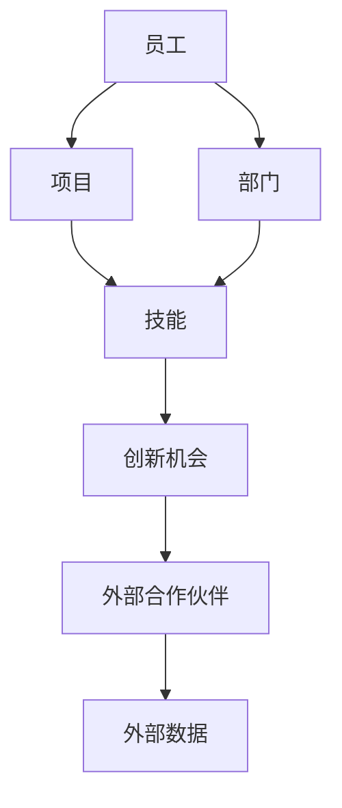
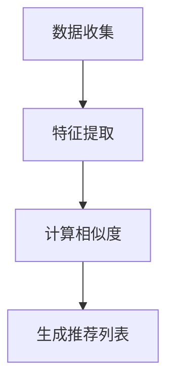
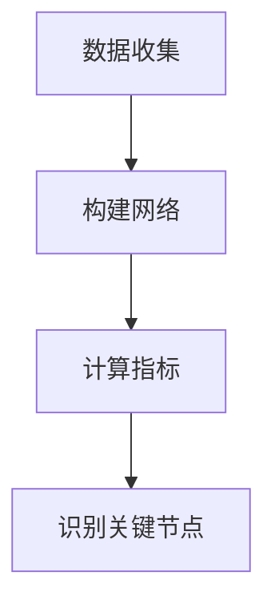
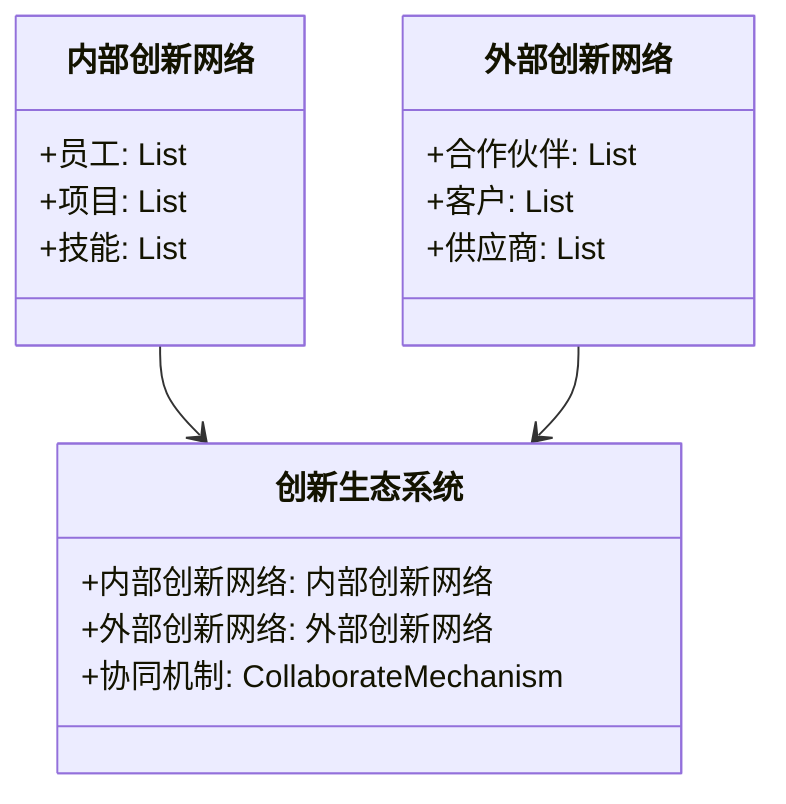
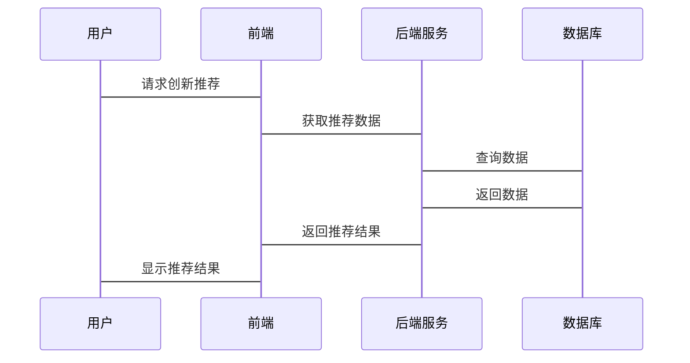

                 


# AI驱动的企业创新生态系统分析：内外部创新网络

## 关键词：AI驱动、企业创新生态系统、内外部创新网络、协同创新、社会网络分析、机器学习算法

## 摘要：  
随着人工智能技术的快速发展，企业创新生态系统正经历着前所未有的变革。本文从AI驱动的角度，系统分析了企业创新生态系统的内外部创新网络，探讨了如何通过AI技术优化企业创新过程。通过详细阐述核心概念、算法原理、系统架构设计和项目实战，本文为读者提供了从理论到实践的全面指导，帮助企业在数字化时代构建更具竞争力的创新生态系统。

---

# 第1章：AI驱动的企业创新生态系统背景与概述

## 1.1 企业创新生态系统的基本概念

### 1.1.1 企业创新生态系统的定义  
企业创新生态系统是指由企业内外部利益相关者（如员工、供应商、客户、合作伙伴等）共同参与、协同创新的网络结构。通过整合内外部资源，企业可以更高效地捕捉创新机会，推动产品和服务的创新。

### 1.1.2 AI在企业创新中的作用  
AI技术通过数据挖掘、机器学习和自然语言处理，帮助企业发现潜在的创新机会，优化资源配置，并加速创新过程。例如，AI可以通过分析市场数据和客户需求，生成创新产品的推荐方案。

### 1.1.3 内部与外部创新网络的定义与区别  
- **内部创新网络**：由企业内部员工、部门和资源构成，关注企业内部的知识共享和协作。  
- **外部创新网络**：由外部合作伙伴、供应商、客户和第三方机构构成，关注企业外部资源的整合和协同。  
两者的区别在于资源范围和控制权，但协同机制是实现创新的关键。

## 1.2 问题背景与描述

### 1.2.1 当前企业创新面临的挑战  
传统的企业创新模式往往依赖于线性流程和部门间协作，效率较低，且难以捕捉外部机会。此外，内部资源分散、外部合作不畅等问题进一步制约了创新效率。

### 1.2.2 AI技术对企业创新的机遇  
AI技术可以通过数据驱动的方式，实时分析企业内外部数据，识别潜在的创新机会，并优化资源配置。例如，AI可以通过分析客户反馈数据，快速识别市场趋势，推动产品创新。

### 1.2.3 内外部创新网络的协同问题  
如何实现内部与外部创新网络的有效协同是当前企业创新面临的核心挑战。例如，如何通过AI技术打破内部与外部的“信息孤岛”，实现知识共享和资源优化配置。

## 1.3 问题解决与边界

### 1.3.1 AI驱动创新网络的解决方案  
通过构建AI驱动的内外部创新网络，企业可以实现数据共享、知识流动和资源优化配置。例如，AI可以通过协同过滤算法，推荐潜在的合作机会。

### 1.3.2 创新生态系统的核心要素  
- 数据：企业内外部数据的整合与分析。  
- 算法：用于网络分析、协同推荐和动态优化的机器学习算法。  
- 模型：构建知识图谱和网络模型，支持创新决策。  
- 接口：实现内外部网络的数据交互和协同工作。  
- 人机交互：直观的用户界面，支持用户与系统高效互动。

### 1.3.3 系统的边界与外延  
系统的边界包括数据输入输出接口、与其他系统的集成接口等。外延则涉及数据安全、隐私保护和系统扩展性。

## 1.4 核心概念与联系

### 1.4.1 核心概念的原理  
- 内部创新网络：基于知识图谱，分析员工技能和项目关联性。  
- 外部创新网络：基于社会网络分析，评估合作伙伴的价值。  
- 协同机制：通过API或事件驱动的方式，促进内外部数据流动。

### 1.4.2 核心概念的属性特征对比表  

| 属性       | 内部创新网络       | 外部创新网络       |
|------------|-------------------|-------------------|
| 资源控制   | 企业内部           | 第三方             |
| 数据来源   | 内部员工、项目数据 | 客户、供应商数据   |
| 协作方式   | 部门间协作         | 战略合作、API接口   |

### 1.4.3 ER实体关系图（Mermaid流程图）  



---

# 第2章：AI驱动的创新生态系统核心概念

## 2.1 创新网络的构建与分析

### 2.1.1 内部创新网络的构建  
基于知识图谱构建内部创新网络，分析员工技能和项目关联性，识别创新瓶颈。

### 2.1.2 外部创新网络的构建  
利用社会网络分析，评估合作伙伴的价值，建立战略联盟。

### 2.1.3 协同机制  
通过API或事件驱动的方式，促进内外部数据流动和知识共享。

## 2.2 AI在创新网络中的应用

### 2.2.1 数据驱动的创新网络分析  
通过AI技术分析市场数据和客户需求，生成创新产品的推荐方案。

### 2.2.2 AI算法在创新网络中的应用  
使用协同过滤算法，推荐潜在的合作机会；使用图嵌入技术，识别关键节点。

### 2.2.3 创新网络的动态演化  
实时更新网络结构，根据反馈调整资源配置。

## 2.3 创新生态系统的评估与优化

### 2.3.1 创新生态系统评估指标  
- 创新效率：创新成果的数量和质量。  
- 资源利用率：内外部资源的整合效率。  
- 协作密度：网络中节点的连接密度。

### 2.3.2 AI驱动的优化策略  
动态调整网络结构，引入激励机制，优化资源配置。

### 2.3.3 创新生态系统可持续性  
确保创新生态系统能够长期稳定运行，持续产生价值。

---

# 第3章：AI驱动的创新网络算法原理

## 3.1 协同过滤推荐算法

### 3.1.1 算法原理与流程图（Mermaid）  



### 3.1.2 Python实现代码  

```python
import numpy as np
from sklearn.metrics.pairwise import cosine_similarity

# 示例数据：用户-物品评分矩阵
users_items = {
    'user1': [4, 3, 0, 0, 0],
    'user2': [3, 1, 4, 0, 0],
    'user3': [0, 0, 5, 4, 0],
    'user4': [0, 0, 3, 0, 5],
}

def collaborative_filtering(users_items, user_id):
    # 提取目标用户的评分数据
    user_data = users_items[user_id]
    # 计算与其他用户的相似度
    similarity = []
    for user in users_items:
        if user != user_id:
            other_data = users_items[user]
            # 计算余弦相似度
            cos_sim = cosine_similarity([user_data], [other_data])[0][0]
            similarity.append((user, cos_sim))
    # 根据相似度排序
    similarity.sort(key=lambda x: x[1], reverse=True)
    # 生成推荐列表
    recommendations = []
    for user, sim in similarity:
        for i in range(len(users_items[user])):
            if users_items[user][i] > 0 and users_items[user_id][i] == 0:
                recommendations.append(i+1)
                if len(recommendations) == 3:
                    break
        if len(recommendations) == 3:
            break
    return recommendations

# 示例推荐
print(collaborative_filtering(users_items, 'user1'))
```

### 3.1.3 数学模型与公式  
$$ \text{余弦相似度} = \frac{\vec{A} \cdot \vec{B}}{\|\vec{A}\| \|\vec{B}\|} $$

## 3.2 社会网络分析算法

### 3.2.1 算法原理与流程图（Mermaid）  



### 3.2.2 Python实现代码  

```python
import networkx as nx

# 示例数据：社会网络图
graph = {
    'A': ['B', 'C'],
    'B': ['A', 'D', 'E'],
    'C': ['A', 'F'],
    'D': ['B'],
    'E': ['B', 'F'],
    'F': ['C', 'E']
}

def social_network_analysis(graph):
    G = nx.from_dict(graph)
    # 计算度数中心性
    degrees = dict(G.degree())
    # 识别关键节点
    max_degree = max(degrees.values())
    key_nodes = [node for node, degree in degrees.items() if degree == max_degree]
    return key_nodes

# 示例分析
print(social_network_analysis(graph))
```

### 3.2.3 数学模型与公式  
$$ \text{度数中心性} = \frac{\text{节点的度数}}{\text{网络中节点的平均度数}} $$

---

# 第4章：系统分析与架构设计

## 4.1 问题场景介绍  
企业内部与外部创新网络协作困难，资源分散，信息孤岛。

## 4.2 系统功能设计  

### 4.2.1 领域模型（Mermaid类图）  



### 4.2.2 系统架构设计（Mermaid架构图）  


## 4.3 系统接口设计  
- **API接口**：RESTful API，用于前后端交互和系统间通信。  
- **事件驱动**：通过事件触发协同机制，实现内外部网络的实时互动。

## 4.4 系统交互设计（Mermaid序列图）  



---

# 第5章：项目实战

## 5.1 环境安装  
- 安装Python、Jupyter、Pandas、Scikit-learn、networkx、node2vec等库。

## 5.2 核心代码实现  

### 5.2.1 协同过滤推荐算法  

```python
import numpy as np
from sklearn.metrics.pairwise import cosine_similarity

def collaborative_filtering(users_items, user_id):
    user_data = users_items[user_id]
    similarity = []
    for user in users_items:
        if user != user_id:
            other_data = users_items[user]
            cos_sim = cosine_similarity([user_data], [other_data])[0][0]
            similarity.append((user, cos_sim))
    similarity.sort(key=lambda x: x[1], reverse=True)
    recommendations = []
    for user, sim in similarity:
        for i in range(len(users_items[user])):
            if users_items[user][i] > 0 and users_items[user_id][i] == 0:
                recommendations.append(i+1)
                if len(recommendations) == 3:
                    break
        if len(recommendations) == 3:
            break
    return recommendations

# 示例推荐
print(collaborative_filtering(users_items, 'user1'))
```

### 5.2.2 社会网络分析算法  

```python
import networkx as nx

def social_network_analysis(graph):
    G = nx.from_dict(graph)
    degrees = dict(G.degree())
    max_degree = max(degrees.values())
    key_nodes = [node for node, degree in degrees.items() if degree == max_degree]
    return key_nodes

# 示例分析
print(social_network_analysis(graph))
```

## 5.3 代码解读与分析  
详细解释代码的功能和实现细节，包括数据预处理、算法实现和结果展示。

## 5.4 实际案例分析  
以某企业为例，展示如何通过AI算法优化其创新网络。

## 5.5 项目小结  
总结项目的成果，分析遇到的问题及解决方法，展望未来的发展方向。

---

# 第6章：最佳实践与小结

## 6.1 最佳实践  
- 数据质量是关键，确保数据的准确性和完整性。  
- 选择合适的算法，根据实际需求调整模型参数。  
- 系统设计要注重可扩展性和可维护性。

## 6.2 小结  
本文从AI驱动的角度，系统分析了企业创新生态系统的内外部创新网络，探讨了如何通过AI技术优化企业创新过程。通过详细阐述核心概念、算法原理、系统架构设计和项目实战，本文为读者提供了从理论到实践的全面指导。

## 6.3 注意事项  
- 数据隐私保护：确保用户数据的安全和隐私。  
- 算法可解释性：选择易于理解和解释的算法，避免“黑箱”模型。  
- 系统维护与更新：定期优化系统，适应业务变化和技术进步。

## 6.4 拓展阅读  
推荐阅读《协同创新：人工智能驱动的企业创新模式》、《社会网络分析与机器学习》等书籍，深入学习相关知识。

---

# 作者：AI天才研究院/AI Genius Institute & 禅与计算机程序设计艺术 /Zen And The Art of Computer Programming

---

这篇文章详细介绍了AI驱动的企业创新生态系统，从背景分析到算法实现，再到系统设计和项目实战，为读者提供了全面的指导。希望对您有所帮助！

