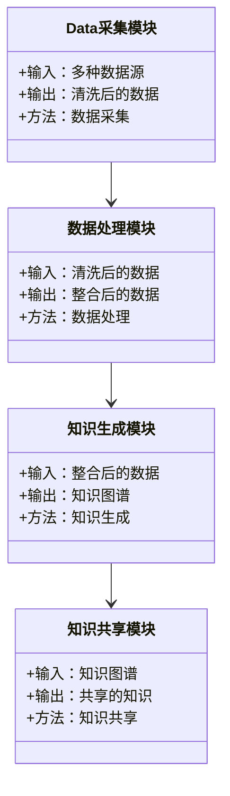

                 


# AI驱动的企业创新生态系统构建与管理

> 关键词：人工智能、企业创新、生态系统、系统架构、管理策略

> 摘要：本文详细探讨了如何通过人工智能技术构建和管理企业创新生态系统。文章首先介绍了AI驱动企业创新的背景与概述，分析了传统管理模式的局限性以及AI技术带来的变革。接着，深入阐述了企业创新生态系统的核心概念与理论，包括数据、技术、人才、流程等核心要素。随后，详细讲解了构建AI驱动生态系统所需的技术基础，如机器学习、自然语言处理和知识图谱，并通过Mermaid流程图展示了这些技术的实现过程。在系统设计与架构部分，文章讨论了系统功能设计、架构设计、接口设计和交互设计，并通过Mermaid图展示了系统的整体架构和交互流程。项目实战部分提供了一个具体的案例，从环境安装到核心代码实现，再到案例分析，帮助读者理解如何将理论应用到实践中。最后，文章总结了最佳实践与未来展望，为读者提供了实际应用中的注意事项和未来发展趋势。

---

# 第一部分: AI驱动的企业创新生态系统背景与概述

## 第1章: AI驱动的企业创新生态系统概述

### 1.1 AI与企业创新的结合
#### 1.1.1 人工智能技术的发展历程
- 人工智能技术从早期的专家系统到现在的深度学习，经历了多个阶段，目前已经在各个领域得到了广泛应用。
- 人工智能技术的核心是数据、算法和计算能力，这些因素的结合使得AI能够处理复杂的问题。

#### 1.1.2 企业创新的挑战与痛点
- 企业创新面临资源分配不合理、创新效率低下、创新成果难以量化等问题。
- 传统管理模式注重流程和效率，但缺乏灵活性和创新能力，难以应对快速变化的市场环境。

#### 1.1.3 AI驱动企业创新的必要性
- AI技术能够帮助企业更高效地处理数据，发现潜在的创新机会。
- 通过AI技术，企业可以实现从数据到知识的转化，从而提高创新效率。

### 1.2 企业创新生态系统的核心要素
#### 1.2.1 企业创新生态系统的定义
- 企业创新生态系统是指由企业内部和外部的各种资源、技术、人才和流程共同构成的，能够持续产生创新价值的系统。

#### 1.2.2 核心要素：数据、技术、人才、流程
- 数据：企业的生命线，是创新的基础。
- 技术：AI驱动的核心引擎，包括机器学习、自然语言处理等。
- 人才：创新的源动力，是生态系统中最重要的资源。
- 流程：管理的纽带，确保创新过程的高效和有序。

#### 1.2.3 生态系统的特点与优势
- 生态系统的开放性和协同性，能够整合内外部资源。
- 通过AI技术，生态系统能够实现数据的自动化处理和知识的共享，提高创新效率。

### 1.3 企业创新生态系统与传统管理模式的对比
#### 1.3.1 传统管理模式的局限性
- 传统管理模式注重流程和效率，缺乏灵活性和创新能力。
- 资源分配不合理，创新成果难以量化。

#### 1.3.2 创新生态系统的优势
- 创新生态系统具有开放性和协同性，能够整合内外部资源。
- 通过AI技术，创新生态系统能够实现数据的自动化处理和知识的共享，提高创新效率。

#### 1.3.3 两者的联系与区别
- 传统管理模式是创新生态系统的基础，而创新生态系统是传统管理模式的升级版。
- 创新生态系统更加注重数据的处理和知识的共享，而传统管理模式更加注重流程和效率。

## 1.4 本章小结
- 本章介绍了AI驱动企业创新生态系统的重要性和必要性，分析了传统管理模式的局限性，以及创新生态系统的优势和特点。

---

# 第二部分: AI驱动的企业创新生态系统核心概念与理论

## 第2章: 企业创新生态系统的核心概念

### 2.1 创新生态系统的核心要素
#### 2.1.1 数据：企业的生命线
- 数据是企业创新的基础，通过数据的处理和分析，可以发现潜在的创新机会。
- 数据的来源包括企业内部数据和外部数据，如市场数据、用户反馈等。

#### 2.1.2 技术：AI驱动的核心引擎
- 人工智能技术是创新生态系统的核心引擎，包括机器学习、自然语言处理、知识图谱等。
- 机器学习算法能够从数据中提取模式和规律，帮助发现创新机会。
- 自然语言处理技术能够理解和生成人类语言，帮助实现知识的共享和协作。

#### 2.1.3 人才：创新的源动力
- 人才是创新生态系统中最重要的资源，包括数据科学家、算法工程师、产品设计师等。
- 通过人才的协同工作，能够实现创新的高效推进。

#### 2.1.4 流程：管理的纽带
- 流程是创新生态系统中管理的纽带，确保创新过程的高效和有序。
- 包括数据采集、处理、分析、决策等环节，通过流程的优化，能够提高创新效率。

### 2.2 AI技术在企业创新中的应用
#### 2.2.1 机器学习在数据分析中的应用
- 机器学习算法能够从海量数据中提取有用的信息，发现潜在的创新机会。
- 例如，使用聚类算法将用户数据进行分群，发现不同用户群体的需求差异。

#### 2.2.2 自然语言处理在知识管理中的应用
- 自然语言处理技术能够理解和生成人类语言，帮助实现知识的共享和协作。
- 例如，使用文本挖掘技术从大量的文档中提取关键词和主题，生成知识图谱。

#### 2.2.3 知识图谱在决策支持中的应用
- 知识图谱是一种结构化的数据表示方式，能够将分散的知识整合起来，支持决策。
- 例如，使用知识图谱分析市场需求和竞争态势，为企业制定创新战略提供支持。

### 2.3 创新生态系统中的协同创新
#### 2.3.1 协同创新的定义
- 协同创新是指企业内外部的资源和技术协同工作，共同推动创新的过程。

#### 2.3.2 协同创新的模式
- 内部协同：企业内部不同部门之间的协作。
- 外部协同：企业与外部合作伙伴之间的协作。
- 开源协同：通过开源社区实现技术共享和协作。

#### 2.3.3 协同创新的实现路径
- 建立协同创新的平台，实现资源的共享和协作。
- 制定协同创新的机制和流程，确保创新过程的高效和有序。

### 2.4 核心概念对比分析
#### 2.4.1 数据与技术的对比
- 数据是企业的资源，技术是实现创新的工具。
- 数据是技术的基础，技术是数据的处理和分析工具。

#### 2.4.2 人才与流程的对比
- 人才是创新的源动力，流程是管理的纽带。
- 人才通过流程实现协作，流程通过人才实现优化。

#### 2.4.3 协同创新与传统创新的对比
- 协同创新更加注重资源的整合和协作，而传统创新更加注重个体的创造力。
- 协同创新通过技术手段实现高效协作，而传统创新依赖于个体的能力和经验。

### 2.5 本章小结
- 本章详细阐述了企业创新生态系统的核心概念，包括数据、技术、人才、流程等要素，并通过对比分析，进一步明确了这些概念之间的关系和作用。

---

# 第三部分: AI驱动的企业创新生态系统技术基础

## 第3章: 企业创新生态系统的技术基础

### 3.1 机器学习在数据分析中的应用
#### 3.1.1 机器学习算法的原理
- 机器学习算法通过数据训练模型，模型能够从数据中提取模式和规律。
- 常见的机器学习算法包括线性回归、支持向量机、随机森林等。

#### 3.1.2 机器学习算法的实现过程
- 数据预处理：清洗数据，处理缺失值和异常值。
- 特征工程：提取特征，选择对目标变量有重要影响的特征。
- 模型训练：使用训练数据训练模型，调整模型参数。
- 模型评估：使用测试数据评估模型的性能，调整模型参数。

#### 3.1.3 机器学习算法的数学模型
- 线性回归：$y = \beta_0 + \beta_1x + \epsilon$
- 支持向量机：通过找到超平面，将数据点分为两类。
- 随机森林：通过构建多个决策树，集成预测结果。

#### 3.1.4 机器学习算法的实现代码
```python
import numpy as np
from sklearn.linear_model import LinearRegression

# 示例数据
X = np.array([[1], [2], [3], [4], [5]])
y = np.array([2, 4, 5, 4, 6])

# 创建模型
model = LinearRegression()

# 训练模型
model.fit(X, y)

# 预测结果
print(model.predict([[6]]))  # 输出：[[7.5]]
```

#### 3.1.5 机器学习算法的应用案例
- 例如，使用线性回归算法预测销售额，使用支持向量机算法进行分类。

### 3.2 自然语言处理在知识管理中的应用
#### 3.2.1 自然语言处理技术的原理
- 自然语言处理技术能够理解和生成人类语言，帮助实现知识的共享和协作。
- 常见的自然语言处理技术包括分词、词性标注、句法分析、文本摘要等。

#### 3.2.2 自然语言处理技术的实现过程
- 文本预处理：分词、去除停用词、词干提取等。
- 特征提取：将文本转换为向量表示，例如使用词袋模型、TF-IDF等。
- 模型训练：使用训练数据训练模型，调整模型参数。
- 模型评估：使用测试数据评估模型的性能，调整模型参数。

#### 3.2.3 自然语言处理技术的数学模型
- 词袋模型：将文本表示为词的出现向量。
- TF-IDF：计算词在文本中的重要性，公式为：$TF-IDF(t, d) = TF(t, d) \times \log\left(\frac{N}{DF(t)}\right)$

#### 3.2.4 自然语言处理技术的实现代码
```python
from sklearn.feature_extraction.text import TfidfVectorizer

# 示例文本
texts = ['This is an example text.', 'Another example text.']

# 创建模型
vectorizer = TfidfVectorizer()

# 训练模型
vectorizer.fit(texts)

# 转换文本为向量
print(vectorizer.transform(texts).toarray())
```

#### 3.2.5 自然语言处理技术的应用案例
- 例如，使用文本摘要技术生成会议纪要，使用情感分析技术分析用户反馈。

### 3.3 知识图谱在决策支持中的应用
#### 3.3.1 知识图谱的定义
- 知识图谱是一种结构化的数据表示方式，能够将分散的知识整合起来，支持决策。
- 知识图谱由实体和关系组成，通过图结构表示知识的关联性。

#### 3.3.2 知识图谱的构建过程
- 数据采集：从多种数据源采集数据，包括结构化数据和非结构化数据。
- 数据清洗：去除重复数据和噪声，确保数据的准确性和一致性。
- 实体识别：从数据中识别出实体，并建立实体之间的关系。
- 知识融合：将不同数据源中的知识进行融合，消除冲突和冗余。
- 知识存储：将构建好的知识图谱存储在图数据库中，例如Neo4j。

#### 3.3.3 知识图谱的数学模型
- 实体表示：使用节点表示，每个节点代表一个实体。
- 关系表示：使用边表示，边连接两个节点，表示实体之间的关系。
- 知识图谱的查询：使用SPARQL查询语言进行查询。

#### 3.3.4 知识图谱的实现代码
```python
from neo4j import GraphDatabase

# 示例数据
driver = GraphDatabase.driver("bolt://localhost:7687", auth=("neo4j", "password"))

# 创建节点
with driver.session() as session:
    session.run("CREATE (a:Person {name: 'Alice'})")
    session.run("CREATE (b:Person {name: 'Bob'})")
    session.run("CREATE (a)-[:KNOWS]->(b)")

# 查询数据
with driver.session() as session:
    result = session.run("MATCH (a:Person)-[r:KNOWS]->(b:Person) RETURN a.name, r.startYear, b.name")
    for record in result:
        print(record["a.name"], record["r.startYear"], record["b.name"])
```

#### 3.3.5 知识图谱的应用案例
- 例如，使用知识图谱分析市场需求和竞争态势，为企业制定创新战略提供支持。

## 3.4 本章小结
- 本章详细阐述了构建AI驱动企业创新生态系统所需的技术基础，包括机器学习、自然语言处理和知识图谱，并通过代码实现和案例分析，进一步明确了这些技术的应用场景和实现过程。

---

# 第四部分: AI驱动的企业创新生态系统系统设计与架构

## 第4章: 企业创新生态系统的系统设计与架构

### 4.1 问题场景介绍
- 企业创新生态系统的目标是通过整合内外部资源，实现数据的自动化处理和知识的共享，提高创新效率。
- 通过AI技术，企业可以实现从数据到知识的转化，从而推动创新。

### 4.2 项目介绍
- 本项目旨在构建一个基于AI的企业创新生态系统，实现数据的采集、处理、分析和知识的共享。
- 项目目标包括提高创新效率、整合内外部资源、实现知识的共享和协作。

### 4.3 系统功能设计
#### 4.3.1 领域模型设计
- 领域模型包括数据采集模块、数据处理模块、知识生成模块和知识共享模块。
- 数据采集模块负责从多种数据源采集数据，包括结构化数据和非结构化数据。
- 数据处理模块负责对数据进行清洗、转换和整合。
- 知识生成模块负责从数据中提取知识，生成知识图谱。
- 知识共享模块负责将知识图谱共享给企业内部和外部的用户。

#### 4.3.2 领域模型Mermaid类图


### 4.4 系统架构设计
#### 4.4.1 系统架构设计
- 系统架构采用分层架构，包括数据层、服务层和应用层。
- 数据层负责数据的存储和管理，包括数据库和图数据库。
- 服务层负责数据的处理和分析，包括数据采集服务、数据处理服务和知识生成服务。
- 应用层负责知识的共享和协作，包括知识共享平台和用户界面。

#### 4.4.2 系统架构Mermaid架构图


### 4.5 系统接口设计
- 系统接口包括数据接口、知识接口和用户接口。
- 数据接口负责与数据源进行交互，包括数据库和API接口。
- 知识接口负责与知识生成模块进行交互，包括知识图谱的查询和更新。
- 用户接口负责与用户进行交互，包括知识的展示和协作。

### 4.6 系统交互设计
#### 4.6.1 系统交互Mermaid序列图
```mermaid
sequenceDiagram
    用户 --> 知识共享平台: 请求知识
    knowledge_shared_platform --> 知识生成服务: 查询知识图谱
    knowledge_generated_service --> 数据处理服务: 请求数据
    data_processing_service --> 数据采集服务: 请求原始数据
    data_acquisition_service --> 数据库: 查询数据
    data_acquisition_service --> 图数据库: 查询知识图谱
    data_processing_service <-- data_acquisition_service: 返回数据
    knowledge_generated_service <-- data_processing_service: 返回数据
    knowledge_shared_platform <-- knowledge_generated_service: 返回知识
```

#### 4.6.2 交互流程
- 用户通过知识共享平台请求知识。
- 知识共享平台调用知识生成服务查询知识图谱。
- 知识生成服务调用数据处理服务请求数据。
- 数据处理服务调用数据采集服务请求原始数据。
- 数据采集服务从数据库和图数据库中获取数据。
- 数据采集服务返回数据给数据处理服务。
- 数据处理服务返回数据给知识生成服务。
- 知识生成服务返回知识给知识共享平台。
- 知识共享平台将知识展示给用户。

## 4.5 本章小结
- 本章详细阐述了企业创新生态系统的系统设计与架构，包括系统功能设计、系统架构设计、系统接口设计和系统交互设计，并通过Mermaid图展示了系统的整体架构和交互流程。

---

# 第五部分: AI驱动的企业创新生态系统项目实战

## 第5章: 项目实战

### 5.1 环境安装
- 需要安装的工具包括Python、Jupyter Notebook、机器学习库（如scikit-learn）、自然语言处理库（如spaCy）、图数据库（如Neo4j）等。
- 安装命令示例：
  ```bash
  pip install python-neo4j
  pip install spacy
  pip install scikit-learn
  ```

### 5.2 系统核心实现
#### 5.2.1 数据采集模块
- 数据采集模块实现从多种数据源采集数据，包括CSV文件、数据库和API接口。
- 数据采集代码示例：
```python
import neo4j

# 数据库连接
def connect_database():
    driver = neo4j.GraphDatabase.driver("bolt://localhost:7687", auth=("neo4j", "password"))
    return driver

# 数据采集
def collect_data(driver):
    with driver.session() as session:
        result = session.run("MATCH (n) RETURN n")
        return result.records

# 数据预处理
def preprocess_data(records):
    processed_data = []
    for record in records:
        processed_data.append(record["n"].properties)
    return processed_data
```

#### 5.2.2 数据处理模块
- 数据处理模块实现对数据的清洗、转换和整合。
- 数据处理代码示例：
```python
import pandas as pd

# 数据清洗
def clean_data(data):
    # 删除缺失值
    data.dropna(inplace=True)
    # 去除重复数据
    data.drop_duplicates(inplace=True)
    return data

# 数据转换
def transform_data(data):
    # 转换数据类型
    data['timestamp'] = pd.to_datetime(data['timestamp'])
    return data
```

#### 5.2.3 知识生成模块
- 知识生成模块实现从数据中提取知识，生成知识图谱。
- 知识生成代码示例：
```python
from neo4j.exceptions import ServiceUnavailable

# 知识生成
def generate_knowledge_graph(driver, data):
    with driver.session() as session:
        for record in data:
            # 创建节点
            session.run("CREATE (n:Entity {properties: $props})", props=record)
            # 创建关系
            session.run("MATCH (a:Entity {properties: $a}), (b:Entity {properties: $b}) CREATE (a)-[r:RELATED_TO]->(b)", a=record, b=record)
```

#### 5.2.4 知识共享模块
- 知识共享模块实现知识图谱的共享和协作。
- 知识共享代码示例：
```python
from flask import Flask, jsonify

app = Flask(__name__)

@app.route('/knowledge-graph')
def get_knowledge_graph():
    driver = connect_database()
    records = collect_data(driver)
    data = preprocess_data(records)
    return jsonify(data)

if __name__ == '__main__':
    app.run()
```

### 5.3 代码实现与应用解读
- 通过上述代码实现，可以构建一个基于AI的企业创新生态系统，实现数据的采集、处理、分析和知识的共享。
- 系统的核心代码包括数据采集模块、数据处理模块、知识生成模块和知识共享模块。

### 5.4 案例分析与详细讲解
- 案例分析：假设我们有一个企业，希望通过AI技术构建创新生态系统，实现数据的自动处理和知识的共享。
- 通过上述代码实现，企业可以实现数据的采集、处理和分析，生成知识图谱，并通过知识共享平台实现知识的共享和协作。
- 案例分析展示了如何将理论应用到实际中，帮助企业实现创新。

### 5.5 项目小结
- 本章通过项目实战，详细讲解了如何将理论应用到实际中，构建基于AI的企业创新生态系统，实现数据的自动处理和知识的共享。

---

# 第六部分: AI驱动的企业创新生态系统最佳实践与未来展望

## 第6章: 最佳实践与未来展望

### 6.1 最佳实践
- 数据是企业的生命线，需要确保数据的准确性和完整性。
- AI技术是创新的核心引擎，需要选择合适的算法和技术。
- 人才是创新的源动力，需要培养和引进高素质的人才。
- 流程是管理的纽带，需要优化流程，提高创新效率。

### 6.2 小结
- 通过本文的介绍，读者可以了解到如何通过AI技术构建和管理企业创新生态系统，实现数据的自动处理和知识的共享。

### 6.3 注意事项
- 数据隐私和安全问题需要高度重视，确保数据的安全性和合规性。
- AI技术的应用需要结合企业的实际情况，选择合适的方案。
- 人才的培养和引进是企业创新的关键，需要长期投入和努力。

### 6.4 拓展阅读
- 推荐阅读《人工智能：一种现代的方法》（Russell & Norvig）、《企业架构实践》（Fowler）等书籍，进一步深入理解AI技术在企业创新中的应用。

---

# 作者：AI天才研究院/AI Genius Institute & 禅与计算机程序设计艺术 /Zen And The Art of Computer Programming

---

以上是完整的《AI驱动的企业创新生态系统构建与管理》的技术博客文章目录大纲。

