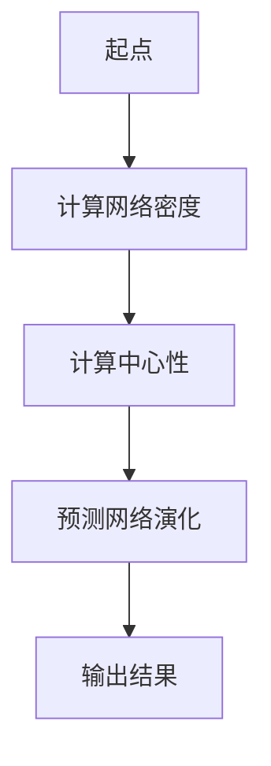
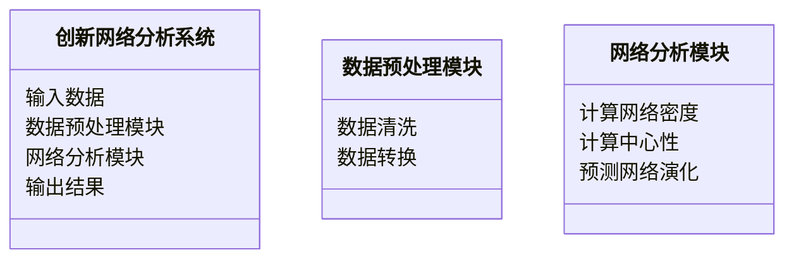
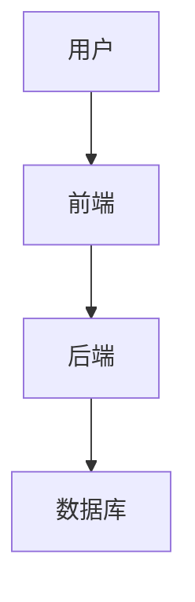

                 


# AI驱动的企业创新生态系统评估：内外部创新网络分析

> 关键词：企业创新生态系统、AI驱动评估、创新网络分析、网络密度、中心性、AI算法、系统架构

> 摘要：本文深入探讨了AI在企业创新生态系统评估中的应用，重点分析了内外部创新网络的结构特征和评估方法。通过结合图论和机器学习技术，本文提出了基于AI的创新网络分析算法，并通过实际案例展示了如何利用这些算法评估企业创新生态系统，为企业创新管理提供了新的思路和工具。

---

# 第1章: 企业创新生态系统与AI驱动评估概述

## 1.1 企业创新生态系统的核心概念

### 1.1.1 企业创新生态系统定义
企业创新生态系统是由企业内部员工、外部合作伙伴（如供应商、客户、合作伙伴）、行业专家、技术提供商等多方主体构成的复杂网络。这些主体通过知识共享、资源整合和协同创新，形成一个动态演化的创新网络。

### 1.1.2 创新网络的内外部特征
- **内部网络**：包括企业内部员工、部门之间的协作关系。
- **外部网络**：包括供应商、客户、合作伙伴等外部主体。
- **外部网络特征**：连接强度、中心性、网络密度等。

### 1.1.3 AI在创新生态系统评估中的作用
AI技术可以通过大数据分析、网络建模和机器学习算法，帮助企业在创新网络中识别关键节点、预测创新趋势、优化资源配置。

## 1.2 问题背景与研究意义

### 1.2.1 传统企业创新评估的局限性
- 传统评估方法通常基于静态指标，难以捕捉动态创新网络的复杂性。
- 数据量有限，难以全面分析内外部创新网络的关联性。

### 1.2.2 AI驱动评估的优势
- 基于AI的创新网络分析可以处理海量数据，发现潜在的创新机会。
- AI算法能够动态分析网络结构，实时优化创新资源配置。

### 1.2.3 研究目标与意义
本文旨在通过AI技术构建企业创新网络分析模型，为企业创新管理提供科学依据，帮助企业发现创新瓶颈，优化创新流程，提升创新效率。

## 1.3 问题描述与解决路径

### 1.3.1 创新网络分析的关键问题
- 如何量化创新网络的结构特征（如网络密度、中心性）。
- 如何利用AI算法预测创新网络的演化趋势。

### 1.3.2 AI驱动评估的核心技术
- 图论算法：用于分析创新网络的结构特征。
- 机器学习：用于预测创新趋势和优化资源配置。

### 1.3.3 解决方案的框架
1. 数据收集与预处理。
2. 创新网络建模与分析。
3. 基于AI的创新网络优化。

---

# 第2章: 创新网络分析的核心概念与联系

## 2.1 核心概念定义与属性对比

### 2.1.1 创新网络的实体与关系
- **实体**：包括企业内部员工、外部合作伙伴、供应商等。
- **关系**：包括协作关系、资源分配关系、知识共享关系。

### 2.1.2 实体属性特征对比表
| 实体 | 属性 | 特征描述 |
|------|------|----------|
| 员工 | 技能 | 技术专长、经验水平 |
| 合作伙伴 | 资源 | 技术资源、资金支持 |
| 供应商 | 供应能力 | 交货周期、产品质量 |

### 2.1.3 创新网络的ER实体关系图
```mermaid
er
    %% 创新网络实体关系图
    entity(员工) {
        员工ID
        技能
        经验
    }
    entity(外部合作伙伴) {
        合作伙伴ID
        资源
        服务类型
    }
    entity(创新项目) {
        项目ID
        项目目标
        关键技术
    }
    relation(员工-项目) {
        员工ID
        项目ID
        贡献度
    }
    relation(合作伙伴-项目) {
        合作伙伴ID
        项目ID
        资源投入
    }
```

## 2.2 创新网络的结构特征

### 2.2.1 网络密度与连接强度
网络密度是衡量创新网络中实体之间连接程度的重要指标，公式为：
$$ \text{网络密度} = \frac{\text{实际边数}}{\text{可能的最大边数}} $$

### 2.2.2 中心性与影响力
中心性是衡量网络中某个节点对整个网络的影响力的重要指标，常用的中心性指标包括度中心性和介数中心性。

### 2.2.3 网络演化规律
创新网络的演化可以通过随机图模型（如ER模型）或小世界网络模型进行模拟。

---

# 第3章: 创新网络分析的算法原理

## 3.1 网络分析算法概述

### 3.1.1 常见网络分析算法
- BFS算法：用于计算网络的最短路径。
- PageRank算法：用于评估网络节点的重要性。

### 3.1.2 AI驱动算法的优势
- 基于机器学习的算法可以动态调整网络分析模型。

## 3.2 基于图论的网络分析算法

### 3.2.1 算法流程图


### 3.2.2 算法实现步骤
1. 收集创新网络数据。
2. 构建图模型。
3. 计算网络密度和中心性。
4. 使用机器学习模型预测网络演化。

### 3.2.3 算法复杂度分析
- 时间复杂度：O(N^2)，其中N是网络节点数。

## 3.3 算法实现的数学模型与公式

### 3.3.1 网络密度计算公式
$$ \text{网络密度} = \frac{\text{实际边数}}{\frac{N(N-1)}{2}} $$

### 3.3.2 中心性计算公式
- 度中心性：$$ C_d(v) = \frac{\sum_{u} a_{vu}}{N-1} $$
- 介数中心性：$$ C_b(v) = \sum_{u \neq v \neq w} \frac{\sigma(u,w)}{\sigma(u,w | v)} $$

### 3.3.3 网络演化模型
随机图模型：$$ P(k) = \frac{e^{-\lambda} \lambda^k}{k!} $$

---

# 第4章: 创新网络分析的系统架构设计

## 4.1 系统分析与设计概述

### 4.1.1 问题场景描述
企业需要一个实时分析创新网络的系统，帮助管理者优化创新资源配置。

### 4.1.2 系统目标与范围
- 目标：实时分析创新网络的结构特征和演化趋势。
- 范围：包括数据采集、网络建模和结果输出。

## 4.2 系统功能设计

### 4.2.1 领域模型设计


### 4.2.2 功能模块划分
- 数据采集模块：负责采集创新网络数据。
- 数据预处理模块：负责数据清洗和转换。
- 网络分析模块：负责计算网络密度、中心性和预测网络演化。

### 4.2.3 用户角色与权限
- 管理员：系统管理员，负责系统配置和用户管理。
- 分析员：负责数据输入和结果解读。
- 普通用户：使用系统进行创新网络分析。

## 4.3 系统架构设计

### 4.3.1 分层架构设计


### 4.3.2 模块交互流程
1. 用户输入数据。
2. 前端接收数据并传递给后端。
3. 后端处理数据并调用网络分析模块。
4. 后端将结果返回给前端，用户查看结果。

### 4.3.3 系统接口设计
- 数据采集接口：HTTP POST 请求。
- 网络分析接口：RESTful API。

---

# 第5章: 创新网络分析的项目实战

## 5.1 环境安装与配置

### 5.1.1 开发环境搭建
- 操作系统：Linux或Windows。
- 开发工具：PyCharm或VS Code。

### 5.1.2 依赖库安装
- Python库：networkx、numpy、scipy。

## 5.2 核心算法实现

### 5.2.1 网络分析算法实现
```python
import networkx as nx

def calculate_network_density(G):
    max_possible_edges = G.number_of_nodes() * (G.number_of_nodes() - 1) / 2
    density = nx.density(G)
    return density
```

### 5.2.2 系统功能模块实现
```python
class NetworkAnalyzer:
    def __init__(self, G):
        self.G = G
    
    def calculate_density(self):
        return calculate_network_density(self.G)
    
    def calculate_centerity(self):
        degree_centrality = nx.degree_centrality(self.G)
        betweenness_centrality = nx.betweenness_centrality(self.G)
        return degree_centrality, betweenness_centrality
```

### 5.2.3 代码示例
```python
G = nx.Graph()
G.add_nodes_from(["员工1", "员工2", "合作伙伴1"])
G.add_edges_from([("员工1", "员工2"), ("员工1", "合作伙伴1")])
analyzer = NetworkAnalyzer(G)
density = analyzer.calculate_density()
print(f"网络密度：{density}")
degree_centrality, betweenness_centrality = analyzer.calculate_centerity()
print(f"度中心性：{degree_centrality}")
print(f"介数中心性：{betweenness_centrality}")
```

## 5.3 实际案例分析

### 5.3.1 数据收集与预处理
- 数据来源：企业内部员工数据、外部合作伙伴数据。
- 数据清洗：处理缺失值、异常值。

### 5.3.2 算法应用与结果分析
- 计算网络密度：发现网络中连接强度较低的区域。
- 计算中心性：识别关键节点，优化资源配置。

### 5.3.3 案例总结与经验分享
通过AI驱动的创新网络分析，企业可以实时监控创新网络的健康状况，优化创新资源配置，提升创新能力。

---

# 第6章: 最佳实践与总结

## 6.1 最佳实践 tip

---

作者：AI天才研究院/AI Genius Institute & 禅与计算机程序设计艺术 /Zen And The Art of Computer Programming

