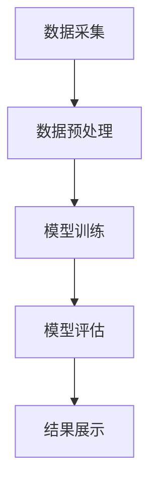

                 


# AI驱动的企业创新生态系统评估：内外部创新能力量化模型

## 关键词：AI, 企业创新, 生态系统, 内外部能力, 量化模型, 创新评估, 技术博客

## 摘要：  
随着人工智能技术的快速发展，企业创新生态系统评估正逐渐从传统的定性分析向基于数据的定量分析转变。本文旨在探讨如何利用AI技术构建内外部创新能力的量化模型，为企业创新管理提供科学依据。通过分析企业内部和外部创新能力的关键指标，结合AI算法，构建一个能够量化评估企业创新生态系统整体表现的模型。本文将从核心概念、算法原理、系统设计到实际应用进行全面解析，为企业创新管理提供新的视角和方法。

---

# 第一部分: AI驱动的企业创新生态系统评估基础

## # 第1章: 企业创新生态系统概述

### 1.1 企业创新生态系统的基本概念

#### 1.1.1 企业创新的定义与内涵
企业创新是指企业在经营活动中通过引入新技术、新产品、新市场和新管理方式等手段，实现价值创造和竞争优势的过程。创新不仅是企业发展的驱动力，也是企业在激烈市场竞争中保持活力的关键。

#### 1.1.2 企业创新生态系统的核心要素
企业创新生态系统是一个复杂的系统，包含企业内部和外部的多个要素。其核心要素包括：
- **内部创新要素**：研发能力、组织结构、文化氛围、人力资源等。
- **外部创新要素**：市场环境、合作伙伴、客户反馈、政策支持等。

#### 1.1.3 企业创新生态系统与企业创新管理的关系
企业创新生态系统是企业创新管理的外部环境和内部条件的综合体现。创新管理通过优化内部流程和外部合作，推动企业创新生态系统的发展，从而实现企业的持续创新。

### 1.2 企业创新生态系统评估的重要性

#### 1.2.1 企业创新对企业发展的影响
创新是企业发展的源动力。通过创新，企业可以提升产品竞争力、优化运营效率、拓展市场份额，并在行业中占据领先地位。

#### 1.2.2 企业创新生态系统评估的意义
企业创新生态系统评估能够帮助企业识别创新瓶颈、优化资源配置、发现潜在的合作机会，并为企业的战略决策提供数据支持。

#### 1.2.3 企业内外部创新能力的平衡与协调
企业内外部创新能力的平衡与协调是企业创新生态系统健康发展的关键。内部创新能力决定了企业的技术储备和创新能力，而外部创新能力则反映了企业与外部环境的互动能力和资源获取能力。

## # 第2章: AI驱动的企业创新生态系统评估背景

### 2.1 AI技术在企业创新中的应用

#### 2.1.1 AI技术对企业创新的支持作用
AI技术可以通过数据分析、模式识别和智能推荐等方式，帮助企业发现创新机会、优化创新流程并提升创新效率。

#### 2.1.2 AI技术在企业创新生态系统评估中的优势
AI技术能够处理海量数据，发现数据背后的规律，并通过模型量化企业内外部创新能力。与传统的定性分析相比，AI技术能够提供更加客观和精准的评估结果。

#### 2.1.3 当前企业创新生态系统评估的挑战
传统的企业创新评估方法多以定性分析为主，难以量化企业内外部创新能力的动态变化。同时，企业创新生态系统涉及的内外部因素复杂，难以通过简单的指标进行评估。

### 2.2 企业内外部创新能力的量化需求

#### 2.2.1 企业内部创新能力的定义与特征
企业内部创新能力是指企业在内部资源和能力的基础上，进行创新活动的能力。其特征包括自主性、可控性和技术领先性。

#### 2.2.2 企业外部创新能力的定义与特征
企业外部创新能力是指企业在外部环境中获取资源、建立合作关系并进行创新的能力。其特征包括开放性、合作性和灵活性。

#### 2.2.3 企业内外部创新能力量化的重要性
量化企业内外部创新能力能够帮助企业识别创新瓶颈、优化资源配置，并为企业的战略决策提供数据支持。

---

# 第二部分: 企业创新生态系统评估的核心概念与联系

## # 第3章: 核心概念与联系

### 3.1 核心概念原理

#### 3.1.1 企业内外部创新能力的定义与属性
- **内部创新能力**：企业在内部资源和能力基础上进行创新的能力，包括研发能力、技术储备和组织结构等。
- **外部创新能力**：企业在外部环境中获取资源、建立合作并进行创新的能力，包括市场环境、合作伙伴和客户反馈等。

#### 3.1.2 企业创新生态系统的核心要素与关系
企业创新生态系统由内部创新要素和外部创新要素组成。内部创新要素包括研发能力、组织结构和文化氛围等；外部创新要素包括市场环境、合作伙伴和政策支持等。两者相互作用，共同推动企业的创新活动。

#### 3.1.3 企业创新生态系统评估的指标体系
企业创新生态系统评估的指标体系包括：
- **内部创新能力指标**：研发投入比例、专利申请数量、员工创新能力等。
- **外部创新能力指标**：市场占有率、合作伙伴数量、客户满意度等。

### 3.2 内外部创新能力对比分析

#### 3.2.1 内部创新能力与外部创新能力的特征对比
- **内部创新能力**：强调企业的自主创新能力，主要依赖于内部资源。
- **外部创新能力**：强调企业与外部环境的互动能力，依赖于外部资源和合作。

#### 3.2.2 内外部创新能力对企业发展的影响
- **内部创新能力**：决定企业的技术领先性和核心竞争力。
- **外部创新能力**：影响企业的市场拓展能力和资源获取能力。

#### 3.2.3 内外部创新能力的动态平衡
企业内外部创新能力需要动态平衡。过度依赖内部创新能力可能导致企业创新的封闭性，而过度依赖外部创新能力可能导致企业创新的不稳定性和风险。

### 3.3 实体关系图（ER图）架构

```mermaid
erDiagram
    actor 企业创新生态系统
    actor 内部创新能力
    actor 外部创新能力
    actor 创新成果

    企业创新生态系统 --> 内部创新能力: 包含
    企业创新生态系统 --> 外部创新能力: 包含
    内部创新能力 --> 创新成果: 支持
    外部创新能力 --> 创新成果: 支持
```

---

# 第三部分: 企业创新生态系统评估的算法原理

## # 第4章: 算法原理与实现

### 4.1 内外部创新能力量化模型的构建

#### 4.1.1 数据收集与预处理
- 数据收集：包括企业内部数据（如研发投入、专利申请数量）和外部数据（如市场占有率、合作伙伴数量）。
- 数据预处理：数据清洗、标准化和特征提取。

#### 4.1.2 模型构建与训练
- 模型选择：基于回归分析、聚类分析或神经网络模型。
- 模型训练：利用历史数据训练模型，提取企业内外部创新能力的关键特征。

#### 4.1.3 模型评估与优化
- 模型评估：通过交叉验证、准确率和召回率等指标评估模型性能。
- 模型优化：通过参数调整和特征选择优化模型性能。

### 4.2 内外部创新能力量化模型的数学公式

#### 4.2.1 内部创新能力量化公式
$$
\text{内部创新能力} = \alpha \cdot \text{研发投入} + \beta \cdot \text{专利申请数量}
$$

其中，$\alpha$ 和 $\beta$ 是模型训练得到的权重系数。

#### 4.2.2 外部创新能力量化公式
$$
\text{外部创新能力} = \gamma \cdot \text{市场占有率} + \delta \cdot \text{合作伙伴数量}
$$

其中，$\gamma$ 和 $\delta$ 是模型训练得到的权重系数。

#### 4.2.3 综合创新能力量化公式
$$
\text{综合创新能力} = \lambda \cdot \text{内部创新能力} + (1-\lambda) \cdot \text{外部创新能力}
$$

其中，$\lambda$ 是根据企业实际情况确定的权重系数。

---

# 第四部分: 企业创新生态系统评估的系统设计

## # 第5章: 系统设计与实现

### 5.1 系统功能设计

#### 5.1.1 系统模块划分
- 数据采集模块：负责收集企业内部和外部数据。
- 模型训练模块：负责构建和训练量化模型。
- 模型评估模块：负责评估模型性能并优化模型。
- 结果展示模块：负责展示企业内外部创新能力的评估结果。

#### 5.1.2 系统功能流程图



### 5.2 系统架构设计

#### 5.2.1 系统架构图

```mermaid
serviceDiagram
    frontend --> backend: 请求数据
    backend --> database: 查询数据
    backend --> model: 调用模型
    model --> database: 获取特征数据
    model --> result: 输出评估结果
    backend --> frontend: 返回结果
```

#### 5.2.2 系统接口设计
- 数据接口：用于数据采集和数据预处理。
- 模型接口：用于模型训练和模型评估。
- 展示接口：用于结果展示和用户交互。

### 5.3 系统实现与代码示例

#### 5.3.1 环境安装
- Python 3.8+
- numpy、pandas、scikit-learn等库。

#### 5.3.2 核心代码实现

```python
import numpy as np
import pandas as pd
from sklearn.linear_model import LinearRegression

# 数据加载与预处理
data = pd.read_csv('innovation.csv')
X = data[['研发投入', '专利申请数量', '市场占有率', '合作伙伴数量']]
y = data['综合创新能力']

# 模型训练
model = LinearRegression()
model.fit(X, y)

# 模型评估
print('模型权重系数：', model.coef_)
print('模型截距：', model.intercept_)
```

---

# 第五部分: 企业创新生态系统评估的项目实战

## # 第6章: 项目实战与案例分析

### 6.1 项目背景介绍
某高科技企业希望利用AI技术评估其内部和外部创新能力，优化其创新生态系统，提升其综合创新能力。

### 6.2 数据准备与处理
- 数据来源：企业内部数据（研发投入、专利申请数量）和外部数据（市场占有率、合作伙伴数量）。
- 数据预处理：数据清洗、特征提取和标准化。

### 6.3 模型训练与评估
- 模型选择：线性回归模型。
- 模型训练：利用历史数据训练模型。
- 模型评估：通过交叉验证评估模型性能。

### 6.4 实际案例分析
通过实际案例分析，验证模型的有效性。例如，通过模型评估某企业的内部和外部创新能力，提出优化建议。

### 6.5 项目总结
总结项目实施过程中的经验教训，提出改进建议，并展望未来发展方向。

---

# 第六部分: 总结与展望

## # 第7章: 总结与展望

### 7.1 核心内容回顾
- 企业创新生态系统评估的重要性。
- AI技术在企业创新生态系统评估中的应用。
- 内外部创新能力量化模型的构建与实现。

### 7.2 未来展望
- 结合更多AI技术（如深度学习和自然语言处理）优化模型。
- 探索更多企业创新生态系统评估的指标和方法。
- 推动AI技术在企业创新管理中的广泛应用。

---

# 作者：AI天才研究院/AI Genius Institute & 禅与计算机程序设计艺术 /Zen And The Art of Computer Programming

