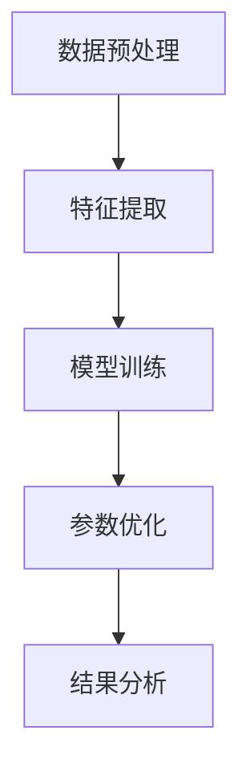

                 


# AI驱动的企业创新生态系统：内外部资源整合

> 关键词：AI驱动、企业创新、生态系统、资源整合、内外部资源、数字化转型、知识图谱

> 摘要：本文详细探讨了AI技术如何驱动企业创新生态系统的发展，重点分析了内外部资源整合的关键策略、算法原理与系统架构设计。通过实际案例和项目实战，展示了如何利用AI技术构建高效的企业创新生态系统，实现企业数字化转型与持续创新能力提升。

---

# 第一部分: AI驱动的企业创新生态系统概述

# 第1章: AI驱动的企业创新生态系统概述

## 1.1 企业创新的背景与挑战
### 1.1.1 传统企业创新模式的局限性
- 传统线性创新模式的不足
- 数字化转型对企业创新的推动作用
- AI技术对企业创新的颠覆性影响

### 1.1.2 问题背景与描述
- 企业内外部资源整合的必要性
- 企业创新生态系统的核心要素
- AI技术在企业创新中的角色与价值

### 1.1.3 问题解决与边界外延
- 通过AI技术优化企业创新流程
- 企业创新生态系统的边界与外延
- AI驱动企业创新生态系统的独特优势

## 1.2 企业创新生态系统的核心概念
### 1.2.1 企业创新生态系统的定义
- 企业创新生态系统的内涵与外延
- 知识图谱在企业创新中的应用
- 企业内外部资源的协同作用

### 1.2.2 核心概念与联系
- 企业创新生态系统的属性特征对比
- 知识图谱构建的关键要素
- 企业内外部资源的协同机制

### 1.2.3 ER实体关系图
- 企业内外部资源的实体关系图
- 知识图谱构建的实体关系模型
- 资源协同的核心逻辑

## 1.3 本章小结
- 企业创新生态系统的核心要素
- AI技术在企业创新中的价值
- 资源整合的必要性与实现路径

---

# 第二部分: AI驱动的企业创新生态系统的核心算法

# 第2章: 基于AI的资源整合优化算法

## 2.1 资源整合优化的数学模型
### 2.1.1 模型构建与目标函数
- 优化目标的数学表达
- 约束条件的数学建模
- 算法的收敛性分析

### 2.1.2 算法的实现流程
- 数据预处理与特征提取
- 算法选择与参数调优
- 结果分析与反馈优化

## 2.2 资源整合优化算法实现
### 2.2.1 算法代码示例
```python
# 示例代码：基于AI的资源整合优化算法
import numpy as np
from sklearn import linear_model

# 数据预处理
data = np.array([[1, 2], [3, 4], [5, 6]])
X = data[:, 0:-1]
y = data[:, -1]

# 算法实现
model = linear_model.LinearRegression()
model.fit(X, y)

# 结果分析
print("系数:", model.coef_)
print("截距:", model.intercept_)
```

### 2.2.2 算法流程图（使用 mermaid）


## 2.3 本章小结
- 算法模型的核心思想
- 算法实现的关键步骤
- 结果分析与优化策略

---

# 第三部分: AI驱动的企业创新生态系统架构设计

# 第3章: 企业创新生态系统的系统架构

## 3.1 系统功能设计
### 3.1.1 数据采集与处理模块
- 数据来源与采集方式
- 数据清洗与特征提取
- 数据存储与管理

### 3.1.2 资源整合与优化模块
- 资源识别与评估
- 资源匹配与优化
- 资源协同与共享

### 3.1.3 知识图谱构建模块
- 实体识别与关系抽取
- 知识图谱构建与优化
- 知识图谱的应用与分析

## 3.2 系统架构设计
### 3.2.1 分层架构设计
- 数据层、业务逻辑层与表现层的划分
- 各层之间的交互与数据流
- 系统架构的可扩展性与可维护性

### 3.2.2 微服务架构设计
- 微服务的设计原则
- 服务之间的交互与通信
- 系统架构的灵活性与高效性

## 3.3 系统交互设计
### 3.3.1 系统接口设计
- API接口的设计与实现
- 接口文档的编写与管理
- 接口的安全性与可靠性

### 3.3.2 系统交互流程
- 用户与系统交互的流程设计
- 交互中的异常处理与容错机制
- 交互的性能优化与用户体验

## 3.4 本章小结
- 系统架构的核心设计思想
- 微服务架构的优势与不足
- 系统交互设计的关键点

---

# 第四部分: AI驱动的企业创新生态系统项目实战

# 第4章: 项目实战与案例分析

## 4.1 项目背景与目标
### 4.1.1 项目背景
- 项目来源与意义
- 项目目标与预期成果
- 项目实施的必要性与可行性

## 4.2 项目环境与工具安装
### 4.2.1 环境要求
- 系统环境与版本要求
- 开发工具与依赖库的安装
- 数据集的获取与预处理

### 4.2.2 工具安装与配置
- Python环境的配置与管理
- 第三方库的安装与使用
- 开发工具的配置与优化

## 4.3 项目核心实现
### 4.3.1 核心代码实现
```python
# 示例代码：项目核心实现
import numpy as np
from sklearn import linear_model

# 数据加载与预处理
data = np.loadtxt('data.csv', delimiter=',')

# 模型训练与预测
model = linear_model.LinearRegression()
model.fit(data[:, :-1], data[:, -1])

# 模型评估与优化
print("决定系数:", model.score(data[:, :-1], data[:, -1]))
```

### 4.3.2 代码实现的关键点
- 数据加载与预处理的实现
- 模型训练与预测的实现
- 模型评估与优化的实现

## 4.4 项目案例分析
### 4.4.1 案例背景
- 案例来源与描述
- 案例目标与实现
- 案例的意义与价值

### 4.4.2 案例实现与分析
- 案例实现的详细步骤
- 案例分析与结果解读
- 案例的可扩展性与可维护性

## 4.5 本章小结
- 项目实战的核心内容
- 项目实现的关键点
- 案例分析的意义与价值

---

# 第五部分: AI驱动的企业创新生态系统最佳实践

# 第5章: 最佳实践与小结

## 5.1 最佳实践
### 5.1.1 知识图谱构建的注意事项
- 数据质量与数据清洗的重要性
- 知识抽取与关系抽取的关键点
- 知识图谱的可扩展性与可维护性

### 5.1.2 资源整合优化的优化策略
- 数据预处理与特征提取的优化
- 算法选择与参数调优的技巧
- 结果分析与反馈优化的策略

## 5.2 小结
### 5.2.1 企业创新生态系统的核心要素
- AI技术在企业创新中的价值
- 企业内外部资源整合的关键点
- 企业创新生态系统构建的实现路径

### 5.2.2 注意事项
- 项目实施中的常见问题与解决方案
- 系统架构设计的注意事项
- 项目管理和团队协作的关键点

## 5.3 拓展阅读
### 5.3.1 相关领域书籍推荐
- AI驱动的企业创新
- 数字化转型与企业创新
- 知识图谱与企业应用

### 5.3.2 技术博客与论文推荐
- AI驱动的企业创新生态系统研究
- 数字化转型中的资源整合策略
- 知识图谱构建与应用的最佳实践

## 5.4 作者寄语
- 感谢读者的阅读与支持
- 鼓励读者积极参与技术实践
- 展望未来技术发展的方向

---

# 作者：AI天才研究院/AI Genius Institute & 禅与计算机程序设计艺术 /Zen And The Art of Computer Programming

