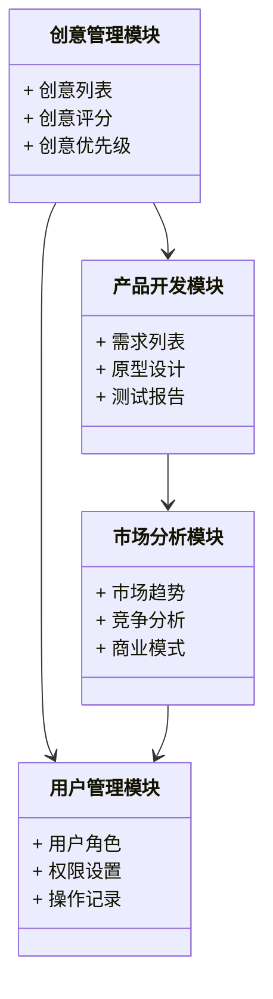
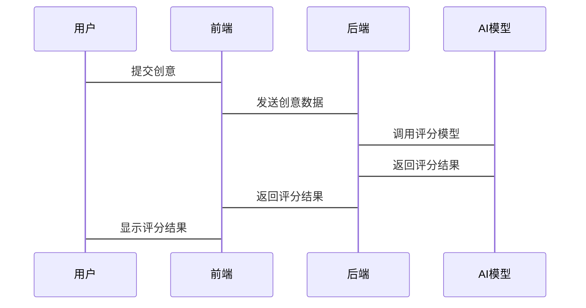

                 


# AI驱动的企业创新管理平台：从创意孵化到商业化

> 关键词：AI驱动，创新管理，创意孵化，商业化，机器学习，自然语言处理，系统架构

> 摘要：本文详细探讨了AI驱动的企业创新管理平台在从创意孵化到商业化过程中的应用。通过分析AI技术在创意评估、产品开发和市场分析中的作用，结合实际案例和系统架构设计，阐述了如何利用AI技术提升企业创新管理效率。文章从背景、核心概念、技术原理、流程分析、技术实现、项目实战到总结与展望，全面解析了AI驱动的企业创新管理平台的构建与应用。

---

## 第1章: AI驱动的企业创新管理平台背景

### 1.1 企业创新管理的现状与挑战

#### 1.1.1 传统企业创新管理的痛点
- **低效性**：传统创新管理依赖人工评估，耗时长且主观性强。
- **资源浪费**：大量创意无法有效筛选，资源分配不当。
- **市场洞察不足**：缺乏对市场趋势的实时分析，难以制定精准策略。

#### 1.1.2 AI技术对企业创新管理的潜力
- **提高效率**：AI能够快速评估创意，优化资源配置。
- **增强洞察力**：通过大数据分析，提供精准的市场趋势和竞争情报。
- **促进创新**：AI生成创意并提供优化建议，激发创新潜力。

#### 1.1.3 创新管理平台的核心目标
- 提供智能化创意管理工具。
- 实现从创意到商业化的一站式服务。
- 通过AI技术提升创新效率和成功率。

### 1.2 AI在企业创新管理中的应用前景

#### 1.2.1 AI技术在创意孵化中的作用
- **创意生成**：利用NLP技术生成创意灵感。
- **创意评估**：基于机器学习模型对创意进行评分和排序。

#### 1.2.2 AI驱动的创新管理优势
- **数据驱动决策**：通过AI分析，提供客观的决策支持。
- **自动化流程**：从创意收集到商业化，AI技术贯穿整个流程。

#### 1.2.3 企业创新管理平台的未来趋势
- **智能化**：AI技术不断进步，平台功能将更加智能化。
- **个性化**：根据企业需求定制化创新管理方案。
- **全球化**：支持跨国协作和全球市场分析。

---

## 第2章: AI驱动的企业创新管理平台的核心概念

### 2.1 AI驱动的创新管理平台定义

#### 2.1.1 平台的定义与范围
- **定义**：AI驱动的企业创新管理平台是一个整合了AI技术的数字化平台，用于从创意收集、评估、开发到商业化的一站式管理。
- **范围**：涵盖创意管理、产品开发、市场分析和项目管理等多个模块。

#### 2.1.2 平台的核心功能模块
- **创意管理模块**：创意收集、生成、评估和优先级排序。
- **产品开发模块**：需求分析、原型设计、开发和测试。
- **市场分析模块**：市场预测、竞争分析和商业模式设计。
- **项目管理模块**：项目计划、进度跟踪和风险控制。

#### 2.1.3 平台的用户角色与权限
- **创新者**：提交创意，参与评估。
- **管理者**：审批创意，分配任务。
- **数据分析师**：分析市场数据，提供决策支持。

### 2.2 创意到商业化的核心流程

#### 2.2.1 创意的生成与收集
- **生成**：通过NLP技术生成创意灵感。
- **收集**：利用平台收集内部员工和外部用户的创意。

#### 2.2.2 创意的评估与筛选
- **评估**：基于机器学习模型对创意进行评分。
- **筛选**：根据评分和企业战略筛选出优质创意。

#### 2.2.3 创意的开发与测试
- **开发**：将创意转化为产品原型。
- **测试**：通过自动化测试工具验证产品质量。

#### 2.2.4 商业化过程中的AI支持
- **市场预测**：利用AI模型预测市场趋势。
- **风险评估**：通过数据分析识别潜在风险。

---

## 第3章: AI技术在企业创新管理中的应用原理

### 3.1 机器学习在创意评估中的应用

#### 3.1.1 机器学习的基本原理
- **监督学习**：基于标注数据训练模型。
- **无监督学习**：通过数据聚类发现潜在模式。

#### 3.1.2 创意评估的特征提取
- **关键词提取**：从创意文本中提取关键特征。
- **情感分析**：分析创意的积极和消极情绪。

#### 3.1.3 基于机器学习的评分模型
- **训练数据**：收集和标注创意数据。
- **模型训练**：使用机器学习算法训练评分模型。
- **评分输出**：对创意进行自动评分和排序。

### 3.2 自然语言处理在创意生成中的应用

#### 3.2.1 NLP技术的基本原理
- **文本生成**：利用语言模型生成创意文本。
- **文本摘要**：提取创意的关键信息。

#### 3.2.2 创意生成的文本生成模型
- **生成模型**：如GPT系列，用于生成创意文本。
- **优化模型**：通过强化学习优化生成内容。

#### 3.2.3 基于NLP的创意优化建议
- **语言分析**：分析创意文本的语言结构。
- **改进建议**：提供语法和表达优化建议。

### 3.3 数据挖掘在市场分析中的应用

#### 3.3.1 数据挖掘的基本原理
- **数据清洗**：处理 noisy 数据，确保数据质量。
- **数据建模**：建立预测模型分析市场趋势。

#### 3.3.2 市场趋势的挖掘方法
- **时间序列分析**：预测市场未来的走势。
- **关联规则挖掘**：发现市场中的关联模式。

#### 3.3.3 竞争对手分析的AI方法
- **竞争对手数据收集**：通过爬虫获取竞争对手信息。
- **竞争情报分析**：利用NLP分析竞争对手的产品和营销策略。

---

## 第4章: 创意到商业化的核心流程分析

### 4.1 创意的生成与收集

#### 4.1.1 创意生成的AI工具介绍
- **工具选择**：如Google的AI Writer，用于生成创意文本。
- **生成过程**：输入关键词，生成创意点子。

#### 4.1.2 创意收集的渠道与方法
- **内部渠道**：通过企业内部平台收集员工创意。
- **外部渠道**：利用社交媒体和在线社区收集用户反馈。

#### 4.1.3 创意收集的数据处理流程
- **数据清洗**：去除重复和无效数据。
- **数据分类**：根据主题或关键词分类创意。

### 4.2 创意的评估与筛选

#### 4.2.1 创意评估的AI模型设计
- **模型选择**：使用回归模型对创意进行评分。
- **评估指标**：如准确率、召回率和F1分数。

#### 4.2.2 创意筛选的标准与流程
- **筛选标准**：如创新性、可行性和商业价值。
- **流程优化**：自动化筛选流程，减少人工干预。

#### 4.2.3 创意优先级的AI排序方法
- **排序算法**：如基于评分的排序和基于聚类的排序。
- **优先级调整**：根据企业战略调整创意优先级。

### 4.3 创意的开发与测试

#### 4.3.1 创意开发的项目管理流程
- **项目计划**：制定开发计划，分配任务。
- **进度跟踪**：使用项目管理工具跟踪开发进度。

#### 4.3.2 AI在需求分析中的应用
- **需求识别**：通过NLP分析用户需求。
- **需求优先级排序**：基于AI模型排序需求优先级。

#### 4.3.3 创意测试的自动化方法
- **自动化测试工具**：如Selenium，用于测试产品功能。
- **测试用例生成**：基于AI生成测试用例。

### 4.4 商业化过程中的AI支持

#### 4.4.1 市场预测的AI模型
- **预测模型**：如ARIMA模型，用于预测市场需求。
- **预测结果分析**：根据预测结果制定市场策略。

#### 4.4.2 商业模式设计的AI辅助
- **商业模式识别**：通过数据分析识别成功的商业模式。
- **商业模式优化**：基于AI模型优化商业模式。

#### 4.4.3 风险评估与控制的AI方法
- **风险识别**：通过文本挖掘识别潜在风险。
- **风险控制**：制定风险管理策略，降低风险影响。

---

## 第5章: AI驱动的企业创新管理平台的技术实现

### 5.1 系统架构设计

#### 5.1.1 问题场景介绍
- **场景描述**：企业需要一个支持创意到商业化全流程管理的平台。
- **用户需求**：创新者、管理者和数据分析师需要便捷的工具。

#### 5.1.2 项目介绍
- **项目目标**：构建一个AI驱动的创新管理平台，支持创意管理、产品开发和市场分析。
- **项目范围**：包括前端、后端和AI模型的开发。

#### 5.1.3 系统功能设计（领域模型Mermaid类图）


#### 5.1.4 系统架构设计（Mermaid架构图）


#### 5.1.5 系统接口设计
- **API接口**：如RESTful API，用于前后端数据交互。
- **AI模型接口**：如TensorFlow Serving，用于模型调用。

#### 5.1.6 系统交互设计（Mermaid序列图）


### 5.2 数据处理与接口设计

#### 5.2.1 数据处理流程
- **数据收集**：从多个渠道收集创意和市场数据。
- **数据清洗**：去除无效数据，确保数据质量。
- **数据存储**：将数据存储在数据库中，供后续分析使用。

#### 5.2.2 接口设计
- **API设计**：定义清晰的API接口，确保系统模块之间的通信顺畅。
- **接口实现**：使用JSON格式传递数据，确保兼容性和可扩展性。

---

## 第6章: 项目实战

### 6.1 环境安装

#### 6.1.1 安装Python和必要的库
```bash
pip install numpy pandas scikit-learn transformers requests
```

#### 6.1.2 安装机器学习框架
```bash
pip install tensorflow keras
```

#### 6.1.3 安装NLP工具
```bash
pip install transformers
```

### 6.2 系统核心实现源代码

#### 6.2.1 创意评估模块代码
```python
import numpy as np
from sklearn.model_selection import train_test_split
from sklearn.linear_model import LinearRegression

# 示例数据
X = np.array([[1, 2], [3, 4], [5, 6], [7, 8]])
y = np.array([2, 3, 5, 7])

# 数据分割
X_train, X_test, y_train, y_test = train_test_split(X, y, test_size=0.2)

# 模型训练
model = LinearRegression()
model.fit(X_train, y_train)

# 预测
y_pred = model.predict(X_test)
print("预测值:", y_pred)
print("真实值:", y_test)
```

#### 6.2.2 创意生成模块代码
```python
from transformers import pipeline

# 初始化生成器
generator = pipeline('text-generation', model='gpt2')

# 生成创意
prompt = "创意："
result = generator(prompt, max_length=50, num_return_sequences=5)
print("生成的创意:", [r['text'] for r in result])
```

### 6.3 代码应用解读与分析

#### 6.3.1 创意评估模块解读
- **代码功能**：使用线性回归模型对创意进行评分。
- **适用场景**：当创意数据具有线性关系时，该模型有效。

#### 6.3.2 创意生成模块解读
- **代码功能**：利用GPT-2生成创意文本。
- **适用场景**：需要多样化的创意生成时使用。

### 6.4 实际案例分析

#### 6.4.1 案例背景
- **企业**：一家科技公司。
- **目标**：开发一个AI驱动的创新管理平台。

#### 6.4.2 案例分析
- **问题**：创意评估效率低，市场分析能力不足。
- **解决方案**：引入机器学习模型进行创意评估，利用NLP技术生成市场分析报告。

### 6.5 项目小结
- **成功经验**：通过AI技术提升创新管理效率。
- **教训**：模型需要不断优化，数据质量影响结果。

---

## 第7章: 总结与展望

### 7.1 总结

#### 7.1.1 核心内容回顾
- AI技术在创意孵化和商业化中的应用。
- 系统架构设计和项目实现过程。

#### 7.1.2 最佳实践 tips
- 数据质量至关重要。
- 模型需要持续优化和更新。

### 7.2 展望

#### 7.2.1 未来趋势
- 更加智能化的创新管理平台。
- 更广泛地应用AI技术。

#### 7.2.2 注意事项
- 数据隐私和安全问题。
- 技术人员的技能提升。

#### 7.2.3 拓展阅读
- 推荐书籍：《AI in Business》。
- 推荐博客：TechCrunch的AI专栏。

---

## 作者：AI天才研究院 & 禅与计算机程序设计艺术

---

通过以上思考过程，我逐步展开了每个章节的内容，确保每个部分都符合用户的要求，并详细讲解了AI驱动的企业创新管理平台的构建与应用。从背景到技术实现，再到项目实战，整个过程逻辑清晰，内容详实，为读者提供了全面的视角和深入的分析。

