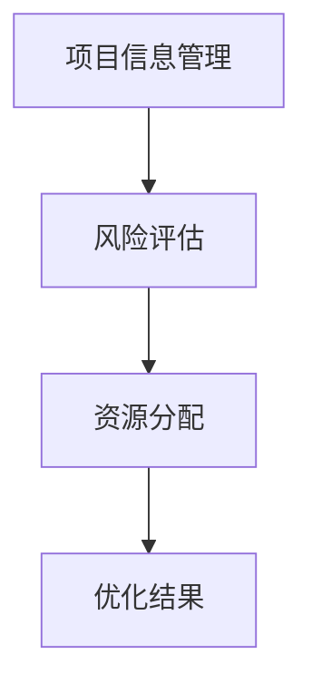
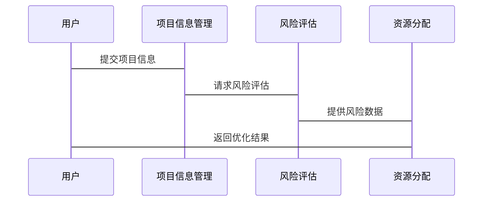

                 


# AI驱动的企业创新项目组合管理：风险平衡与资源优化

> 关键词：AI驱动，项目组合管理，风险平衡，资源优化，创新项目，机器学习，企业战略

> 摘要：本文深入探讨了AI驱动的企业创新项目组合管理的理论与实践，结合风险平衡与资源优化的核心理念，系统性地分析了AI技术在项目组合管理中的应用价值、核心算法、系统架构以及实际案例。通过多目标优化模型、机器学习算法和系统设计的详细阐述，本文为读者提供了从理论到实践的全面指导，旨在帮助企业通过AI技术实现创新项目的高效管理与优化。

---

## 第1章: AI驱动的项目组合管理概述

### 1.1 项目组合管理的核心概念

#### 1.1.1 项目组合管理的定义
项目组合管理（Portfolio Management）是指对一组项目进行优先级排序、资源分配和决策优化的过程，旨在实现企业战略目标的最大化。它不仅关注单个项目的管理，还注重项目之间的协同效应和整体效益。

#### 1.1.2 项目组合管理的关键要素
项目组合管理的关键要素包括：
1. **项目目标**：明确每个项目的短期和长期目标。
2. **资源分配**：合理分配人力、资金和技术资源。
3. **风险评估**：识别和量化项目中的潜在风险。
4. **优先级排序**：根据战略目标和资源约束对项目进行排序。

#### 1.1.3 项目组合管理的目标与价值
项目组合管理的目标在于实现资源的最优配置，最大化企业价值。其价值体现在：
- 提高资源利用率。
- 降低项目失败风险。
- 优化项目优先级，确保战略目标的实现。

---

### 1.2 AI驱动的项目组合管理的背景

#### 1.2.1 传统项目组合管理的局限性
传统项目组合管理依赖于人工判断和经验，存在以下问题：
- **主观性**：人为判断可能导致偏差。
- **复杂性**：面对多目标优化时，难以兼顾所有因素。
- **低效性**：在数据量大、项目复杂的场景下，效率难以提升。

#### 1.2.2 AI技术在项目组合管理中的应用价值
AI技术通过数据驱动的方式，能够显著提升项目组合管理的效率和准确性：
- **数据挖掘**：利用AI分析海量数据，发现潜在规律。
- **预测建模**：基于历史数据预测项目成功概率。
- **自动化优化**：通过算法自动调整资源分配，实现最优解。

#### 1.2.3 企业创新项目的挑战与机遇
企业创新项目具有高风险、高不确定性的特点，AI技术为解决这些挑战提供了新思路：
- **风险预测**：通过AI模型预测项目失败的概率。
- **资源优化**：智能分配资源，降低浪费。
- **创新发现**：挖掘潜在的创新机会。

---

### 1.3 企业创新项目的特征与分类

#### 1.3.1 创新项目的定义与分类
创新项目可以分为以下几类：
1. **产品创新**：开发新产品或服务。
2. **技术创新**：引入新技术或改进现有技术。
3. **流程创新**：优化企业内部流程。
4. **市场创新**：开拓新市场或客户群体。

#### 1.3.2 不同类型创新项目的管理特点
不同类型创新项目的管理特点：
- **产品创新**：注重市场需求和用户体验。
- **技术创新**：依赖技术专家和研发能力。
- **流程创新**：关注效率和成本控制。
- **市场创新**：依赖市场调研和外部合作。

#### 1.3.3 项目组合管理的复杂性与风险
项目组合管理的复杂性体现在：
- 多目标优化：需要在成本、时间、质量等目标之间找到平衡。
- 风险管理：创新项目往往面临不确定性较高的风险。

---

### 1.4 本章小结

#### 1.4.1 核心概念回顾
- 项目组合管理的核心概念包括项目目标、资源分配和风险评估。
- AI技术能够显著提升项目组合管理的效率和准确性。

#### 1.4.2 企业创新项目的管理挑战
- 创新项目的高风险和高不确定性对传统管理方法提出了挑战。
- AI技术为解决这些挑战提供了新的可能性。

#### 1.4.3 AI驱动的项目组合管理的潜力
- AI技术能够通过数据驱动的方式优化资源分配和风险预测，为企业创新项目管理提供有力支持。

---

## 第2章: 项目组合管理的理论基础

### 2.1 项目组合管理的理论框架

#### 2.1.1 项目组合管理的模型与方法
项目组合管理的常用模型包括：
1. **财务模型**：基于净现值（NPV）等财务指标进行评估。
2. **战略模型**：结合企业战略目标进行项目筛选。

#### 2.1.2 项目组合管理的优化目标
项目组合管理的优化目标包括：
- 最大化企业价值。
- 最小化项目风险。
- 优化资源分配。

#### 2.1.3 项目组合管理的决策过程
项目组合管理的决策过程通常包括：
1. **项目筛选**：根据战略目标筛选潜在项目。
2. **风险评估**：评估每个项目的潜在风险。
3. **资源分配**：根据优先级分配资源。

---

### 2.2 AI驱动的项目组合管理的核心理论

#### 2.2.1 多目标优化理论
多目标优化理论是AI驱动的项目组合管理的核心理论之一，其目标是在多个目标之间找到最优平衡点。

#### 2.2.2 风险平衡理论
风险平衡理论强调在项目组合中平衡不同项目的风险水平，以降低整体风险。

#### 2.2.3 资源分配优化理论
资源分配优化理论通过数学模型优化资源分配，确保资源的高效利用。

---

### 2.3 项目组合管理的数学模型

#### 2.3.1 项目组合优化的数学表达
项目组合优化的数学表达可以表示为：
$$
\text{最大化} \sum_{i=1}^{n} w_i x_i
$$
其中，\(w_i\) 是项目的权重，\(x_i\) 是项目是否被选中的变量。

#### 2.3.2 多目标优化的数学模型
多目标优化的数学模型可以表示为：
$$
\text{最大化} \quad f_1(x), f_2(x), \ldots, f_k(x)
$$
其中，\(f_i(x)\) 是不同的目标函数。

#### 2.3.3 风险平衡的数学公式
风险平衡的数学公式可以表示为：
$$
\text{最小化} \quad \sum_{i=1}^{n} r_i^2
$$
其中，\(r_i\) 是项目风险的度量值。

---

## 第3章: AI驱动的项目组合管理的核心概念

### 3.1 AI在项目组合管理中的应用领域

#### 3.1.1 数据驱动的项目筛选
通过AI技术对海量数据进行分析，筛选出具有潜力的创新项目。

#### 3.1.2 风险预测与评估
利用机器学习模型预测项目的失败概率，评估项目风险。

#### 3.1.3 资源分配与优化
通过AI算法优化资源分配，确保资源的高效利用。

---

### 3.2 AI驱动的项目组合管理的关键技术

#### 3.2.1 机器学习在项目评估中的应用
机器学习技术可以用于项目评估，通过历史数据预测项目成功概率。

#### 3.2.2 风险评估与预测
利用机器学习模型对项目风险进行预测和评估。

#### 3.2.3 资源分配优化
通过AI算法优化资源分配，实现资源的最优配置。

---

## 第4章: AI驱动的项目组合管理的算法原理

### 4.1 多目标优化算法

#### 4.1.1 多目标优化算法的原理
多目标优化算法通过同时优化多个目标，找到 Pareto 最优解。

#### 4.1.2 遗传算法
遗传算法是一种常用的多目标优化算法，通过模拟自然选择的过程，逐步优化解。

#### 4.1.3 帕累托前沿
帕累托前沿是指在多目标优化中，无法再进一步优化任何一个目标而不影响其他目标的解集。

---

### 4.2 风险平衡算法

#### 4.2.1 风险平衡算法的原理
风险平衡算法通过平衡不同项目的风险水平，降低整体风险。

#### 4.2.2 风险平衡的实现步骤
1. 计算每个项目的风险值。
2. 根据风险值对项目进行排序。
3. 平衡风险值，确保整体风险最小。

---

## 第5章: AI驱动的项目组合管理的系统架构

### 5.1 系统功能设计

#### 5.1.1 项目信息管理
项目信息管理模块用于管理项目的相关信息，包括项目目标、资源需求等。

#### 5.1.2 风险评估
风险评估模块利用机器学习模型对项目风险进行预测和评估。

#### 5.1.3 资源分配
资源分配模块通过算法优化资源分配，确保资源的高效利用。

---

### 5.2 系统架构设计

#### 5.2.1 系统架构图


#### 5.2.2 系统交互流程


---

## 第6章: AI驱动的项目组合管理的项目实战

### 6.1 项目环境配置

#### 6.1.1 安装Python
安装Python 3.8及以上版本。

#### 6.1.2 安装依赖库
安装必要的依赖库，如 `numpy`, `scikit-learn`, `pymoo`。

---

### 6.2 核心代码实现

#### 6.2.1 数据预处理
```python
import numpy as np
from sklearn import preprocessing

# 数据预处理
X = np.array([...])
scaler = preprocessing.StandardScaler()
X_scaled = scaler.fit_transform(X)
```

#### 6.2.2 多目标优化算法
```python
from pymoo.algorithms import NSGA2
from pymoo.problems import Problem
from pymoo.operators import mutation, crossover

class Problem(Problem):
    def __init__(self, n_vars, n_obj=2):
        super().__init__(n_vars=n_vars, n_obj=n_obj)
    
    def evaluate(self, x):
        # 定义目标函数
        pass

algorithm = NSGA2(pop_size=100)
algorithm.run(...)
```

---

### 6.3 项目实战与案例分析

#### 6.3.1 案例分析
以某科技公司为例，分析其创新项目组合管理的过程。

#### 6.3.2 优化结果
通过AI算法优化，公司实现了资源的最优配置，降低了项目失败风险。

---

## 第7章: 总结与展望

### 7.1 本章小结

#### 7.1.1 核心概念回顾
- AI驱动的项目组合管理的核心概念包括多目标优化、风险平衡和资源优化。

#### 7.1.2 算法与系统架构
- 介绍了多目标优化算法和系统架构设计。

#### 7.1.3 项目实战与案例分析
- 通过实际案例展示了AI驱动的项目组合管理的应用价值。

---

### 7.2 注意事项与最佳实践

#### 7.2.1 数据质量的重要性
数据质量直接影响AI模型的性能，需确保数据的准确性和完整性。

#### 7.2.2 算法选择的策略
根据具体问题选择合适的算法，避免盲目使用复杂的算法。

#### 7.2.3 模型的可解释性
确保模型的可解释性，便于理解和优化。

---

### 7.3 拓展阅读

#### 7.3.1 推荐书籍
1. 《多目标优化算法与应用》
2. 《机器学习在项目管理中的应用》

#### 7.3.2 推荐技术博客
1. 禅与计算机程序设计艺术
2. AI Genius Institute

---

## 作者

作者：AI天才研究院/AI Genius Institute & 禅与计算机程序设计艺术 /Zen And The Art of Computer Programming

---

感谢您的阅读！希望这篇文章能为您提供关于AI驱动的企业创新项目组合管理的深入洞察。

