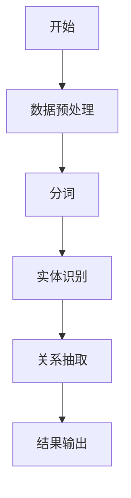
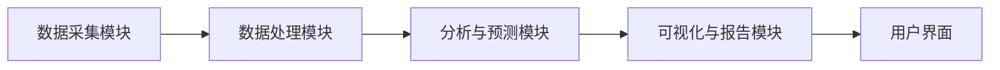

                 


# AI驱动的企业战略情报系统：竞争对手分析

> 关键词：AI，企业战略情报，竞争对手分析，机器学习，自然语言处理，数据挖掘

> 摘要：本文探讨了AI技术在企业战略情报系统中的应用，特别是竞争对手分析方面。通过结合自然语言处理、机器学习和数据挖掘技术，AI能够帮助企业更高效地收集、分析和预测竞争对手的行为，从而制定更有效的战略。本文详细介绍了竞争对手分析的核心算法、数学模型以及系统架构，并通过实际案例展示了AI驱动的企业战略情报系统的强大能力。

---

# 第一部分: AI驱动的企业战略情报系统概述

## 第1章: 企业战略情报系统与AI的结合

### 1.1 企业战略情报系统的核心概念

#### 1.1.1 企业战略情报的定义与特点

企业战略情报是指企业在制定战略决策过程中所需的关键信息。它包括市场趋势、竞争对手行为、客户需求、行业动态等。与传统的情报相比，企业战略情报更注重实时性和前瞻性，能够帮助企业提前预判市场变化，制定更具竞争力的战略。

**特点：**
- **实时性**：企业战略情报需要及时更新，以便捕捉市场动态。
- **全面性**：涵盖市场、竞争、客户等多个维度。
- **预测性**：基于历史数据和趋势，预测未来可能的变化。

#### 1.1.2 AI在企业战略情报中的作用

AI技术通过自然语言处理、机器学习和数据挖掘等手段，能够高效地从大量非结构化数据中提取有价值的信息。例如，AI可以自动分析竞争对手的新闻报道、社交媒体信息和市场报告，生成竞争分析报告。

**AI的优势：**
- **高效性**：AI能够快速处理大量数据，节省时间和成本。
- **准确性**：通过机器学习模型，AI能够提高分析结果的准确性。
- **预测性**：基于历史数据，AI可以预测竞争对手的未来行为。

#### 1.1.3 企业战略情报系统的边界与外延

企业战略情报系统的边界包括企业的核心业务领域和相关市场。外延则包括竞争对手分析、客户分析、行业趋势分析等。

**核心业务领域：**
- 市场份额
- 产品定位
- 客户需求

**竞争对手分析：**
- 竞争对手的市场份额
- 产品策略
- 市场行为

### 1.2 竞争对手分析的背景与重要性

#### 1.2.1 竞争对手分析的定义

竞争对手分析是指对企业外部竞争对手的行为、策略和市场表现进行系统性研究，以帮助企业制定更具竞争力的战略。

#### 1.2.2 竞争对手分析的常见方法

传统竞争对手分析方法包括：
- **SWOT分析**：分析竞争对手的优势、劣势、机会和威胁。
- **波特五力分析**：分析行业竞争结构，评估企业的竞争地位。
- **市场份额分析**：通过市场份额数据，评估竞争对手的市场影响力。

#### 1.2.3 AI驱动竞争对手分析的优势

AI技术能够显著提高竞争对手分析的效率和准确性。例如：
- **自动化数据收集**：AI可以自动从新闻、社交媒体和行业报告中提取竞争对手的信息。
- **预测竞争对手行为**：通过机器学习模型，AI可以预测竞争对手的市场策略和行为。
- **实时监控**：AI能够实时监控竞争对手的动态，及时提供预警。

---

# 第二部分: AI驱动的竞争对手分析系统核心原理

## 第3章: 竞争对手分析的核心算法

### 3.1 竞争对手信息提取算法

#### 3.1.1 基于NLP的信息抽取算法

自然语言处理（NLP）技术能够从文本中提取竞争对手的关键信息。例如，使用分词、实体识别和关系抽取等技术，从新闻报道中提取竞争对手的产品发布信息。

**流程图：**



#### 3.1.2 基于规则的信息抽取算法

基于规则的算法通过预定义的规则从文本中提取信息。例如，使用正则表达式匹配竞争对手的市场份额数据。

#### 3.1.3 深度学习模型在信息抽取中的应用

深度学习模型（如BERT）能够从上下文中理解文本的含义，从而更准确地提取信息。

### 3.2 竞争对手行为预测算法

#### 3.2.1 时间序列分析模型

时间序列分析模型（如ARIMA）可以用于预测竞争对手的市场份额变化。

#### 3.2.2 基于机器学习的分类模型

分类模型（如随机森林）可以用于预测竞争对手的市场行为，例如是否推出新产品。

#### 3.2.3 基于深度学习的预测模型

深度学习模型（如LSTM）可以用于处理时间序列数据，预测竞争对手的市场行为。

---

## 第4章: 竞争对手分析系统的数学模型

### 4.1 竞争对手信息提取的数学模型

#### 4.1.1 基于向量空间模型的文本表示

向量空间模型将文本表示为向量，用于计算文本之间的相似性。

$$ \text{余弦相似度} = \frac{\vec{A} \cdot \vec{B}}{|\vec{A}| |\vec{B}|} $$

#### 4.1.2 基于词嵌入的文本表示

词嵌入模型（如Word2Vec）将单词表示为低维向量，用于捕捉单词的语义信息。

#### 4.1.3 基于注意力机制的文本表示

注意力机制（如BERT）能够根据上下文的重要性分配权重，提取关键信息。

### 4.2 竞争对手行为预测的数学模型

#### 4.2.1 基于线性回归的预测模型

线性回归模型可以用于预测竞争对手的市场份额。

$$ y = \beta_0 + \beta_1 x_1 + \beta_2 x_2 + \dots + \beta_n x_n $$

#### 4.2.2 基于决策树的预测模型

决策树模型（如ID3）可以用于分类竞争对手的市场行为。

#### 4.2.3 基于神经网络的预测模型

神经网络模型（如LSTM）可以用于处理时间序列数据，预测竞争对手的市场行为。

---

# 第三部分: 竞争对手分析系统的架构与实现

## 第5章: 竞争对手分析系统的架构设计

### 5.1 系统功能模块设计

#### 5.1.1 数据采集模块

数据采集模块负责从新闻网站、社交媒体和行业报告中采集竞争对手的信息。

#### 5.1.2 数据处理模块

数据处理模块对采集到的数据进行清洗、转换和存储。

#### 5.1.3 分析与预测模块

分析与预测模块使用NLP、机器学习和深度学习技术对竞争对手的行为进行预测。

#### 5.1.4 可视化与报告模块

可视化与报告模块生成竞争分析报告，并以图表形式展示竞争对手的行为。

### 5.2 系统架构设计

**系统架构图：**



---

## 第6章: 项目实战

### 6.1 竞争对手分析系统实现

#### 6.1.1 环境安装

安装Python、Scikit-learn、NLTK、BERT等库。

#### 6.1.2 核心代码实现

```python
from sklearn.feature_extraction.text import TfidfVectorizer
from sklearn.svm import SVC

# 数据预处理
X = text_data
y = labels

# 特征提取
vectorizer = TfidfVectorizer()
X_vectorized = vectorizer.fit_transform(X)

# 训练模型
model = SVC()
model.fit(X_vectorized, y)

# 预测
new_data = ["竞争对手发布新产品"]
new_data_vectorized = vectorizer.transform(new_data)
predicted = model.predict(new_data_vectorized)
```

---

## 第7章: 总结与展望

### 7.1 总结

本文详细介绍了AI技术在企业战略情报系统中的应用，特别是竞争对手分析方面。通过结合NLP、机器学习和数据挖掘技术，AI能够帮助企业高效地收集、分析和预测竞争对手的行为，从而制定更有效的战略。

### 7.2 展望

未来，随着AI技术的不断发展，企业战略情报系统将更加智能化和自动化。例如，可以利用区块链技术确保数据的安全性，或者利用边缘计算技术实现实时监控。

---

作者：AI天才研究院 & 禅与计算机程序设计艺术

