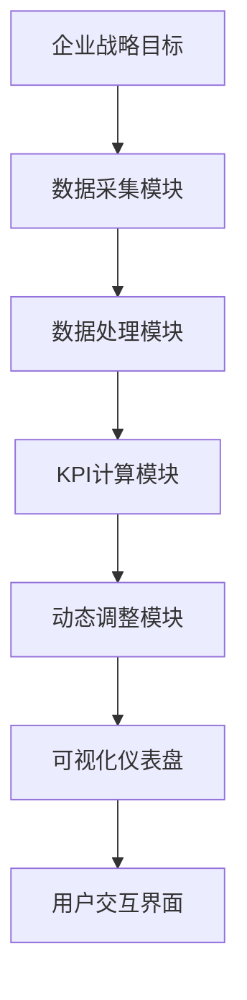
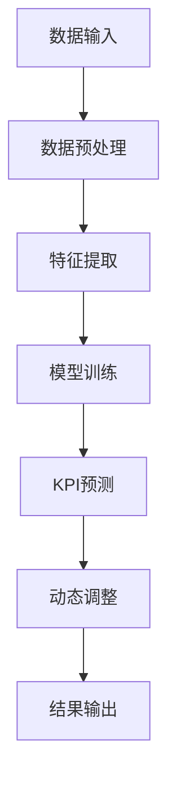
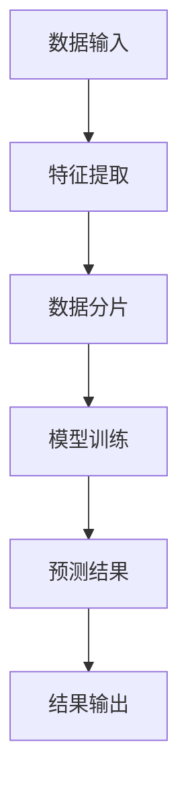
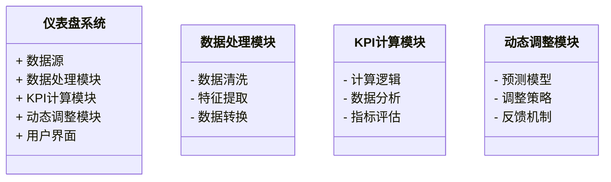
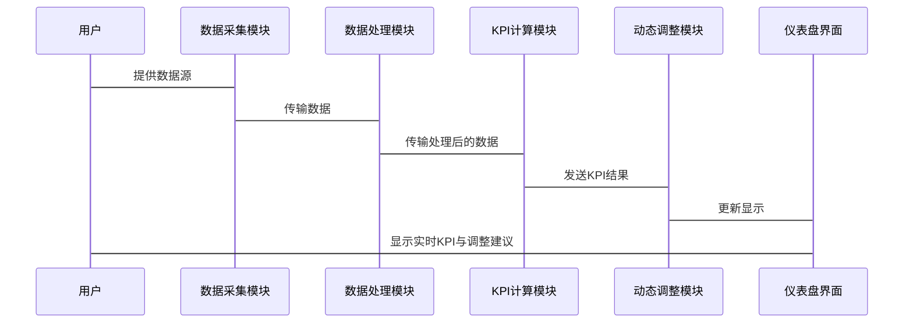

                 


# AI驱动的企业战略执行仪表盘：实时KPI追踪与调整

> 关键词：AI驱动，企业战略，KPI追踪，实时数据，动态调整，仪表盘设计，系统架构

> 摘要：随着企业数字化转型的深入，实时KPI追踪和动态调整成为优化战略执行的关键。本文将探讨如何利用AI技术构建企业战略执行仪表盘，实现对关键绩效指标的实时监控与智能调整，帮助企业在复杂多变的商业环境中保持竞争优势。

---

## 第一部分: 背景与核心概念

### 第1章: 问题背景与挑战

#### 1.1 传统KPI管理的局限性
- 传统KPI管理的被动性和滞后性
- 企业战略执行中的不确定性与动态变化
- 数据孤岛与信息碎片化问题

#### 1.2 AI在现代企业管理中的作用
- 数据驱动决策的重要性
- AI技术在实时数据分析中的优势
- 智能化KPI调整的潜力与价值

#### 1.3 实时KPI追踪的必要性
- 快速响应市场变化的需求
- 提高战略执行的精准性和效率
- 优化资源配置与企业绩效

---

### 第2章: 核心概念与系统架构

#### 2.1 核心概念与术语
- KPI（关键绩效指标）的定义与分类
- AI驱动的实时数据分析与动态调整
- 仪表盘的设计原则与功能特性

#### 2.2 系统架构图


#### 2.3 数据流与处理流程
- 数据源的多样化与数据预处理
- 实时数据流的处理与存储
- KPI计算与评估的逻辑流程

---

## 第二部分: 算法原理与实现

### 第3章: 实时数据处理算法

#### 3.1 数据流处理流程
- 数据采集与预处理的步骤
- 数据清洗与转换的技术
- 数据存储与管理的策略

#### 3.2 动态KPI调整算法
- 基于时间序列分析的KPI预测
- 基于机器学习的动态调整模型
- 多目标优化算法的设计与实现

#### 3.3 算法流程图


#### 3.4 算法实现代码示例
```python
import pandas as pd
from sklearn.metrics import mean_absolute_error

def preprocess_data(data):
    # 数据清洗与转换
    data = data.dropna()
    data = data[~data['value'].isnull()]
    return data

def calculate_kpi(data, target_column='value'):
    # 计算KPI
    kpi_value = data[target_column].mean()
    return kpi_value

# 示例数据
data = pd.DataFrame({
    'timestamp': pd.date_range(start='2023-01-01', periods=10),
    'value': [10, 20, 30, 40, 50, 60, 70, 80, 90, 100]
})

# 数据预处理
processed_data = preprocess_data(data)
# 计算KPI
kpi = calculate_kpi(processed_data)
print(f"KPI Value: {kpi}")
```

---

### 第4章: KPI预测模型

#### 4.1 时间序列预测模型
- ARIMA模型的原理与应用
- LSTM模型的优势与局限
- 模型比较与选择

#### 4.2 优化算法
- 线性回归模型的简单实现
- 随机森林模型的集成学习策略
- 模型训练与调优的技巧

#### 4.3 模型流程图


---

## 第三部分: 系统分析与架构设计

### 第5章: 仪表盘系统架构

#### 5.1 系统功能模块
- 数据采集模块的功能与实现
- 数据处理模块的架构设计
- KPI计算模块的算法选择
- 动态调整模块的策略实现

#### 5.2 系统架构图


#### 5.3 系统交互图


---

## 第四部分: 项目实战与案例分析

### 第6章: 项目实战

#### 6.1 环境安装与配置
- 数据处理工具（如Python、Pandas）
- AI框架（如TensorFlow、Keras）
- 可视化工具（如Matplotlib、Plotly）

#### 6.2 核心实现代码
```python
import numpy as np
import pandas as pd
from sklearn.ensemble import RandomForestRegressor
from sklearn.metrics import mean_squared_error

# 示例数据加载
data = pd.read_csv('kpi_data.csv')
data['timestamp'] = pd.to_datetime(data['timestamp'])

# 数据预处理
X = data[['feature1', 'feature2']]
y = data['target']

# 模型训练
model = RandomForestRegressor(n_estimators=100)
model.fit(X, y)

# 预测与评估
y_pred = model.predict(X)
mse = mean_squared_error(y, y_pred)
print(f"均方误差: {mse}")
```

#### 6.3 案例分析与解读
- 项目背景与目标
- 数据来源与处理
- 模型训练与评估
- 实际应用与效果

---

## 第五部分: 总结与展望

### 第7章: 总结与最佳实践

#### 7.1 核心内容回顾
- AI驱动的实时KPI追踪与调整的实现原理
- 系统架构设计的关键点
- 项目实战的经验与教训

#### 7.2 最佳实践与注意事项
- 数据质量管理的重要性
- 模型选择与调优的技巧
- 系统可扩展性与维护性

#### 7.3 未来展望与挑战
- 更高级AI技术的应用（如强化学习）
- 多源数据融合的挑战
- 实时系统性能优化的方向

---

## 作者信息

作者：AI天才研究院/AI Genius Institute & 禅与计算机程序设计艺术 /Zen And The Art of Computer Programming

---

**结束**

