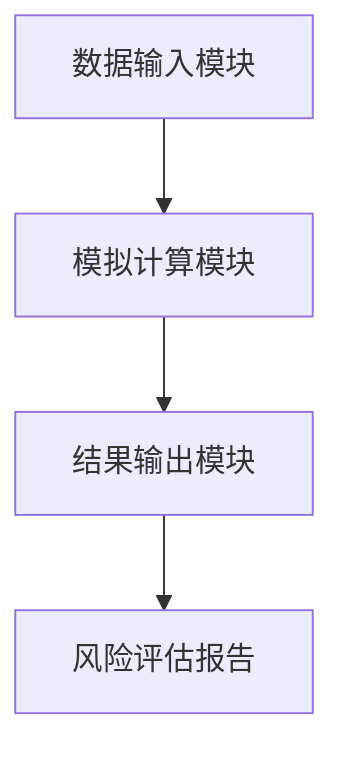
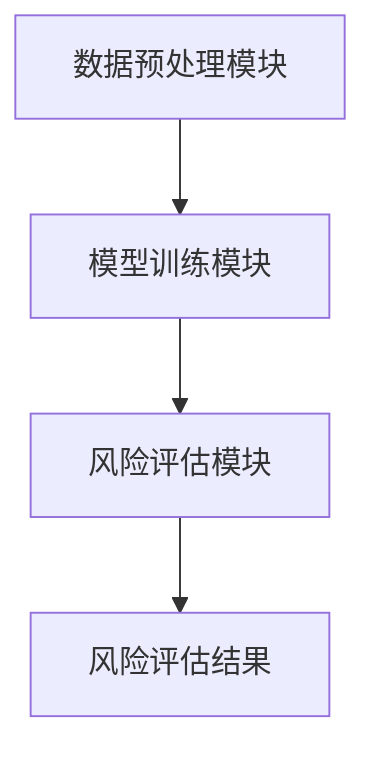
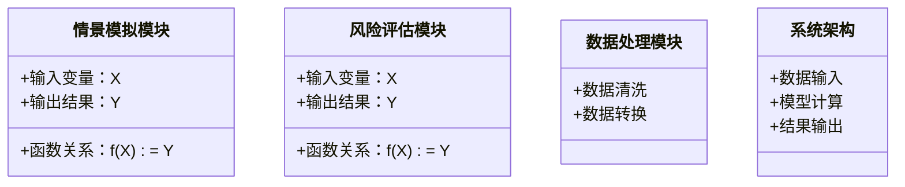
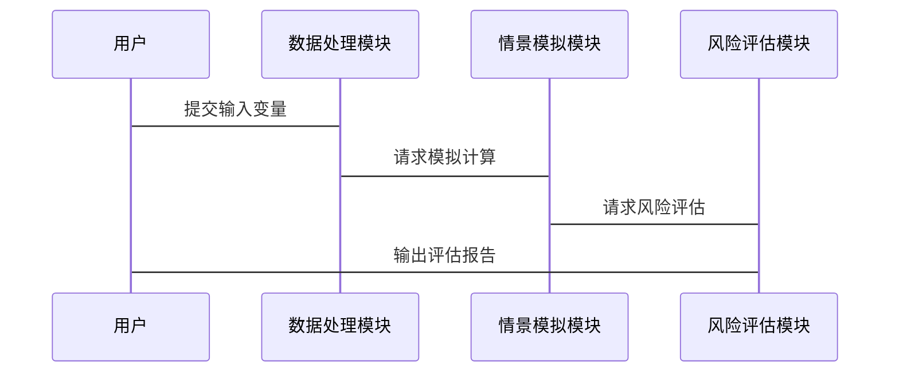

                 


# AI驱动的企业战略规划：情景模拟与风险评估

> 关键词：AI驱动、企业战略规划、情景模拟、风险评估、蒙特卡洛模拟、决策树、机器学习

> 摘要：本文详细探讨了AI技术在企业战略规划中的应用，特别是情景模拟和风险评估方面。通过分析传统战略规划的局限性，结合现代AI技术的优势，本文提出了利用AI进行情景模拟和风险评估的方法，包括数学模型、算法流程和系统架构设计。文章还提供了具体的Python代码实现和实际案例分析，帮助读者理解如何将AI技术应用于企业战略规划。

---

# 第1章: 企业战略规划的背景与挑战

## 1.1 企业战略规划的传统方法

### 1.1.1 传统战略规划的定义与特点

传统战略规划是指企业在不考虑技术因素的情况下，通过市场调研、数据分析和管理经验制定的长期发展目标和行动计划。其特点包括：

- **长期性**：通常关注3-5年甚至更长时间的发展目标。
- **主观性**：依赖于管理者的经验和判断，缺乏数据支持。
- **静态性**：一旦制定，调整成本高，难以适应快速变化的市场环境。

### 1.1.2 传统战略规划的局限性

- **信息不全**：依赖于有限的数据，可能导致决策失误。
- **效率低下**：手动分析耗时长，难以及时应对市场变化。
- **风险忽视**：缺乏系统性风险评估，可能导致战略失误。

### 1.1.3 企业战略规划的重要性与价值

企业战略规划是企业发展的蓝图，直接关系到企业的生存和发展。好的战略规划能够帮助企业抓住机遇，规避风险，实现可持续发展。

---

## 1.2 AI驱动的战略规划的优势

### 1.2.1 数据驱动的决策优势

AI技术能够处理海量数据，发现数据中的规律，为决策提供科学依据。

### 1.2.2 AI技术对企业战略规划的支持

- **自动化分析**：利用机器学习算法自动分析市场趋势、竞争对手行为。
- **实时反馈**：通过实时数据更新，提供动态调整的可能。
- **精准预测**：基于历史数据和市场环境，进行高精度的市场预测。

### 1.2.3 提高战略规划的效率与准确性

AI技术能够快速处理大量数据，减少人为误差，提高战略规划的效率和准确性。

---

## 1.3 情景模拟与风险评估的核心作用

### 1.3.1 情景模拟的定义与应用场景

情景模拟是通过构建数学模型，模拟不同市场条件下企业的表现，帮助企业在多种可能的情况下制定最优策略。

### 1.3.2 风险评估的定义与方法

风险评估是通过分析可能的风险因素，评估其对企业战略的影响，制定相应的风险管理策略。

### 1.3.3 情景模拟与风险评估的结合意义

通过情景模拟和风险评估的结合，企业可以在制定战略规划时，充分考虑各种可能的风险，并制定相应的应对策略。

---

# 第2章: AI在企业战略规划中的应用现状

## 2.1 AI技术在企业战略规划中的应用案例

### 2.1.1 企业战略预测的AI应用

利用时间序列分析预测市场趋势，帮助企业制定长期发展目标。

### 2.1.2 市场趋势分析的AI应用

通过自然语言处理技术分析市场报告、新闻等非结构化数据，提取市场趋势信息。

### 2.1.3 竞争对手分析的AI应用

利用爬虫技术获取竞争对手的公开数据，分析其市场策略和产品动向。

---

## 2.2 当前AI技术对企业战略规划的影响

### 2.2.1 数据分析能力的提升

AI技术能够处理和分析海量数据，为企业提供更全面的市场洞察。

### 2.2.2 自动化决策的支持

通过机器学习模型，企业可以实现部分战略决策的自动化，提高决策效率。

### 2.2.3 战略执行的实时反馈与优化

AI技术能够实时监控战略执行情况，提供动态反馈，帮助企业及时调整策略。

---

## 2.3 未来AI在企业战略规划中的发展趋势

### 2.3.1 更加智能化的战略规划工具

未来的战略规划工具将更加智能化，能够根据市场变化自动调整战略方案。

### 2.3.2 更加个性化的战略规划方案

AI技术将能够根据企业的具体情况，提供个性化的战略规划方案。

### 2.3.3 更加动态化的战略调整能力

AI技术将能够实时分析市场变化，帮助企业进行动态化的战略调整。

---

# 第3章: 情景模拟的基本原理

## 3.1 情景模拟的定义与分类

### 3.1.1 情景模拟的定义

情景模拟是通过构建数学模型，模拟不同市场条件下企业的表现，帮助企业在多种可能的情况下制定最优策略。

### 3.1.2 常见的情景模拟类型

- **蒙特卡洛模拟**：通过随机采样模拟多种可能的市场情景。
- **决策树分析**：通过构建决策树模型，分析不同决策路径的可能结果。
- **博弈论模型**：通过分析竞争对手的可能策略，制定最优竞争策略。

---

## 3.2 情景模拟的主要方法

### 3.2.1 蒙特卡洛模拟

#### 3.2.1.1 蒙特卡洛模拟的定义与特点

蒙特卡洛模拟是一种通过随机采样来模拟系统行为的方法。其特点是能够处理高度不确定的系统，并提供概率分布的结果。

#### 3.2.1.2 蒙特卡洛模拟的步骤

1. 确定系统的输入变量及其概率分布。
2. 生成随机样本。
3. 计算系统的输出结果。
4. 分析结果的概率分布。

#### 3.2.1.3 蒙特卡洛模拟的数学模型

假设输入变量为X，输出结果为Y，蒙特卡洛模拟的数学模型可以表示为：

$$ Y = f(X) $$

其中，f是系统的函数，X是输入变量，Y是输出结果。

---

### 3.2.2 决策树分析

#### 3.2.2.1 决策树分析的定义与特点

决策树分析是一种通过构建决策树模型来分析不同决策路径的可能结果的方法。其特点是能够清晰地展示决策的逻辑关系。

#### 3.2.2.2 决策树分析的步骤

1. 确定决策问题和决策目标。
2. 构建决策树模型，包括决策节点和结果节点。
3. 分析每个决策路径的概率和收益。
4. 选择最优决策路径。

---

## 3.3 情景模拟的核心要素

### 3.3.1 模拟模型

模拟模型是情景模拟的基础，包括系统的输入变量、输出结果和函数关系。

### 3.3.2 输入变量

输入变量是模拟模型的输入参数，通常包括市场需求、竞争对手行为、政策变化等因素。

### 3.3.3 输出结果

输出结果是模拟模型的最终结果，通常包括企业的市场占有率、利润、风险等指标。

---

# 第4章: AI驱动的情景模拟实现

## 4.1 情景模拟的数学模型

### 4.1.1 蒙特卡洛模拟的数学模型

假设输入变量X服从正态分布，均值为μ，方差为σ²。蒙特卡洛模拟的数学模型可以表示为：

$$ X \sim N(\mu, \sigma^2) $$

通过随机采样生成X的样本，计算Y = f(X)，得到Y的分布。

---

## 4.2 情景模拟的算法实现

### 4.2.1 蒙特卡洛模拟的Python实现

```python
import numpy as np

# 定义输入变量
mu = 100
sigma = 15
n_samples = 10000

# 生成随机样本
X = np.random.normal(mu, sigma, n_samples)

# 定义函数f(X)
def f(x):
    return x * 2 + 3

# 计算输出结果
Y = f(X)

# 计算Y的均值和标准差
Y_mean = np.mean(Y)
Y_std = np.std(Y)

print(f"Y的均值为：{Y_mean}")
print(f"Y的标准差为：{Y_std}")
```

### 4.2.2 决策树分析的Python实现

```python
from sklearn.tree import DecisionTreeRegressor
from sklearn.model_selection import train_test_split

# 定义输入数据
X = [[0], [1], [2], [3], [4]]
y = [0, 1, 2, 3, 4]

# 划分训练集和测试集
X_train, X_test, y_train, y_test = train_test_split(X, y, test_size=0.2, random_state=42)

# 训练决策树模型
model = DecisionTreeRegressor()
model.fit(X_train, y_train)

# 预测测试集结果
y_pred = model.predict(X_test)

# 输出预测结果
print("预测结果：", y_pred)
```

---

## 4.3 情景模拟的系统架构设计

### 4.3.1 系统功能模块

- **数据输入模块**：接收输入变量和参数设置。
- **模拟计算模块**：执行蒙特卡洛模拟或决策树分析。
- **结果输出模块**：展示模拟结果和风险评估报告。

### 4.3.2 系统架构图



---

# 第5章: 风险评估方法与实现

## 5.1 风险评估的核心概念

### 5.1.1 风险的定义与分类

风险是指企业在经营过程中可能面临的不确定性因素，通常分为市场风险、操作风险、信用风险等。

### 5.1.2 风险评估的指标

- **VaR（Value at Risk）**：在一定置信水平下，可能承受的最大损失。
- **CVaR（Conditional VaR）**：在VaR的基础上，考虑尾部风险。

---

## 5.2 基于机器学习的风险评估模型

### 5.2.1 风险评估的数学模型

假设输入变量为X，输出结果为Y，风险评估模型可以表示为：

$$ Y = f(X) $$

其中，f是风险评估模型，X是输入变量，Y是输出结果。

### 5.2.2 风险评估的Python实现

```python
import torch
import torch.nn as nn
import torch.optim as optim

# 定义风险评估模型
class RiskModel(nn.Module):
    def __init__(self, input_size, output_size):
        super(RiskModel, self).__init__()
        self.fc1 = nn.Linear(input_size, 64)
        self.fc2 = nn.Linear(64, output_size)
    
    def forward(self, x):
        x = torch.relu(self.fc1(x))
        x = self.fc2(x)
        return x

# 初始化模型
input_size = 5
output_size = 1
model = RiskModel(input_size, output_size)

# 定义损失函数和优化器
criterion = nn.MSELoss()
optimizer = optim.Adam(model.parameters(), lr=0.001)

# 训练模型
for epoch in range(100):
    outputs = model(X_train)
    loss = criterion(outputs, y_train)
    loss.backward()
    optimizer.step()
    optimizer.zero_grad()

print("模型训练完成")
```

---

## 5.3 风险评估的系统架构设计

### 5.3.1 系统功能模块

- **数据预处理模块**：清洗和转换数据。
- **模型训练模块**：训练风险评估模型。
- **风险评估模块**：输出风险评估结果。

### 5.3.2 系统架构图



---

# 第6章: 系统分析与架构设计方案

## 6.1 问题场景介绍

企业需要在复杂多变的市场环境中制定战略规划，通过AI技术实现情景模拟和风险评估，提高战略规划的科学性和可行性。

## 6.2 系统功能设计

### 6.2.1 领域模型（Mermaid 类图）



---

## 6.3 系统架构设计

### 6.3.1 系统架构图（Mermaid 架构图）


---

## 6.4 系统接口设计

### 6.4.1 接口描述

- **输入接口**：接收输入变量和参数设置。
- **输出接口**：输出模拟结果和风险评估报告。

### 6.4.2 接口交互流程（Mermaid 序列图）



---

# 第7章: 项目实战

## 7.1 环境安装与配置

### 7.1.1 安装必要的Python库

```bash
pip install numpy pandas matplotlib scikit-learn torch
```

---

## 7.2 系统核心实现

### 7.2.1 情景模拟实现

```python
import numpy as np
import matplotlib.pyplot as plt

# 定义输入变量
mu = 100
sigma = 15
n_samples = 10000

# 生成随机样本
X = np.random.normal(mu, sigma, n_samples)

# 定义函数f(X)
def f(x):
    return x * 2 + 3

# 计算输出结果
Y = f(X)

# 绘制分布图
plt.hist(Y, bins=50, alpha=0.7)
plt.xlabel('Y值')
plt.ylabel('频数')
plt.title('蒙特卡洛模拟结果')
plt.show()
```

### 7.2.2 风险评估实现

```python
import torch
import torch.nn as nn
import torch.optim as optim

# 定义风险评估模型
class RiskModel(nn.Module):
    def __init__(self, input_size, output_size):
        super(RiskModel, self).__init__()
        self.fc1 = nn.Linear(input_size, 64)
        self.fc2 = nn.Linear(64, output_size)
    
    def forward(self, x):
        x = torch.relu(self.fc1(x))
        x = self.fc2(x)
        return x

# 初始化模型
input_size = 5
output_size = 1
model = RiskModel(input_size, output_size)

# 定义损失函数和优化器
criterion = nn.MSELoss()
optimizer = optim.Adam(model.parameters(), lr=0.001)

# 训练模型
for epoch in range(100):
    outputs = model(X_train)
    loss = criterion(outputs, y_train)
    loss.backward()
    optimizer.step()
    optimizer.zero_grad()

print("模型训练完成")
```

---

## 7.3 实际案例分析

### 7.3.1 案例背景

某企业计划进入一个新的市场，希望通过AI技术进行市场预测和风险评估。

### 7.3.2 数据准备

收集市场数据，包括市场规模、竞争对手数量、市场需求等。

### 7.3.3 实施步骤

1. 数据清洗和预处理。
2. 构建情景模拟模型。
3. 训练风险评估模型。
4. 输出模拟结果和风险评估报告。

---

## 7.4 项目小结

通过本项目，读者可以掌握AI技术在情景模拟和风险评估中的应用，能够实际操作并理解相关算法的实现过程。

---

# 第8章: 最佳实践与注意事项

## 8.1 最佳实践 tips

### 8.1.1 数据质量

确保数据的准确性和完整性，数据质量直接影响模拟结果的准确性。

### 8.1.2 模型选择

根据具体问题选择合适的模型，避免盲目使用复杂模型。

### 8.1.3 结果验证

对模拟结果进行验证，确保模型的准确性和可靠性。

---

## 8.2 小结

通过本文的详细讲解和实际案例分析，读者可以深入理解AI技术在企业战略规划中的应用，特别是情景模拟和风险评估方面。

---

## 8.3 注意事项

### 8.3.1 数据隐私

在处理企业数据时，需要注意数据隐私和合规性。

### 8.3.2 模型解释性

复杂的模型可能缺乏解释性，需要权衡模型的准确性和解释性。

### 8.3.3 技术更新

AI技术发展迅速，需要持续关注技术更新和最佳实践。

---

## 8.4 拓展阅读

### 8.4.1 推荐书籍

- 《机器学习实战》
- 《深度学习》
- 《战略管理》

### 8.4.2 推荐博客

- Towards Data Science
- Medium上的AI相关博客

---

# 作者：AI天才研究院 & 禅与计算机程序设计艺术

---

通过本文的详细讲解和实际案例分析，读者可以深入理解AI技术在企业战略规划中的应用，特别是情景模拟和风险评估方面。希望本文能够为企业制定战略规划提供新的思路和方法。

