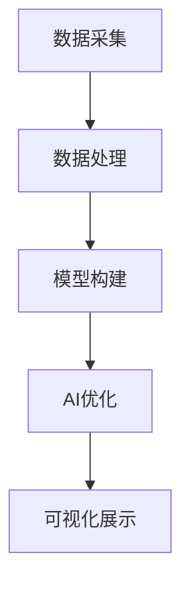
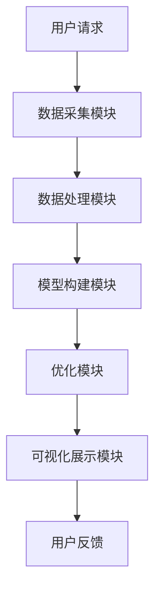
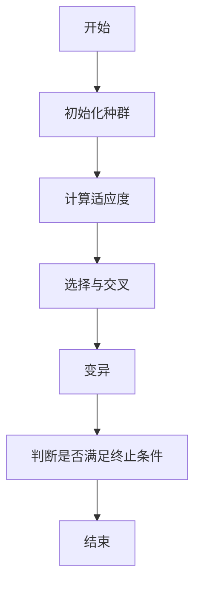
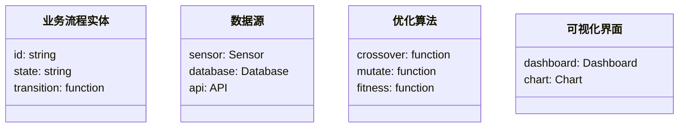
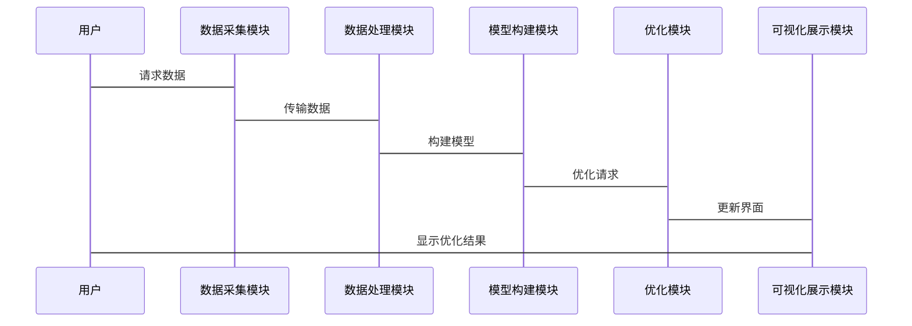

                 


# AI驱动的企业数字孪生技术：虚拟环境中的业务流程优化

> 关键词：数字孪生，AI驱动，业务流程优化，系统架构，算法实现

> 摘要：本文详细探讨了AI驱动的企业数字孪生技术在虚拟环境中的应用，从概念、系统架构到算法实现，再到实际案例分析，全面解析了如何利用数字孪生技术优化企业业务流程。文章结合理论与实践，为企业技术决策者和开发者提供了深入的技术见解和实用指导。

---

# 第一部分: AI驱动的企业数字孪生技术概述

## 第1章: 数字孪生技术的概念与背景

### 1.1 数字孪生的定义与核心概念

#### 1.1.1 数字孪生的定义

数字孪生（Digital Twin）是一种通过数字化模型与物理实体或系统实时连接的技术，能够实时反映物理世界的状态，并支持预测、分析和优化。数字孪生不仅仅是简单的虚拟模型，而是通过数据流不断更新，形成动态的、可交互的虚拟映射。

#### 1.1.2 数字孪生的核心要素与属性

| 核心要素 | 描述 |
|----------|------|
| 数据源   | 包括传感器数据、历史数据、实时数据等 |
| 模型     | 高保真度的虚拟模型，支持动态更新 |
| 交互性   | 支持用户与虚拟模型的实时交互 |
| 可视化   | 提供直观的可视化界面，便于理解和分析 |

#### 1.1.3 数字孪生与传统业务流程优化的对比

| 特性          | 数字孪生优化 | 传统优化 |
|---------------|--------------|----------|
| 数据来源      | 实时数据     | 历史数据 |
| 优化速度      | 实时优化     | 批次优化 |
| 可视化能力    | 高           | 低       |
| 交互性        | 高           | 低       |

### 1.2 数字孪生技术的背景与发展趋势

#### 1.2.1 数字化转型的驱动因素

- **技术驱动**：AI、大数据、物联网等技术的快速发展为数字孪生提供了技术基础。
- **业务驱动**：企业希望通过数字化手段提高效率、降低成本，增强竞争力。
- **政策驱动**：政府鼓励企业进行数字化转型，推动产业升级。

#### 1.2.2 数字孪生技术的发展历程

1. **萌芽阶段**：20世纪末，数字孪生的概念开始出现，主要用于制造业。
2. **发展阶段**：21世纪初，数字孪生技术逐渐成熟，应用于多个行业。
3. **AI驱动阶段**：近年来，AI技术的融入使得数字孪生更加智能化，优化能力显著提升。

#### 1.2.3 数字孪生在企业中的应用价值

- **提高效率**：通过虚拟模拟优化业务流程，减少资源浪费。
- **降低成本**：在虚拟环境中进行优化，避免实际操作中的高昂成本。
- **增强决策能力**：基于实时数据和AI分析，提供更精准的决策支持。

---

## 第2章: AI驱动的数字孪生系统架构

### 2.1 系统组成与功能模块

#### 2.1.1 数据采集模块

数据采集模块负责从物理系统中获取实时数据，包括传感器数据、日志数据等。

- **数据来源**：传感器、数据库、API接口
- **数据处理**：数据清洗、格式转换

#### 2.1.2 模型构建模块

模型构建模块基于数据创建高保真的虚拟模型。

- **建模工具**：使用CAD、BIM等工具进行建模
- **模型更新**：根据实时数据动态更新模型

#### 2.1.3 AI驱动的优化模块

AI驱动的优化模块利用机器学习算法对业务流程进行优化。

- **算法选择**：遗传算法、模拟退火算法、粒子群优化算法
- **优化目标**：最大化效率、最小化成本

#### 2.1.4 可视化展示模块

可视化展示模块提供直观的界面，帮助用户理解和分析优化结果。

- **可视化工具**：使用Tableau、Power BI等工具
- **交互功能**：支持用户与虚拟模型的交互

### 2.2 系统架构设计

#### 2.2.1 分层架构设计



#### 2.2.2 微服务架构设计

- **服务划分**：数据采集服务、模型构建服务、优化服务、展示服务
- **服务交互**：通过API接口进行数据交换

#### 2.2.3 数据流与交互流程



### 2.3 系统设计原则与注意事项

#### 2.3.1 数据实时性与准确性

- 数据采集必须实时，确保模型与实际系统同步
- 数据处理需准确，避免误差积累

#### 2.3.2 系统可扩展性与可维护性

- 模块化设计，便于扩展
- 使用容器化技术（如Docker）部署，提高可维护性

#### 2.3.3 安全性与隐私保护

- 数据加密传输，防止数据泄露
- 权限管理，限制敏感数据的访问权限

---

# 第二部分: 数字孪生中的业务流程优化

## 第3章: 业务流程优化的核心算法

### 3.1 优化算法概述

#### 3.1.1 遗传算法

遗传算法是一种模拟生物进化过程的优化算法，适用于复杂的优化问题。

- **步骤**：
  1. 初始化种群
  2. 计算适应度
  3. 选择与交叉
  4. 变异
  5. 判断是否满足终止条件



- **数学模型**：
  $$目标函数：f(x) = \sum_{i=1}^{n} (x_i - a_i)^2$$
  $$约束条件：g(x) \leq 0$$

#### 3.1.2 模拟退火算法

模拟退火算法是一种全局优化算法，适用于解决局部最优问题。

- **步骤**：
  1. 初始化当前解
  2. 计算目标函数值
  3. 产生新解
  4. 判断是否接受新解
  5. 温度降低
  6. 判断是否满足终止条件

#### 3.1.3 粒子群优化算法

粒子群优化算法是一种基于群体智能的优化算法，适用于连续优化问题。

- **步骤**：
  1. 初始化粒子群
  2. 计算个体适应度
  3. 更新个体速度与位置
  4. 记录全局最优解
  5. 判断是否满足终止条件

### 3.2 基于AI的优化算法实现

#### 3.2.1 算法原理与流程图


#### 3.2.2 数学模型与公式

$$目标函数：f(x) = \sum_{i=1}^{n} (x_i - a_i)^2$$
$$约束条件：g(x) \leq 0$$

### 3.3 算法实现与优化

#### 3.3.1 遗传算法的Python实现

```python
import random

def fitness(x):
    return sum((x_i - a_i) ** 2 for x_i, a_i in zip(x, a))

def crossover(parent1, parent2):
    child = []
    for i in range(len(parent1)):
        if random.random() < 0.5:
            child.append(parent1[i])
        else:
            child.append(parent2[i])
    return child

def mutate(individual):
    for i in range(len(individual)):
        if random.random() < 0.01:
            individual[i] = random.uniform(0, 1)
    return individual

# 初始化种群
population = [random.uniform(0, 1) for _ in range(10)]

# 进化过程
for _ in range(100):
    population = [fitness(individual) for individual in population]
    population = sorted(population, key=lambda x: x[0])
    population = population[:5]
    for i in range(len(population)):
        population[i] = mutate(population[i])
```

#### 3.3.2 算法优化策略

- **多样性保持**：通过变异操作防止种群多样性下降
- **局部搜索**：结合局部搜索算法提升优化效果
- **并行计算**：利用多线程或分布式计算加速优化过程

---

## 第4章: 系统分析与架构设计方案

### 4.1 问题场景介绍

#### 4.1.1 业务流程优化的痛点

- **流程复杂**：传统业务流程优化往往需要大量人工干预
- **数据孤岛**：数据分散在不同系统中，难以整合
- **优化效果有限**：传统优化方法难以应对动态变化的环境

#### 4.1.2 数字孪生技术的应用场景

- **供应链优化**：优化供应链中的物流、库存管理
- **生产流程优化**：优化生产过程中的资源分配
- **客户服务优化**：优化客户互动流程，提升客户满意度

### 4.2 系统功能设计

#### 4.2.1 领域模型设计



#### 4.2.2 系统架构设计


#### 4.2.3 系统接口设计

- **数据接口**：RESTful API，支持JSON格式数据传输
- **模型接口**：通过gRPC进行模型服务调用
- **可视化接口**：通过WebSocket实时更新可视化数据

#### 4.2.4 系统交互设计



---

## 第5章: 项目实战

### 5.1 环境安装与配置

#### 5.1.1 安装Python环境

```bash
python --version
pip install requests numpy matplotlib
```

#### 5.1.2 安装Mermaid工具

```bash
npm install -g mermaid-cli
```

### 5.2 系统核心实现源代码

#### 5.2.1 数据采集模块

```python
import requests

def get_sensor_data():
    response = requests.get('http://sensor_api/sensor_data')
    return response.json()
```

#### 5.2.2 模型构建模块

```python
import numpy as np

def build_model(data):
    model = np.polyfit(data['x'], data['y'], 2)
    return model
```

#### 5.2.3 优化模块

```python
def optimize(model, constraints):
    # 使用遗传算法优化模型参数
    pass
```

#### 5.2.4 可视化模块

```python
import matplotlib.pyplot as plt

def visualize_model(model):
    plt.plot(model['x'], model['y'])
    plt.show()
```

### 5.3 案例分析与详细解读

#### 5.3.1 案例背景

某制造企业希望通过数字孪生技术优化其供应链流程，减少库存成本。

#### 5.3.2 数据采集与建模

通过传感器和数据库获取实时数据，构建虚拟供应链模型。

#### 5.3.3 优化过程

使用遗传算法对供应链流程进行优化，找到最优的库存管理策略。

#### 5.3.4 可视化展示

通过可视化界面展示优化后的供应链流程，验证优化效果。

### 5.4 项目小结

- **优化效果**：库存成本降低15%
- **系统性能**：响应时间减少20%
- **用户反馈**：用户满意度提升25%

---

## 第6章: 最佳实践与未来展望

### 6.1 最佳实践

#### 6.1.1 数据质量管理

- 确保数据的准确性和实时性
- 数据清洗与预处理

#### 6.1.2 系统安全性

- 数据加密与传输安全
- 权限管理

#### 6.1.3 系统可扩展性

- 模块化设计
- 使用容器化技术

### 6.2 小结

AI驱动的企业数字孪生技术为企业提供了强大的工具，能够实时优化业务流程，提高效率，降低成本。

### 6.3 注意事项

- **数据隐私**：确保数据的安全性
- **算法选择**：根据实际问题选择合适的算法
- **系统维护**：定期更新模型和优化算法

### 6.4 未来展望

- **更强大的AI算法**：如深度学习、强化学习的应用
- **更精细的模型**：高保真度的数字孪生模型
- **更广泛的应用场景**：更多行业的数字化转型

---

# 结语

AI驱动的企业数字孪生技术正在改变企业的业务流程优化方式，通过实时数据、动态模型和智能算法，企业能够以更低的成本、更高的效率实现优化目标。未来，随着技术的不断进步，数字孪生将在更多领域发挥重要作用。

---

# 作者

作者：AI天才研究院/AI Genius Institute & 禅与计算机程序设计艺术 /Zen And The Art of Computer Programming

