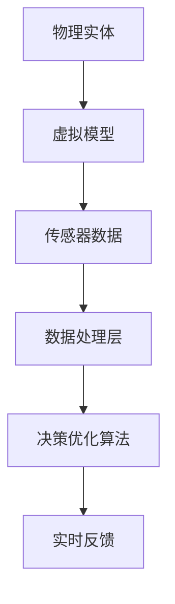
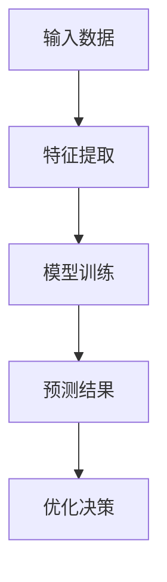
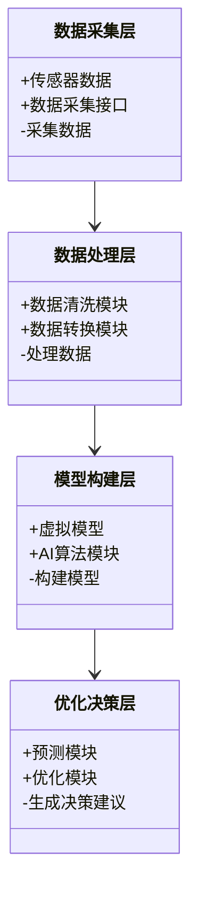
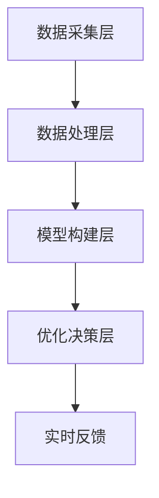
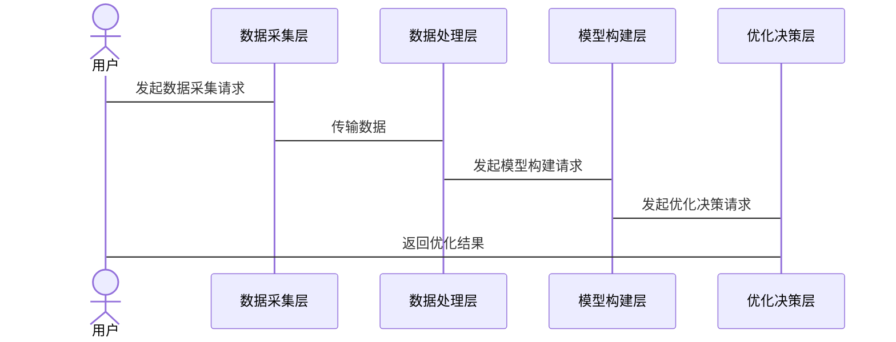

                 


# AI驱动的企业数字孪生技术：虚拟环境中的决策优化

> **关键词**: 数字孪生, 人工智能, 企业决策优化, 数据驱动, 虚拟环境

> **摘要**: 本文探讨了AI驱动的企业数字孪生技术在虚拟环境中的决策优化应用。通过分析数字孪生的核心概念、算法原理、系统架构及项目实战，本文详细阐述了如何利用数字孪生技术构建虚拟模型，结合AI算法优化企业决策流程，提升企业运营效率和竞争力。本文内容涵盖背景介绍、核心概念、算法原理、系统分析与架构设计、项目实战以及最佳实践，旨在为读者提供全面的技术指导和实践参考。

---

# 第1章: 数字孪生技术的背景与概念

## 1.1 数字孪生技术的定义与特点

### 1.1.1 数字孪生的定义
数字孪生（Digital Twin）是一种通过虚拟模型与物理实体实时映射的技术，利用数据流和AI算法在虚拟环境中进行决策优化和模拟验证。数字孪生不仅仅是简单的数据可视化，而是通过实时数据更新和模型仿真，实现对物理世界的动态模拟和优化。

### 1.1.2 数字孪生的核心特点
- **实时性**: 数字孪生能够实时反映物理世界的状态，确保虚拟模型与实际运行同步。
- **数据驱动**: 基于实时数据流和历史数据，数字孪生能够进行预测和优化。
- **动态性**: 数字孪生模型可以根据环境变化自动调整，支持动态决策。
- **可扩展性**: 数字孪生技术可以应用于企业中的多个领域，具有良好的扩展性。

### 1.1.3 数字孪生与传统技术的区别
数字孪生与传统技术（如物联网、大数据分析）相比，具有以下显著区别：
- **实时性更强**: 数字孪生不仅依赖于历史数据，还实时更新虚拟模型。
- **决策优化能力**: 数字孪生通过AI算法进行决策优化，而传统技术主要提供数据支持。
- **虚实结合**: 数字孪生强调虚拟模型与物理实体的双向互动，传统技术则更注重单向数据采集。

## 1.2 企业数字孪生的应用背景

### 1.2.1 企业数字化转型的现状
随着企业数字化转型的推进，越来越多的企业开始采用新技术来优化运营流程。数字孪生技术作为一种新兴的技术，能够帮助企业实现从数据采集到决策优化的全流程数字化。

### 1.2.2 数字孪生在企业中的应用领域
数字孪生技术广泛应用于以下领域：
- **智能制造**: 优化生产流程，降低生产成本。
- **智慧城市**: 提高城市管理效率，优化资源配置。
- **金融服务**: 通过实时风险评估，优化投资决策。
- **医疗健康**: 支持个性化医疗，优化医疗资源配置。

### 1.2.3 数字孪生对企业决策优化的意义
数字孪生技术通过实时数据和AI算法，帮助企业实现更高效的决策优化。例如，在智能制造领域，数字孪生可以实时监控生产线的状态，预测可能出现的问题，并提出优化建议，从而减少停机时间，降低成本。

## 1.3 数字孪生技术的核心要素

### 1.3.1 物理世界与虚拟模型的映射
数字孪生的核心是通过传感器和数据采集设备，将物理世界中的数据实时传输到虚拟模型中，实现虚实结合。

### 1.3.2 数据流与实时反馈机制
数字孪生依赖于实时数据流，通过数据处理层进行分析和建模，然后通过虚拟模型进行预测和优化，最终将优化结果反馈到物理世界。

### 1.3.3 AI算法在数字孪生中的作用
AI算法是数字孪生技术的核心驱动力，通过机器学习、深度学习等算法，数字孪生能够实现数据的深度分析和决策优化。

---

# 第2章: 数字孪生的核心概念与原理

## 2.1 数字孪生的技术架构

### 2.1.1 分层架构模型
数字孪生技术通常采用分层架构，包括：
- **数据采集层**: 通过传感器和数据采集设备获取物理世界的数据。
- **数据处理层**: 对数据进行清洗、转换和存储。
- **模型构建层**: 利用AI算法构建虚拟模型。
- **优化决策层**: 通过虚拟模型进行预测和优化，生成决策建议。
- **反馈执行层**: 将优化结果反馈到物理世界，执行决策。

### 2.1.2 数据流与信息处理流程
数据流从物理世界流向虚拟模型，经过数据处理层的清洗和转换，进入模型构建层进行建模和分析，最后通过优化决策层生成决策建议，并将结果反馈到物理世界。

### 2.1.3 虚拟环境中的实时交互机制
数字孪生的虚拟环境支持实时交互，用户可以通过虚拟模型进行实时操作和调整，虚拟模型会根据用户的操作更新物理世界的状态。

## 2.2 数字孪生与相关技术的对比

### 2.2.1 数字孪生与物联网的区别
物联网（IoT）主要关注数据的采集和传输，而数字孪生不仅关注数据采集，还强调数据的分析和决策优化。

### 2.2.2 数字孪生与大数据分析的联系
数字孪生依赖于实时数据流和历史数据，大数据分析技术在数据处理和建模过程中起到关键作用。

### 2.2.3 数字孪生与人工智能的结合
数字孪生的核心驱动力是AI算法，通过机器学习、深度学习等技术实现数据的深度分析和决策优化。

## 2.3 数字孪生的ER实体关系图



---

# 第3章: 常用算法与流程图

## 3.1 机器学习算法在数字孪生中的应用

### 3.1.1 线性回归算法
线性回归是一种简单而有效的回归算法，适用于预测连续型变量。

$$ y = \beta_0 + \beta_1x + \epsilon $$

### 3.1.2 支持向量机算法
支持向量机（SVM）适用于分类和回归问题，具有良好的泛化能力。

### 3.1.3 神经网络算法
神经网络是一种强大的机器学习算法，适用于复杂的数据模式识别。

## 3.2 强化学习算法在决策优化中的应用

### 3.2.1 Q-Learning算法
Q-Learning是一种经典的强化学习算法，适用于离散动作空间的决策优化。

### 3.2.2 Deep Q-Network算法
Deep Q-Network（DQN）通过深度神经网络近似Q值函数，适用于复杂环境中的决策优化。

### 3.2.3 策略梯度算法
策略梯度算法直接优化策略，适用于连续动作空间的决策优化。

## 3.3 算法流程图



## 3.4 数学模型与公式

### 3.4.1 线性回归模型
$$ y = \beta_0 + \beta_1x + \epsilon $$

### 3.4.2 决策树模型
$$ Gini\ Index = \sum_{i=1}^{n} p_i(1 - p_i) $$

---

# 第4章: 数字孪生系统的分析与架构设计

## 4.1 系统分析与架构设计

### 4.1.1 问题场景介绍
以智能制造为例，数字孪生系统需要实时监控生产线的状态，预测可能出现的问题，并提出优化建议。

### 4.1.2 系统功能设计



### 4.1.3 系统架构设计



### 4.1.4 系统接口设计
系统接口包括数据采集接口、数据处理接口和优化决策接口，支持RESTful API和消息队列（如Kafka）。

### 4.1.5 系统交互流程



---

# 第5章: 数字孪生技术的项目实战

## 5.1 项目实战：数字孪生在智能制造中的应用

### 5.1.1 环境安装与配置
- 安装Python和相关库（如NumPy、Scikit-learn、TensorFlow）。
- 配置传感器数据采集接口（如MQTT）。

### 5.1.2 核心代码实现

```python
import numpy as np
from sklearn.linear_model import LinearRegression

# 示例数据
X = np.array([[1], [2], [3], [4], [5]])
y = np.array([2, 4, 5, 4, 6])

# 模型训练
model = LinearRegression()
model.fit(X, y)

# 预测结果
new_X = np.array([[6]])
print(model.predict(new_X))
```

### 5.1.3 代码功能解读与分析
上述代码展示了如何使用线性回归算法进行预测。模型通过训练数据学习了X和y之间的关系，然后利用训练好的模型对新数据进行预测。

### 5.1.4 实际案例分析
以智能制造为例，数字孪生系统可以实时监控生产线的状态，预测可能出现的故障，并提出优化建议，从而降低生产成本。

### 5.1.5 项目小结
通过本项目，我们了解了数字孪生技术在智能制造中的应用，掌握了数据采集、模型构建和优化决策的基本流程。

---

# 第6章: 最佳实践与总结

## 6.1 最佳实践

### 6.1.1 小结
数字孪生技术通过实时数据和AI算法，能够帮助企业实现更高效的决策优化。

### 6.1.2 注意事项
- 数据质量是数字孪生的核心，必须确保数据的准确性和实时性。
- 数字孪生系统的安全性需要高度重视，防止数据泄露和系统攻击。

### 6.1.3 拓展阅读
推荐阅读《机器学习实战》和《深度学习入门》等书籍，深入理解AI算法在数字孪生中的应用。

---

# 作者：AI天才研究院 & 禅与计算机程序设计艺术

通过本文的详细阐述，我们希望能够为读者提供关于AI驱动的企业数字孪生技术的全面了解，从概念到实践，帮助读者在实际工作中更好地应用这一技术，提升企业的决策能力和竞争力。

