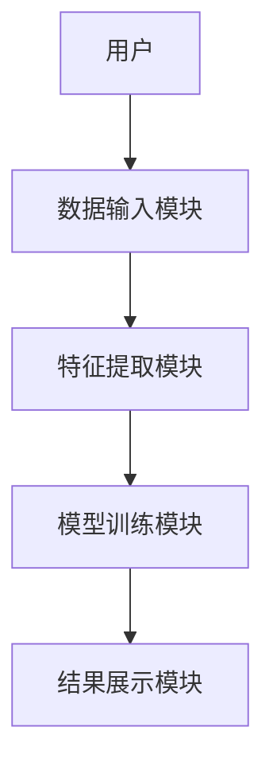

                 


# AI驱动的企业知识产权价值评估与管理

## 关键词：AI驱动，知识产权，价值评估，知识管理，技术应用

## 摘要：本文探讨了如何利用人工智能技术提升企业知识产权的评估与管理效率。通过分析知识产权的核心要素、AI技术的应用场景，以及基于机器学习的评估算法，本文详细阐述了AI在知识产权管理中的潜在价值和实现路径。同时，结合实际案例，本文还展示了如何构建一个AI驱动的知识产权限值评估系统，并提出了未来发展的建议。

---

## 第一部分: 知识产权与AI驱动管理的背景

### 第1章: 知识产权基础与AI的结合

#### 1.1 知识产权的基本概念

- **1.1.1 知识产权的定义与范围**

知识产权是指依法保护的智力成果和标记，包括专利权、商标权、版权、商业秘密等。其范围涵盖技术创新、文化创意、商业标识等多个领域。

- **1.1.2 知识产权的核心要素与分类**

知识产权的核心要素包括创新性、法律保护、市场价值等。主要分类包括专利（技术创新）、商标（商业标识）、版权（文学艺术作品）和商业秘密（未公开的技术信息）。

- **1.1.3 知识产权的保护与价值实现**

知识产权的保护通过法律手段确保其独占性和排他性，其价值实现依赖于市场应用和商业化潜力。

#### 1.2 AI在知识产权管理中的作用

- **1.2.1 AI技术如何赋能知识产权管理**

AI技术可以用于自动化的数据整理、相似性分析、价值预测和风险评估，显著提高管理效率和准确性。

- **1.2.2 AI在知识产权分析与评估中的优势**

AI能够快速处理大量数据，识别隐藏的关联性，并提供数据驱动的决策支持。

- **1.2.3 AI驱动的知识产权管理新范式**

AI技术引入了智能化、数据化的管理方式，改变了传统的手工评估和经验判断模式。

#### 1.3 知识产权管理的痛点与需求

- **1.3.1 传统知识产权管理的局限性**

传统管理方式效率低、成本高，难以应对海量数据和复杂场景。

- **1.3.2 企业对知识产权价值评估的需求**

企业需要准确评估知识产权的市场价值，以支持决策和战略规划。

- **1.3.3 AI技术在知识产权管理中的应用场景**

AI可应用于专利检索、侵权分析、价值评估、风险预警等领域。

---

## 第二部分: AI驱动的知识产权限值评估方法

### 第2章: 知识产权价值评估的核心概念

#### 2.1 知识产权价值评估的定义与框架

- **2.1.1 知识产权价值评估的定义**

知识产权价值评估是基于技术、法律和市场因素，对知识产权的经济价值进行量化的过程。

- **2.1.2 价值评估的框架与流程**

评估框架包括数据收集、特征提取、模型训练和预测四个步骤。

#### 2.2 知识产权价值的关键影响因素

- **2.2.1 技术创新性与市场竞争力**

技术创新性决定知识产权的市场价值，市场竞争力影响其应用潜力。

- **2.2.2 法律保护的强度与范围**

法律保护的力度和覆盖范围直接影响知识产权的市场价值。

- **2.2.3 商业化潜力与经济价值**

知识产权的商业化潜力是其经济价值的重要来源。

#### 2.3 传统评估方法与AI驱动方法的对比

| **方法**         | **优点**                          | **缺点**                          |
|------------------|-----------------------------------|-----------------------------------|
| 传统评估         | 经验丰富，考虑因素全面             | 主观性强，效率低下                 |
| AI驱动评估       | 数据驱动，效率高，准确性强         | 数据依赖性强，模型复杂             |

---

## 第三部分: 基于机器学习的知识产权价值评估算法

### 第3章: 算法原理与实现

#### 3.1 数据预处理

- **3.1.1 数据清洗**

去除重复和噪声数据，确保数据质量。

- **3.1.2 特征提取**

从专利文本中提取技术关键词和分类信息。

#### 3.2 算法选择与实现

- **3.2.1 算法选择**

使用支持向量机（SVM）或随机森林（Random Forest）进行分类和回归分析。

- **3.2.2 算法实现**

以下是一个简单的Python代码示例：

```python
from sklearn.svm import SVC
from sklearn.model_selection import train_test_split

# 假设X是特征向量，y是目标变量
X_train, X_test, y_train, y_test = train_test_split(X, y, test_size=0.2)

# 训练模型
model = SVC()
model.fit(X_train, y_train)

# 预测
y_pred = model.predict(X_test)
```

#### 3.3 模型评估与优化

- **3.3.1 评估指标**

使用准确率、召回率和F1分数评估模型性能。

- **3.3.2 模型优化**

通过网格搜索和交叉验证优化模型参数。

---

## 第四部分: 系统架构与实现

### 第4章: 系统设计与实现

#### 4.1 系统功能设计

- **4.1.1 功能模块**

包括数据输入、特征提取、模型训练、结果展示等模块。

- **4.1.2 功能流程**

用户输入专利数据，系统提取特征，训练模型并生成评估结果。

#### 4.2 系统架构设计

以下是一个简单的系统架构图：



#### 4.3 系统接口设计

- **API接口**

提供RESTful API，供其他系统调用评估结果。

---

## 第五部分: 项目实战与案例分析

### 第5章: 项目实战

#### 5.1 环境搭建

- **安装依赖**

安装Python、Scikit-learn、Mermaid等工具。

#### 5.2 核心代码实现

```python
import numpy as np
from sklearn import svm

# 示例数据
X = np.array([[1, 2], [3, 4], [5, 6], [7, 8]])
y = np.array([0, 1, 0, 1])

# 创建SVM模型并训练
model = svm.SVC()
model.fit(X, y)

# 预测新数据
new_data = np.array([[9, 10]])
print(model.predict(new_data))  # 输出：[1]
```

---

## 第六部分: 总结与展望

### 第6章: 总结与展望

#### 6.1 本章小结

本文详细介绍了AI在知识产权管理中的应用，包括价值评估和系统实现。

#### 6.2 未来展望

未来，AI技术将更加深入地融入知识产权管理，推动智能化管理和决策。

---

## 作者：AI天才研究院 & 禅与计算机程序设计艺术

