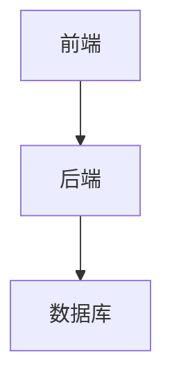

                 


# AI驱动的企业知识图谱：自动化构建与智能推理机制

**关键词**：知识图谱、AI驱动、自动化构建、智能推理、企业应用、数据建模、图神经网络

**摘要**：知识图谱作为一种强大的数据建模工具，正在企业中发挥越来越重要的作用。本文详细探讨了AI驱动的知识图谱的构建过程，包括数据采集、预处理、知识抽取与融合，以及智能推理机制的设计与实现。通过结合实际企业案例，本文分析了知识图谱在企业中的应用价值，并展望了未来的发展趋势。文章内容涵盖知识图谱的核心概念、构建方法、推理算法、系统架构和项目实战，旨在为企业技术决策者和开发者提供全面的技术指导。

---

## 第一部分：知识图谱概述

### 1.1 知识图谱的定义与核心概念

知识图谱是一种以图结构形式表示知识的语义网络，由实体（概念）和关系（属性或联系）组成，用于描述真实世界中的各种实体及其关系。知识图谱的核心要素包括：

- **实体**：知识图谱中的基本单位，代表现实世界中的具体事物或概念。
- **关系**：连接实体的桥梁，描述实体之间的关联方式。
- **属性**：描述实体的特征或状态，进一步丰富实体的信息。

**知识图谱与传统数据库的区别**：传统数据库通常以行和列的形式存储数据，而知识图谱通过图结构（节点和边）来表示数据，能够更好地捕捉数据之间的复杂关系。

### 1.2 企业知识图谱的背景与价值

#### 1.2.1 背景
随着企业数据的爆炸式增长，如何高效地利用数据成为企业面临的重要挑战。知识图谱通过构建语义网络，将分散在不同数据源中的信息整合起来，为企业提供了统一的知识表示方式。

#### 1.2.2 价值
- **提升数据利用率**：通过知识图谱，企业能够更好地理解数据之间的关系，从而提高数据的利用效率。
- **支持智能应用**：知识图谱为智能搜索、推荐系统、自然语言处理等应用提供了丰富的语义信息。
- **增强决策能力**：基于知识图谱的推理能力，企业能够做出更智能、更精准的决策。

---

## 第二部分：知识图谱的自动化构建

### 2.1 数据采集与预处理

#### 2.1.1 数据源的选择与整合
数据源可以是结构化数据（如数据库）、半结构化数据（如XML/JSON）或非结构化数据（如文本）。在数据采集过程中，需要对数据进行清洗和去重，确保数据的准确性和一致性。

**数据清洗流程**：
1. 去除重复数据。
2. 处理缺失值。
3. 标准化数据格式。

#### 2.1.2 数据格式的统一化
为了方便后续处理，需要将不同数据源中的数据转换为统一的格式，例如将文本数据转换为结构化的格式。

### 2.2 知识抽取与融合

#### 2.2.1 实体识别与关系抽取
实体识别是通过自然语言处理技术从文本中提取出实体，例如从“张三在北京工作”中提取出“张三”和“北京”。关系抽取则是识别实体之间的关系，例如“张三在北京工作”。

**基于规则的实体识别**：
使用正则表达式或领域知识来识别特定类型的实体。例如，识别日期时可以使用正则表达式`\d{4}-\d{2}-\d{2}`。

**基于机器学习的实体识别**：
使用训练好的模型（如CRF）进行序列标注，自动识别实体。

#### 2.2.2 实体链接与消歧
实体链接是将文本中的实体映射到知识图谱中的唯一标识。例如，文本中的“苹果”可能指的是“苹果公司”或“苹果手机”。

**实体消歧方法**：
1. 基于上下文的消歧：根据上下文信息判断实体的含义。
2. 基于知识库的消歧：通过知识库中的实体信息进行消歧。

---

## 第三部分：智能推理机制

### 3.1 知识推理的基本原理

#### 3.1.1 基于规则的推理
基于规则的推理通过预定义的规则进行推理。例如，如果A是B的父亲，且B是C的父亲，那么A是C的祖父。

**规则表示**：
使用逻辑规则或正则表达式表示推理规则。例如，规则可以表示为：
$$ \text{如果 } A.r1 = B \text{ 并且 } B.r2 = C \text{，则 } A.r3 = C \text{ 的祖父} $$

#### 3.1.2 基于机器学习的推理
基于机器学习的推理通过训练模型进行推理。例如，使用神经网络模型对知识图谱中的关系进行预测。

**神经网络推理模型**：
- 输入：实体和关系。
- 输出：预测的关系或属性。

#### 3.1.3 基于图神经网络的推理
图神经网络通过图结构进行推理。例如，在知识图谱中，通过遍历图结构找到实体之间的关系。

**图神经网络推理流程**：
1. 输入起点实体。
2. 遍历图结构，找到相关实体。
3. 输出推理结果。

### 3.2 智能推理的应用与优化

#### 3.2.1 规则的定义与设计
规则的设计需要考虑以下几点：
- 简洁性：规则应尽可能简洁。
- 完备性：规则应覆盖所有可能的情况。
- 可解释性：规则应易于理解和解释。

#### 3.2.2 机器学习推理的优化
- **模型选择**：选择适合任务的模型，例如使用图卷积网络（GCN）进行关系推理。
- **数据增强**：通过数据增强技术提高模型的泛化能力。
- **模型调优**：通过网格搜索等方法优化模型参数。

---

## 第四部分：知识图谱的系统架构

### 4.1 系统设计与实现

#### 4.1.1 知识图谱的存储与管理
- **图数据库**：常用的图数据库包括Neo4j、OrientDB等。
- **数据模型**：设计合适的数据模型，例如使用节点和边表示实体和关系。

#### 4.1.2 知识图谱的查询与推理
- **查询语言**：使用SPARQL进行查询。
- **推理接口**：提供推理服务，例如通过REST API提供推理结果。

### 4.2 系统实现与优化

#### 4.2.1 系统架构设计
- **前端**：用户界面，展示知识图谱。
- **后端**：处理查询和推理请求。
- **数据库**：存储知识图谱数据。

**系统架构图**：


#### 4.2.2 系统优化策略
- **数据索引**：在数据库中建立索引，提高查询效率。
- **缓存机制**：使用缓存技术减少重复查询。

---

## 第五部分：项目实战

### 5.1 项目背景与目标

#### 5.1.1 项目背景
假设我们正在为一家电商公司构建知识图谱，目标是整合产品信息、客户信息和订单信息，支持智能推荐和客户服务。

#### 5.1.2 项目目标
- 整合数据源。
- 构建知识图谱。
- 实现智能推理。

### 5.2 系统实现

#### 5.2.1 环境配置
- **Python版本**：3.8+
- **依赖库**：networkx、neo4j-driver

#### 5.2.2 核心代码实现

```python
import neo4j_driver as neo4j
from networkx import Graph

def build_knowledge_graph():
    driver = neo4j.GraphDatabaseService("bolt://localhost:7687", auth=("neo4j", "password"))
    # 创建节点
    with driver.session() as session:
        session.run("CREATE (:Product {name: 'iPhone 13'})")
        session.run("CREATE (:Customer {name: '张三'})")
        session.run("CREATE (:Order {id: '20231010'})")
    # 创建关系
    with driver.session() as session:
        session.run("MATCH (p:Product {name: 'iPhone 13'}), (c:Customer {name: '张三'}) CREATE (c)-[:PURCHASED]->(p)")
    return driver

# 运行构建函数
build_knowledge_graph()
```

---

## 第六部分：未来展望

### 6.1 挑战与机遇

#### 6.1.1 挑战
- **数据质量**：如何处理数据中的噪声。
- **推理能力**：如何提高推理的准确性和效率。

#### 6.1.2 机遇
- **技术进步**：随着AI技术的进步，知识图谱的构建和推理将更加智能化。
- **应用场景扩展**：知识图谱将在更多领域得到应用。

### 6.2 研究与发展趋势

- **多模态知识图谱**：结合文本、图像等多种数据类型，构建更丰富的知识图谱。
- **实时推理**：研究如何在实时场景下进行高效的推理。

---

**作者：AI天才研究院/AI Genius Institute & 禅与计算机程序设计艺术 /Zen And The Art of Computer Programming**

---

以上是文章的详细大纲和内容，涵盖了知识图谱的核心概念、构建方法、推理机制和系统架构，并结合实际案例进行了详细讲解。

