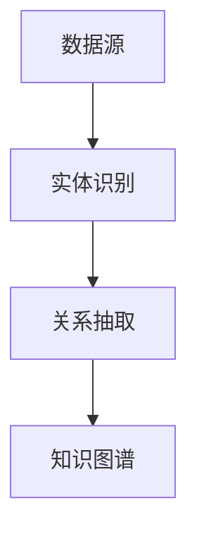
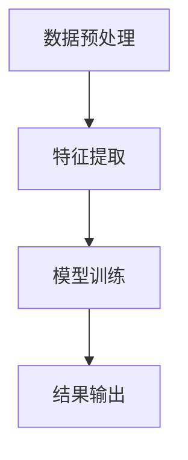
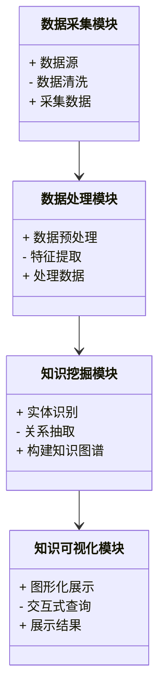
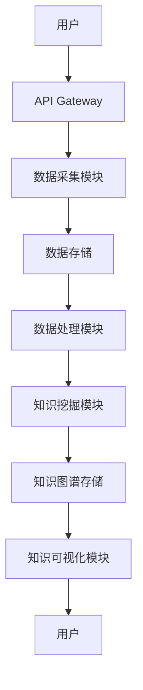
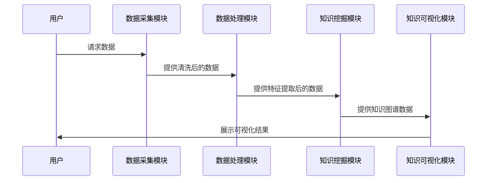

                 


---

# AI驱动的企业知识挖掘：从非结构化数据中提取价值

> 关键词：AI驱动，知识挖掘，非结构化数据，企业价值，自然语言处理，知识图谱

> 摘要：本文详细探讨了AI驱动的知识挖掘技术，从非结构化数据中提取有价值的信息。通过分析知识挖掘的核心概念、算法原理、系统架构设计，结合实际项目案例，展示了如何利用AI技术提升企业数据处理能力。文章还介绍了自然语言处理、机器学习等技术在知识挖掘中的应用，并提出了系统设计与优化的建议。

---

# 第一部分：AI驱动的知识挖掘概述

## 第1章：AI驱动的知识挖掘背景与意义

### 1.1 什么是知识挖掘

知识挖掘是从非结构化数据中提取隐含知识的过程，其目标是将数据转化为可利用的信息和知识。知识挖掘的核心在于理解数据背后的意义，并通过技术手段将其结构化和关联化。

**知识挖掘的定义**：知识挖掘是利用人工智能技术，从文本、图像等非结构化数据中提取、整理和关联知识的过程。

**知识挖掘的核心概念**：
- 数据源：包括文本、图像、视频等多种形式。
- 知识表示：通过结构化数据（如知识图谱）表示知识。
- 知识关联：建立实体之间的关系，形成完整的知识网络。

**知识挖掘的目标与价值**：
- 发现隐含关系：揭示数据中潜在的联系。
- 提供决策支持：为企业决策提供依据。
- 优化流程：提高数据处理效率。

### 1.2 非结构化数据的特点与挑战

**非结构化数据的定义**：未经过系统整理，缺乏明确结构的数据，如文本、图像等。

**非结构化数据的常见类型**：
- 文本数据：包括文档、邮件等。
- 图像数据：包括图片、图表等。
- 视频数据：包括录像、直播等。

**处理非结构化数据的难点**：
- 数据多样性：不同类型数据的处理方法不同。
- 数据量大：处理大规模数据需要高效算法。
- 数据噪声：数据中存在干扰信息，影响提取效果。

### 1.3 AI在知识挖掘中的作用

**AI技术如何赋能知识挖掘**：
- 自然语言处理：用于文本分析和理解。
- 机器学习：用于模式识别和分类。
- 知识图谱：用于构建结构化的知识库。

**AI驱动的知识挖掘的优势**：
- 高效性：AI算法能够快速处理大量数据。
- 精准性：通过深度学习提升提取准确性。
- 可扩展性：适用于不同规模和类型的数据。

**企业级应用中的价值体现**：
- 优化业务流程：通过数据驱动决策。
- 提升竞争力：快速获取市场洞察。
- 降低运营成本：自动化处理数据。

---

## 第2章：知识挖掘的核心概念与联系

### 2.1 知识挖掘的核心要素

**数据源**：知识挖掘的基础，包括文本、图像等多种形式。

**知识表示**：将数据转化为结构化的形式，如知识图谱。

**知识关联**：建立实体之间的关系，形成完整的知识网络。

### 2.2 核心概念的原理

**知识图谱的构建**：通过实体识别和关系抽取，将非结构化数据转化为结构化的知识图谱。

**实体识别与关系抽取**：利用自然语言处理技术，识别文本中的实体及其关系。

**概念层次分析**：通过层次化的方法，分析概念之间的关系，构建概念网络。

### 2.3 核心概念的对比分析

**不同知识挖掘方法的对比**：
| 方法         | 描述                                   |
|--------------|--------------------------------------|
| 基于规则的挖掘 | 依赖预定义规则，适用于特定场景。   |
| 基于统计的挖掘 | 基于数据分布，适用于大规模数据。   |
| 基于机器学习的挖掘 | 使用深度学习模型，具有高准确性。   |

**算法复杂度与性能对比**：
| 算法         | 复杂度 | 性能         |
|--------------|--------|--------------|
| TF-IDF       | O(n)   | 适用于文本摘要。 |
| LDA          | O(n²)  | 适用于主题建模。 |
| Word2Vec     | O(n³)  | 适用于词嵌入。 |

**数据规模与处理能力对比**：
| 方法         | 处理能力 | 数据规模         |
|--------------|----------|------------------|
| 支持向量机    | 高       | 中等规模         |
| 随机森林      | 中       | 大规模数据       |
| 深度学习模型   | 高       | 超大规模数据       |

### 2.4 ER实体关系图



---

## 第3章：知识挖掘的算法原理

### 3.1 文本挖掘算法

**TF-IDF算法**：
- **原理**：通过计算词频和倒置文档频率，找出重要的关键词。
- **公式**：$$TF-IDF(t, d) = TF(t, d) \times \log\left( \frac{N}{DF(t)} \right)$$
  - TF(t, d)：词t在文档d中的频率。
  - DF(t)：词t在所有文档中的出现次数。
  - N：文档总数。

**LDA主题建模**：
- **原理**：通过概率模型，发现文档中的主题分布。
- **应用**：用于主题建模和文本聚类。

**Word2Vec词嵌入**：
- **原理**：通过神经网络，将词映射为低维向量。
- **模型**：包括CBOW和Skip-Gram两种模型。
- **应用**：用于文本相似度计算和情感分析。

### 3.2 自然语言处理算法

**分词与句法分析**：
- **分词**：将文本分割成词语或短语。
- **句法分析**：分析句子的语法结构，识别名词、动词等。

**命名实体识别**：
- **原理**：识别文本中的专有名词，如人名、地名等。
- **应用**：用于信息抽取和知识图谱构建。

**语义理解**：
- **原理**：通过上下文理解词语和句子的含义。
- **技术**：基于预训练模型，如BERT。

### 3.3 机器学习算法

**支持向量机（SVM）**：
- **原理**：通过构建超平面，将数据分为不同类别。
- **应用**：用于文本分类和模式识别。

**随机森林（Random Forest）**：
- **原理**：通过集成多个决策树，提高分类准确性。
- **应用**：用于特征选择和分类任务。

**深度学习模型（如BERT）**：
- **原理**：基于Transformer架构，进行预训练和微调。
- **应用**：用于问答系统和文本摘要。

### 3.4 算法流程图



---

## 第4章：系统分析与架构设计

### 4.1 系统功能设计

**数据采集模块**：
- **功能**：从多种数据源采集数据，如数据库、API等。
- **流程**：数据清洗、转换和存储。

**数据处理模块**：
- **功能**：对数据进行预处理，如分词、去停用词等。
- **流程**：数据清洗、特征提取。

**知识挖掘模块**：
- **功能**：应用算法进行知识提取和关联。
- **流程**：实体识别、关系抽取、知识图谱构建。

**知识可视化模块**：
- **功能**：将知识图谱以图形化方式展示。
- **流程**：数据可视化、交互式查询。

### 4.2 系统架构设计

**领域模型（Mermaid类图）**：



**系统架构图（Mermaid架构图）**：



**系统交互图（Mermaid序列图）**：



### 4.3 系统实现细节

**数据采集模块**：
- 使用Python的`requests`库进行HTTP请求。
- 数据清洗代码示例：
  ```python
  import pandas as pd
  df = pd.read_csv('data.csv')
  df.dropna(inplace=True)
  ```

**知识挖掘模块**：
- 使用`spaCy`进行实体识别：
  ```python
  import spacy
  nlp = spacy.load('en_core_web_sm')
  doc = nlp('This is a test sentence.')
  for ent in doc.ents:
      print(ent.text, ent.label_)
  ```

**知识可视化模块**：
- 使用`igraph`构建知识图谱：
  ```python
  import igraph
  g = igraph.Graph()
  g.add_edges([('A', 'B'), ('B', 'C')])
  g.plot('graph.png')
  ```

---

## 第5章：项目实战

### 5.1 环境安装

**Python环境**：
- 安装必要的库：
  ```bash
  pip install numpy pandas spacy transformers
  ```

**数据准备**：
- 下载公开数据集，如维基百科文本。

### 5.2 核心实现

**实体识别代码**：
```python
import spacy

nlp = spacy.load('en_core_web_sm')
text = "Apple is a company based in Cupertino."
doc = nlp(text)
for ent in doc.ents:
    print(f"{ent.text} ({ent.label_})")
```

**关系抽取代码**：
```python
from spacy.matcher import Matcher

nlp = spacy.load('en_core_web_sm')
matcher = Matcher(nlp.vocab)
pattern = [{'POS': 'PROPN'}, {'RELATION': 'be'}, {'POS': 'PROPN'}]
matcher.add('LOCATION', [pattern])
doc = nlp('Apple is located in Cupertino.')
matches = matcher(doc)
for match_id, start, end in matches:
    span = doc[start:end]
    print(span.text)
```

### 5.3 案例分析

**案例：企业信息抽取**：
- 数据源：企业新闻报道。
- 处理步骤：
  1. 数据清洗：去除无效信息。
  2. 实体识别：提取公司名称、地点等。
  3. 关系抽取：建立公司与地点的关系。
  4. 知识图谱构建：展示公司及其地理位置。

### 5.4 项目小结

**项目总结**：
- 成功实现企业信息抽取，构建了知识图谱。
- 验证了算法的有效性和系统的可行性。

**经验总结**：
- 数据预处理是关键，影响后续结果。
- 选择合适的算法和工具，提升效率。
- 可视化展示有助于更好地理解数据。

---

## 第6章：总结与展望

### 6.1 本章总结

**知识挖掘的核心价值**：从非结构化数据中提取有用信息，支持企业决策。

**AI技术的作用**：通过自然语言处理、机器学习等技术，提升知识挖掘的效率和准确性。

**系统设计的意义**：构建高效的系统架构，确保数据处理和知识提取的高效性。

### 6.2 未来展望

**技术发展**：
- 更先进的深度学习模型，如更大规模的预训练模型。
- 更高效的算法，提升处理速度和准确性。

**应用场景扩展**：
- 更多领域的应用，如医疗、教育等。
- 结合区块链技术，确保数据安全和隐私。

**挑战与机遇**：
- 数据隐私和安全问题。
- 多模态数据的处理，如图像和文本的结合。

### 6.3 最佳实践 tips

**小结**：
- 数据预处理是关键，确保数据质量。
- 选择合适的算法，提升效率和准确性。
- 系统设计要注重可扩展性和可维护性。

**注意事项**：
- 数据隐私和合规性：遵守相关法律法规。
- 模型解释性：确保模型结果可解释。
- 性能优化：通过并行计算和优化算法提升效率。

**拓展阅读**：
- 关注最新的AI技术，如生成式AI。
- 学习更多的自然语言处理工具和框架。

---

# 结束语

AI驱动的知识挖掘为企业提供了强大的工具，从非结构化数据中提取价值。通过本文的详细介绍，读者可以深入了解知识挖掘的核心概念、算法原理和系统设计。未来，随着AI技术的不断进步，知识挖掘将在更多领域发挥重要作用。

---

**作者：AI天才研究院/AI Genius Institute & 禅与计算机程序设计艺术 /Zen And The Art of Computer Programming**

