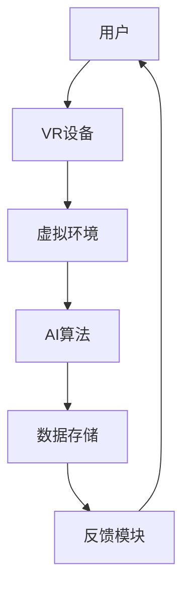
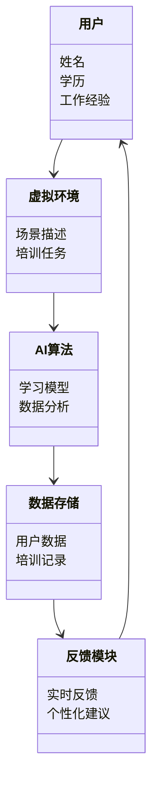

                 


# AI驱动的企业虚拟现实培训：提升学习效果与参与度

> 关键词：AI驱动，虚拟现实，企业培训，学习效果，参与度

> 摘要：本文探讨了AI驱动的企业虚拟现实培训的原理、设计与实现，通过实际案例展示了其在提升学习效果与参与度方面的优势，分析了其在企业培训中的应用前景。

---

## 第一部分: AI驱动的企业虚拟现实培训概述

### 第1章: 背景介绍与核心概念

#### 1.1 企业虚拟现实培训的背景

企业培训是提升员工技能和企业竞争力的重要手段。然而，传统的企业培训方式存在以下问题：

- **时间与成本高昂**：传统的线下培训需要大量时间和资金投入，且难以覆盖大规模员工。
- **参与度不足**：员工在被动接受培训内容时，注意力难以集中，学习效果有限。
- **内容单一**：传统的培训方式难以提供个性化的学习体验，且内容形式单一，难以激发员工兴趣。

随着虚拟现实（VR）技术的快速发展，企业培训逐渐从传统的面授模式向虚拟现实模式转型。虚拟现实技术能够提供沉浸式的学习体验，使员工在虚拟环境中进行实践操作和互动交流，从而提高学习效果和参与度。

此外，人工智能（AI）技术的引入，进一步提升了虚拟现实培训的效果。AI技术可以通过分析员工的学习行为和表现，提供个性化的学习路径和实时反馈，从而进一步优化培训效果。

---

#### 1.2 AI驱动的虚拟现实培训的核心概念

为了更好地理解AI驱动的虚拟现实培训，我们需要明确以下几个核心概念：

1. **虚拟现实（VR）**：一种能够模拟真实环境的计算机技术，通过头戴式显示器（HMD）或其他设备，让用户沉浸在虚拟环境中。VR技术广泛应用于游戏、教育、医疗和企业培训等领域。

2. **人工智能（AI）**：一种模拟人类智能的计算机技术，包括机器学习、自然语言处理、计算机视觉等技术。AI能够通过数据分析和模式识别，为用户提供智能化的决策支持和个性化服务。

3. **AI驱动的虚拟现实培训**：将AI技术与虚拟现实技术相结合，利用AI算法分析用户的学习行为和表现，动态调整培训内容和难度，提供个性化的学习体验。

---

### 第2章: AI与虚拟现实的核心概念与联系

#### 2.1 AI与虚拟现实的核心概念

- **AI的核心概念**：
  - **机器学习**：通过训练数据，使计算机能够从经验中学习并做出预测。
  - **自然语言处理（NLP）**：使计算机能够理解和生成人类语言。
  - **计算机视觉**：使计算机能够识别和处理图像。

- **VR的核心概念**：
  - **沉浸式体验**：用户能够身临其境地体验虚拟环境。
  - **交互性**：用户可以通过手柄、语音或其他设备与虚拟环境进行互动。
  - **实时渲染**：虚拟环境能够实时响应用户的操作。

#### 2.2 AI与虚拟现实的核心概念对比

下表对比了AI与虚拟现实的核心概念：

| **属性** | **AI** | **虚拟现实（VR）** |
|----------|--------|--------------------|
| 核心目标 | 模拟人类智能 | 提供沉浸式体验 |
| 主要技术 | 机器学习、NLP、计算机视觉 | 图形渲染、三维建模、交互技术 |
| 应用场景 | 企业培训、智能客服、自动驾驶 | 游戏、教育、医疗、企业培训 |

#### 2.3 AI与虚拟现实的协同效应

AI与虚拟现实的结合，能够充分发挥双方的优势，实现协同效应：

1. **个性化学习**：AI技术能够根据用户的学习行为和表现，动态调整培训内容，提供个性化的学习路径。
2. **实时反馈**：AI技术能够实时分析用户的操作数据，提供即时反馈，帮助用户快速改进。
3. **沉浸式体验**：虚拟现实技术能够提供高度沉浸的学习环境，使用户能够在虚拟环境中进行实践操作和互动交流。

---

### 第3章: AI驱动的虚拟现实培训系统设计与实现

#### 3.1 系统架构设计

下图展示了AI驱动的虚拟现实培训系统的架构：



该系统主要包括以下几个模块：

1. **用户模块**：用户通过VR设备进入虚拟环境，并与系统进行交互。
2. **虚拟环境模块**：提供虚拟场景和培训内容，如模拟办公室、生产车间等。
3. **AI算法模块**：分析用户的行为数据，动态调整培训内容和难度。
4. **数据存储模块**：存储用户的学习数据和系统日志。
5. **反馈模块**：根据用户的表现，提供实时反馈和个性化建议。

---

#### 3.2 系统功能设计

下图展示了系统的功能模块：



该系统能够实现以下功能：

1. **个性化学习路径**：根据用户的学习能力和兴趣，动态调整培训内容。
2. **实时反馈**：根据用户的操作数据，提供即时反馈和建议。
3. **数据驱动优化**：通过分析用户数据，不断优化系统性能和培训内容。

---

#### 3.3 算法原理与实现

##### 3.3.1 支持向量机（SVM）算法

支持向量机（SVM）是一种常用的机器学习算法，常用于分类和回归问题。其核心思想是通过构建一个超平面，将数据点分为两类。

以下是SVM的优化目标：

$$ \min_{w,b,\xi} \frac{1}{2}||w||^2 + C\sum_{i=1}^{n}\xi_i $$
$$ \text{subject to} \quad y_i(w\cdot x_i + b) \geq 1 - \xi_i $$
$$ \xi_i \geq 0 $$

其中，$w$是权重向量，$b$是偏置项，$\xi_i$是松弛变量，$C$是惩罚系数。

##### 3.3.2 算法实现

以下是SVM算法的Python实现示例：

```python
import numpy as np
from sklearn import svm

# 生成训练数据
X = np.array([[0, 0], [1, 1], [1, 0], [0, 1]])
y = np.array([0, 1, 1, 1])

# 训练模型
clf = svm.SVC(kernel='linear')
clf.fit(X, y)

# 预测
print(clf.predict([[0.5, 0.5]]))
```

---

#### 3.4 项目实战

##### 3.4.1 项目背景与目标

本项目旨在开发一个基于AI的虚拟现实培训系统，用于企业员工的技能培训。系统能够根据员工的学习行为和表现，动态调整培训内容和难度，提供个性化的学习体验。

##### 3.4.2 系统实现

以下是系统实现的主要步骤：

1. **环境配置**：
   - 安装Python、TensorFlow、OpenCV等开发工具。
   - 配置VR设备和开发平台（如Unity或Unreal Engine）。

2. **系统核心功能实现**：
   - 实现虚拟环境的构建（如模拟办公室）。
   - 集成AI算法模块，用于分析用户行为数据。
   - 实现反馈模块，提供实时反馈和个性化建议。

3. **系统测试与优化**：
   - 进行功能测试和性能优化。
   - 收集用户反馈，不断优化系统性能。

---

#### 3.5 最佳实践与小结

##### 3.5.1 最佳实践

1. **系统设计**：在设计系统架构时，应充分考虑系统的扩展性和可维护性。
2. **算法选择**：根据具体场景和需求，选择合适的机器学习算法。
3. **数据处理**：在处理用户数据时，应确保数据的隐私和安全。

##### 3.5.2 小结

本文详细介绍了AI驱动的企业虚拟现实培训系统的原理、设计与实现。通过实际案例展示了其在提升学习效果与参与度方面的优势。未来，随着AI和VR技术的不断发展，AI驱动的虚拟现实培训将在企业培训中发挥更大的作用。

---

## 作者

作者：AI天才研究院/AI Genius Institute & 禅与计算机程序设计艺术 /Zen And The Art of Computer Programming

---

**注意**：以上内容为示例性内容，实际撰写时需要根据具体需求进行调整和补充。

