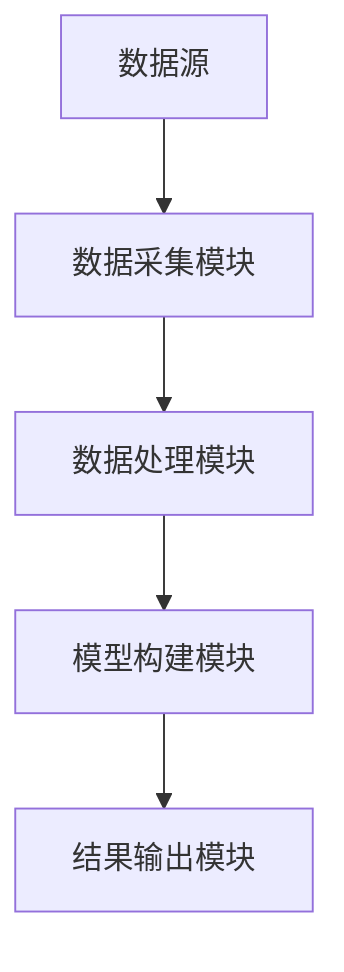
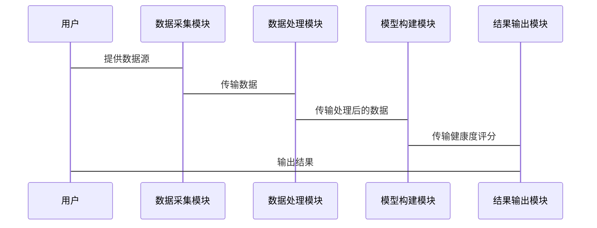

                 

# AI驱动的供应商健康度分析：评估上游风险

> 关键词：AI技术，供应链管理，供应商健康度，风险评估，机器学习，数据驱动决策

> 摘要：随着全球供应链的复杂化和市场竞争的加剧，评估上游供应商的健康度成为企业确保供应链稳定性和降低风险的关键任务。本文将探讨如何利用人工智能（AI）技术构建供应商健康度分析系统，通过数据驱动的方法评估上游风险，为企业提供科学的决策支持。

---

# 第一部分: 供应商健康度分析背景与概念

# 第1章: 供应商健康度分析概述

## 1.1 问题背景与挑战

### 1.1.1 供应链风险管理的重要性
供应链是企业运营的核心，供应商的健康状况直接关系到企业的生产和交付能力。近年来，全球供应链的复杂性增加，供应商面临的不确定性也在上升。例如，原材料价格上涨、政策变化、自然灾害等都可能影响供应商的健康度。因此，如何实时、准确地评估供应商的健康状况，成为企业风险管理的重要课题。

### 1.1.2 传统供应商评估的局限性
传统的供应商评估方法主要依赖于财务报表分析、历史交易数据和主观判断。这种方法存在以下问题：
1. **数据不足**：传统方法往往只依赖财务数据，忽略了供应商的运营能力和市场环境。
2. **滞后性**：财务数据通常只能反映过去的状况，难以预测未来的风险。
3. **主观性**：主观判断容易受到人为因素的影响，缺乏客观性和科学性。

### 1.1.3 AI技术在供应链管理中的应用潜力
AI技术通过机器学习、自然语言处理（NLP）和大数据分析，能够从海量数据中提取有用信息，帮助企业在复杂环境中做出更明智的决策。AI在供应链管理中的应用包括需求预测、库存优化、供应商风险评估等，其中供应商健康度分析是最重要的应用场景之一。

## 1.2 供应商健康度分析的核心概念

### 1.2.1 供应商健康度的定义与内涵
供应商健康度是指供应商在当前市场环境下的运营能力和抗风险能力。它不仅包括财务健康状况，还涉及供应链稳定性、交付能力、质量管理等多个维度。

### 1.2.2 健康度分析的关键维度
供应商健康度可以从以下几个维度进行评估：
1. **财务状况**：包括利润率、资产负债率、现金流等。
2. **交付能力**：包括交货准时率、订单完成率等。
3. **质量稳定性**：包括产品合格率、退货率等。
4. **市场风险**：包括行业波动、政策变化等。
5. **运营能力**：包括生产能力、供应链弹性等。

### 1.2.3 上游风险的多维度评估框架
为了全面评估上游风险，我们需要构建一个多维度的评估框架。这个框架应包括数据来源、评估指标、分析方法和决策支持等部分。

## 1.3 供应商健康度分析的框架与流程

### 1.3.1 数据收集与处理流程
供应商健康度分析的第一步是数据收集，数据来源包括：
- **供应商的历史交易数据**：订单量、交货时间、退货率等。
- **供应商的财务数据**：资产负债表、利润表、现金流量表等。
- **市场数据**：行业趋势、原材料价格波动、政策变化等。

### 1.3.2 数据分析与模型构建
在数据收集的基础上，我们需要对数据进行清洗、特征提取和建模。数据分析的核心是找到影响供应商健康度的关键因素，并构建预测模型。

### 1.3.3 结果输出与决策支持
模型输出供应商健康度评分，并根据评分制定相应的风险管理策略，例如优先选择健康度高的供应商，或对健康度低的供应商进行预警和干预。

## 1.4 数据来源与特征分析

### 1.4.1 供应商的历史交易数据
历史交易数据是供应商健康度分析的重要来源。通过对交易数据的分析，可以评估供应商的交货准时率、订单完成率等。

### 1.4.2 供应商的财务与运营数据
财务数据是评估供应商健康度的核心指标，包括利润率、资产负债率等。运营数据则包括生产能力、供应链弹性等。

### 1.4.3 市场环境与行业趋势数据
市场环境数据包括行业波动、原材料价格波动、政策变化等。这些数据可以帮助我们评估供应商所处的外部风险。

### 1.4.4 数据特征的提取与筛选
为了提高模型的准确性和效率，我们需要对数据进行特征提取和筛选。常用的方法包括主成分分析（PCA）和特征重要性评估。

## 1.5 本章小结

---

# 第二部分: 供应商健康度分析的核心理论与方法

# 第2章: 数据预处理与特征工程

## 2.1 数据清洗与标准化

### 2.1.1 数据清洗的必要性
数据清洗是数据预处理的第一步。由于数据来源多样，可能存在缺失值、异常值和重复值，这些数据会影响模型的准确性。

### 2.1.2 数据标准化与归一化方法
标准化和归一化是数据预处理的重要步骤。标准化是指将数据按比例缩放到相同的范围内，归一化则是指将数据按比例缩放到0-1范围内。

### 2.1.3 数据缺失值的处理策略
缺失值的处理策略包括删除缺失数据、填充缺失值（均值、中位数、随机填充）和使用机器学习模型预测缺失值。

## 2.2 数据特征的选择与提取

### 2.2.1 特征重要性评估方法
特征重要性评估方法包括基于树模型的特征重要性评分、基于线性回归的系数分析和基于Lasso回归的特征选择。

### 2.2.2 主成分分析（PCA）的应用
主成分分析是一种降维技术，可以通过减少特征数量来提高模型的效率和准确性。

### 2.2.3 自然语言处理（NLP）在文本数据中的应用
NLP技术可以用于处理供应商的文本数据，例如公司简介、新闻报道等，提取有用的信息。

## 2.3 数据特征的可视化分析

### 2.3.1 数据分布的可视化
通过直方图、箱线图等可视化工具，可以了解数据的分布情况。

### 2.3.2 特征相关性的热力图
热力图可以帮助我们了解不同特征之间的相关性。

### 2.3.3 数据特征的层次分析
层次分析是一种将复杂问题分解为多个层次的分析方法，可以帮助我们更好地理解数据特征之间的关系。

## 2.4 本章小结

---

# 第3章: 供应商健康度评估模型的核心理论

## 3.1 健康度评估的数学模型

### 3.1.1 线性回归模型
线性回归是一种简单但有效的回归模型，适用于线性关系的数据。

### 3.1.2 随机森林模型
随机森林是一种基于决策树的集成学习方法，具有高准确性和鲁棒性。

### 3.1.3 支持向量机（SVM）模型
支持向量机是一种常用的分类模型，适用于高维数据的分类和回归问题。

### 3.1.4 神经网络模型
神经网络是一种模仿人脑结构的深度学习模型，适用于复杂的非线性关系。

## 3.2 模型选择与评估指标

### 3.2.1 模型选择的依据
模型选择需要考虑数据特征、数据量、计算资源和业务需求。

### 3.2.2 常见评估指标
评估指标包括准确率、召回率、F1值、AUC值等。

### 3.2.3 模型调优与超参数优化
通过网格搜索、随机搜索等方法，可以找到最优的超参数组合，提高模型性能。

## 3.3 基于机器学习的健康度预测

### 3.3.1 模型训练与验证
模型训练需要使用训练数据，验证需要使用验证集。

### 3.3.2 模型的交叉验证与泛化能力
交叉验证是一种常用的模型评估方法，可以提高模型的泛化能力。

### 3.3.3 模型的解释性与可解释性
模型的解释性是供应链管理的重要需求，需要确保模型结果的可解释性和可验证性。

## 3.4 本章小结

---

# 第三部分: 系统架构与实现

# 第4章: 供应商健康度分析系统架构与实现

## 4.1 问题场景介绍
供应商健康度分析系统需要解决的问题包括数据收集、数据处理、模型构建和结果输出。

## 4.2 系统功能设计

### 4.2.1 数据采集模块
数据采集模块负责从不同数据源采集数据，包括数据库、API接口、文件等。

### 4.2.2 数据处理模块
数据处理模块包括数据清洗、特征提取和数据转换。

### 4.2.3 模型构建模块
模型构建模块包括模型选择、训练和优化。

### 4.2.4 结果输出模块
结果输出模块包括健康度评分、风险预警和决策建议。

## 4.3 系统架构设计

### 4.3.1 系统架构图

### 4.3.2 系统接口设计
系统接口包括数据接口和API接口。

### 4.3.3 系统交互设计

## 4.4 本章小结

---

# 第四部分: 项目实战

# 第5章: 供应商健康度分析项目实战

## 5.1 环境搭建与数据准备

### 5.1.1 环境搭建
安装必要的Python库，包括numpy、pandas、scikit-learn、xgboost等。

### 5.1.2 数据准备
从公开数据集或模拟数据中获取供应商数据，包括财务数据、交易数据和市场数据。

## 5.2 数据清洗与特征工程

### 5.2.1 数据清洗
处理缺失值、异常值和重复值。

### 5.2.2 特征提取
通过PCA和特征重要性评估，提取关键特征。

## 5.3 模型构建与训练

### 5.3.1 模型选择
选择合适的模型，例如随机森林、XGBoost等。

### 5.3.2 模型训练
使用训练数据进行模型训练，并验证模型性能。

### 5.3.3 模型优化
通过超参数调优，提高模型性能。

## 5.4 模型评估与部署

### 5.4.1 模型评估
使用验证集评估模型性能，包括准确率、召回率、F1值等。

### 5.4.2 模型部署
将模型部署到生产环境中，提供API接口，实时评估供应商健康度。

## 5.5 项目小结

---

# 第五部分: 总结与展望

# 第6章: 总结与展望

## 6.1 总结
本文详细介绍了AI驱动的供应商健康度分析系统的构建过程，包括数据预处理、特征工程、模型选择和系统架构设计。

## 6.2 最佳实践
- 数据质量是模型性能的基础，需确保数据的准确性和完整性。
- 模型选择需结合业务需求和数据特征，选择合适的算法。
- 模型部署需考虑系统的可扩展性和可维护性。

## 6.3 注意事项
- 数据隐私和安全需严格保护。
- 模型结果需结合业务知识进行解释和验证。
- 模型需定期更新，以适应市场环境的变化。

## 6.4 未来展望
随着AI技术的不断发展，供应商健康度分析将更加智能化和自动化。未来的研究方向包括：
1. 多模态数据的融合与分析。
2. 自动化的模型优化与部署。
3. 智能化的风险预警与决策支持。

---

# 作者：AI天才研究院 & 禅与计算机程序设计艺术

