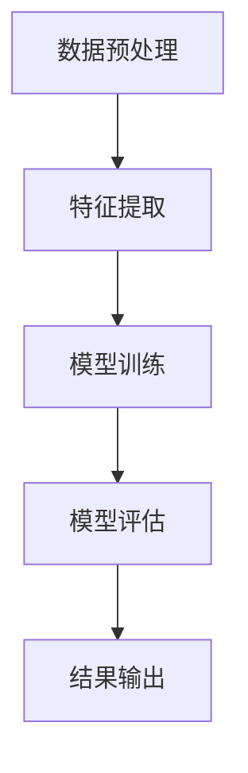
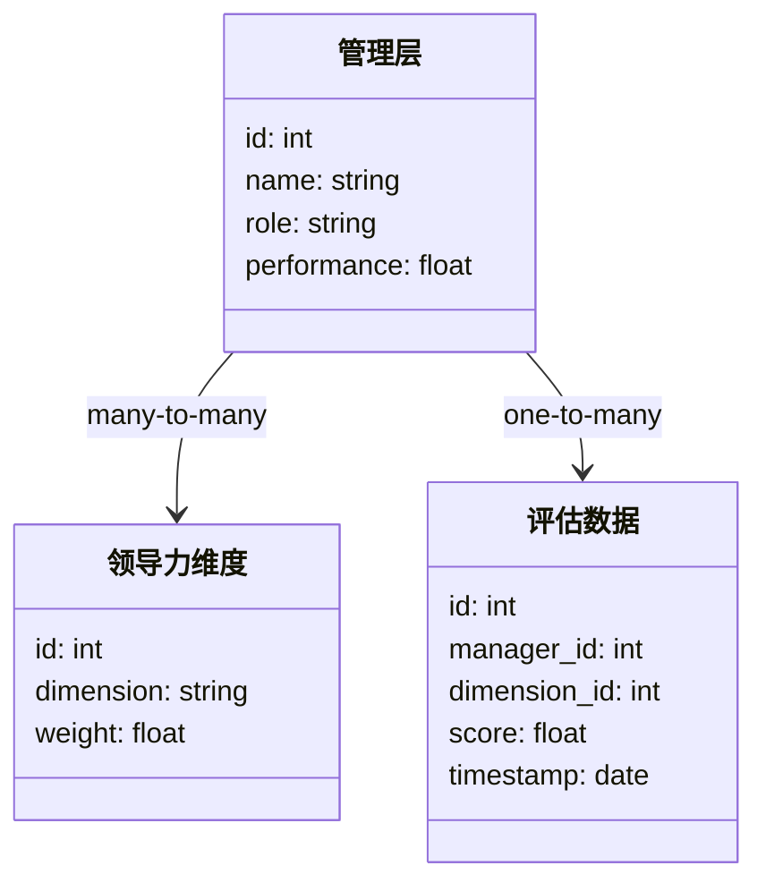
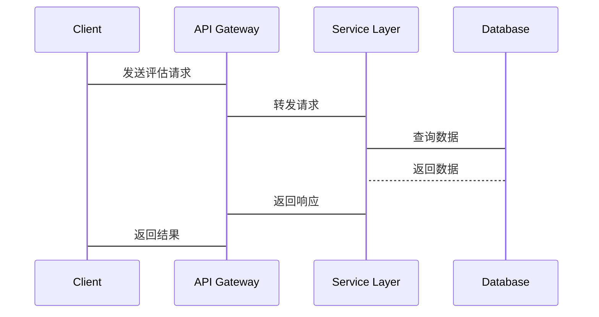

                 


# AI驱动的管理层能力评估：量化领导力对公司价值的影响

## 关键词：AI，管理层能力评估，领导力，量化，公司价值

## 摘要：  
随着企业数字化转型的加速，领导力评估逐渐从传统的主观评价转向数据驱动的量化分析。本文通过AI技术，探讨如何建立科学的管理层能力评估模型，量化领导力对公司价值的影响，为企业决策提供支持。文章结合实际案例，详细分析AI在领导力评估中的应用，为管理层能力提升和企业绩效优化提供新思路。

---

# 第1章: 背景介绍

## 1.1 问题背景

### 1.1.1 管理层能力评估的传统挑战  
传统的领导力评估方法依赖于主观判断，如面试、问卷调查等，存在以下问题：  
1. **主观性**：评估结果受评估者主观因素影响，可能导致结果偏差。  
2. **低效性**：人工评估耗时耗力，难以快速获取数据。  
3. **缺乏量化**：难以将领导力与公司绩效直接关联，无法量化领导力对价值的具体贡献。  

### 1.1.2 数字化转型与AI技术的结合  
随着企业数字化转型的推进，数据成为企业核心资产。AI技术的应用使得领导力评估可以从数据中提取客观、量化的信息，为企业决策提供支持。  

### 1.1.3 企业领导力对公司价值的影响  
领导力是企业绩效的核心驱动因素之一。研究表明，优秀领导力可以显著提升团队效率、员工满意度和企业利润。然而，如何量化这种影响，一直是管理学领域的难题。  

## 1.2 问题描述

### 1.2.1 管理层能力评估的复杂性  
领导力涉及多个维度，如决策能力、沟通能力、团队建设能力等。如何在多维度中找到关键指标，并量化其对绩效的影响，是一个复杂的系统性问题。  

### 1.2.2 领导力对公司绩效的具体影响  
领导力不仅影响团队效率，还可能通过员工创造力、客户满意度等多个方面间接影响公司价值。然而，这些影响难以直接量化。  

### 1.2.3 传统评估方法的局限性  
传统评估方法难以捕捉领导力的动态变化，且缺乏数据支持，导致评估结果缺乏说服力。  

## 1.3 问题解决

### 1.3.1 AI技术在领导力评估中的应用  
AI可以通过分析大量数据，提取领导力的关键特征，并建立预测模型，量化领导力对绩效的影响。  

### 1.3.2 数据驱动的决策方法  
通过收集和分析员工绩效、客户反馈等数据，结合AI技术，建立数据驱动的领导力评估模型，为企业决策提供支持。  

### 1.3.3 量化领导力对公司价值的影响  
通过AI模型，将领导力与公司绩效进行关联分析，量化领导力对价值的具体贡献。  

## 1.4 边界与外延

### 1.4.1 领导力评估的适用范围  
AI驱动的领导力评估适用于中高层管理者，尤其是需要量化领导力对业务绩效影响的场景。  

### 1.4.2 量化模型的局限性  
量化模型难以完全捕捉领导力的复杂性，且模型的准确性依赖于数据质量和数量。  

### 1.4.3 AI技术的可解释性问题  
AI模型的“黑箱”特性可能导致结果难以解释，这在领导力评估中可能引发信任问题。  

## 1.5 概念结构与核心要素

### 1.5.1 领导力的核心维度  
1. 战略思维能力  
2. 沟通与决策能力  
3. 团队建设能力  
4. 绩效驱动能力  

### 1.5.2 数据驱动的评估框架  
1. 数据来源：员工绩效、客户反馈、业务指标等。  
2. 数据处理：清洗、特征提取、标准化。  
3. 模型构建：监督学习、无监督学习、深度学习。  

### 1.5.3 AI模型的关键输入与输出  
- **输入**：领导力维度数据、业务绩效数据。  
- **输出**：领导力得分、对绩效的影响权重。  

## 1.6 本章小结  
本章介绍了AI驱动的领导力评估的背景、问题和解决方案，明确了领导力评估的核心维度和数据驱动的评估框架，为后续分析奠定了基础。  

---

# 第2章: 核心概念与联系

## 2.1 领导力评估模型

### 2.1.1 基于AI的领导力评估模型  
AI模型通过分析多维度数据，预测领导力对绩效的影响。  

### 2.1.2 数据驱动的领导力评估框架  
1. 数据采集：员工绩效、客户反馈、业务指标。  
2. 数据分析：特征提取、关联分析。  
3. 模型训练：监督学习、无监督学习。  

### 2.1.3 模型的核心要素与关系  
- **输入**：领导力维度数据、业务绩效数据。  
- **输出**：领导力得分、对绩效的影响权重。  

## 2.2 核心概念对比

### 2.2.1 传统领导力评估与AI驱动评估的对比  
| 对比维度       | 传统评估               | AI驱动评估               |  
|----------------|-----------------------|--------------------------|  
| 评估依据       | 主观判断               | 数据驱动                 |  
| 评估效率       | 低                   | 高                      |  
| 评估结果       | 非量化               | 量化                   |  

### 2.2.2 不同领导力维度的权重分析  
- **战略思维能力**：权重较高，影响企业长期发展。  
- **沟通与决策能力**：权重中等，影响团队协作和决策效率。  
- **团队建设能力**：权重较低，但对员工满意度有直接影响。  

### 2.2.3 AI模型的可扩展性与适应性  
AI模型可以根据企业需求灵活调整，适用于不同行业和规模的企业。  

## 2.3 ER实体关系图

### 2.3.1 实体关系图
```mermaid
er
    entity(管理层) {
        id: int
        name: string
        role: string
        performance: float
    }
    entity(领导力维度) {
        id: int
        dimension: string
        weight: float
    }
    entity(评估数据) {
        id: int
        manager_id: int
        dimension_id: int
        score: float
        timestamp: date
    }
    relationship(管理层-领导力维度) many-to-many
    relationship(管理层-评估数据) one-to-many
```

## 2.4 本章小结  
本章详细分析了AI驱动的领导力评估模型，并通过对比和ER图展示了核心概念之间的关系，为后续算法设计奠定了基础。  

---

# 第3章: AI驱动的领导力评估算法原理

## 3.1 算法原理概述

### 3.1.1 机器学习模型在领导力评估中的应用  
- **监督学习**：基于历史数据，预测领导力得分。  
- **无监督学习**：发现领导力维度之间的关联。  
- **深度学习**：提取复杂特征，提升模型准确性。  

### 3.1.2 监督学习与无监督学习的对比  
| 对比维度       | 监督学习               | 无监督学习               |  
|----------------|-----------------------|--------------------------|  
| 数据需求       | 标签数据               | 无标签数据               |  
| 适用场景       | 预测任务               | 聚类、降维任务           |  

### 3.1.3 深度学习模型的优势  
- **特征提取能力强**：能够自动学习数据中的复杂特征。  
- **模型灵活性高**：适用于多种数据类型，如文本、数值等。  

## 3.2 算法流程

### 3.2.1 算法流程图


## 3.3 数学模型与公式

### 3.3.1 线性回归模型
$$ y = \beta_0 + \beta_1x + \epsilon $$  
其中，$y$为领导力得分，$x$为领导力维度，$\beta_0$为截距，$\beta_1$为回归系数，$\epsilon$为误差项。  

### 3.3.2 神经网络模型
神经网络结构如下：
$$
\text{输入层} \rightarrow \text{隐藏层} \rightarrow \text{输出层}
$$  
隐藏层通过激活函数处理输入数据，输出层给出最终预测结果。  

## 3.4 本章小结  
本章介绍了AI驱动的领导力评估算法原理，包括监督学习和无监督学习的应用，以及深度学习模型的优势。通过流程图和数学公式，详细讲解了算法的实现过程。  

---

# 第4章: 系统分析与架构设计方案

## 4.1 问题场景介绍  
本系统旨在通过AI技术，量化领导力对公司价值的影响，为企业提供科学的评估和决策支持。  

## 4.2 系统功能设计

### 4.2.1 领域模型


### 4.2.2 系统架构设计


### 4.2.3 系统接口设计


## 4.3 本章小结  
本章通过系统分析和架构设计，明确了系统的功能模块和接口设计，为后续的系统实现提供了指导。  

---

# 第5章: 项目实战

## 5.1 环境安装  
1. 安装Python：`python --version`  
2. 安装依赖库：`pip install numpy pandas scikit-learn`  

## 5.2 核心代码实现

### 5.2.1 数据预处理
```python
import pandas as pd
from sklearn.preprocessing import StandardScaler

data = pd.read_csv('leadership.csv')
X = data[['strategic_thinking', 'communication', 'team_building']]
y = data['performance']
```

### 5.2.2 模型训练
```python
from sklearn.model import LinearRegression

model = LinearRegression()
model.fit(X, y)
```

### 5.2.3 模型评估
```python
from sklearn.metrics import r2_score

y_pred = model.predict(X)
print(r2_score(y, y_pred))
```

## 5.3 代码应用解读与分析  
1. **数据预处理**：标准化特征数据，确保模型训练效果。  
2. **模型训练**：使用线性回归模型，预测领导力得分。  
3. **模型评估**：计算R²值，评估模型拟合效果。  

## 5.4 实际案例分析  
以某公司高管为例，使用模型预测其领导力得分，并分析其对绩效的影响。  

## 5.5 本章小结  
本章通过实际案例，详细讲解了AI驱动的领导力评估系统的实现过程，帮助读者理解如何将理论应用于实践。  

---

# 第6章: 总结与展望

## 6.1 本章总结  
本文通过AI技术，探讨了领导力评估的量化方法，提出了数据驱动的评估框架，并通过实际案例验证了模型的有效性。  

## 6.2 未来展望  
1. **模型优化**：引入更复杂的深度学习模型，提升预测精度。  
2. **可解释性增强**：解决AI模型的“黑箱”问题，增强结果的可解释性。  
3. **多维度应用**：将AI技术应用于更多管理领域，如团队协作、员工发展等。  

## 6.3 注意事项  
在实际应用中，需注意数据质量和模型的可解释性，避免因模型误用导致决策失误。  

## 6.4 拓展阅读  
推荐阅读《数据驱动的管理决策》和《人工智能在企业中的应用》等书籍，深入理解AI在管理领域的应用。  

---

# 作者：AI天才研究院/AI Genius Institute & 禅与计算机程序设计艺术 /Zen And The Art of Computer Programming

