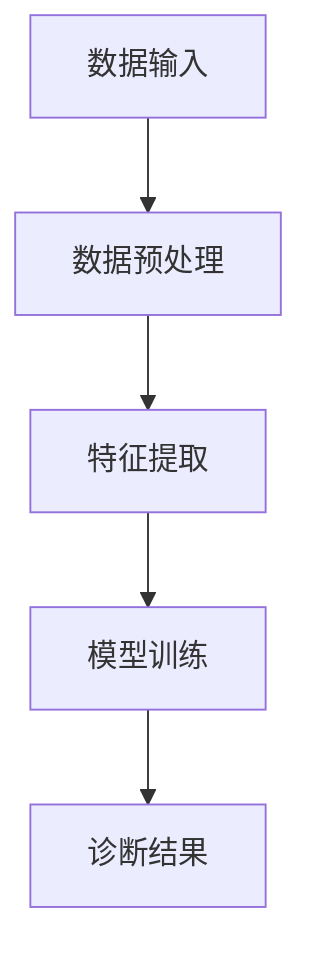
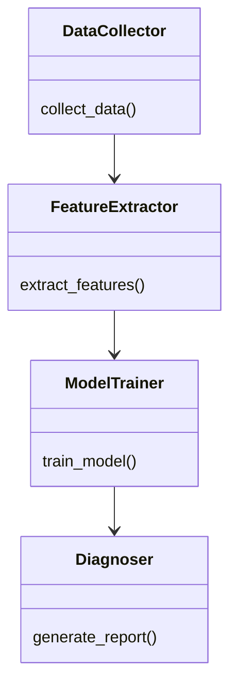
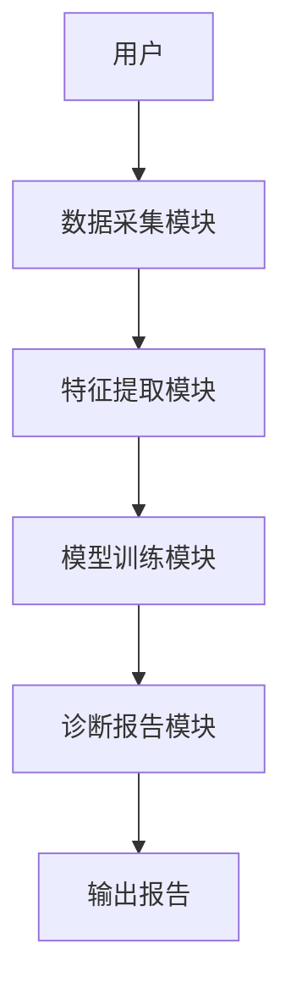
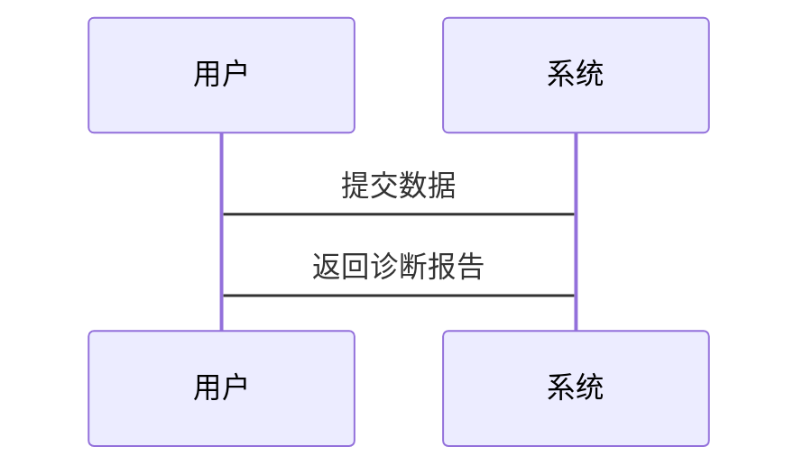

                 


```markdown
# 第三章: 算法原理与实现

## 3.1 数据预处理与特征工程

### 3.1.1 数据清洗与标准化
数据清洗是投资组合诊断的第一步，主要包括去除缺失值、处理异常值和标准化数据。例如，使用Z-score方法标准化数据，确保不同特征在相同尺度上。

### 3.1.2 特征选择与降维
特征选择可以通过相关性分析或递归特征消除法进行。降维常用主成分分析（PCA）实现，减少特征数量，提高模型性能。

### 3.1.3 时间序列数据的处理
时间序列数据需要考虑滞后特征和移动平均等方法。例如，使用滑动窗口技术处理每日价格数据。

## 3.2 算法原理与流程图

### 3.2.1 算法原理
投资组合诊断中常用回归分析预测资产回报，聚类分析识别资产类别，时间序列分析检测趋势和周期性。

### 3.2.2 算法流程图


## 3.3 算法实现与数学模型

### 3.3.1 线性回归
线性回归模型用于预测资产回报，数学表达式：
$$ y = \beta_0 + \beta_1x + \epsilon $$
其中，$\beta_0$和$\beta_1$是回归系数，$\epsilon$是误差项。

### 3.3.2 聚类分析
聚类分析用于分类资产，K-means算法是常用方法，目标是最小化聚类内距离平方和：
$$ \text{目标函数} = \sum_{i=1}^{k} \sum_{j=1}^{n_i} (x_{ij} - c_i)^2 $$
其中，$k$是聚类数，$n_i$是第$i$个聚类的样本数，$c_i$是聚类中心。

## 3.4 项目实战: 算法实现

### 3.4.1 环境安装
安装所需的Python库，如pandas、numpy、scikit-learn和matplotlib。

### 3.4.2 代码实现
```python
import pandas as pd
import numpy as np
from sklearn.linear_model import LinearRegression
from sklearn.cluster import KMeans

# 数据加载与预处理
data = pd.read_csv('portfolio.csv')
data = data.dropna()  # 删除缺失值
data = (data - data.mean()) / data.std()  # 标准化

# 特征提取与模型训练
X = data[['return', 'volatility']]
model = LinearRegression()
model.fit(X, data['target'])

# 聚类分析
clusters = KMeans(n_clusters=3, random_state=42).fit(X)
```

## 3.5 本章小结

# 第四章: 系统分析与架构设计

## 4.1 问题场景介绍
投资组合诊断系统需要处理大量金融数据，涉及数据采集、特征提取、模型训练和诊断报告生成。

## 4.2 系统功能设计

### 4.2.1 领域模型类图


## 4.3 系统架构设计

### 4.3.1 系统架构图


## 4.4 系统接口设计

### 4.4.1 接口交互序列图


## 4.5 本章小结

# 第五章: 项目实战

## 5.1 环境安装
安装必要的Python库：pandas、numpy、scikit-learn、matplotlib。

## 5.2 核心实现代码

### 5.2.1 数据采集与预处理
```python
import pandas as pd
import numpy as np
import matplotlib.pyplot as plt

# 数据加载
data = pd.read_csv('portfolio.csv')

# 数据清洗
data.dropna()  # 删除缺失值
data = (data - data.mean()) / data.std()  # 标准化
```

### 5.2.2 特征提取与模型训练
```python
from sklearn.linear_model import LinearRegression
from sklearn.metrics import mean_squared_error

# 特征提取
X = data[['return', 'volatility']]
y = data['target']

# 模型训练
model = LinearRegression()
model.fit(X, y)

# 模型评估
predictions = model.predict(X)
print(mean_squared_error(y, predictions))
```

### 5.2.3 聚类分析
```python
from sklearn.cluster import KMeans

# 聚类分析
clusters = KMeans(n_clusters=3, random_state=42).fit(X)

# 可视化
plt.scatter(X['return'], X['volatility'], c=clusters.labels_)
plt.xlabel('Return')
plt.ylabel('Volatility')
plt.show()
```

## 5.3 案例分析
使用真实数据进行分析，展示模型预测结果和聚类效果。

## 5.4 本章小结

# 第六章: 最佳实践与扩展

## 6.1 最佳实践

### 6.1.1 数据质量的重要性
确保数据的完整性和准确性，避免偏差。

### 6.1.2 模型选择的影响
选择合适的模型，避免过拟合和欠拟合。

## 6.2 小结与注意事项

### 6.2.1 小结
总结AI驱动投资组合诊断的关键点。

### 6.2.2 注意事项
避免忽略市场外部因素，保持模型更新。

## 6.3 拓展阅读

### 6.3.1 推荐书籍
- 《机器学习实战》
- 《量化投资入门》

### 6.3.2 在线资源
推荐相关课程和工具，如Coursera的机器学习课程。

## 6.4 本章小结

# 作者

作者：AI天才研究院/AI Genius Institute & 禅与计算机程序设计艺术 /Zen And The Art of Computer Programming
```

