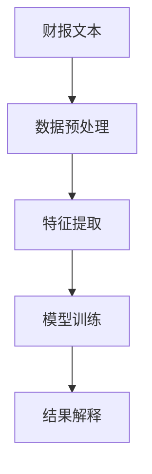
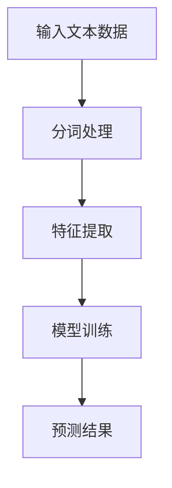
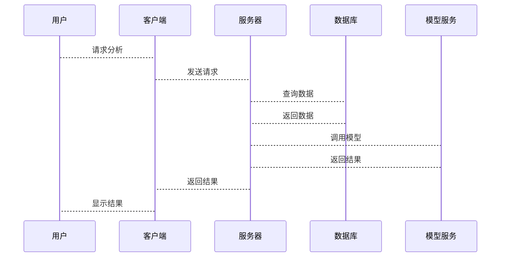

                 


# AI驱动的自动化财报分析系统

> 关键词：AI驱动，自动化财报分析，自然语言处理，机器学习，时间序列分析

> 摘要：本文详细探讨了AI驱动的自动化财报分析系统的构建与应用。从背景介绍到核心算法，从系统架构设计到项目实战，系统地分析了如何利用AI技术实现对财务报告的自动化分析与预测，为企业提供高效、准确的财务决策支持。

---

# 第1章: AI驱动的自动化财报分析系统背景

## 1.1 问题背景与目标

### 1.1.1 财务报告分析的现状与挑战

传统的企业财务报告分析主要依赖人工处理，存在以下问题：

- **数据量大**：企业每天产生的财务数据和报告数量庞大，人工分析效率低。
- **复杂性高**：财务报告涉及大量专业术语和复杂的数据关系，人工分析容易出错。
- **时效性差**：传统分析方式耗时长，难以满足实时决策需求。
- **主观性强**：分析结果依赖分析师的经验和主观判断，缺乏客观性。

### 1.1.2 AI技术在财务分析中的应用前景

AI技术的快速发展为财务报告分析带来了新的可能性：

- **自动化处理**：利用自然语言处理（NLP）技术自动解析财务文本。
- **精准预测**：通过机器学习算法对财务数据进行建模，实现精准的财务预测。
- **实时分析**：AI系统可以实时处理数据，提供及时的财务分析结果。

### 1.1.3 自动化财报分析系统的定义与目标

**定义**：AI驱动的自动化财报分析系统是一种利用AI技术，对企业的财务报告进行自动化解析、分析和预测的系统。

**目标**：
1. 提高财务报告分析的效率和准确性。
2. 实现财务数据的实时监控与预警。
3. 为企业决策提供数据支持和建议。

---

## 1.2 技术背景与基础

### 1.2.1 自然语言处理技术在文本分析中的应用

自然语言处理（NLP）技术是AI驱动的财报分析系统的核心技术之一。其主要应用包括：

- **分词处理**：将财务报告中的文本分割成词语或短语。
- **语义理解**：通过上下文理解财务文本的含义。
- **文本分类**：将财务报告分为不同的类别（如收入、支出等）。

### 1.2.2 机器学习在财务预测中的作用

机器学习技术在财务预测中的作用主要体现在：

- **监督学习**：利用历史财务数据训练分类或回归模型，预测未来的财务状况。
- **无监督学习**：通过聚类分析，发现财务数据中的潜在模式。
- **深度学习**：利用神经网络模型（如LSTM）进行时间序列预测。

### 1.2.3 大数据分析在财报处理中的价值

大数据分析技术在处理财务报告中的价值体现在：

- **数据清洗**：处理缺失值、异常值等数据问题。
- **数据整合**：将来自不同来源的财务数据进行整合。
- **数据可视化**：通过图表展示财务数据，帮助用户更好地理解数据。

---

## 1.3 应用背景与场景

### 1.3.1 企业财报分析的典型场景

- **财务报表分析**：对企业利润表、资产负债表等进行自动化分析。
- **财务预测**：基于历史财务数据预测未来的财务状况。
- **风险预警**：通过分析财务数据发现潜在风险。

### 1.3.2 AI驱动自动化分析的优势

- **高效性**：AI系统可以在短时间内处理大量数据。
- **准确性**：通过算法优化，提高分析结果的准确性。
- **可扩展性**：系统可以扩展到更多企业或更多类型的财务数据。

### 1.3.3 系统的边界与外延

- **边界**：系统仅处理结构化的财务数据和文本数据，不涉及非财务数据。
- **外延**：系统可以与其他企业系统（如ERP）集成，提供更全面的财务分析。

---

## 1.4 核心概念与联系

### 1.4.1 核心概念原理

AI驱动的自动化财报分析系统的核心概念包括：

- **数据预处理**：对财务数据进行清洗、转换和标准化。
- **特征提取**：从财务数据中提取有用的特征，用于模型训练。
- **模型训练**：利用机器学习算法训练模型，实现对财务数据的分类或预测。
- **结果解释**：将模型输出的结果转化为易于理解的解释。

### 1.4.2 核心概念属性特征对比

下表对比了核心概念的主要属性特征：

| 概念       | 特征                         |
|------------|------------------------------|
| 数据预处理 | 文本清洗、数据标准化         |
| 特征提取   | 词袋模型、TF-IDF             |
| 模型训练   | 监督学习、无监督学习         |
| 结果解释   | 可视化分析、规则匹配         |

### 1.4.3 实体关系图



---

## 1.5 本章小结

本章从背景介绍、技术基础、应用场景等多个方面，详细探讨了AI驱动的自动化财报分析系统的背景与核心概念。通过对比和图示，帮助读者更好地理解系统的构成与工作原理。

---

# 第2章: AI驱动的自动化财报分析系统核心算法

## 2.1 自然语言处理算法

### 2.1.1 分词算法

- **分词算法**：将财务报告中的文本分割成词语或短语。
- **常用工具**：jieba、spaCy。

### 2.1.2 语义理解算法

- **语义理解算法**：通过上下文理解财务文本的含义。
- **常用模型**：BERT、GPT。

### 2.1.3 文本分类算法

- **文本分类算法**：将财务报告分为不同的类别。
- **常用算法**：SVM、随机森林、神经网络。

---

## 2.2 机器学习算法

### 2.2.1 监督学习算法

- **监督学习算法**：利用有标签的数据训练模型。
- **常用算法**：线性回归、逻辑回归、SVM。

### 2.2.2 无监督学习算法

- **无监督学习算法**：利用无标签的数据发现数据中的潜在模式。
- **常用算法**：聚类分析、关联规则挖掘。

### 2.2.3 深度学习算法

- **深度学习算法**：利用神经网络模型进行复杂的特征提取。
- **常用模型**：CNN、RNN、LSTM。

---

## 2.3 时间序列分析算法

### 2.3.1 LSTM网络

- **LSTM网络**：一种特殊的RNN，适合处理时间序列数据。
- **数学模型**：
  $$
  f_t = \sigma(W_f \cdot [h_{t-1}, x_t] + b_f)
  $$
  其中，$f_t$ 是遗忘门，$h_{t-1}$ 是前一时刻的隐藏状态，$x_t$ 是当前输入。

### 2.3.2 ARIMA模型

- **ARIMA模型**：一种经典的统计模型，用于时间序列预测。
- **数学模型**：
  $$
  y_t = \phi_1 y_{t-1} + \phi_2 y_{t-2} + \epsilon_t
  $$

### 2.3.3 Prophet模型

- **Prophet模型**：由Facebook开源的时间序列预测模型。
- **数学模型**：
  $$
  y(t) = a + b t + c \cdot \sin(d t + e)
  $$

---

## 2.4 算法流程图



---

## 2.5 本章小结

本章详细介绍了AI驱动的自动化财报分析系统中常用的自然语言处理算法、机器学习算法和时间序列分析算法，并通过流程图展示了算法的整体流程。通过这些算法的结合，系统可以实现对财务报告的自动化分析与预测。

---

# 第3章: AI驱动的自动化财报分析系统系统分析与架构设计

## 3.1 系统需求分析

### 3.1.1 业务需求

- **需求1**：实现对财务报告的自动化解析。
- **需求2**：提供财务数据的实时监控功能。
- **需求3**：生成财务分析报告。

### 3.1.2 功能需求

- **功能1**：文本解析功能。
- **功能2**：数据可视化功能。
- **功能3**：财务预测功能。

---

## 3.2 系统功能设计

### 3.2.1 领域模型


### 3.2.2 系统架构设计


### 3.2.3 接口设计

- **API1**：文本解析接口。
- **API2**：数据查询接口。
- **API3**：结果展示接口。

### 3.2.4 交互设计



---

## 3.3 本章小结

本章从系统需求分析出发，详细设计了系统的功能模块、架构、接口和交互流程。通过领域模型和架构图，帮助读者更好地理解系统的整体结构和各部分的协作方式。

---

# 第4章: AI驱动的自动化财报分析系统项目实战

## 4.1 环境搭建

### 4.1.1 开发环境

- **Python**：3.8+
- **框架**：Flask、Django
- **库**：jieba、spaCy、scikit-learn、Keras

### 4.1.2 数据来源

- **数据集1**：公开企业财报数据。
- **数据集2**：模拟财务数据。

---

## 4.2 系统核心实现

### 4.2.1 数据预处理

```python
import jieba

text = "公司2022年实现营业收入100亿元，同比增长20%。"
words = jieba.lcut(text)
print(words)
```

### 4.2.2 模型训练

```python
from sklearn.feature_extraction.text import TfidfVectorizer
from sklearn.svm import SVC

vectorizer = TfidfVectorizer()
X = vectorizer.fit_transform(documents)
model = SVC()
model.fit(X, labels)
```

### 4.2.3 结果解释

```python
from prophet import Prophet

model = Prophet()
model.fit(df)
future = model.make_future(...)
forecast = model.predict(future)
```

---

## 4.3 项目小结

本章通过具体的项目实战，详细讲解了AI驱动的自动化财报分析系统的实现过程。从环境搭建到模型训练，再到结果解释，帮助读者更好地理解系统的实际应用。

---

# 第5章: AI驱动的自动化财报分析系统最佳实践

## 5.1 小结

- **总结**：AI驱动的自动化财报分析系统通过结合NLP、机器学习和时间序列分析技术，实现了对财务报告的自动化分析与预测。
- **优势**：高效性、准确性、可扩展性。

---

## 5.2 注意事项

- **数据质量**：确保输入数据的准确性和完整性。
- **模型调优**：根据实际需求不断优化模型参数。
- **系统维护**：定期更新模型和数据，确保系统的稳定运行。

---

## 5.3 拓展阅读

- **推荐书籍**：《机器学习实战》、《深度学习入门》。
- **推荐博客**：Towards Data Science、Medium的AI专栏。

---

# 作者

作者：AI天才研究院/AI Genius Institute & 禅与计算机程序设计艺术 /Zen And The Art of Computer Programming

---

感谢您的阅读！如果对本文有任何疑问或建议，请随时与我们联系。

