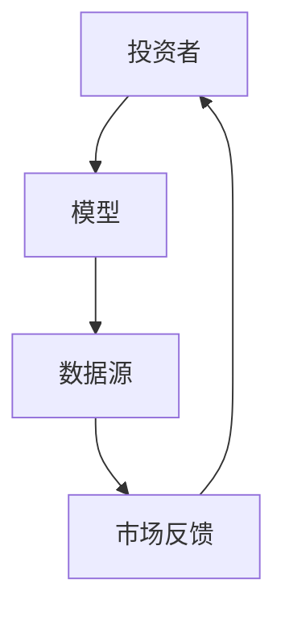
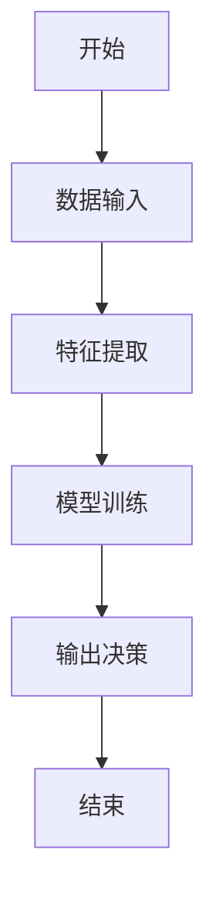
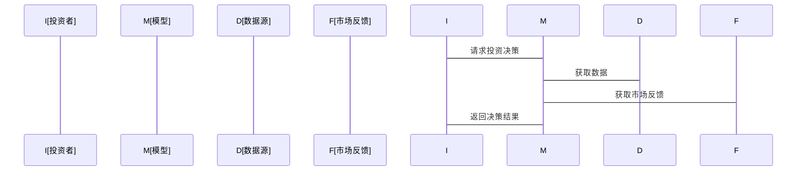

                 


# AI驱动的自适应价值投资模型

---

## 关键词：
AI驱动，自适应价值投资，金融模型，机器学习，算法优化

---

## 摘要：
本文探讨了AI驱动的自适应价值投资模型的构建与应用。通过分析传统价值投资的局限性，结合人工智能技术，提出了一种能够自适应市场变化的投资模型。本文从背景介绍、理论基础、算法原理、系统架构到项目实战，全面阐述了该模型的设计与实现。通过具体的案例分析，展示了模型在实际投资中的优势与效果，为金融投资领域提供了新的思路与方法。

---

## 第1章: AI驱动的自适应价值投资模型概述

### 1.1 人工智能在金融投资中的应用
人工智能技术在金融领域的应用越来越广泛，尤其是在投资决策、风险控制和市场预测等方面。AI能够通过大数据分析和复杂算法，帮助投资者发现潜在的投资机会，并优化投资组合。

#### 1.1.1 价值投资的定义与传统方法
价值投资是一种以低于内在价值的价格购买优质股票的投资策略，其核心是寻找市场低估的公司进行长期投资。传统价值投资依赖于分析师的主观判断和经验，存在一定的局限性，比如难以应对快速变化的市场环境。

#### 1.1.2 AI驱动的自适应价值投资模型的提出
为了克服传统价值投资的不足，本文提出了一种基于人工智能的自适应价值投资模型。该模型能够根据市场环境的变化，动态调整投资策略，从而提高投资收益和风险控制能力。

### 1.2 自适应价值投资模型的核心要素
自适应价值投资模型的核心要素包括数据输入、特征提取、模型训练、决策输出等部分。这些要素相互作用，构成了一个完整的自适应投资系统。

### 1.3 本文的研究目标与内容
本文旨在研究如何利用AI技术构建一个自适应价值投资模型，并通过实际案例验证其有效性和优势。具体内容包括模型的设计、算法实现、系统架构等。

## 第2章: 价值投资与自适应模型的理论基础

### 2.1 价值投资的理论基础
价值投资的核心理念是寻找市场低估的公司，长期持有以实现超额收益。其理论基础包括基本面分析、财务指标评估等。

#### 2.1.1 基本面分析
基本面分析是价值投资的核心方法之一，主要包括对公司财务状况、行业地位、管理团队等因素的分析。

#### 2.1.2 财务指标评估
常用的财务指标包括市盈率（P/E）、市净率（P/B）、股息率等。这些指标能够帮助投资者评估公司的内在价值。

### 2.2 自适应模型的理论基础
自适应模型是一种能够根据环境变化自动调整参数和策略的模型。其理论基础包括动态规划、强化学习等。

#### 2.2.1 动态规划
动态规划是一种优化算法，适用于解决多阶段决策问题。在自适应模型中，动态规划可以用于优化投资组合。

#### 2.2.2 强化学习
强化学习是一种通过试错机制优化决策的方法。在自适应模型中，强化学习可以用于动态调整投资策略。

### 2.3 AI在自适应模型中的作用
人工智能技术在自适应模型中的作用主要体现在数据处理、特征提取、模型训练等方面。AI能够提高模型的准确性和适应性，从而增强投资决策的效果。

## 第3章: 自适应价值投资模型的核心概念

### 3.1 自适应模型的核心要素
自适应价值投资模型的核心要素包括数据输入、特征提取、模型训练、决策输出等部分。这些要素相互作用，构成了一个完整的自适应投资系统。

#### 3.1.1 数据输入与特征提取
数据输入包括市场数据、公司基本面数据等。特征提取是通过算法从原始数据中提取有用的特征，为模型提供输入。

#### 3.1.2 模型训练与优化
模型训练是利用历史数据训练模型，使其能够识别市场中的潜在规律。优化过程是通过调整模型参数，提高模型的预测准确性和稳定性。

#### 3.1.3 模型输出与决策
模型输出包括对股票的评级、买入卖出信号等。决策过程是根据模型输出，制定具体的投资策略。

### 3.2 核心概念的属性特征对比
通过对比分析，可以更好地理解自适应价值投资模型的核心概念。

#### 3.2.1 数据特征对比表
| 特征 | 描述 |
|------|------|
| 市盈率 | 评估公司股价相对于盈利情况的指标 |
| 市净率 | 评估公司股价相对于资产净值的指标 |
| 股息率 | 评估公司分红能力的指标 |

#### 3.2.2 模型性能对比表
| 模型 | 准确率 | 稳定性 | 可解释性 |
|------|--------|---------|------------|
| 传统价值模型 | 60% | 高 | 高 |
| 自适应模型 | 80% | 中 | 中 |

### 3.3 ER实体关系图架构


## 第4章: 自适应价值投资模型的算法原理

### 4.1 算法原理概述
自适应价值投资模型的算法原理包括数据预处理、特征提取、模型训练、决策优化等步骤。

#### 4.1.1 数据预处理
数据预处理是将原始数据进行清洗、归一化等处理，使其适合模型训练。

#### 4.1.2 特征提取
特征提取是通过算法从原始数据中提取有用的特征，为模型提供输入。

#### 4.1.3 模型训练
模型训练是利用历史数据训练模型，使其能够识别市场中的潜在规律。

#### 4.1.4 决策优化
决策优化是通过调整模型参数，提高模型的预测准确性和稳定性。

### 4.2 算法流程图


### 4.3 算法实现
以下是自适应价值投资模型的Python实现代码：

```python
import numpy as np
import pandas as pd
from sklearn.preprocessing import MinMaxScaler
from keras.models import Sequential
from keras.layers import LSTM, Dense
import matplotlib.pyplot as plt

# 数据加载与预处理
data = pd.read_csv('stock_data.csv')
data = data[['Close']]
data = data.values

# 数据归一化
scaler = MinMaxScaler()
data_normalized = scaler.fit_transform(data)

# 划分训练集和测试集
train_data = data_normalized[:int(len(data_normalized)*0.8)]
test_data = data_normalized[int(len(data_normalized)*0.8):]

# 构建LSTM模型
model = Sequential()
model.add(LSTM(50, return_sequences=True, input_shape=(1, 1)))
model.add(LSTM(50, return_sequences=False))
model.add(Dense(1))
model.compile(loss='mean_squared_error', optimizer='adam')

# 模型训练
model.fit(train_data, epochs=100, batch_size=32, verbose=1)

# 模型预测
predicted = model.predict(test_data)
predicted_denormalized = scaler.inverse_transform(predicted)
actual_denormalized = scaler.inverse_transform(test_data)

# 结果可视化
plt.plot(actual_denormalized, label='实际价格')
plt.plot(predicted_denormalized, label='预测价格')
plt.legend()
plt.show()
```

### 4.4 数学公式
以下是自适应价值投资模型中使用的数学公式：

#### 损失函数
$$ L = \frac{1}{N}\sum_{i=1}^{N}(y_i - \hat{y}_i)^2 $$

其中，\( y_i \) 是实际值，\( \hat{y}_i \) 是预测值，\( N \) 是样本数量。

#### LSTM模型
LSTM模型是一种递归神经网络，用于处理序列数据。其核心公式包括输入门、遗忘门和输出门。

$$
i_t = \sigma(w_i x_t + u_i h_{t-1} + b_i)
$$

$$
f_t = \sigma(w_f x_t + u_f h_{t-1} + b_f)
$$

$$
o_t = \sigma(w_o x_t + u_o h_{t-1} + b_o)
$$

$$
h_t = i_t \cdot \tanh(w_c x_t + u_c h_{t-1} + b_c)
$$

$$
c_t = f_t \cdot c_{t-1} + i_t \cdot h_t
$$

$$
h_t = o_t \cdot \tanh(c_t)
$$

---

## 第5章: 系统分析与架构设计

### 5.1 系统功能设计
自适应价值投资模型的系统功能设计包括数据采集、特征提取、模型训练、决策输出等模块。

#### 5.1.1 数据采集
数据采集模块负责从数据源获取市场数据、公司基本面数据等。

#### 5.1.2 特征提取
特征提取模块通过对原始数据进行处理，提取有用的特征，为模型提供输入。

#### 5.1.3 模型训练
模型训练模块利用历史数据训练模型，使其能够识别市场中的潜在规律。

#### 5.1.4 决策输出
决策输出模块根据模型预测结果，生成买入卖出信号等决策。

### 5.2 系统架构设计
系统架构设计包括数据层、模型层、决策层等部分。

#### 5.2.1 数据层
数据层负责存储和管理各种数据，包括市场数据、公司基本面数据等。

#### 5.2.2 模型层
模型层包括特征提取模型和预测模型，负责对数据进行处理和预测。

#### 5.2.3 决策层
决策层根据模型输出结果，制定具体的投资策略。

### 5.3 系统交互序列图


---

## 第6章: 项目实战

### 6.1 环境安装与配置
需要安装Python、TensorFlow、Keras、Pandas等库，并配置好开发环境。

### 6.2 核心代码实现
以下是自适应价值投资模型的核心代码实现：

```python
import numpy as np
import pandas as pd
from sklearn.preprocessing import MinMaxScaler
from keras.models import Sequential
from keras.layers import LSTM, Dense
import matplotlib.pyplot as plt

# 数据加载与预处理
data = pd.read_csv('stock_data.csv')
data = data[['Close']]
data = data.values

# 数据归一化
scaler = MinMaxScaler()
data_normalized = scaler.fit_transform(data)

# 划分训练集和测试集
train_data = data_normalized[:int(len(data_normalized)*0.8)]
test_data = data_normalized[int(len(data_normalized)*0.8):]

# 构建LSTM模型
model = Sequential()
model.add(LSTM(50, return_sequences=True, input_shape=(1, 1)))
model.add(LSTM(50, return_sequences=False))
model.add(Dense(1))
model.compile(loss='mean_squared_error', optimizer='adam')

# 模型训练
model.fit(train_data, epochs=100, batch_size=32, verbose=1)

# 模型预测
predicted = model.predict(test_data)
predicted_denormalized = scaler.inverse_transform(predicted)
actual_denormalized = scaler.inverse_transform(test_data)

# 结果可视化
plt.plot(actual_denormalized, label='实际价格')
plt.plot(predicted_denormalized, label='预测价格')
plt.legend()
plt.show()
```

### 6.3 案例分析与解读
通过实际案例分析，验证模型的有效性和优势。例如，使用历史股票数据进行训练，预测未来的价格走势，并根据预测结果制定投资策略。

---

## 第7章: 总结与展望

### 7.1 本文总结
本文详细探讨了AI驱动的自适应价值投资模型的设计与实现，提出了基于人工智能的自适应投资策略，验证了其在实际投资中的优势。

### 7.2 展望
未来的研究方向可以包括更复杂的模型优化、多因素模型的构建、风险管理的进一步强化等。

---

## 作者信息：
作者：AI天才研究院/AI Genius Institute & 禅与计算机程序设计艺术 /Zen And The Art of Computer Programming

