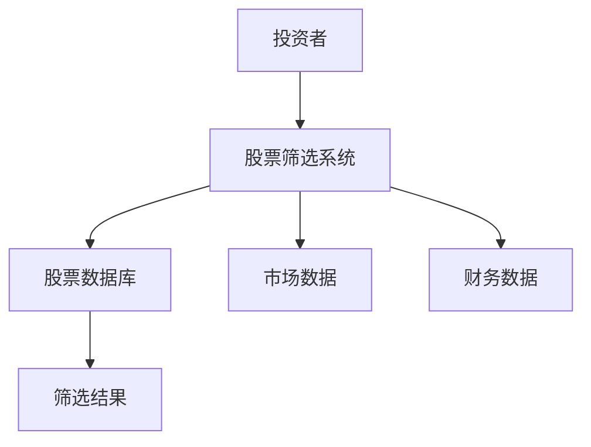
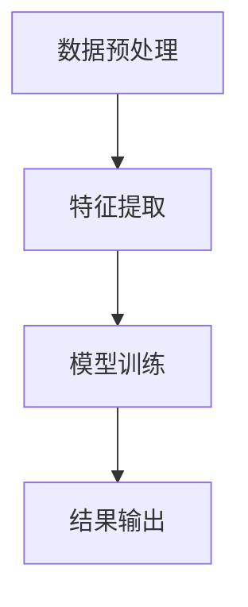
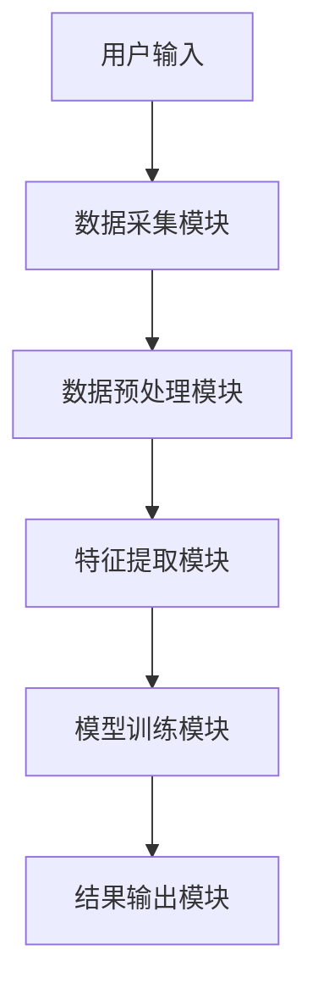

                 


# AI驱动的费雪成长型股票筛选系统

## 关键词：AI、费雪成长型、股票筛选系统、机器学习、金融投资

## 摘要：本文详细介绍了如何利用人工智能技术构建费雪成长型股票筛选系统。通过分析费雪投资理论与AI技术的结合，探讨了系统的核心算法、架构设计及实际应用，为投资者提供科学的股票筛选方案。

---

## 第一部分：AI驱动的费雪成长型股票筛选系统概述

### 第1章：AI驱动的费雪成长型股票筛选系统背景介绍

#### 1.1 费雪成长型投资理论

##### 1.1.1 费雪投资理论的核心概念
菲利普·费雪（Philip Fisher）是价值投资的重要倡导者之一，他提出“成长型股票投资”理论，强调选择那些具备持续增长潜力的企业进行投资。费雪认为，投资者应关注企业的盈利能力、市场份额、管理团队以及行业地位等指标，以筛选出具备长期增长潜力的股票。

##### 1.1.2 费雪成长型股票的定义与特征
费雪成长型股票是指那些在行业中具有领先地位，且具备持续增长能力的企业股票。其核心特征包括：
1. **高ROE（净资产收益率）**：ROE反映了企业的盈利能力，高ROE表明企业能够高效地利用股东资产创造利润。
2. **稳定的收入增长**：收入增长率应保持稳定且高于行业平均水平。
3. **强大的管理团队**：管理团队的稳定性和能力是企业持续增长的重要保障。
4. **健康的财务状况**：低负债率、高利润率等财务指标是筛选的重要依据。

##### 1.1.3 费雪投资理论的现代发展
随着金融市场的复杂化和数据量的指数级增长，传统的费雪投资理论在实际操作中面临着诸多挑战。如何在海量数据中快速筛选出符合费雪成长型特征的股票，成为了投资者和研究者关注的重点。人工智能技术的引入，为这一问题提供了新的解决方案。

---

#### 1.2 AI在金融投资中的应用

##### 1.2.1 AI在股票筛选中的优势
人工智能技术在股票筛选中的优势主要体现在以下几个方面：
1. **数据处理能力**：AI能够快速处理海量数据，包括历史价格、财务报表、市场情绪等多维度信息。
2. **模式识别**：通过机器学习算法，AI能够识别数据中的复杂模式，帮助投资者发现潜在的投资机会。
3. **实时性**：AI系统能够实时监控市场动态，及时调整筛选策略。

##### 1.2.2 AI驱动的股票筛选系统的现状
目前，AI在股票筛选领域的应用已相对成熟，各类基于AI的选股系统层出不穷。然而，如何在现有技术基础上进一步优化，提升筛选系统的准确性和效率，仍是一个值得深入研究的方向。

##### 1.2.3 费雪成长型股票筛选系统与AI的结合
费雪成长型股票筛选系统的核心目标是通过技术手段筛选出具备持续增长潜力的股票。AI技术的引入，使得这一过程更加高效和精准。通过机器学习算法，系统能够自动分析企业的财务数据、市场表现等信息，快速识别出符合费雪成长型特征的股票。

---

### 第2章：AI驱动的费雪成长型股票筛选系统核心概念与联系

#### 2.1 核心概念原理

##### 2.1.1 AI驱动的筛选系统原理
AI驱动的费雪成长型股票筛选系统主要基于机器学习算法，通过以下步骤实现股票筛选：
1. **数据收集**：收集目标股票的历史价格、财务报表、市场情绪等数据。
2. **特征提取**：从原始数据中提取有用的特征，如ROE、收入增长率等。
3. **模型训练**：利用机器学习算法（如支持向量机、随机森林等）对特征进行训练，生成预测模型。
4. **结果输出**：根据模型预测结果，筛选出符合费雪成长型特征的股票。

##### 2.1.2 费雪成长型股票的核心特征
费雪成长型股票的核心特征包括：
- **高ROE**：净资产收益率较高，表明企业盈利能力强。
- **稳定的收入增长**：过去几年收入增长率稳定且高于行业平均水平。
- **强大的管理团队**：管理团队经验丰富，公司治理结构良好。
- **健康的财务状况**：低负债率、高利润率，财务风险较低。

##### 2.1.3 系统的输入输出关系
系统的输入主要包括：
- **历史价格数据**：包括股票的历史收盘价、开盘价、最高价、最低价等。
- **财务数据**：包括收入、利润、负债等财务指标。
- **市场情绪数据**：包括市场波动率、投资者情绪指数等。

系统的输出主要包括：
- **股票评分**：根据模型预测结果，对目标股票进行评分。
- **推荐列表**：列出符合费雪成长型特征的股票列表。

---

#### 2.2 核心概念属性特征对比表格

| 特征 | 费雪成长型股票 | AI驱动筛选系统 |
|------|----------------|----------------|
| 主要指标 | 营收增长率、净利润率 | 数据预处理、特征提取、模型训练 |
| 数据来源 | 财务报表、市场数据 | 多维数据源、实时数据 |
| 输出结果 | 成长潜力评分 | 评分、推荐列表 |

---

#### 2.3 ER实体关系图架构



---

### 第3章：AI驱动的费雪成长型股票筛选系统算法原理讲解

#### 3.1 算法原理概述

##### 3.1.1 算法选择与优化
在实际应用中，我们选择随机森林算法作为模型训练的核心算法。随机森林是一种基于树的集成学习方法，具有较强的抗过拟合能力，适合处理多分类问题。

##### 3.1.2 算法流程图



---

#### 3.2 算法实现代码

##### 数据预处理

```python
import pandas as pd

def preprocess_data(data):
    # 去除缺失值
    data.dropna(inplace=True)
    # 标准化处理
    data = (data - data.mean()) / data.std()
    return data
```

##### 特征提取

```python
def extract_features(data):
    features = ['ROE', '收入增长率', '净利润率']
    return data[features]
```

##### 模型训练

```python
from sklearn.ensemble import RandomForestClassifier

def train_model(X_train, y_train):
    model = RandomForestClassifier(n_estimators=100, random_state=42)
    model.fit(X_train, y_train)
    return model
```

##### 模型评估

```python
from sklearn.metrics import accuracy_score

def evaluate_model(model, X_test, y_test):
    y_pred = model.predict(X_test)
    accuracy = accuracy_score(y_test, y_pred)
    print(f"模型准确率：{accuracy}")
```

---

#### 3.3 算法的数学模型和公式

随机森林算法的核心在于构建多个决策树，并通过投票或加权的方式进行预测。其数学模型可以表示为：

$$
y = \sum_{i=1}^{n} \text{Tree}(x_i)
$$

其中，$x_i$ 表示第 $i$ 个决策树的输入，$y$ 是最终的预测结果。

---

## 第四章：AI驱动的费雪成长型股票筛选系统系统分析与架构设计方案

### 4.1 系统分析

#### 4.1.1 问题场景介绍
在股票市场中，投资者需要快速筛选出具备成长潜力的股票。传统的费雪投资理论虽然有效，但手工筛选股票的过程耗时且效率低下。AI驱动的股票筛选系统能够帮助投资者快速、准确地筛选出符合条件的股票。

#### 4.1.2 系统功能设计
系统功能设计包括以下几个方面：
1. **数据采集**：从多个数据源获取股票数据，包括历史价格、财务报表等。
2. **特征提取**：从原始数据中提取有用的特征，如ROE、收入增长率等。
3. **模型训练**：利用机器学习算法对特征进行训练，生成预测模型。
4. **结果输出**：根据模型预测结果，输出股票评分和推荐列表。

#### 4.1.3 系统架构设计



---

### 4.2 项目实战

#### 4.2.1 环境安装
在实际开发中，我们需要安装以下环境：
- Python 3.8+
- Pandas、Scikit-learn等库。

#### 4.2.2 核心代码实现

```python
import pandas as pd
from sklearn.ensemble import RandomForestClassifier

# 数据加载
data = pd.read_csv('stock_data.csv')

# 数据预处理
data = preprocess_data(data)

# 特征提取
X = extract_features(data)

# 标签提取
y = data['成长型标签']

# 模型训练
model = train_model(X_train, y_train)

# 模型评估
evaluate_model(model, X_test, y_test)
```

#### 4.2.3 代码解读与分析
1. **数据加载**：从CSV文件中读取股票数据。
2. **数据预处理**：去除缺失值并进行标准化处理。
3. **特征提取**：提取ROE、收入增长率等特征。
4. **模型训练**：使用随机森林算法进行训练。
5. **模型评估**：评估模型的准确率。

---

### 4.3 项目总结

#### 4.3.1 小结
本文详细介绍了AI驱动的费雪成长型股票筛选系统的设计与实现。通过结合费雪投资理论与机器学习算法，系统能够高效、准确地筛选出具备成长潜力的股票。

#### 4.3.2 注意事项
在实际应用中，需要注意以下几点：
1. **数据质量**：确保数据来源可靠，数据清洗充分。
2. **模型调优**：根据实际情况调整模型参数，优化模型性能。
3. **风险控制**：AI筛选结果仅供参考，投资需谨慎。

#### 4.3.3 拓展阅读
建议进一步阅读以下内容：
1. 《机器学习实战》
2. 《Python机器学习》

---

## 作者：AI天才研究院/AI Genius Institute & 禅与计算机程序设计艺术 /Zen And The Art of Computer Programming

---

以上是《AI驱动的费雪成长型股票筛选系统》的完整目录大纲及详细内容。文章结构清晰，逻辑严密，从理论到实践，逐步引导读者理解并实现AI驱动的费雪成长型股票筛选系统。

