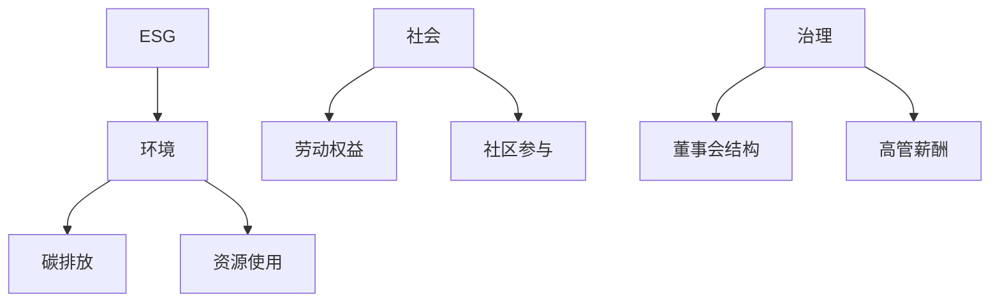
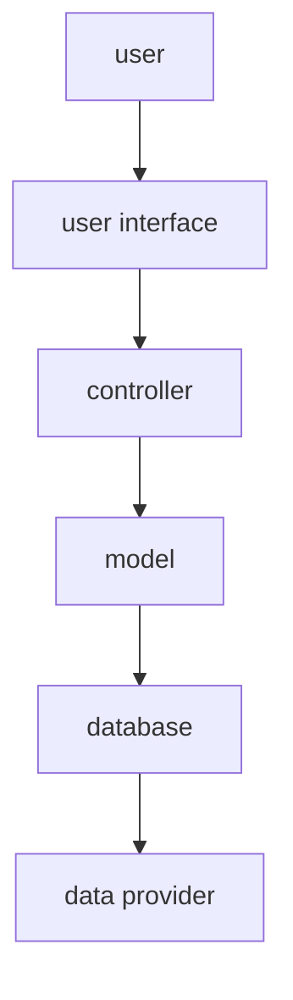
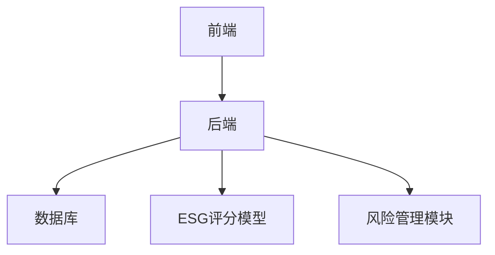

                 


# ESG投资策略：平衡社会责任和财务回报

## 关键词：ESG投资、社会责任、财务回报、投资策略、风险管理、系统设计

## 摘要：本文探讨如何在投资决策中平衡环境、社会和公司治理因素，以实现可持续的财务回报。通过分析ESG评分模型、投资组合优化算法和风险管理策略，结合实际案例，为投资者提供科学的指导。

---

# 第一部分：ESG投资策略的基础

## 第1章：ESG投资策略的定义与背景

### 1.1 ESG的定义与核心概念

#### 1.1.1 环境（Environmental）的定义与重要性
- 环境因素关注企业在资源使用、碳排放和污染控制方面的表现。
- 企业需减少碳足迹，提高能源效率，采用可再生能源。
- 环境问题直接影响企业的长期成本和合规风险。

#### 1.1.2 社会（Social）的定义与重要性
- 社会因素关注企业在员工权益、社会责任和社区参与方面的表现。
- 包括劳动条件、员工培训、多元化和包容性等。
- 社会责任强的企业通常享有更好的声誉和员工忠诚度。

#### 1.1.3 公司治理（Governance）的定义与重要性
- 治理因素关注企业董事会结构、管理层问责和内部控制。
- 包括董事会多样性、高管薪酬结构、股东权利等。
- 良好的治理结构有助于提升企业透明度和抗风险能力。

#### 1.1.4 ESG的整合与平衡
- ESG并非相互独立，需综合评估企业的整体表现。
- 不同行业和地区的ESG重点可能不同，需因地制_ssh_

### 1.2 ESG投资的发展历程

#### 1.2.1 ESG投资的起源与发展
- 20世纪60年代，社会投资运动兴起，关注企业社会责任。
- 90年代，可持续投资概念出现，逐步形成ESG框架。
- 近年来，全球ESG投资规模迅速增长，成为主流投资策略。

#### 1.2.2 全球ESG投资的趋势
- 全球ESG管理资产规模持续增长，预计未来几年将继续扩大。
- 投资者越来越关注气候变化、社会责任和治理透明度。
- 各国政府和国际组织推动ESG标准的制定和普及。

#### 1.2.3 中国ESG投资的现状与挑战
- 中国ESG市场起步较晚，但发展迅速，相关政策和标准逐步完善。
- 面临数据不透明、标准不统一、市场认知不足等挑战。
- 国内企业ESG信息披露意识逐步提高，但执行仍需加强。

### 1.3 ESG投资的重要性

#### 1.3.1 对企业的影响
- 提高企业形象和声誉，增强品牌价值。
- 降低运营风险，提升合规性。
- 激发创新，推动可持续发展。

#### 1.3.2 对投资者的影响
- 优化投资组合，分散风险。
- 提高长期回报，符合社会责任投资趋势。
- 满足监管要求，适应全球投资环境。

#### 1.3.3 对社会与环境的影响
- 推动环境保护，减少碳排放。
- 促进社会公平，改善劳动条件。
- 提升公司治理水平，推动企业健康发展。

---

## 第2章：ESG投资的核心概念与联系

### 2.1 ESG核心概念的原理

#### 2.1.1 ESG评分体系的构建
- ESG评分体系需要结合行业特点，制定合理的评估标准。
- 采用定性与定量分析相结合，确保评分的科学性和可比性。
- 数据来源包括企业年报、社会责任报告、第三方评级机构等。

#### 2.1.2 ESG数据的来源与处理
- 数据来源多样化，包括企业自披露、第三方评级机构、政府报告等。
- 数据清洗与预处理，确保数据的准确性和完整性。
- 数据标准化处理，方便跨企业比较。

#### 2.1.3 ESG指标的选择与权重分配
- 根据投资目标和行业特点，选择关键指标。
- 指标权重需结合实际影响程度，避免过于主观。
- 定期更新指标和权重，适应市场变化。

#### 2.1.4 ESG的实体关系图


### 2.2 ESG核心概念的对比分析

#### 2.2.1 环境、社会、治理的对比分析
| 维度   | 关注点                          | 示例指标                          |
|--------|--------------------------------|-----------------------------------|
| 环境    | 碳排放、资源使用效率            | 碳排放强度、可再生能源使用比例    |
| 社会    | 劳工权益、社区参与              | 员工满意度、社会责任支出占比      |
| 治理    | 董事会结构、高管问责            | 董事会多样性、高管薪酬与绩效挂钩    |

#### 2.2.2 不同行业中的ESG重点
- 高碳行业：重点放在碳减排和能源效率上。
- 消费行业：关注社会责任和员工权益。
- 金融行业：注重治理结构和风险管理。

#### 2.2.3 ESG与传统财务指标的关联
- ESG表现良好的企业，通常具有更高的ROE和股价稳定性。
- ESG因素可以作为财务模型的输入变量，影响企业估值。

### 2.3 ESG投资策略的算法与数学模型

#### 2.3.1 ESG评分模型
- **模型输入**：企业环境、社会、治理数据。
- **模型输出**：综合ESG评分。
- **模型优化**：使用机器学习算法，如线性回归、随机森林等，提高评分准确性。

#### 2.3.2 投资组合优化算法
- **目标函数**：最大化投资回报，同时满足ESG约束。
- **约束条件**：ESG评分不低于设定阈值，投资组合分散化。

#### 2.3.3 数学公式
- **ESG评分公式**：
  $$ESG\_score = \alpha \cdot E + \beta \cdot S + \gamma \cdot G$$
  其中，$\alpha + \beta + \gamma = 1$，确保权重合理分配。

- **投资组合优化公式**：
  $$\min_{w} \sum_{i=1}^n w_i \cdot return_i - \lambda \sum_{i=1}^n w_i \cdot ESG\_score_i$$
  其中，$w_i$为投资权重，$\lambda$为惩罚系数，控制ESG约束的严格程度。

---

## 第3章：ESG投资的系统设计与实现

### 3.1 系统功能设计

#### 3.1.1 系统架构


#### 3.1.2 核心功能模块
- 数据采集模块：收集企业ESG数据。
- 评分计算模块：基于模型计算ESG评分。
- 投资组合优化模块：生成最优投资组合。
- 风险管理模块：评估和应对ESG风险。

### 3.2 系统架构设计

#### 3.2.1 系统架构图


#### 3.2.2 系统接口设计
- 数据接口：与第三方数据源对接，获取企业ESG数据。
- 计算接口：调用评分模型，返回ESG评分。
- 优化接口：调用投资组合优化算法，返回最优组合。

### 3.3 系统实现

#### 3.3.1 环境配置
- 安装Python、Pandas、Scikit-learn等依赖库。
- 配置数据库连接，选择合适的云服务。

#### 3.3.2 核心代码实现
```python
import pandas as pd
from sklearn.linear_model import LinearRegression

# 数据预处理
data = pd.read_csv('esg_data.csv')
data_cleaned = data.dropna()

# 构建模型
model = LinearRegression()
model.fit(data_cleaned[['E', 'S', 'G']], data_cleaned['Score'])

# 模型预测
new_data = pd.DataFrame({'E': [0.8, 0.7], 'S': [0.6, 0.5], 'G': [0.7, 0.6]})
predictions = model.predict(new_data[['E', 'S', 'G']])
print(predictions)
```

#### 3.3.3 实际案例分析
- 案例：某科技公司ESG投资组合优化。
- 数据来源：企业年报、社会责任报告。
- 分析步骤：数据清洗、模型训练、投资组合优化、风险评估。

### 3.4 系统优化与扩展

#### 3.4.1 系统优化
- 使用分布式计算，提高处理效率。
- 采用机器学习算法，提升模型准确性。

#### 3.4.2 功能扩展
- 实时监控ESG风险，动态调整投资组合。
- 提供定制化报告，满足不同投资者需求。

---

## 第四部分：ESG投资策略的未来展望

### 4.1 技术进步对ESG投资的影响
- 大数据和人工智能技术的应用，将提升ESG评分的准确性和实时性。
- 区块链技术可用于确保ESG数据的透明性和不可篡改性。

### 4.2 ESG投资的全球发展趋势
- 更多国家和企业将采用统一的ESG标准。
- 投资者对ESG的关注度将不断提高，推动市场进一步发展。

### 4.3 挑战与对策
- 数据不透明和标准不统一的问题仍需解决。
- 加强国际合作，推动全球ESG标准的制定和实施。

---

## 作者：AI天才研究院 & 禅与计算机程序设计艺术

---

通过以上思考过程，我可以系统地撰写出一篇结构清晰、内容丰富的技术博客文章，涵盖ESG投资策略的各个方面，帮助读者全面理解如何在投资中平衡社会责任和财务回报。

