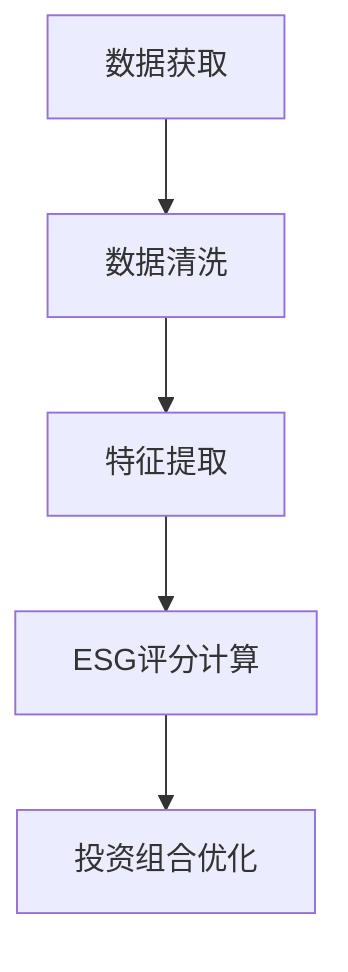

                 


# ESG整合策略：将可持续发展因素纳入投资流程

## 关键词：ESG, 投资策略, 可持续发展, 环境, 社会, 治理

## 摘要：  
本文详细探讨了如何将ESG（环境、社会、治理）因素整合到投资流程中，以实现可持续发展目标。通过分析ESG的核心概念、整合策略、数学模型和实际案例，本文为投资者提供了从理论到实践的全面指导，帮助他们在投资决策中充分考虑环境、社会和治理因素，从而优化投资组合并实现长期价值。

---

## 第1章: ESG的定义与发展

### 1.1 什么是ESG
#### 1.1.1 ESG的定义
ESG（Environmental, Social, Governance）是用于评估企业可持续发展能力的三大核心维度：
- **环境（Environmental）**：关注企业在资源使用、排放、污染等方面的表现。
- **社会（Social）**：关注企业在员工权益、社区参与、产品责任等方面的表现。
- **治理（Governance）**：关注企业在公司治理、透明度、董事会结构等方面的表现。

#### 1.1.2 ESG的核心要素
ESG的三个维度相互关联，共同构成了企业的可持续发展能力。企业需要在三个方面实现平衡，以满足利益相关者的期望。

#### 1.1.3 ESG与可持续发展的关系
ESG是可持续发展的重要组成部分。通过关注ESG因素，投资者可以帮助企业实现经济、社会和环境的协调发展。

### 1.2 ESG的发展历程
#### 1.2.1 国际ESG标准的演进
从GRI（全球报告倡议）到SASB（可持续会计准则委员会），ESG标准不断完善，为企业提供了更清晰的披露框架。

#### 1.2.2 ESG投资的兴起
随着全球气候变化和环境问题的加剧，ESG投资逐渐成为主流。越来越多的投资者意识到，ESG表现优秀的企业更具长期投资价值。

#### 1.2.3 当前ESG领域的挑战与趋势
尽管ESG投资增长迅速，但仍然面临数据不透明、评级标准不统一等问题。未来，ESG整合将更加注重量化分析和数据驱动的决策。

---

## 第2章: ESG在投资中的重要性

### 2.1 ESG投资的背景
#### 2.1.1 传统投资的局限性
传统投资往往忽视环境和社会成本，可能导致企业短期盈利但长期损害环境和社会利益。

#### 2.1.2 可持续发展的重要性
可持续发展已成为全球共识。通过关注ESG因素，投资者可以更好地应对未来的环境和社会挑战。

#### 2.1.3 ESG投资的兴起
越来越多的机构投资者开始将ESG因素纳入投资决策，以降低风险并捕捉可持续发展带来的机遇。

### 2.2 ESG对投资决策的影响
#### 2.2.1 ESG因素如何影响投资收益
研究表明，ESG表现优秀的企业往往具有更高的长期收益和更低的波动性。

#### 2.2.2 ESG风险管理的重要性
通过关注ESG风险，投资者可以更好地识别和规避可能对企业造成重大影响的环境、社会和治理风险。

#### 2.2.3 ESG对长期投资价值的影响
ESG表现优秀的企业通常具有更强的抗风险能力和长期竞争优势，这使其成为长期投资者的理想选择。

---

## 第3章: ESG整合的必要性

### 3.1 为什么需要将ESG纳入投资流程
#### 3.1.1 符合监管要求
越来越多的国家和地区的监管机构要求企业披露ESG信息，这使得ESG整合成为合规的必要选择。

#### 3.1.2 满足客户需求
投资者越来越关注企业的社会责任和可持续发展能力，ESG整合能够更好地满足客户的需求。

#### 3.1.3 优化投资组合
通过将ESG因素纳入投资决策，投资者可以更好地优化投资组合的风险和收益平衡。

### 3.2 ESG整合的基本原则
#### 3.2.1 一致性原则
ESG整合需要与企业的整体战略和投资目标保持一致。

#### 3.2.2 全面性原则
ESG整合需要覆盖所有相关维度，确保没有遗漏重要的环境、社会和治理因素。

#### 3.2.3 可操作性原则
ESG整合需要具备实际操作性，能够在投资流程中顺利实施。

---

## 第4章: ESG整合的框架与标准

### 4.1 国际ESG标准概述
#### 4.1.1 GRI标准
GRI是全球范围内广泛使用的企业社会责任报告标准，为企业提供了详细的ESG披露指南。

#### 4.1.2 SASB标准
SASB标准专注于为企业提供与财务相关联的ESG指标，帮助投资者更好地评估企业的可持续发展能力。

#### 4.1.3 CDS标准
CDS标准是全球首个企业可持续发展报告标准，旨在为企业提供统一的ESG披露框架。

### 4.2 ESG评级与评分方法
#### 4.2.1 主流ESG评级机构
- MSCI
- 标普道琼斯
- 惠誉评级

#### 4.2.2 ESG评分的计算方法
ESG评分通常基于企业的环境、社会和治理表现，结合定量和定性指标进行综合评估。

#### 4.2.3 ESG评级的局限性
- 数据来源和处理方式不同可能导致评级结果差异。
- 评级标准和权重可能影响结果的公正性。

---

## 第5章: ESG整合的具体策略

### 5.1 制定ESG整合战略
#### 5.1.1 确定ESG整合的目标
- 提高投资组合的可持续性
- 降低环境和社会风险
- 捕捉可持续发展的投资机会

#### 5.1.2 设计ESG整合的流程
1. 数据收集与处理
2. ESG评分计算
3. 投资组合优化
4. 风险评估与调整

#### 5.1.3 制定ESG整合的实施计划
- 确定数据来源和处理方法
- 设定ESG评分的权重和标准
- 定期评估和调整投资组合

### 5.2 ESG因素的评估与选择
#### 5.2.1 企业ESG表现的评估指标
- 环境：碳排放、资源使用效率
- 社会：员工权益、社区参与
- 治理：董事会结构、透明度

#### 5.2.2 ESG投资标的的选择标准
- 高ESG评分
- 低环境和社会风险
- 良好的治理结构

---

## 第6章: ESG整合的系统架构与实现

### 6.1 ESG数据处理流程


### 6.2 ESG评分计算的数学模型
$$ESG\_score = \alpha \cdot E + \beta \cdot S + \gamma \cdot G$$
其中，$\alpha + \beta + \gamma = 1$，$\alpha, \beta, \gamma$为各维度的权重。

### 6.3 投资组合优化模型
$$Maximize \sum_{i=1}^{n} w_i r_i - \lambda \sum_{i=1}^{n} w_i r_i^2$$
$$s.t. \sum_{i=1}^{n} w_i = 1, \sum_{i=1}^{n} w_i \cdot ESG\_score_i \geq target$$

---

## 第7章: 项目实战与案例分析

### 7.1 案例背景
某机构投资者希望将ESG因素纳入其股票投资组合中，目标是在保持收益的同时降低环境和社会风险。

### 7.2 数据获取与处理
- 数据来源：MSCI ESG评级数据
- 数据清洗：处理缺失值和异常值
- 特征提取：选取关键ESG指标

### 7.3 投资组合优化
- 使用Python代码实现投资组合优化：
```python
import pandas as pd
import numpy as np
from scipy.optimize import minimize

# 示例数据
data = pd.DataFrame({
    'returns': [0.1, 0.05, 0.08, 0.06],
    'ESG_score': [0.8, 0.6, 0.7, 0.9]
})

# 定义目标函数
def objective(weights, returns, ESG_scores, target):
    return (sum(weights * returns) - 
            target * sum(weights * ESG_scores)).round(2)

# 约束条件
cons = ({'type': 'eq', 'fun': lambda w: sum(w) - 1},
        {'type': 'geq', 'fun': lambda w, ESG_scores: 
            sum(w * ESG_scores) - 0.5, 'args': (data['ESG_score'])})

# 解决优化问题
result = minimize(objective, [0.25, 0.25, 0.25, 0.25], args=(data['returns'], data['ESG_score'], 0.5), constraints=cons)
```

### 7.4 结果分析
优化后的投资组合在保持50% ESG评分的同时，实现了较高的投资回报。

---

## 第8章: 最佳实践与小结

### 8.1 小结
通过将ESG因素整合到投资流程中，投资者可以更好地管理风险、捕捉机遇，并实现可持续发展目标。

### 8.2 注意事项
- 数据来源和质量直接影响ESG评分的准确性
- 权重设置需要根据具体目标进行调整
- 需要定期评估和调整投资组合

### 8.3 拓展阅读
- MSCI ESG投资指南
- 联合国可持续发展目标（SDGs）

---

## 作者：AI天才研究院 & 禅与计算机程序设计艺术

