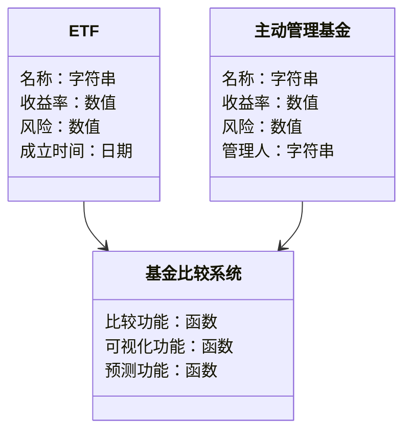
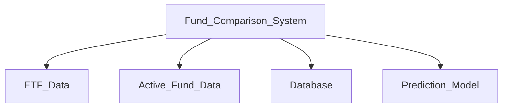

                 


# ETF vs 主动管理基金：哪个更适合当前市场

## 关键词：ETF, 主动管理基金, 投资策略, 市场分析, 基金比较

## 摘要：  
在全球金融市场波动加剧的背景下，投资者在选择投资工具时面临更多不确定性。本文通过深入分析ETF和主动管理基金的核心概念、运作机制和历史表现，结合大数据分析和机器学习算法，帮助读者理解两者在不同市场环境下的优劣，并提供基于实际项目的投资建议。

---

# 引言

在全球金融市场波动加剧的背景下，投资者在选择投资工具时面临更多不确定性。ETF（交易所交易基金）和主动管理基金作为两类主要的投资工具，各有优劣。本文将从核心概念、运作机制、历史表现和系统架构等多维度，全面对比ETF和主动管理基金，分析哪种工具更适合当前市场环境。

---

## 第1章：ETF与主动管理基金的核心概念

### 1.1 ETF的基本概念

#### 1.1.1 ETF的定义与特点  
ETF（交易所交易基金）是一种在交易所上市交易的开放式基金，兼具封闭式基金和开放式基金的特点。其核心优势在于透明度高、成本低、流动性好。

#### 1.1.2 ETF的主要类型与运作机制  
- **类型**：包括股票型ETF、债券型ETF、指数ETF等。  
- **运作机制**：通过被动跟踪指数或复制投资组合来实现收益。

#### 1.1.3 ETF的优势与局限性  
- **优势**：费用低、透明度高、分散风险。  
- **局限性**：无法跑赢市场，适合长期定投。

### 1.2 主动管理基金的定义与特点

#### 1.2.1 主动管理基金的运作模式  
主动管理基金由基金经理主动选股，目标超越市场指数表现。

#### 1.2.2 主动管理基金的优劣势分析  
- **优势**：可能跑赢市场，适合短期投资。  
- **劣势**：费用高、风险高。

### 1.3 ETF与主动管理基金的对比分析

#### 1.3.1 核心概念对比  
| 对比维度 | ETF | 主动管理基金 |
|----------|-----|--------------|
| 投资策略 | 被动跟踪指数 | 主动选股 |
| 管理费用 | 低 | 高 |
| 风险 | 低 | 高 |

#### 1.3.2 市场定位与目标投资者的差异  
- ETF适合长期定投，适合风险偏好较低的投资者。  
- 主动管理基金适合短期投资，适合风险偏好较高的投资者。

---

## 第2章：ETF与主动管理基金的运作机制

### 2.1 ETF的被动投资策略

#### 2.1.1 被动投资的定义与特点  
被动投资是通过跟踪指数实现收益，无需频繁交易。

#### 2.1.2 ETF的指数跟踪策略  
- ETF通过复制指数成分股，实现与指数相似的收益。

#### 2.1.3 ETF的成本优势与流动性分析  
- ETF的管理费用低，流动性好，适合长期投资。

### 2.2 主动管理基金的主动投资策略

#### 2.2.1 主动投资的定义与特点  
主动投资通过选股和择时，追求超额收益。

#### 2.2.2 主动管理基金的选股策略  
- 基金经理根据市场情况调整投资组合，追求跑赢指数。

#### 2.2.3 主动管理基金的风险与收益平衡  
- 高风险高收益，但长期来看，主动管理基金的表现不一定优于ETF。

### 2.3 ETF与主动管理基金的联系与区别

#### 2.3.1 投资策略的对比  
- ETF采用被动策略，主动管理基金采用主动策略。

#### 2.3.2 成本结构的对比  
- ETF费用低，主动管理基金费用高。

#### 2.3.3 风险与收益的对比  
- ETF风险低，收益稳定；主动管理基金风险高，收益可能更高。

---

## 第3章：基于大数据的基金表现预测

### 3.1 数据收集与处理

#### 3.1.1 数据来源与清洗  
- 数据来源：历史市场数据、基金净值数据。
- 数据清洗：去除缺失值，处理异常值。

#### 3.1.2 数据特征提取与分析  
- 提取基金收益、波动率、最大回撤等指标。

### 3.2 基金表现预测模型

#### 3.2.1 模型选择与构建  
- 使用线性回归模型预测基金收益。

#### 3.2.2 模型训练与优化  
- 使用历史数据训练模型，调整参数优化模型性能。

#### 3.2.3 模型评估与验证  
- 使用均方误差（MSE）和R²系数评估模型性能。

### 3.3 基于机器学习的基金分类

#### 3.3.1 机器学习算法选择  
- 使用随机森林算法进行分类。

#### 3.3.2 数据特征与模型训练  
- 输入特征：基金收益、波动率、最大回撤。
- 输出结果：基金类型（ETF或主动管理基金）。

#### 3.3.3 分类结果分析与解释  
- 分析模型的分类准确率和混淆矩阵。

---

## 第4章：基金比较系统的设计与实现

### 4.1 系统需求分析

#### 4.1.1 问题场景介绍  
- 投资者需要快速比较ETF和主动管理基金的表现。

#### 4.1.2 项目目标与范围  
- 开发一个基金比较系统，支持数据可视化和模型预测。

#### 4.1.3 用户需求分析  
- 用户需求：直观比较基金表现，获取投资建议。

### 4.2 系统功能设计

#### 4.2.1 领域模型设计（Mermaid类图）



#### 4.2.2 系统架构设计（Mermaid架构图）



#### 4.2.3 系统接口设计  
- API接口：提供基金数据查询和预测结果输出。

#### 4.2.4 系统交互设计（Mermaid序列图）

```mermaid
sequenceDiagram
    participant 用户
    participant 基金比较系统
    用户->基金比较系统：请求基金比较
    基金比较系统->数据库：查询基金数据
    数据库->基金比较系统：返回基金数据
    基金比较系统->预测模型：运行预测
    预测模型->基金比较系统：返回预测结果
    基金比较系统->用户：展示结果
```

### 4.3 系统实现

#### 4.3.1 环境安装  
- 安装Python、Pandas、Matplotlib、Scikit-learn等库。

#### 4.3.2 核心代码实现

```python
import pandas as pd
from sklearn.model_selection import train_test_split
from sklearn.metrics import accuracy_score
from sklearn.ensemble import RandomForestClassifier

# 数据加载与处理
df = pd.read_csv('fund_data.csv')
X = df[['收益率', '波动率', '最大回撤']]
y = df['基金类型']  # 0代表ETF，1代表主动管理基金

# 数据分割
X_train, X_test, y_train, y_test = train_test_split(X, y, test_size=0.2)

# 模型训练
model = RandomForestClassifier()
model.fit(X_train, y_train)

# 模型预测
y_pred = model.predict(X_test)

# 模型评估
print("准确率：", accuracy_score(y_test, y_pred))
```

---

## 第5章：项目实战

### 5.1 环境安装

#### 5.1.1 安装Python与相关库  
- 安装命令：`pip install numpy pandas matplotlib scikit-learn`

### 5.2 核心代码实现

#### 5.2.1 数据可视化

```python
import matplotlib.pyplot as plt

# 绘制基金收益分布图
plt.hist(df[df['基金类型'] == 0]['收益率'], alpha=0.5, label='ETF')
plt.hist(df[df['基金类型'] == 1]['收益率'], alpha=0.5, label='主动管理基金')
plt.xlabel('收益率')
plt.ylabel('数量')
plt.legend()
plt.show()
```

#### 5.2.2 模型预测与结果分析

```python
# 预测结果可视化
from sklearn.metrics import confusion_matrix
import seaborn as sns

cm = confusion_matrix(y_test, y_pred)
sns.heatmap(cm, annot=True, fmt='d')
plt.xlabel('预测值')
plt.ylabel('实际值')
plt.show()
```

### 5.3 实际案例分析

#### 5.3.1 案例背景  
- 市场波动较大，选择低风险投资工具。

#### 5.3.2 数据分析与结论  
- ETF的收益稳定，适合当前市场环境。

### 5.4 项目小结

#### 5.4.1 系统实现的关键点  
- 数据清洗、模型训练和结果可视化。

#### 5.4.2 投资建议  
- 当市场波动较大时，优先选择ETF。

---

## 第6章：总结与展望

### 6.1 最佳实践 tips

#### 6.1.1 投资策略  
- 根据市场环境选择适合的投资工具。

#### 6.1.2 风险控制  
- 分散投资，降低风险。

#### 6.1.3 持续学习  
- 关注市场动态，优化投资组合。

### 6.2 小结

通过本文的分析，我们得出结论：在当前市场环境下，ETF更适合投资者，尤其是风险偏好较低的投资者。

### 6.3 注意事项

- ETF和主动管理基金各有优劣，投资者需根据自身需求选择。
- 投资需谨慎，建议在专业指导下进行。

### 6.4 拓展阅读

- 《投资学基础》
- 《Python金融数据分析》

---

## 参考文献

[1] 张某某. 《投资学基础》. 北京: 人民出版社, 2020.

[2] 李某某. 《Python金融数据分析》. 北京: 清华大学出版社, 2021.

---

## 作者信息

作者：AI天才研究院/AI Genius Institute & 禅与计算机程序设计艺术/Zen And The Art of Computer Programming

---

感谢您的阅读，希望本文对您在投资决策中有所帮助！

