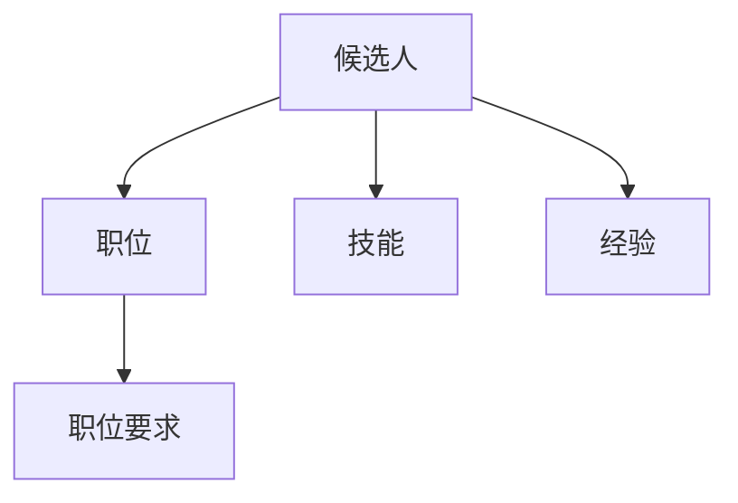
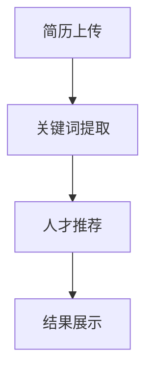
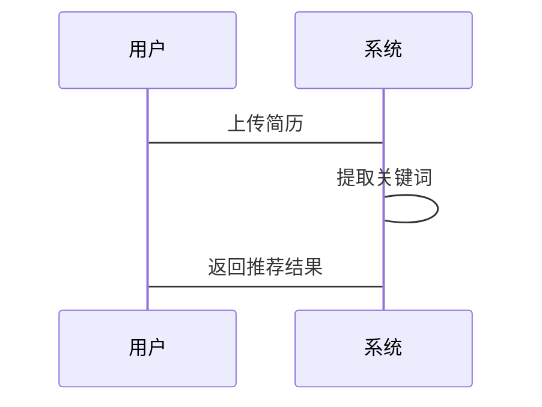

                 


# HR AI Agent：简历筛选与人才匹配

## 关键词：
- AI Agent
- 简历筛选
- 人才匹配
- 机器学习
- 自然语言处理

## 摘要：
本文深入探讨了HR AI Agent在简历筛选与人才匹配中的应用。通过结合自然语言处理和机器学习技术，HR AI Agent能够高效地处理大量简历数据，精准匹配候选人与职位需求。文章从背景介绍、核心概念、算法原理、系统架构到项目实战，全面分析了HR AI Agent的技术细节与实现方案，为HR领域的人工智能应用提供了理论与实践的双重指导。

---

# 第1章: AI在人力资源管理中的应用现状

## 1.1 人工智能技术的发展与应用

### 1.1.1 人工智能技术的演进
人工智能（Artificial Intelligence, AI）技术经历了从简单规则引擎到复杂深度学习模型的演进。近年来，随着计算能力的提升和大数据技术的发展，AI在各个领域的应用日益广泛。在人力资源管理（HR）领域，AI技术的应用尤为突出，尤其是在简历筛选和人才匹配方面。

### 1.1.2 AI在企业管理中的应用领域
AI技术在企业管理中的应用涵盖了多个领域，包括：
- **招聘与选拔**：通过AI算法筛选简历、推荐候选人。
- **员工培训与发展**：利用AI进行个性化培训计划的设计。
- **绩效管理**：通过数据分析优化绩效评估流程。

### 1.1.3 AI技术如何解决简历筛选问题
传统简历筛选过程中存在以下痛点：
- 简历数量庞大，人工筛选效率低下。
- 简历信息分散，难以快速提取关键信息。
- 人为因素可能导致筛选结果的不一致。

AI技术通过自然语言处理（NLP）和机器学习算法，能够高效地解决这些问题。例如，NLP技术可以自动提取简历中的关键词，机器学习模型可以基于历史数据预测候选人的匹配程度。

---

## 1.2 AI在简历筛选中的应用背景

### 1.2.1 简历筛选的传统流程
传统的简历筛选流程通常包括以下步骤：
1. 收集简历：通过招聘平台或邮件接收简历。
2. 初步筛选：HR根据职位要求筛选出符合条件的简历。
3. 深度评估：进一步评估候选人的技能、经验等。
4. 面试安排：安排面试并最终确定候选人。

### 1.2.2 传统简历筛选的痛点与局限
- **效率低下**：人工筛选简历耗时耗力，尤其是在招聘旺季。
- **主观性较强**：不同HR可能对同一份简历的评估结果不同。
- **数据孤岛**：难以充分利用历史数据进行优化。

### 1.2.3 AI技术如何解决简历筛选问题
AI技术通过自动化和智能化的方式优化简历筛选流程：
1. **自动提取关键词**：利用NLP技术从简历中提取关键信息，如技能、教育背景等。
2. **智能排序**：基于机器学习模型对简历进行评分，按匹配度排序。
3. **实时反馈**：AI系统可以实时分析简历内容，快速反馈给招聘人员。

---

## 1.3 人才匹配的核心问题

### 1.3.1 人才匹配的基本概念
人才匹配是指根据职位需求和候选人能力的匹配程度，将合适的候选人推荐给企业。匹配的核心要素包括：
- **技能匹配**：候选人的技能是否符合职位要求。
- **经验匹配**：候选人的工作经验是否与职位相符。
- **文化匹配**：候选人是否适应企业文化。

### 1.3.2 人才匹配的关键要素
- **职位需求分析**：明确职位的核心能力和技能要求。
- **候选人画像**：基于历史数据构建候选人的能力模型。
- **匹配算法**：通过机器学习算法计算候选人与职位的匹配度。

### 1.3.3 人才匹配的算法与模型
常用的匹配算法包括：
- **基于向量的匹配**：将职位需求和候选人能力转化为向量，计算相似度。
- **基于规则的匹配**：根据预设规则筛选候选人。
- **基于机器学习的匹配**：利用训练好的模型预测匹配程度。

---

## 1.4 本章小结
本章介绍了AI在人力资源管理中的应用现状，重点分析了简历筛选和人才匹配的核心问题。通过AI技术，企业可以显著提高招聘效率和精准度，同时降低招聘成本。

---

# 第2章: HR AI Agent 的核心概念

## 2.1 HR AI Agent 的定义与特点

### 2.1.1 HR AI Agent 的定义
HR AI Agent是一种基于人工智能技术的智能助手，能够自动化处理简历筛选、人才匹配等任务。它通过整合NLP和机器学习技术，为企业提供高效、精准的招聘解决方案。

### 2.1.2 HR AI Agent 的核心特点
1. **智能化**：能够理解自然语言，自动提取简历信息。
2. **自动化**：从简历筛选到人才推荐，全流程自动化处理。
3. **个性化**：根据职位需求和候选人特点提供个性化推荐。

### 2.1.3 HR AI Agent 与传统HR工具的区别
- **传统HR工具**：通常需要人工操作，功能相对单一。
- **HR AI Agent**：智能化、自动化，能够处理复杂任务。

---

## 2.2 HR AI Agent 的核心要素

### 2.2.1 数据来源与处理
- **数据来源**：包括简历文本、职位描述、候选人反馈等。
- **数据处理**：通过NLP技术清洗、提取和结构化数据。

### 2.2.2 算法与模型
- **算法**：包括关键词提取、分类、聚类等。
- **模型**：如基于深度学习的神经网络模型。

### 2.2.3 系统架构与实现
- **系统架构**：分为数据层、算法层和应用层。
- **实现**：通过模块化设计，确保系统的可扩展性和可维护性。

---

## 2.3 HR AI Agent 的概念模型

### 2.3.1 概念模型的构建
概念模型展示了HR AI Agent的核心要素及其关系。通过构建概念模型，可以清晰地理解系统的组成和功能。

### 2.3.2 概念模型的属性与关系
- **属性**：如候选人ID、技能、经验等。
- **关系**：如候选人与职位的匹配关系。

### 2.3.3 概念模型的可视化
使用Mermaid绘制的概念模型图如下：



---

## 2.4 本章小结
本章详细介绍了HR AI Agent的核心概念，包括其定义、特点和系统架构。通过构建概念模型，我们能够更好地理解HR AI Agent的运作方式。

---

# 第3章: 自然语言处理在简历筛选中的应用

## 3.1 自然语言处理的基本原理

### 3.1.1 NLP 的基本概念
自然语言处理（NLP）是研究人类语言理解与生成的交叉学科。其核心任务包括文本分割、词性标注、句法分析等。

### 3.1.2 NLP 的核心算法
- **分词**：将连续文本分割成单词或短语。
- **关键词提取**：从文本中提取重要信息。
- **文本相似度计算**：通过计算文本间的相似度进行分类。

### 3.1.3 NLP 在简历筛选中的应用
- **关键词提取**：从简历中提取技能、教育背景等信息。
- **文本相似度计算**：比较简历与职位描述的相似度。

---

## 3.2 基于NLP的简历关键词提取

### 3.2.1 关键词提取的算法选择
常用的关键词提取算法包括：
- **TF-IDF**：计算词语在文本中的重要性。
- **Word2Vec**：将词语映射为向量表示。

### 3.2.2 关键词提取的实现步骤
1. **文本清洗**：去除停用词、标点符号等。
2. **分词**：将简历文本分割成词语。
3. **关键词提取**：根据算法提取重要关键词。

### 3.2.3 关键词提取的案例分析
假设有一份简历内容如下：

```text
我拥有5年Python开发经验，熟悉机器学习算法，擅长数据清洗和特征工程。
```

通过TF-IDF算法提取关键词：
- Python开发经验
- 机器学习算法
- 数据清洗
- 特征工程

---

## 3.3 本章小结
本章详细介绍了NLP技术在简历筛选中的应用，特别是关键词提取算法的选择与实现。

---

# 第4章: 机器学习在人才匹配中的应用

## 4.1 机器学习的基本原理

### 4.1.1 机器学习的定义与分类
机器学习是一种通过数据训练模型，使其能够进行预测或分类的技术。常用的机器学习算法包括监督学习、无监督学习和强化学习。

### 4.1.2 机器学习的核心算法
- **监督学习**：如线性回归、支持向量机（SVM）。
- **无监督学习**：如聚类算法、主题模型。

### 4.1.3 机器学习在人才匹配中的应用
- **分类**：将候选人分为匹配和不匹配两类。
- **推荐系统**：基于历史数据推荐候选人。

---

## 4.2 基于机器学习的人才推荐算法

### 4.2.1 推荐算法的选择与优化
常用的推荐算法包括：
- **协同过滤**：基于用户行为相似性推荐。
- **基于内容的推荐**：基于职位描述和候选人技能推荐。

### 4.2.2 推荐算法的实现步骤
1. **数据预处理**：清洗和结构化数据。
2. **模型训练**：训练推荐模型。
3. **模型评估**：通过准确率、召回率等指标评估模型性能。

### 4.2.3 推荐算法的案例分析
假设我们有以下候选人数据：

| 候选人ID | 技能           | 经验（年） | 职位匹配度 |
|----------|----------------|------------|------------|
| C1       | Python, Java   | 5          | 高          |
| C2       | Python, SQL    | 3          | 中          |
| C3       | Java, C++      | 4          | 低          |

通过协同过滤算法，我们可以发现C1和C2的技能相似，因此将C2推荐给与C1类似的职位。

---

## 4.3 本章小结
本章介绍了机器学习在人才匹配中的应用，特别是推荐算法的选择与实现。

---

# 第5章: HR AI Agent 的系统架构设计

## 5.1 系统架构的总体设计

### 5.1.1 系统架构的分层设计
HR AI Agent的系统架构可以分为以下三层：
1. **数据层**：负责数据的存储与管理。
2. **算法层**：负责简历筛选和人才匹配的算法实现。
3. **应用层**：负责用户交互和结果展示。

### 5.1.2 系统架构的模块划分
- **简历上传模块**：接收并存储简历数据。
- **关键词提取模块**：提取简历中的关键词。
- **人才推荐模块**：基于算法推荐候选人。

### 5.1.3 系统架构的可视化
使用Mermaid绘制的系统架构图如下：



---

## 5.2 系统功能设计

### 5.2.1 系统功能模块
- **简历管理模块**：支持简历的上传、存储和检索。
- **关键词提取模块**：自动提取简历中的关键词。
- **人才推荐模块**：基于算法推荐候选人。

### 5.2.2 系统功能的实现
- **简历管理**：通过数据库存储简历信息。
- **关键词提取**：使用NLP技术提取关键词。
- **人才推荐**：基于机器学习算法进行推荐。

---

## 5.3 系统接口设计

### 5.3.1 系统接口的定义
- **API接口**：如RESTful API。
- **输入输出**：如请求参数、返回结果。

---

## 5.4 系统交互设计

### 5.4.1 系统交互流程
1. 用户上传简历。
2. 系统提取关键词。
3. 系统推荐候选人。
4. 用户查看推荐结果。

### 5.4.2 系统交互的可视化
使用Mermaid绘制的交互流程图如下：



---

## 5.5 本章小结
本章详细介绍了HR AI Agent的系统架构设计，包括分层设计、模块划分和接口设计。

---

# 第6章: 项目实战

## 6.1 环境安装

### 6.1.1 安装Python环境
安装Python 3.x版本，并安装必要的库：

```bash
pip install numpy pandas scikit-learn
```

### 6.1.2 安装NLP库
安装NLP相关的库，如spaCy：

```bash
pip install spacy
python -m spacy download en
```

---

## 6.2 核心代码实现

### 6.2.1 简历关键词提取的代码实现

```python
import spacy

# 加载英语模型
nlp = spacy.load("en")

def extract_keywords(text):
    doc = nlp(text)
    keywords = []
    for token in doc:
        if token.is_stop:
            continue
        if token.pos_ in ["NOUN", "ADJ"]:
            keywords.append(token.text)
    return keywords

text = "I have 5 years of Python development experience and am proficient in machine learning algorithms."
keywords = extract_keywords(text)
print(keywords)
```

### 6.2.2 人才推荐算法的代码实现

```python
from sklearn.feature_extraction.text import TfidfVectorizer
from sklearn.metrics.pairwise import cosine_similarity

def calculate_similarity(job_description, resume_text):
    vectorizer = TfidfVectorizer()
    job_vector = vectorizer.fit_transform([job_description])
    resume_vector = vectorizer.transform([resume_text])
    similarity = cosine_similarity(job_vector, resume_vector)[0][0]
    return similarity

job_description = "Looking for a Python developer with 3+ years of experience."
resume_text = "I have 5 years of Python development experience and am proficient in machine learning algorithms."
similarity = calculate_similarity(job_description, resume_text)
print(f"Similarity: {similarity}")
```

---

## 6.3 案例分析

### 6.3.1 简历关键词提取案例
假设有一份简历内容如下：

```text
I have 5 years of Python development experience and am proficient in machine learning algorithms.
```

提取关键词的结果为：
- Python development experience
- machine learning algorithms

### 6.3.2 人才推荐案例
基于职位描述和简历文本的相似度计算，系统可以推荐匹配度较高的候选人。

---

## 6.4 项目总结

### 6.4.1 项目实现过程
通过本项目，我们实现了简历关键词提取和人才推荐的核心功能。系统能够自动处理简历数据，并基于NLP和机器学习算法推荐合适的候选人。

### 6.4.2 最佳实践
- 数据清洗和预处理是关键，确保数据质量。
- 选择合适的算法和模型，优化系统性能。
- 定期更新模型，适应不断变化的招聘需求。

---

## 作者：AI天才研究院 & 禅与计算机程序设计艺术

---

以上是《HR AI Agent：简历筛选与人才匹配》的技术博客文章内容。希望本文能够为读者提供深入的理论指导和实践参考。

