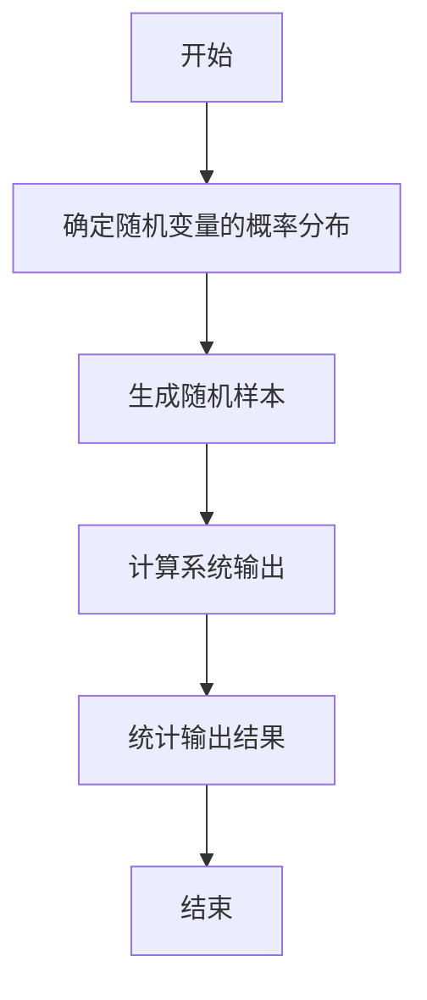
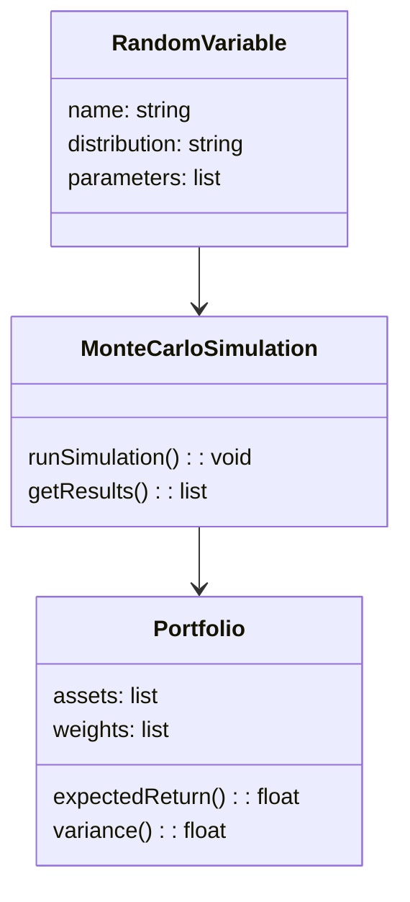
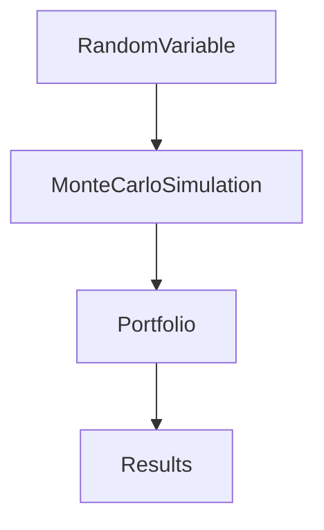

                 


# Monte Carlo模拟：投资结果的概率分布分析

**关键词：** Monte Carlo模拟，概率分布，投资结果，风险评估，金融建模

**摘要：**  
本文深入探讨了Monte Carlo模拟在投资结果分析中的应用，重点介绍了概率分布的建模、模拟过程、风险评估以及实际案例分析。通过系统化的分析和实例演示，读者将理解如何利用Monte Carlo模拟来量化投资风险，优化投资决策，并预测投资结果的概率分布。

---

# 第1章: Monte Carlo模拟的背景与概念

## 1.1 问题背景

### 1.1.1 投资结果预测的不确定性
在金融市场中，投资结果往往受到多种不确定因素的影响，例如市场波动、经济政策变化、公司业绩等。这些不确定性使得投资结果的预测具有高度的不确定性，传统的确定性模型难以准确捕捉这种随机性。

### 1.1.2 传统确定性模型的局限性
传统的金融模型通常假设市场变量服从确定性关系，例如线性回归模型。然而，这种假设忽略了市场的随机性和不确定性，导致模型的预测结果与实际结果可能存在较大偏差。

### 1.1.3 随机模拟方法的引入
为了克服传统模型的局限性，随机模拟方法应运而生。Monte Carlo模拟作为一种强大的随机模拟技术，通过生成大量随机样本，能够有效地描述和量化投资结果的不确定性。

---

## 1.2 Monte Carlo模拟的定义

### 1.2.1 Monte Carlo模拟的基本概念
Monte Carlo模拟是一种基于随机采样的数值方法，通过生成大量随机数来模拟系统的随机行为。这种方法的核心在于利用概率分布来描述系统中的不确定性，并通过多次模拟来估计系统的统计特性。

### 1.2.2 Monte Carlo模拟的核心原理
Monte Carlo模拟的基本原理是通过随机采样来逼近问题的解。具体来说，模拟过程包括以下几个步骤：
1. 确定系统中随机变量的概率分布。
2. 生成这些随机变量的样本。
3. 根据样本计算系统的输出结果。
4. 统计输出结果的分布特性。

### 1.2.3 Monte Carlo模拟与概率分布的关系
Monte Carlo模拟的核心在于概率分布的建模。通过选择合适的概率分布，模拟过程能够准确反映系统中的随机性，并生成符合实际的样本数据。

---

## 1.3 Monte Carlo模拟的特点

### 1.3.1 随机性与统计性
Monte Carlo模拟通过随机采样生成样本数据，模拟结果具有随机性，但可以通过多次模拟得到统计意义上的准确估计。

### 1.3.2 计算密集性
由于需要生成大量的随机样本，Monte Carlo模拟通常需要进行大量的计算，计算量随样本数量的增加而增长。

### 1.3.3 应用广泛性
Monte Carlo模拟不仅适用于金融领域，还广泛应用于物理、化学、工程等领域，是一种通用的随机模拟方法。

---

## 1.4 Monte Carlo模拟与其他模拟方法的对比

### 1.4.1 确定性模拟方法
确定性模拟方法假设系统中的变量之间存在确定性关系，例如线性关系。这种方法适用于系统中变量之间的关系明确且不存在随机性的场景。

### 1.4.2 随机模拟方法的分类
随机模拟方法可以分为两类：基于概率分布的随机采样方法（如Monte Carlo模拟）和基于物理过程的随机模拟方法（如分子动力学模拟）。

### 1.4.3 Monte Carlo模拟的独特优势
Monte Carlo模拟的独特优势在于其能够处理高维问题和复杂的概率分布，适用于系统中存在多个随机变量且变量之间关系复杂的场景。

---

## 1.5 Monte Carlo模拟在投资分析中的应用

### 1.5.1 投资组合风险评估
通过Monte Carlo模拟，可以生成投资组合收益的大量样本，从而估计投资组合的期望收益、方差和潜在的最大损失。

### 1.5.2 期权定价
Monte Carlo模拟是期权定价的重要工具，特别是对于复杂的金融衍生品，如路径依赖期权和奇异期权，其模拟效果尤为显著。

### 1.5.3 股票价格预测
通过模拟股票价格的随机波动，可以生成股票价格的未来路径分布，从而评估股票的投资风险和潜在收益。

---

## 1.6 本章小结
本章介绍了Monte Carlo模拟的基本概念、特点以及在投资分析中的应用。通过对比其他模拟方法，强调了Monte Carlo模拟在处理复杂随机系统中的独特优势。

---

# 第2章: Monte Carlo模拟的核心概念与联系

## 2.1 概率论基础

### 2.1.1 概率分布的基本概念
概率分布描述了随机变量取值的概率大小。常见的概率分布包括正态分布、均匀分布、泊松分布等。

### 2.1.2 常见概率分布及其特点
- **正态分布：** 对称分布，适合描述资产收益。
- **均匀分布：** 所有可能取值的概率相同，适合描述均匀随机变量。
- **泊松分布：** 适合描述事件发生的次数，如股票交易量。

### 2.1.3 随机变量的期望与方差
期望是随机变量的平均值，方差是随机变量与其期望值的平方差的期望，表示随机变量的波动程度。

$$ E[X] = \mu $$  
$$ Var(X) = E[(X - \mu)^2] $$

---

## 2.2 随机数生成

### 2.2.1 均匀分布随机数生成
许多概率分布可以通过均匀分布的随机数生成。例如，可以通过逆变换法将均匀分布的随机数转换为其他分布的随机数。

### 2.2.2 其他分布的随机数生成方法
- **正态分布：** 使用Box-Muller算法生成正态分布随机数。
- **泊松分布：** 使用拒绝法或直接方法生成泊松分布随机数。

### 2.2.3 随机数生成算法的实现
随机数生成算法可以通过编程实现，例如Python中的`numpy.random`库提供了多种分布的随机数生成函数。

---

## 2.3 Monte Carlo模拟的数学模型

### 2.3.1 Monte Carlo模拟的基本模型
假设系统中存在随机变量$X_1, X_2, ..., X_n$，每个变量都有自己的概率分布。通过生成这些变量的随机样本，计算系统的输出$Y = f(X_1, X_2, ..., X_n)$，并统计$Y$的概率分布。

### 2.3.2 模拟过程的数学表达
对于每个模拟试验，生成随机变量的样本$x_1, x_2, ..., x_n$，计算输出$y = f(x_1, x_2, ..., x_n)$，并记录$y$的值。通过多次模拟，可以得到$y$的样本分布。

### 2.3.3 模拟结果的统计分析
通过对大量模拟结果的统计分析，可以估计$Y$的期望、方差、分位数等统计量。

---

## 2.4 Monte Carlo模拟与投资分析的关系

### 2.4.1 投资结果的概率分布建模
通过选择合适的概率分布，可以对投资结果进行建模，例如假设资产收益服从正态分布。

### 2.4.2 Monte Carlo模拟在风险评估中的应用
通过模拟资产收益的随机波动，可以生成资产收益的样本分布，从而评估投资风险。

### 2.4.3 模拟结果的可视化与解释
通过绘制概率分布图，可以直观地展示投资结果的可能性，并帮助投资者做出决策。

---

## 2.5 本章小结
本章介绍了概率论基础、随机数生成方法以及Monte Carlo模拟的数学模型，并探讨了Monte Carlo模拟在投资分析中的应用。

---

# 第3章: Monte Carlo模拟的算法原理

## 3.1 算法步骤

### 3.1.1 确定随机变量的概率分布
在进行Monte Carlo模拟之前，需要确定系统中随机变量的概率分布。

### 3.1.2 生成随机样本
根据确定的概率分布，生成随机变量的样本数据。

### 3.1.3 计算系统输出
根据生成的随机样本，计算系统的输出结果。

### 3.1.4 统计输出结果
对模拟结果进行统计分析，得到输出结果的概率分布。

---

## 3.2 流程图



---

## 3.3 代码实现

```python
import numpy as np

def monte_carlo_simulation(n_trials, n_assets, mean_return, std_dev):
    np.random.seed(42)
    returns = np.random.normal(mean_return, std_dev, size=(n_trials, n_assets))
    portfolio_return = np.mean(returns, axis=1)
    return portfolio_return

# 示例
n_trials = 1000
n_assets = 5
mean_return = 0.05
std_dev = 0.1

portfolio_returns = monte_carlo_simulation(n_trials, n_assets, mean_return, std_dev)
print("投资组合的平均收益:", np.mean(portfolio_returns))
print("投资组合的收益率方差:", np.var(portfolio_returns))
```

---

## 3.4 结果分析

### 3.4.1 统计量计算
通过对模拟结果的统计分析，可以得到输出结果的期望值、方差、分位数等统计量。

### 3.4.2 概率分布可视化
可以通过绘制直方图或概率密度图来展示输出结果的概率分布。

---

## 3.5 本章小结
本章详细介绍了Monte Carlo模拟的算法步骤，并通过代码实现和结果分析，展示了如何利用该方法进行概率分布的建模和分析。

---

# 第4章: Monte Carlo模拟的数学模型与公式

## 4.1 概率分布的数学表达

### 4.1.1 正态分布
正态分布的概率密度函数为：
$$ f(x) = \frac{1}{\sqrt{2\pi\sigma^2}} e^{-\frac{(x-\mu)^2}{2\sigma^2}} $$

### 4.1.2 均匀分布
均匀分布的概率密度函数为：
$$ f(x) = \begin{cases} 
\frac{1}{b-a} & \text{if } a \leq x \leq b \\
0 & \text{otherwise}
\end{cases} $$

---

## 4.2 Monte Carlo模拟的数学推导

### 4.2.1 随机变量的期望值
通过Monte Carlo模拟，可以估计随机变量的期望值：
$$ E[X] \approx \frac{1}{N}\sum_{i=1}^{N} X_i $$

### 4.2.2 方差估计
方差可以通过以下公式估计：
$$ Var(X) \approx \frac{1}{N}\sum_{i=1}^{N} (X_i - \bar{X})^2 $$

---

## 4.3 投资结果的概率分布建模

### 4.3.1 资产收益的分布假设
假设资产收益服从正态分布，可以利用正态分布的参数进行Monte Carlo模拟。

### 4.3.2 模拟结果的概率密度函数
通过对模拟结果进行统计分析，可以得到投资结果的概率密度函数。

---

## 4.4 本章小结
本章通过数学公式推导，详细介绍了Monte Carlo模拟的原理和实现方法，并探讨了投资结果的概率分布建模。

---

# 第5章: 系统分析与架构设计方案

## 5.1 项目背景

### 5.1.1 问题场景
假设我们需要对一个投资组合的风险进行评估，通过Monte Carlo模拟生成资产收益的随机样本，并分析投资组合的潜在收益和风险。

### 5.1.2 项目目标
通过构建Monte Carlo模拟系统，实现投资组合收益的概率分布分析。

---

## 5.2 系统功能设计

### 5.2.1 领域模型


---

## 5.3 系统架构设计

### 5.3.1 架构图


### 5.3.2 接口设计
- 输入接口：随机变量的分布参数
- 输出接口：投资组合收益的概率分布

### 5.3.3 交互流程
1. 用户输入随机变量的分布参数。
2. MonteCarloSimulation生成随机样本。
3. Portfolio计算投资组合收益。
4. Results展示模拟结果。

---

## 5.4 本章小结
本章通过系统分析和架构设计，展示了如何构建一个基于Monte Carlo模拟的投资组合风险评估系统。

---

# 第6章: 项目实战

## 6.1 环境安装

### 6.1.1 安装Python
安装Python 3.x版本，并安装必要的库：
```bash
pip install numpy matplotlib pandas
```

---

## 6.2 系统核心实现

### 6.2.1 随机变量生成
```python
import numpy as np

def generate_samples(n_trials, mean, std_dev):
    np.random.seed(42)
    return np.random.normal(mean, std_dev, size=n_trials)
```

### 6.2.2 投资组合收益计算
```python
def calculate_portfolio_return(assets_returns, weights):
    return np.sum(assets_returns * weights, axis=1)
```

---

## 6.3 代码实现与分析

### 6.3.1 示例代码
```python
import numpy as np
import matplotlib.pyplot as plt

def monte_carlo_simulation(n_trials, n_assets, mean_return, std_dev, weights):
    np.random.seed(42)
    returns = np.random.normal(mean_return, std_dev, size=(n_trials, n_assets))
    portfolio_returns = np.sum(returns * weights, axis=1)
    return portfolio_returns

n_trials = 1000
n_assets = 5
mean_return = 0.05
std_dev = 0.1
weights = np.array([0.2, 0.3, 0.1, 0.2, 0.2])

portfolio_returns = monte_carlo_simulation(n_trials, n_assets, mean_return, std_dev, weights)

plt.hist(portfolio_returns, bins=30, alpha=0.7)
plt.xlabel('Return')
plt.ylabel('Frequency')
plt.title('投资组合收益分布')
plt.show()
```

### 6.3.2 结果分析
通过绘制直方图，可以直观地看到投资组合收益的分布情况。

---

## 6.4 本章小结
本章通过实际案例分析，展示了如何利用Monte Carlo模拟进行投资组合收益的分布分析，并通过代码实现和结果可视化，帮助读者理解理论知识。

---

# 第7章: Monte Carlo模拟的高级主题

## 7.1 优化方法

### 7.1.1 随机优化方法
如蒙特卡洛优化和模拟退火。

### 7.1.2 确定性优化方法
如最优化和线性规划。

---

## 7.2 敏感性分析

### 7.2.1 参数敏感性
通过分析随机变量的敏感性，确定哪些变量对系统输出影响最大。

### 7.2.2 主成分分析
通过主成分分析，提取随机变量的关键因素。

---

## 7.3 高效算法与并行计算

### 7.3.1 高效算法
如低 discrepancy采样和重要性抽样。

### 7.3.2 并行计算
通过并行计算加速模拟过程，例如使用多线程或分布式计算。

---

## 7.4 本章小结
本章探讨了Monte Carlo模拟的高级主题，包括优化方法、敏感性分析和高效算法，帮助读者进一步提升模拟效率和准确性。

---

# 第8章: 小结与展望

## 8.1 本章小结
本文系统介绍了Monte Carlo模拟的基本概念、算法原理、数学模型以及在投资分析中的应用。通过实际案例分析，展示了如何利用Monte Carlo模拟进行投资结果的概率分布分析。

## 8.2 未来展望
未来的研究可以进一步探索高效算法和高级主题，例如结合深度学习和蒙特卡洛模拟进行更复杂的金融建模。

---

# 作者

**作者：** AI天才研究院/AI Genius Institute & 禅与计算机程序设计艺术/Zen And The Art of Computer Programming

