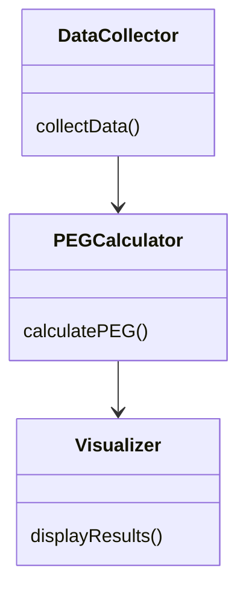
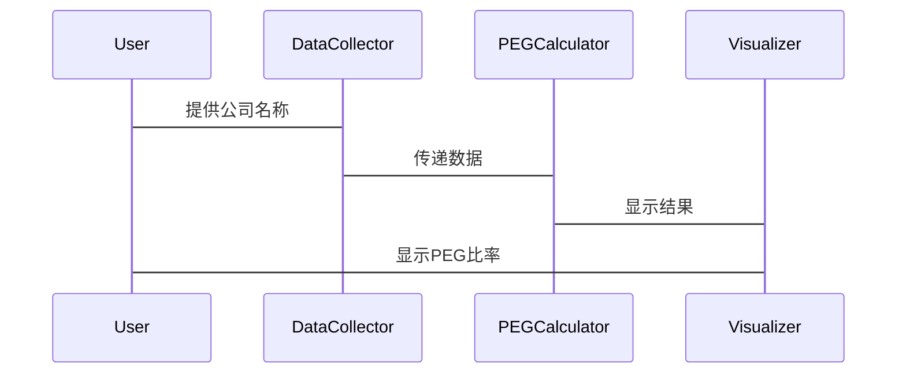

                 


# PEG比率：结合增长预期的动态估值方法

> 关键词：PEG比率，动态估值，增长预期，投资决策，股票估值，市盈率优化

> 摘要：PEG比率是一种结合公司增长率的动态估值方法，弥补了传统市盈率（PE）估值法的不足，帮助投资者更准确地评估股票价值。本文系统地介绍PEG比率的背景、理论基础、核心原理、实际应用、系统架构设计、项目实战以及最佳实践，为投资者和程序员提供深度的技术分析和实践指导。

---

## 第1章：PEG比率的背景与概念

### 1.1 PEG比率的起源与定义

PEG比率（Price-to-Earnings-to-Growth ratio）是一种结合公司增长率的动态估值方法，旨在更准确地评估股票的价值。它由投资者约翰·内夫（John Neff）在20世纪60年代提出，旨在弥补传统市盈率（PE）估值法的不足。

#### 1.1.1 传统估值方法的局限性

传统市盈率（PE）仅考虑公司的当前盈利情况，忽略了公司的增长潜力。例如，一家高增长的科技公司可能具有较高的PE，但其未来的盈利能力可能超过低增长的传统制造业公司。因此，PE并不能全面反映公司的价值。

#### 1.1.2 PEG比率的提出背景

PEG比率的提出是为了将公司的增长率因素纳入估值模型。通过将市盈率与公司增长率相结合，投资者可以更全面地评估公司的价值。

#### 1.1.3 PEG比率的定义与核心要素

PEG比率的定义为：

$$
PEG = \frac{市盈率 (PE)}{年增长率 (g)}
$$

其中，市盈率（PE）是股票价格与每股收益（EPS）的比值，年增长率（g）是公司未来几年的预期年增长率。

### 1.2 PEG比率与市盈率（PE）的区别

#### 1.2.1 市盈率（PE）的局限性

市盈率仅考虑当前盈利情况，忽视了公司的增长潜力。例如，一家高增长的公司可能具有较高的PE，但其未来的盈利能力可能超过低增长的传统公司。

#### 1.2.2 PEG比率的改进与优势

PEG比率通过引入增长率因素，弥补了PE的不足。它能够更准确地反映公司的潜在价值，尤其适用于高增长行业。

#### 1.2.3 PEG比率的适用场景

PEG比率适用于成长型公司，尤其是科技、互联网等行业，这些行业的公司通常具有较高的增长率。

---

## 第2章：PEG比率的理论基础

### 2.1 市盈率（PE）的计算与分析

#### 2.1.1 市盈率的定义与计算公式

市盈率（PE）的计算公式为：

$$
PE = \frac{股票价格}{每股收益 (EPS)}
$$

#### 2.1.2 市盈率的行业基准与比较

不同行业的市盈率基准不同。例如，科技行业的市盈率通常高于传统制造业。

#### 2.1.3 市盈率的局限性与改进方向

市盈率忽视了公司的增长潜力，PEG比率通过引入增长率因素改进了这一问题。

### 2.2 增长率的定义与计算

#### 2.2.1 增长率的定义与分类

增长率是指公司收入或利润的预期增长速度，通常分为年增长率和复合年增长率（CAGR）。

#### 2.2.2 增长率的计算方法

增长率可以通过历史数据预测，也可以通过行业平均水平估计。

#### 2.2.3 增长率的影响因素

增长率受市场需求、行业竞争、公司管理等因素影响。

### 2.3 PEG比率的数学模型与公式

#### 2.3.1 PEG比率的公式推导

PEG比率的公式推导如下：

$$
PEG = \frac{PE}{g}
$$

其中，PE是市盈率，g是年增长率。

#### 2.3.2 PEG比率的数学模型

PEG比率的数学模型可以表示为：

$$
PEG = \frac{\frac{P}{EPS}}{g} = \frac{P}{EPS \times g}
$$

#### 2.3.3 PEG比率的适用条件与限制

PEG比率适用于高增长公司，但需要注意增长率的准确性，避免过高或过低的估计。

---

## 第3章：PEG比率的核心原理与应用

### 3.1 PEG比率的核心原理

#### 3.1.1 增长率与估值的关系

增长率高的公司通常具有较高的PEG比率，但合理的PEG比率应低于1，表示公司估值合理。

#### 3.1.2 PEG比率的动态调整机制

PEG比率可以根据市场变化和公司业绩进行动态调整，帮助投资者及时评估股票价值。

#### 3.1.3 PEG比率的多维度分析

PEG比率结合了市盈率和增长率，能够更全面地评估公司价值。

### 3.2 PEG比率与企业价值的关系

#### 3.2.1 企业价值的定义与计算

企业价值（EV）是公司整体价值的度量，包括股权和债务。

#### 3.2.2 PEG比率对企业价值的影响

PEG比率可以帮助投资者评估企业价值是否合理。

#### 3.2.3 PEG比率的行业差异与适用性

不同行业的PEG比率基准不同，需结合行业特点进行分析。

### 3.3 PEG比率的实践应用

#### 3.3.1 PEG比率在投资决策中的应用

投资者可以通过计算PEG比率，选择具有合理估值的股票。

#### 3.3.2 PEG比率的实际计算步骤

1. 计算市盈率（PE）。
2. 确定公司的预期增长率（g）。
3. 计算PEG比率（PE / g）。

#### 3.3.3 PEG比率的行业比较

通过比较同行业公司的PEG比率，可以评估公司的相对估值水平。

---

## 第4章：PEG比率的实际应用

### 4.1 PEG比率的实际计算步骤

#### 4.1.1 收集数据

收集公司的股价、每股收益和预期增长率。

#### 4.1.2 计算市盈率（PE）

$$
PE = \frac{股价}{EPS}
$$

#### 4.1.3 计算PEG比率

$$
PEG = \frac{PE}{g}
$$

### 4.2 PEG比率的行业应用

#### 4.2.1 高增长行业的PEG比率分析

科技行业公司通常具有较高的增长率，适合使用PEG比率进行估值。

#### 4.2.2 低增长行业的PEG比率分析

传统制造业公司增长率较低，PEG比率可能高于1，需谨慎评估。

### 4.3 PEG比率的动态调整

#### 4.3.1 根据市场变化调整PEG比率

市场波动可能会影响公司的增长率和股价，需定期更新PEG比率。

#### 4.3.2 根据公司业绩调整PEG比率

公司业绩变化会影响增长率和股价，需动态调整PEG比率。

---

## 第5章：系统分析与架构设计

### 5.1 系统功能设计

#### 5.1.1 功能模块划分

- 数据获取模块：获取公司股价、EPS和增长率数据。
- PEG计算模块：计算PEG比率。
- 数据可视化模块：展示PEG比率分析结果。

#### 5.1.2 领域模型（Mermaid 类图）



### 5.2 系统架构设计

#### 5.2.1 系统架构图（Mermaid 架构图）


### 5.3 系统接口设计

#### 5.3.1 数据接口

- 输入：公司股价、EPS、增长率。
- 输出：PEG比率。

#### 5.3.2 用户接口

- 输入：公司名称。
- 输出：PEG比率分析结果。

### 5.4 系统交互设计（Mermaid 序列图）



---

## 第6章：项目实战

### 6.1 项目环境安装

#### 6.1.1 安装Python

```bash
python --version
pip install numpy pandas matplotlib
```

#### 6.1.2 安装数据获取库

```bash
pip install yfinance
```

### 6.2 核心代码实现

#### 6.2.1 数据获取

```python
import yfinance as yf

def get_data(ticker):
    df = yf.download(ticker, start='2023-01-01', end='2023-12-31')
    return df
```

#### 6.2.2 PEG比率计算

```python
def calculate_peg(pe, growth_rate):
    return pe / growth_rate
```

#### 6.2.3 数据可视化

```python
import matplotlib.pyplot as plt

def plot_peg(peg_values):
    plt.plot(peg_values, label='PEG比率')
    plt.xlabel('时间')
    plt.ylabel('PEG比率')
    plt.legend()
    plt.show()
```

### 6.3 案例分析

#### 6.3.1 案例选择

以苹果公司（AAPL）为例，计算其PEG比率。

#### 6.3.2 数据计算

假设苹果公司股价为150美元，EPS为10美元，预期增长率为10%。

计算PE：

$$
PE = \frac{150}{10} = 15
$$

计算PEG：

$$
PEG = \frac{15}{0.1} = 150
$$

---

## 第7章：最佳实践与注意事项

### 7.1 最佳实践

- 确保增长率数据的准确性。
- 结合其他估值指标进行综合分析。

### 7.2 小结

PEG比率是一种动态估值方法，能够更准确地反映公司价值，但需要注意增长率的准确性。

### 7.3 注意事项

- 避免过高或过低估计增长率。
- 结合行业特点进行分析。

---

## 第8章：未来展望

### 8.1 PEG比率的未来发展

PEG比率将继续在投资领域发挥重要作用，尤其是在高增长行业。

### 8.2 与其他技术的结合

PEG比率可能与AI和大数据技术结合，提供更精准的估值模型。

### 8.3 对投资策略的影响

PEG比率将帮助投资者制定更科学的投资策略，尤其是在动态调整投资组合时。

---

## 作者：AI天才研究院/AI Genius Institute & 禅与计算机程序设计艺术 /Zen And The Art of Computer Programming

---

本文通过系统地介绍PEG比率的背景、理论基础、核心原理、实际应用、系统架构设计、项目实战以及最佳实践，为投资者和程序员提供了深度的技术分析和实践指导。希望读者能够通过本文更好地理解和应用PEG比率，提升投资决策的科学性和准确性。

