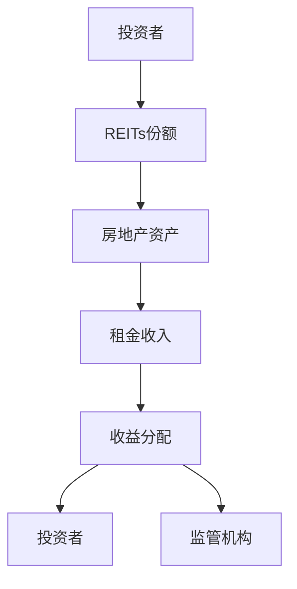
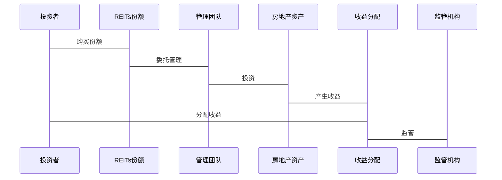
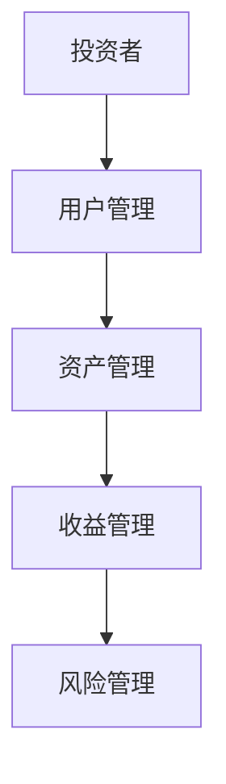
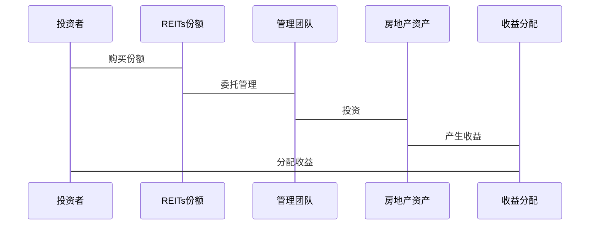

                 


# REITs投资：房地产市场的流动性解决方案

> 关键词：REITs，房地产，流动性，投资，金融工具

> 摘要：REITs（房地产投资信托基金）作为房地产市场的重要金融工具，通过提供高流动性、分散风险和透明化的投资方式，解决了传统房地产投资中的流动性不足问题。本文从REITs的核心概念、数学模型、系统架构到项目实战，全面解析REITs如何为房地产市场提供流动性解决方案。

---

## 第1章: REITs投资概述

### 1.1 REITs的基本概念

#### 1.1.1 什么是REITs
REITs（房地产投资信托基金）是一种通过汇集投资者资金，用于投资房地产资产（如办公楼、零售物业、酒店等）的金融工具。REITs将房地产的所有权分散化，投资者可以通过购买REITs的份额间接持有房地产资产。

#### 1.1.2 REITs的起源与发展
REITs起源于20世纪60年代，目的是让更多投资者能够通过购买股票的方式参与房地产市场。目前，全球有多个国家和地区建立了REITs市场，成为房地产融资的重要渠道。

#### 1.1.3 REITs的分类与特点
REITs可以分为权益型REITs和抵押型REITs：
- **权益型REITs**：直接持有房地产资产，收益来自租金收入和资本增值。
- **抵押型REITs**：通过发放房地产抵押贷款获得收益。

### 1.2 REITs的运作机制

#### 1.2.1 REITs的运作模式
REITs通过专业管理团队进行房地产投资，投资者通过购买REITs份额获得收益，包括租金收入和资本增值。

#### 1.2.2 REITs的收益来源
REITs的收益主要来自：
1. 租金收入
2. 资本增值
3. 抵押贷款利息收入

#### 1.2.3 REITs的市场定位
REITs为投资者提供了一种低门槛、高流动性的房地产投资方式，特别适合中小投资者。

### 1.3 REITs与房地产市场的关系

#### 1.3.1 REITs在房地产市场中的作用
REITs通过将房地产资产证券化，提高了房地产市场的流动性和透明度。

#### 1.3.2 REITs如何解决房地产流动性问题
REITs将房地产资产转化为可流动的金融产品，解决了传统房地产投资中的流动性不足问题。

#### 1.3.3 REITs对房地产投资的影响
REITs降低了房地产投资的门槛，吸引了更多投资者进入房地产市场，增加了市场的活跃度。

---

## 第2章: REITs的核心概念与联系

### 2.1 REITs的核心概念

#### 2.1.1 REITs的定义与属性
REITs是一种通过汇集资金投资房地产资产的金融工具，具有高流动性、低门槛、高透明度的特点。

#### 2.1.2 REITs的运作原理
REITs通过专业管理团队进行房地产投资，收益通过分红或资本增值分配给投资者。

#### 2.1.3 REITs的收益结构
REITs的收益结构包括租金收入、资本增值和抵押贷款利息收入。

### 2.2 REITs与房地产市场的关系

#### 2.2.1 REITs在房地产市场中的角色
REITs是房地产市场的流动性提供者，通过证券化将房地产资产转化为可流动的金融产品。

#### 2.2.2 REITs如何影响房地产流动性
REITs通过提高房地产资产的流动性，降低了投资者的资金锁定期，提高了市场的活跃度。

#### 2.2.3 REITs对房地产投资的影响
REITs通过分散化投资降低了房地产投资的风险，吸引了更多投资者进入房地产市场。

### 2.3 REITs的实体关系图

#### 2.3.1 REITs的ER实体关系图
```mermaid
er
  actor 投资者
  actor 管理团队
  actor 投资者
  actor 金融机构
  actor 监管机构

  entity REITs份额
  entity 房地产资产
  entity 收益分配
  entity 风险管理

  投资者 --> REITs份额: 购买
  管理团队 --> REITs份额: 管理
  REITs份额 --> 房地产资产: 持有
  房地产资产 --> 收益分配: 产生
  收益分配 --> 投资者: 分配
  风险管理 --> 监管机构: 监管
```

#### 2.3.2 REITs的系统架构图


#### 2.3.3 REITs的交互流程图


---

## 第3章: REITs的数学模型与算法原理

### 3.1 REITs的数学模型

#### 3.1.1 REITs的收益计算公式
REITs的内部收益率（IRR）计算公式：
$$IRR = \frac{\sum_{t=1}^{n} \frac{CF_t}{(1 + r)^t}}{I}$$
其中，$CF_t$为第$t$年的现金流，$r$为折现率，$I$为初始投资。

#### 3.1.2 REITs的净现值（NPV）计算
NPV计算公式：
$$NPV = \sum_{t=1}^{n} \frac{CF_t}{(1 + r)^t}$$

#### 3.1.3 REITs的风险评估模型
使用CAPM模型评估REITs的预期收益：
$$E(R) = R_f + \beta (R_m - R_f)$$
其中，$E(R)$为预期收益，$R_f$为无风险利率，$\beta$为贝塔系数，$R_m$为市场预期收益。

### 3.2 REITs的算法原理

#### 3.2.1 REITs的现金流分析
REITs的现金流主要来自租金收入和资本增值。

#### 3.2.2 REITs的定价模型
使用Fama-Jensen模型评估REITs的定价：
$$R_i = \alpha + \beta R_m + \epsilon_i$$
其中，$R_i$为资产收益，$\alpha$为截距，$\beta$为贝塔系数，$R_m$为市场收益，$\epsilon_i$为误差项。

#### 3.2.3 REITs的风险评估模型
使用VaR（在险价值）模型评估REITs的风险。

---

## 第4章: REITs的系统分析与架构设计

### 4.1 REITs的投资管理系统

#### 4.1.1 系统功能设计
- 用户管理
- 资产管理
- 收益管理
- 风险管理

#### 4.1.2 系统架构设计


#### 4.1.3 系统接口设计
- 用户接口：购买、查看收益
- 管理接口：资产配置、风险控制

### 4.2 REITs的交互流程图

#### 4.2.1 REITs的用户交互流程


#### 4.2.2 REITs的数据流分析
- 投资者资金流入系统
- 管理团队处理投资
- 收益分配给投资者

#### 4.2.3 REITs的系统架构图


---

## 第5章: REITs的项目实战

### 5.1 REITs的环境安装

#### 5.1.1 开发环境的搭建
- 安装Python
- 安装Jupyter Notebook
- 安装相关库（pandas, numpy, matplotlib）

### 5.2 REITs的核心实现源代码

#### 5.2.1 计算REITs的内部收益率
```python
import numpy as np

def calculateIRR(cash_flows, initial_investment):
    # 现金流入
    cash_flows = [initial_investment] + cash_flows
    # 计算IRR
    irr = np.irr(cash_flows)
    return irr

# 示例
cash_flows = [100, 200, 300]
initial_investment = -600
irr = calculateIRR(cash_flows, initial_investment)
print(f"IRR: {irr}")
```

#### 5.2.2 REITs的收益分析
```python
import pandas as pd
import matplotlib.pyplot as plt

data = {'Year': [2020, 2021, 2022],
        'Revenue': [100, 200, 300]}
df = pd.DataFrame(data)
df.plot(kind='bar', x='Year', y='Revenue')
plt.show()
```

### 5.3 REITs的实际案例分析

#### 5.3.1 案例背景
某REITs基金投资于办公楼，预计每年租金收入为100万元，资本增值率为5%。

#### 5.3.2 计算IRR
```python
import numpy as np

cash_flows = [100, 200, 300]
initial_investment = -600
irr = np.irr([100, 200, 300])
print(f"IRR: {irr}")
```

### 5.4 项目小结

---

## 第6章: 最佳实践、小结、注意事项与拓展阅读

### 6.1 最佳实践
- 投资者应根据自身风险承受能力选择REITs类型。
- 关注REITs的管理团队和资产质量。

### 6.2 小结
REITs通过证券化将房地产资产转化为流动性高的金融产品，解决了房地产市场的流动性问题，为投资者提供了多样化的投资选择。

### 6.3 注意事项
- REITs存在市场风险和流动性风险。
- 投资者需关注REITs的杠杆率和资本结构。

### 6.4 拓展阅读
- REITs与房地产金融创新
- REITs在房地产市场中的风险管理

---

## 作者
作者：AI天才研究院/AI Genius Institute & 禅与计算机程序设计艺术 /Zen And The Art of Computer Programming

