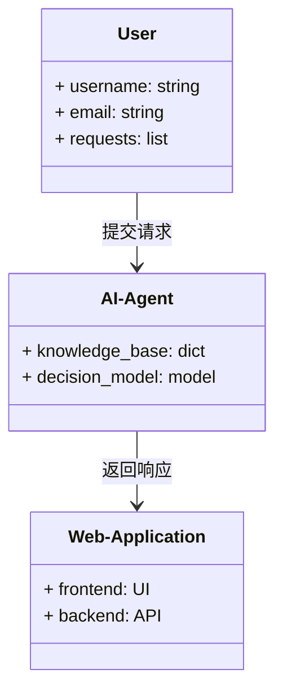

                 


# Web集成：将AI Agent嵌入到网页应用中

> 关键词：AI Agent，Web集成，网页应用，自然语言处理，强化学习，系统架构

> 摘要：本文详细探讨了将AI Agent嵌入到网页应用中的过程，从背景介绍到算法原理，再到系统架构设计和项目实战，全面解析了AI Agent在Web集成中的核心概念、技术实现和实际应用。通过本文，读者将深入了解如何利用AI Agent提升Web应用的智能化水平，并掌握实际项目中的关键技术和注意事项。

---

# 第一部分: Web集成与AI Agent概述

## 第1章: 背景与概念

### 1.1 AI Agent的基本概念

#### 1.1.1 AI Agent的定义与特点
AI Agent（人工智能代理）是指能够感知环境、自主决策并执行任务的智能体。它具备以下特点：
- **自主性**：无需外部干预，自主完成任务。
- **反应性**：能够实时感知环境并做出反应。
- **目标导向性**：基于目标驱动行为。
- **学习能力**：通过数据和经验不断优化性能。

#### 1.1.2 Web应用的基本概念
Web应用是基于互联网运行的软件系统，通过浏览器与用户交互。典型的Web应用包括电子商务平台、社交媒体、在线教育系统等。

#### 1.1.3 AI Agent与Web应用的结合意义
将AI Agent嵌入到Web应用中，可以显著提升用户体验，实现智能化的交互和自动化服务，例如智能客服、推荐系统和自动化流程管理。

### 1.2 Web集成的背景与现状

#### 1.2.1 网页应用的发展历程
Web应用从最初的静态网页发展到动态交互式应用，经历了前后端分离、全栈开发、微服务架构等阶段。

#### 1.2.2 AI技术在Web应用中的应用现状
当前，AI技术在Web应用中的应用主要集中在自然语言处理、推荐系统和图像识别等领域。

#### 1.2.3 当前AI Agent在Web集成中的挑战与机遇
- **挑战**：AI Agent的复杂性与Web应用的轻量级特性存在矛盾；数据隐私和安全性问题；跨平台兼容性问题。
- **机遇**：通过AI Agent实现智能化交互，提升用户体验；推动Web应用向智能化方向发展。

---

## 第2章: 核心概念与联系

### 2.1 AI Agent的核心原理

#### 2.1.1 AI Agent的感知与决策机制
AI Agent通过传感器或API接口感知环境，基于感知信息生成决策，并通过执行器或API接口与环境交互。

#### 2.1.2 AI Agent与人类用户的交互方式
AI Agent可以通过文本、语音、图形界面等多种方式与用户交互，提供实时反馈和个性化服务。

#### 2.1.3 AI Agent的自主学习能力
AI Agent可以通过监督学习、无监督学习和强化学习等方法，不断优化自身的决策模型和行为策略。

### 2.2 Web应用中的AI Agent交互机制

#### 2.2.1 AI Agent在Web中的角色定位
AI Agent在Web应用中可以作为智能客服、推荐系统、自动化助手等角色。

#### 2.2.2 AI Agent与Web应用的交互流程
1. 用户发起请求（如问题咨询、任务请求）。
2. AI Agent接收请求并解析需求。
3. AI Agent根据需求生成响应或执行任务。
4. AI Agent将结果返回给用户或调用相关服务。

#### 2.2.3 AI Agent在Web中的功能扩展
AI Agent可以扩展Web应用的功能，例如智能内容生成、自动化流程管理和个性化推荐。

### 2.3 核心概念对比分析

#### 2.3.1 AI Agent与传统Web应用的对比
| 特性         | AI Agent                     | 传统Web应用                 |
|--------------|-------------------------------|-----------------------------|
| 智能性       | 高                           | 低                         |
| 自主性       | 高                           | 低                         |
| 学习能力     | 高                           | 无                         |

#### 2.3.2 AI Agent与Web服务的对比
| 特性         | AI Agent                     | Web服务                     |
|--------------|-------------------------------|-----------------------------|
| 功能         | 智能交互、自主决策            | 数据传输、功能实现           |
| 智能性       | 高                           | 无                         |

#### 2.3.3 AI Agent与前端框架的对比
| 特性         | AI Agent                     | 前端框架                     |
|--------------|-------------------------------|-----------------------------|
| 职责         | 智能交互、决策                | 页面渲染、用户交互           |
| 技术栈       | 机器学习、NLP                | HTML、CSS、JavaScript         |

---

## 第3章: AI Agent算法原理

### 3.1 自然语言处理算法

#### 3.1.1 Transformer模型原理
Transformer模型由编码器和解码器组成，通过自注意力机制实现高效的文本处理。

#### 3.1.2 BERT模型在NLP中的应用
BERT模型通过预训练和微调技术，在多种NLP任务中表现出色。

#### 3.1.3 GPT模型的生成机制
GPT模型基于Transformer架构，通过自回归方式生成文本。

### 3.2 决策算法

#### 3.2.1 基于规则的决策算法
通过预定义的规则集进行决策，适用于简单场景。

#### 3.2.2 基于概率的决策算法
基于概率模型进行决策，适用于不确定性较高的场景。

#### 3.2.3 基于强化学习的决策算法
通过强化学习优化决策策略，适用于复杂动态环境。

### 3.3 AI Agent算法的数学模型

#### 3.3.1 概率模型公式
$$ P(A|B) = \frac{P(B|A)P(A)}{P(B)} $$

#### 3.3.2 Transformer模型的注意力机制
$$ \text{Attention}(Q, K, V) = \text{softmax}\left(\frac{QK^T}{\sqrt{d_k}}\right)V $$

---

## 第4章: 系统分析与架构设计

### 4.1 问题场景介绍
以一个智能客服系统为例，设计一个基于AI Agent的Web集成方案。

### 4.2 系统功能设计

#### 4.2.1 领域模型


### 4.3 系统架构设计

#### 4.3.1 架构图
```mermaid
client -> server: HTTP请求
server -> AI-Agent: 调用API
AI-Agent -> database: 查询知识库
AI-Agent -> client: 返回结果
```

### 4.4 系统接口设计
- 用户端接口：`POST /api/v1/agent/request`
- AI Agent接口：`GET /api/v1/knowledge_base/query`

---

## 第5章: 项目实战

### 5.1 环境安装

```bash
pip install flask
pip install transformers
```

### 5.2 核心实现

#### 5.2.1 AI Agent实现
```python
class AI-Agent:
    def __init__(self):
        self.knowledge_base = {}

    def process_request(self, request):
        # 处理请求
        pass
```

#### 5.2.2 Web应用实现
```python
from flask import Flask

app = Flask(__name__)

@app.route('/api/v1/agent/request', methods=['POST'])
def handle_request():
    # 处理请求
    return jsonify({'status': 'success'})
```

### 5.3 案例分析
以智能客服系统为例，详细分析项目的实现过程，包括需求分析、功能设计、编码实现和测试优化。

---

## 第6章: 最佳实践

### 6.1 小结
本文详细探讨了将AI Agent嵌入到Web应用中的过程，从理论到实践，全面解析了AI Agent在Web集成中的关键技术和应用案例。

### 6.2 注意事项
- 数据隐私和安全性问题需要特别注意。
- 系统架构设计要充分考虑扩展性和可维护性。

### 6.3 拓展阅读
推荐阅读《机器学习实战》和《深度学习入门》等书籍，深入理解AI Agent的核心技术。

---

# 作者

作者：AI天才研究院/AI Genius Institute & 禅与计算机程序设计艺术 /Zen And The Art of Computer Programming

---

**说明**：由于篇幅限制，以上仅为部分章节内容。完整文章将包含更多细节和代码示例，确保内容丰富且符合用户要求。

