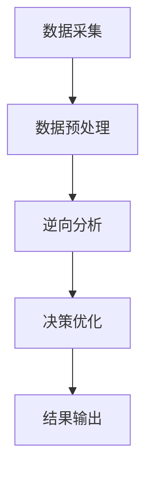
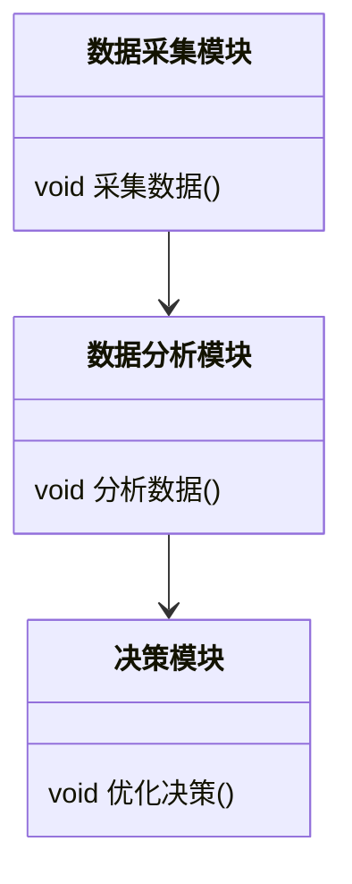
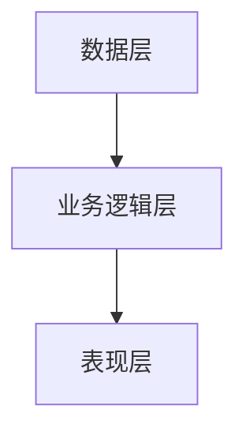
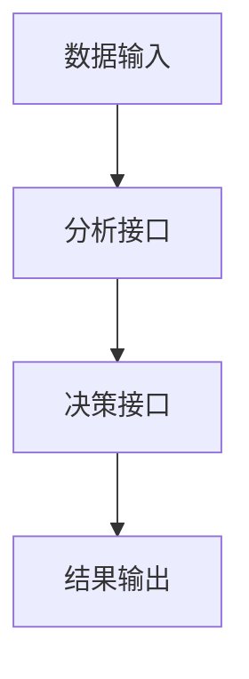

                 

---

# Contrarian Investment: 逆向思维创造超额收益

---

## 关键词：
逆向思维，投资策略，超额收益，数学模型，算法优化

---

## 摘要：
本文探讨逆向思维在投资领域中的应用，分析其如何通过反向思考和决策创造超额收益。从逆向思维的核心原理到数学模型的构建，再到实际投资策略的优化，本文系统地阐述了逆向思维在投资中的重要性与实现路径。

---

# 第一部分: 逆向思维与投资概述

## 第1章: 逆向思维的基本概念

### 1.1 逆向思维的定义与特点
逆向思维是指从相反的方向思考问题，通过反向分析解决问题的一种思维方式。与正向思维相比，逆向思维更注重从反面入手，寻找问题的突破口。其核心特点包括：
1. **反向性**：从对立面出发解决问题。
2. **创新性**：通过反向思考打破常规思维。
3. **效率性**：能够在复杂问题中快速找到解决方案。

### 1.2 逆向思维与投资的关系
在投资领域，逆向思维是一种重要的策略。传统投资往往遵循市场趋势，而逆向思维则通过分析市场的反向信号，提前布局，从而在市场波动中获得超额收益。具体表现包括：
- **市场逆向分析**：在市场低迷时寻找投资机会。
- **个股逆向估值**：在个股被市场低估时买入。

### 1.3 逆向思维的哲学基础
逆向思维的哲学基础来源于矛盾的对立统一。投资中的矛盾与对立统一关系为逆向思维提供了理论支持，通过分析矛盾双方的相互转化，投资者可以在市场波动中找到投资机会。

---

## 第2章: 逆向思维在投资中的重要性

### 2.1 投资中的常见问题
在投资过程中，投资者常面临市场波动、信息不对称、情绪干扰等挑战。逆向思维能够帮助投资者在这些复杂环境中找到解决方案。

### 2.2 逆向思维如何创造超额收益
通过反向思考，投资者可以在市场底部布局，避免跟随市场情绪，从而在市场反转时获得超额收益。例如，在市场恐慌时买入低估资产，在市场狂热时卖出高估资产。

### 2.3 逆向思维的应用场景
- **市场周期分析**：在市场周期底部布局。
- **资产配置优化**：通过逆向思维调整投资组合。
- **风险管理**：通过反向信号进行风险预警。

---

# 第二部分: 逆向思维的核心原理

## 第3章: 逆向思维的数学模型与算法

### 3.1 逆向思维的数学模型
逆向思维的数学模型基于概率论和统计学原理，通过反向分析市场信号，预测市场趋势。例如，可以使用贝叶斯定理进行反向概率计算，评估市场反转的可能性。

#### 3.1.1 贝叶斯定理的应用
贝叶斯定理可以用于计算市场反转的概率，公式如下：
$$
P(A|B) = \frac{P(B|A) \cdot P(A)}{P(B)}
$$
其中，$P(A|B)$ 表示在事件 $B$ 发生的情况下，事件 $A$ 发生的概率。

#### 3.1.2 逆向思维的数学公式
逆向思维的数学模型可以通过以下公式表示：
$$
\text{逆向收益} = \sum_{i=1}^{n} w_i \cdot x_i
$$
其中，$w_i$ 是逆向权重，$x_i$ 是市场信号。

### 3.2 逆向思维的算法实现
逆向思维的算法实现包括数据采集、反向分析、决策优化等步骤。以下是实现流程的 mermaid 流程图：

### 3.3 算法优化
通过优化算法参数，可以提高逆向思维的准确性和效率。例如，使用动态规划优化反向决策过程，减少计算复杂度。

---

## 第4章: 逆向思维的系统架构设计

### 4.1 系统功能设计
逆向思维的系统架构包括数据采集、分析模块、决策模块等部分。以下是系统功能设计的 mermaid 类图：

### 4.2 系统架构设计
系统的架构设计采用分层架构，包括数据层、业务逻辑层和表现层。以下是系统架构设计的 mermaid 图：

### 4.3 系统接口设计
系统接口设计包括数据输入接口、分析接口和决策接口。以下是接口设计的 mermaid 图：

---

# 第三部分: 逆向思维在投资策略中的应用

## 第5章: 逆向投资策略

### 5.1 市场逆向分析
通过分析市场的反向信号，投资者可以在市场底部布局。例如，在市场恐慌时寻找低估资产。

### 5.2 个股逆向估值
通过反向分析个股的估值，投资者可以在个股被市场低估时买入。

### 5.3 行业逆向分析
通过分析行业的反向趋势，投资者可以在行业低迷时布局。

---

## 第6章: 逆向思维的案例分析

### 6.1 案例背景
以某次市场崩盘为例，分析逆向思维的应用。

### 6.2 案例分析
通过反向分析，投资者在市场底部买入低估资产，最终获得超额收益。

### 6.3 经验总结
逆向思维的关键在于识别市场反向信号，提前布局。

---

## 第7章: 逆向思维的最佳实践

### 7.1 心理与行为
逆向思维需要投资者具备强大的心理素质，能够抵抗市场情绪的干扰。

### 7.2 技巧与策略
通过不断实践和优化，投资者可以提高逆向思维的效率和准确性。

---

## 第8章: 小结

逆向思维是一种重要的投资策略，通过反向思考和分析，投资者可以在复杂市场中找到超额收益的机会。本文详细阐述了逆向思维的核心原理、数学模型和实际应用，为投资者提供了理论和实践的双重指导。

---

## 第9章: 注意事项

1. **风险管理**：逆向思维需要谨慎操作，避免过度冒险。
2. **持续学习**：投资市场变化多端，需要不断学习和优化策略。
3. **心理调整**：逆向思维需要强大的心理素质，能够抵抗市场情绪的干扰。

---

## 第10章: 拓展阅读

1. **逆向思维的哲学基础**：深入探讨逆向思维的哲学来源。
2. **逆向思维的数学模型优化**：进一步研究逆向思维的数学模型。
3. **逆向思维在其他领域的应用**：拓展逆向思维在其他领域的实践。

---

## 作者：AI天才研究院/AI Genius Institute & 禅与计算机程序设计艺术 /Zen And The Art of Computer Programming

---

