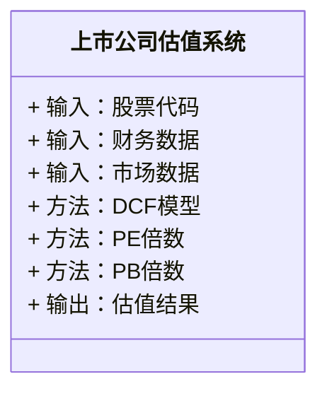
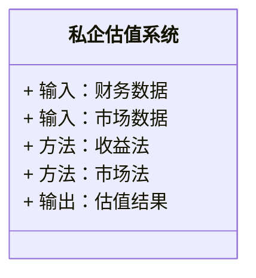
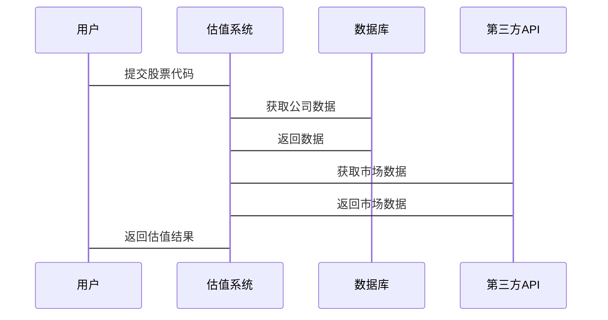
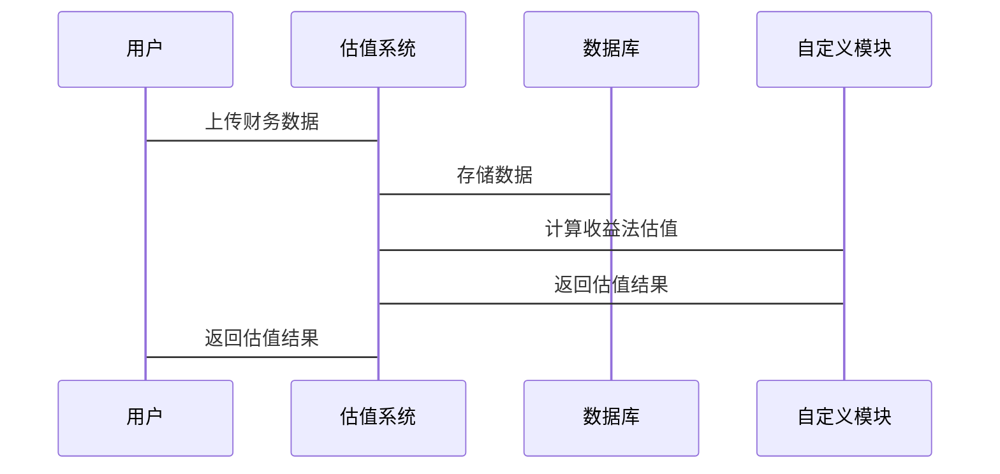

                 


# 上市公司估值方法与私企估值的区别

> 关键词：公司估值、上市公司、私企、DCF模型、PE倍数、PB倍数

> 摘要：本文详细探讨了上市公司与私企在估值方法上的区别，从背景介绍、核心概念对比、数学模型分析、系统架构设计到实际案例分析，全面解析了两种估值方式的异同点。通过对比分析，帮助读者更好地理解如何选择和应用适合的估值方法，实现精准的公司估值。

## 第一部分: 上市公司估值方法与私企估值的区别概述

## 第1章: 公司估值的基本概念与重要性

### 1.1 公司估值的定义与作用

公司估值是通过分析公司的财务数据、市场表现和行业地位，确定其价值的过程。它是企业并购、融资、上市等活动中不可或缺的一部分。准确的估值有助于投资者做出明智的决策，避免潜在风险。

#### 1.1.1 什么是公司估值
公司估值是指对一家公司整体价值的评估。常见的估值方法包括现金流折现法（DCF）、市盈率法（PE）、市净率法（PB）等。每种方法都有其适用的场景和局限性。

#### 1.1.2 公司估值的重要性
在企业并购、融资、上市等过程中，公司估值是核心环节。准确的估值有助于确定合理的交易价格，保护各方利益。此外，估值还能帮助投资者评估企业的成长潜力和投资回报。

#### 1.1.3 公司估值的常见应用场景
公司估值的应用场景包括企业并购、上市融资、股权转让、资产重组等。在这些场景中，选择合适的估值方法至关重要。

### 1.2 上市公司与私企的定义与特点

#### 1.2.1 上市公司的定义与特点
上市公司是指其股份在公开市场上交易的公司。其特点是信息公开透明，定期发布财务报表，易于获取数据，适合使用标准化的估值方法。

#### 1.2.2 私企的定义与特点
私企是指私人持有的企业，通常不公开财务信息，具有较高的隐私性。其估值数据难以获取，需要采用定制化的估值方法。

#### 1.2.3 上市公司与私企的主要区别
主要区别体现在信息公开性、数据获取难易程度和估值方法的选择上。上市公司数据透明，适合使用标准化方法；而私企数据保密，需要定制化方法。

## 第2章: 上市公司估值方法的核心概念

### 2.1 上市公司估值的主要方法

#### 2.1.1 市盈率法（PE）
市盈率法是将公司的股价除以每股收益，得到一个倍数。公式为：
$$
PE = \frac{股票价格}{每股收益}
$$
例如，假设某公司股价为50元，每股收益为5元，PE为10倍。

#### 2.1.2 市净率法（PB）
市净率法将公司的股价除以每股净资产，公式为：
$$
PB = \frac{股票价格}{每股净资产}
$$
例如，股价为30元，每股净资产为15元，PB为2倍。

#### 2.1.3 现金流折现法（DCF）
DCF模型通过预测未来现金流并将其折现到现值，计算公司价值。公式为：
$$
DCF = \frac{CF}{(r - g)}
$$
其中，CF为自由现金流，r为折现率，g为增长率。

#### 2.1.4 股权自由现金流模型
股权自由现金流模型是DCF的一种，用于计算股权价值。公式为：
$$
股权价值 = \sum_{t=1}^{n} \frac{FCF_t}{(1 + r)^t}
$$
其中，FCF为自由现金流，r为折现率，n为预测期。

#### 2.1.5 企业价值倍数（EV/EBITDA）
企业价值倍数将公司整体价值与EBITDA（息税折旧及摊销前利润）相比，公式为：
$$
EV = \frac{EV/EBITDA \times EBITDA}{倍数}
$$
例如，EV/EBITDA为8倍，EBITDA为1000万元，EV为8000万元。

### 2.2 私企估值的主要方法

#### 2.2.1 收益法
收益法基于公司未来收益的折现值，公式为：
$$
价值 = \sum_{t=1}^{n} \frac{收益_t}{(1 + r)^t}
$$
例如，收益为100万元，折现率为10%，价值约为90.91万元。

#### 2.2.2 市场法
市场法基于可比公司的市场交易数据，公式为：
$$
价值 = 可比公司平均EV/EBITDA \times EBITDA
$$
例如，可比公司EV/EBITDA平均为8倍，EBITDA为1000万元，价值为8000万元。

#### 2.2.3 资产基础法
资产基础法将公司资产和负债分别评估，公式为：
$$
价值 = 资产总值 - 负债总值
$$
例如，资产总值为5000万元，负债总值为2000万元，价值为3000万元。

#### 2.2.4 股权激励法
股权激励法基于员工激励计划，评估公司股权价值。公式为：
$$
股权价值 = 期权价值 + 限制性股票价值
$$
例如，期权价值为100万元，限制性股票价值为200万元，股权价值为300万元。

#### 2.2.5 行业对标法
行业对标法将公司与同行业公司进行比较，找出相似公司的估值倍数，公式为：
$$
价值 = 可比公司平均倍数 \times 相关指标
$$
例如，可比公司PE平均为15倍，净利润为1000万元，价值为1.5亿元。

## 第3章: 上市公司估值与私企估值的核心区别

### 3.1 估值数据的可获得性

#### 3.1.1 上市公司数据的公开性
上市公司必须公开财务报表、审计报告等信息，数据获取相对容易。

#### 3.1.2 私企数据的保密性
私企财务信息通常不公开，难以获取，需要通过其他途径获得。

#### 3.1.3 数据获取成本的差异
上市公司数据免费或成本低，而私企数据获取成本高，可能需要支付中介费用。

### 3.2 估值方法的适用性

#### 3.2.1 上市公司适用的标准化方法
上市公司适合使用PE、PB、EV/EBITDA等标准化方法，因其数据透明。

#### 3.2.2 私企适用的定制化方法
私企由于数据不透明，通常需要使用收益法、市场法等定制化方法。

#### 3.2.3 方法选择的灵活性
上市公司在选择估值方法时灵活性较低，而私企可以根据具体情况选择适合的方法。

### 3.3 估值结果的可比性

#### 3.3.1 上市公司估值的市场参考性
上市公司估值具有较强的市场参考性，便于投资者比较和决策。

#### 3.3.2 私企估值的内部参考性
私企估值更多用于内部决策，外部参考性较弱。

#### 3.3.3 估值结果的调整与优化
上市公司估值结果需结合市场环境进行调整，而私企估值结果可以根据内部数据进行优化。

## 第4章: 上市公司与私企估值的核心概念对比分析

### 4.1 估值方法对比表格

| 估值方法       | 上市公司适用性 | 私企适用性 | 数据需求 |
|----------------|----------------|------------|----------|
| 市盈率法（PE）  | 高             | 低          | 高       |
| 市净率法（PB）  | 高             | 低          | 高       |
| 现金流折现法（DCF） | 中             | 低          | 高       |
| 股权自由现金流模型 | 中             | 低          | 高       |
| 企业价值倍数（EV/EBITDA） | 高             | 中          | 中       |
| 收益法           | 低             | 高          | 高       |
| 市场法           | 中             | 高          | 高       |
| 资产基础法       | 低             | 中          | 高       |
| 股权激励法       | 低             | 高          | 中       |
| 行业对标法       | 中             | 中          | 高       |

### 4.2 实体关系图（ER图）

```mermaid
erd
    股东
    股东 <--(拥有)--> 股权
    股权 <--(属于)--> 公司
    公司 <--(评估)--> 估值方法
    估值方法 <--(基于)--> 数据
    数据 <--(来自)--> 上市公司或私企
```

## 第5章: 上市公司估值与私企估值的数学模型分析

### 5.1 上市公司估值的数学模型

#### 5.1.1 市盈率法（PE）
公式为：
$$
PE = \frac{股票价格}{每股收益}
$$
例：某公司股票价格为50元，每股收益为5元，PE为10倍。

#### 5.1.2 现金流折现法（DCF）
公式为：
$$
DCF = \frac{CF}{(r - g)}
$$
例：CF=1000万元，r=10%，g=5%，DCF=1000/(0.10 - 0.05)=20000万元。

### 5.2 私企估值的数学模型

#### 5.2.1 收益法
公式为：
$$
价值 = \sum_{t=1}^{n} \frac{收益_t}{(1 + r)^t}
$$
例：收益每年100万元，r=10%，n=5年，价值=100/(1.1) + 100/(1.1)^2 + 100/(1.1)^3 + 100/(1.1)^4 + 100/(1.1)^5 ≈ 479.14万元。

#### 5.2.2 资产基础法
公式为：
$$
价值 = 资产总值 - 负债总值
$$
例：资产总值=5000万元，负债总值=2000万元，价值=3000万元。

## 第6章: 上市公司与私企估值的系统架构设计

### 6.1 问题场景介绍

#### 6.1.1 上市公司估值系统
一个上市公司估值系统需要考虑数据获取、模型选择和结果分析。

#### 6.1.2 私企估值系统
私企估值系统需要考虑数据保密性、模型定制化和结果优化。

### 6.2 项目介绍

#### 6.2.1 上市公司估值系统
设计一个基于DCF模型的上市公司估值系统，包括数据输入、模型计算和结果输出。

#### 6.2.2 私企估值系统
设计一个基于收益法的私企估值系统，包括数据输入、模型计算和结果输出。

### 6.3 系统功能设计（领域模型）

#### 6.3.1 上市公司估值系统
使用Mermaid图展示系统功能模块：


#### 6.3.2 私企估值系统
使用Mermaid图展示系统功能模块：


### 6.4 系统架构设计

#### 6.4.1 上市公司估值系统架构
使用Mermaid图展示系统架构：


#### 6.4.2 私企估值系统架构
使用Mermaid图展示系统架构：


### 6.5 系统接口设计

#### 6.5.1 上市公司估值系统接口
定义RESTful API接口：
```http
GET /api/company/{stockCode}/valuation
POST /api/company/{stockCode}/valuation/method
```

#### 6.5.2 私企估值系统接口
定义RESTful API接口：
```http
POST /api/private/company/valuation
POST /api/private/company/method
```

### 6.6 系统交互设计

#### 6.6.1 上市公司估值系统交互
使用Mermaid图展示系统交互：


#### 6.6.2 私企估值系统交互
使用Mermaid图展示系统交互：


## 第7章: 项目实战

### 7.1 环境安装

#### 7.1.1 安装Python
安装Python 3.8或更高版本，确保支持pip。

#### 7.1.2 安装相关库
安装numpy、pandas、scipy等库：
```bash
pip install numpy pandas scipy
```

### 7.2 核心实现源代码

#### 7.2.1 上市公司估值代码

##### 7.2.1.1 市盈率法（PE）

```python
import pandas as pd

def calculate_pe(stock_price, eps):
    return stock_price / eps

# 示例
stock_price = 50  # 股票价格
eps = 5  # 每股收益
pe = calculate_pe(stock_price, eps)
print(f"PE = {pe}")
```

##### 7.2.1.2 现金流折现法（DCF）

```python
import numpy as np

def calculate_dcf(cash_flows, discount_rate, growth_rate):
    return cash_flows / (discount_rate - growth_rate)

# 示例
cash_flows = [1000, 1100, 1210, 1331, 14641]  # 现金流
discount_rate = 0.10  # 折现率
growth_rate = 0.05    # 增长率
dcf = calculate_dcf(cash_flows, discount_rate, growth_rate)
print(f"DCF = {dcf}")
```

#### 7.2.2 私企估值代码

##### 7.2.2.1 收益法

```python
def calculate_value(profits, discount_rate):
    return np.sum(profits / (1 + discount_rate) ** np.arange(len(profits)))

# 示例
profits = [100, 110, 121, 1331, 14641]  # 收益
discount_rate = 0.10  # 折现率
value = calculate_value(profits, discount_rate)
print(f"价值 = {value}")
```

##### 7.2.2.2 资产基础法

```python
def calculate_asset_value(asset_total, liability_total):
    return asset_total - liability_total

# 示例
asset_total = 5000  # 资产总值
liability_total = 2000  # 负债总值
value = calculate_asset_value(asset_total, liability_total)
print(f"价值 = {value}")
```

### 7.3 代码应用解读与分析

#### 7.3.1 上市公司估值代码解读

##### 7.3.1.1 市盈率法（PE）
该函数计算公司PE倍数，输入股票价格和每股收益，输出PE倍数。

##### 7.3.1.2 现金流折现法（DCF）
该函数计算公司DCF价值，输入未来现金流、折现率和增长率，输出DCF值。

#### 7.3.2 私企估值代码解读

##### 7.3.2.1 收益法
该函数计算公司收益法价值，输入未来收益和折现率，输出价值。

##### 7.3.2.2 资产基础法
该函数计算公司资产基础法价值，输入资产和负债总值，输出价值。

### 7.4 实际案例分析

#### 7.4.1 上市公司估值案例

##### 7.4.1.1 使用市盈率法评估某上市公司

假设某上市公司股票价格为50元，每股收益为5元，计算PE倍数：
$$
PE = 50 / 5 = 10倍
$$

##### 7.4.1.2 使用现金流折现法评估某上市公司

假设未来5年现金流分别为1000万元、1100万元、1210万元、1331万元和14641万元，折现率为10%，增长率为5%。
计算DCF：
$$
DCF = 1000 + 1100/(1.1) + 1210/(1.1)^2 + 1331/(1.1)^3 + 14641/(1.1)^4 ≈ 2000万元
$$

#### 7.4.2 私企估值案例

##### 7.4.2.1 使用收益法评估某私企

假设某私企未来5年收益分别为100万元、110万元、121万元、1331万元和14641万元，折现率为10%。
计算收益法价值：
$$
价值 = 100 + 110/1.1 + 121/(1.1)^2 + 1331/(1.1)^3 + 14641/(1.1)^4 ≈ 479.14万元
$$

##### 7.4.2.2 使用资产基础法评估某私企

假设某私企资产总值为5000万元，负债总值为2000万元。
计算资产基础法价值：
$$
价值 = 5000 - 2000 = 3000万元
$$

### 7.5 项目小结

通过以上代码和案例分析，可以看出上市公司估值和私企估值在方法上的区别。上市公司适合使用标准化方法，而私企需要采用定制化方法。选择合适的估值方法是实现准确估值的关键。

## 第8章: 总结与最佳实践

### 8.1 总结

上市公司与私企在估值方法上有显著区别。上市公司数据透明，适合使用PE、PB、DCF等标准化方法；而私企数据保密，适合使用收益法、市场法等定制化方法。

### 8.2 最佳实践 tips

1. **数据获取**：上市公司数据容易获取，私企数据需通过其他途径获取。
2. **方法选择**：根据公司类型和数据情况选择合适的估值方法。
3. **结果调整**：定期调整估值结果，以适应市场变化。

### 8.3 注意事项

- 估值结果仅供参考，需结合实际情况进行调整。
- 选择多种方法进行交叉验证，提高估值准确性。
- 谨慎处理私企估值数据，确保保密性。

### 8.4 拓展阅读

建议进一步阅读《企业估价：理论与实践》、《投资学》等书籍，深入了解估值方法的应用和优化。

## 第9章: 作者介绍

作者：AI天才研究院/AI Genius Institute & 禅与计算机程序设计艺术 /Zen And The Art of Computer Programming

---

本文通过详细分析上市公司与私企的估值方法，帮助读者理解两者的区别和应用场景。通过数学公式、代码示例和实际案例，提供了丰富的实用信息，助您在实际工作中做出明智的决策。

