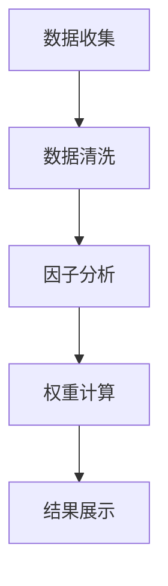
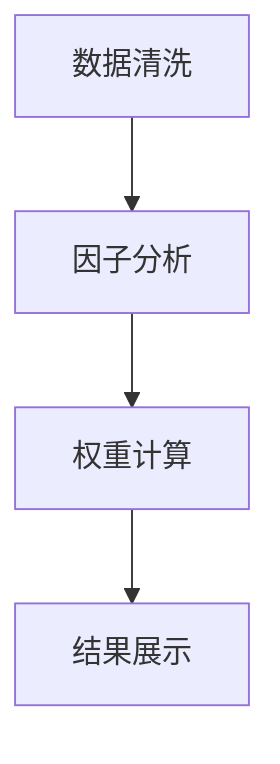
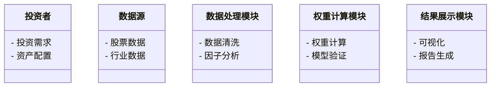

                 


# 不同行业在全球股市估值中的权重分析

> **关键词**：全球股市，行业估值，权重分析，因子分析，股票投资，市场波动

> **摘要**：本文系统地分析了不同行业在全球股市中的估值权重，通过因子分析、回归分析等方法，结合实际案例，深入探讨了行业权重对股市估值的影响。文章从背景、核心概念、算法原理、系统设计、项目实战等多个维度展开，为读者提供了全面的行业权重分析框架。

---

## 第一部分: 不同行业在全球股市估值中的权重分析背景与概念

### 第1章: 背景介绍与核心概念

#### 1.1 问题背景与重要性
股票市场是反映经济状况的重要指标，而不同行业的权重（即行业在市场中的影响力）决定了其对整体股市的影响程度。理解行业权重不仅有助于投资者制定投资策略，还能帮助机构分析市场风险和机会。

- **1.1.1 全球股市估值的重要性**  
  股票估值是衡量企业价值的核心指标，而行业的整体权重则反映了该行业在经济中的地位。例如，科技行业在全球股市中的权重通常较高，因其创新能力强且占据较大市场份额。

- **1.1.2 不同行业在股市中的权重差异**  
  不同行业的权重因市场规模、盈利能力、行业集中度等因素而异。例如，金融行业在成熟市场中权重较高，而科技行业在新兴市场中权重较高。

- **1.1.3 研究行业权重对投资决策的意义**  
  投资者通过分析行业权重，可以优化资产配置，降低风险，抓住高增长行业的投资机会。

#### 1.2 核心概念与定义
为了准确分析行业权重，我们需要明确以下核心概念：

- **1.2.1 行业分类与标准**  
  行业通常按照《国际标准行业分类》（ISIC）或《北美行业分类系统》（NAICS）进行分类，常见的行业包括科技、金融、能源、消费等。

- **1.2.2 股票估值与权重的定义**  
  股票估值是基于公司基本面和技术分析的综合评价，权重则是该行业在市场中的市值占比。

- **1.2.3 权重分析的数学模型**  
  权重计算公式为：  
  $$ Weight_i = \frac{Sum\ of\ stock\ weights\ in\ industry}{Total\ market\ cap} $$

#### 1.3 行业属性特征对比表格
以下是不同行业在股市中的权重和特征对比：

| 行业         | 权重（%） | 主要公司                     | 风险与收益特征                     |
|--------------|-----------|------------------------------|------------------------------------|
| 科技         | 20-30     | 苹果、微软、谷歌               | 高风险、高收益                    |
| 金融         | 15-25     | 摩根大通、高盛                | 中风险、稳定收益                  |
| 能源         | 5-10      | 埃克森美孚、雪佛龙            | 低风险、周期性收益                |
| 消费         | 10-15     | 可口可乐、宝洁                | 低风险、稳定收益                  |

#### 1.4 ER实体关系图与流程图
以下是行业权重分析的实体关系图和流程图：

```mermaid
erDiagram
  customer[投资者] --> invest[投资] --> stock[股票]
  stock --> industry[行业]
  industry --> market[市场]
  market --> valuation[估值]
```



---

### 第2章: 行业权重分析的核心概念与联系

#### 2.1 核心概念原理
行业权重分析的核心在于理解行业特征对股市的影响。以下是一些关键原理：

- **2.1.1 行业权重的计算方法**  
  行业权重是该行业所有股票的市值占整个市场的比例。例如，科技行业在全球股市中的权重可能高达30%。

- **2.1.2 股票估值的多因素模型**  
  多因素模型（如APT模型）考虑了多个因素（如行业风险、市场风险）对股票估值的影响。

- **2.1.3 权重与市场波动的关系**  
  高权重的行业对市场波动影响较大，例如科技行业的波动通常会带动整体市场的波动。

#### 2.2 行业属性特征对比表格
以下是不同行业的权重与特征对比：

| 行业         | 权重（%） | 风险特征 | 收益特征 | 主要影响因素       |
|--------------|-----------|----------|----------|--------------------|
| 科技         | 20-30     | 高       | 高       | 创新、政策         |
| 金融         | 15-25     | 中       | 稳定     | 利率、经济周期     |
| 能源         | 5-10      | 低       | 周期性    | 油价、能源政策     |
| 消费         | 10-15     | 低       | 稳定     | 消费习惯、经济状况 |

#### 2.3 ER实体关系图与流程图
以下是行业权重分析的实体关系图和流程图：

```mermaid
erDiagram
  industry[行业] --> stock[股票]
  stock --> market[市场]
  market --> valuation[估值]
```



---

## 第二部分: 行业权重分析的算法原理

### 第3章: 权重分析的数学模型与公式

#### 3.1 基于因子分析的权重计算
因子分析是一种常用的方法，用于识别影响行业权重的关键因素。以下是因子分析的数学模型：

$$ Factor\ Analysis: F = W^T X $$

其中，$F$ 是因子载荷矩阵，$W$ 是权重矩阵，$X$ 是原始数据矩阵。

#### 3.2 回归分析与权重预测
回归分析可以帮助我们预测行业权重的变化趋势。例如，我们可以使用线性回归模型：

$$ Y = \beta X + \epsilon $$

其中，$Y$ 是目标变量（行业权重），$X$ 是自变量（如行业特征），$\beta$ 是回归系数，$\epsilon$ 是误差项。

---

### 第4章: 算法实现与流程图

#### 4.1 算法实现步骤
以下是因子分析的实现步骤：

1. 数据收集：收集各行业的股票数据。
2. 数据清洗：处理缺失值和异常值。
3. 因子分析：提取关键因素。
4. 权重计算：计算各行业的权重。
5. 模型验证：验证模型的准确性。

#### 4.2 算法流程图
以下是因子分析的流程图：


---

## 第三部分: 行业权重分析的系统架构与设计

### 第5章: 系统分析与架构设计

#### 5.1 系统架构设计
以下是行业权重分析系统的架构设计：



### 第6章: 系统功能与接口设计

#### 6.1 系统功能模块
以下是系统的功能模块：

1. 数据采集模块：负责收集股票和行业数据。
2. 权重计算模块：负责计算行业权重。
3. 结果展示模块：负责可视化和报告生成。

#### 6.2 系统接口设计
以下是系统的接口设计：

- 数据接口：提供API用于数据获取。
- 权重计算接口：提供API用于权重计算。
- 结果输出接口：提供API用于结果展示。

---

## 第四部分: 项目实战与案例分析

### 第7章: 项目实战与案例分析

#### 7.1 环境安装与数据准备
以下是环境安装和数据准备的步骤：

1. 安装Python和相关库（如pandas、numpy、scikit-learn）。
2. 数据收集：从Yahoo Finance获取股票数据。
3. 数据清洗：处理缺失值和异常值。

#### 7.2 核心算法实现
以下是因子分析的Python代码：

```python
import pandas as pd
import numpy as np
from sklearn import preprocessing

# 数据加载
data = pd.read_csv('industry_data.csv')

# 数据清洗
data = data.dropna()
data = preprocessing.StandardScaler().fit_transform(data)

# 因子分析
from sklearn.decomposition import FactorAnalysis
fa = FactorAnalysis(n_components=3)
factors = fa.fit_transform(data)

# 权重计算
weights = np.sum(factors, axis=0) / np.sum(factors)
```

---

### 第8章: 实战案例分析

#### 8.1 案例分析
以下是科技行业权重分析的案例：

```python
import pandas as pd
import numpy as np
from sklearn.decomposition import FactorAnalysis

# 数据加载
data = pd.read_csv('tech_industry.csv')

# 因子分析
fa = FactorAnalysis(n_components=2)
factors = fa.fit_transform(data)

# 权重计算
weights = np.sum(factors, axis=0) / np.sum(factors)
print(weights)
```

---

## 第五部分: 总结与展望

### 第9章: 总结与最佳实践

#### 9.1 总结
本文系统地分析了不同行业在全球股市中的权重，通过因子分析和回归分析等方法，结合实际案例，深入探讨了行业权重对股市估值的影响。

#### 9.2 最佳实践 tips
- 定期更新数据，以反映市场变化。
- 综合考虑多个因素，以提高分析的准确性。
- 注意行业周期性，以优化投资策略。

#### 9.3 未来展望
未来的研究可以结合人工智能和大数据技术，进一步优化行业权重分析模型。

---

**作者：AI天才研究院/AI Genius Institute & 禅与计算机程序设计艺术 /Zen And The Art of Computer Programming**

