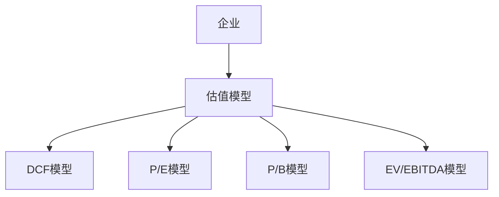
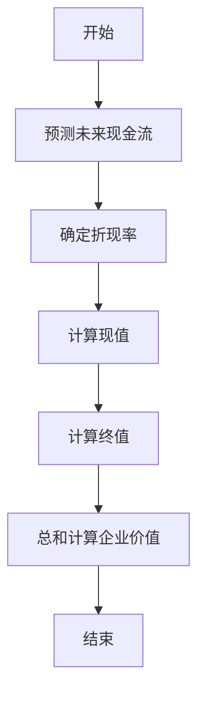
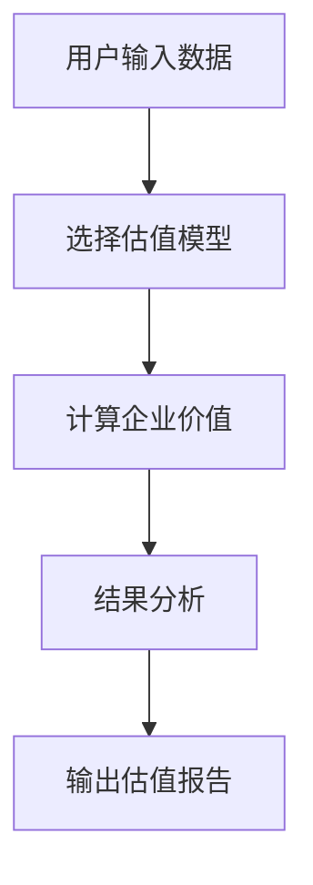
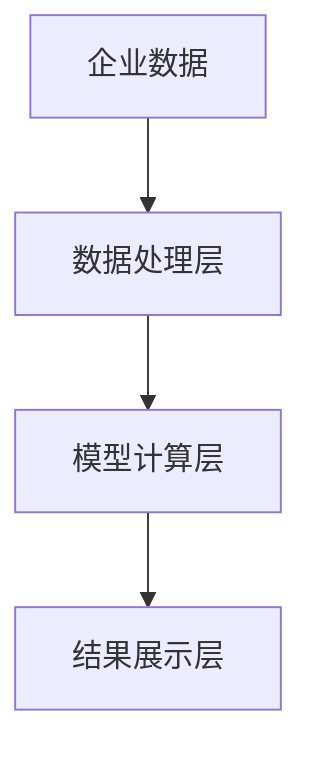
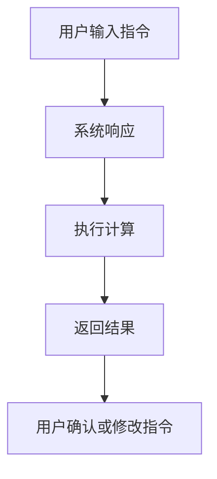

                 


# 不同行业的企业估值模型对比

**关键词**：企业估值模型、DCF模型、P/E模型、P/B模型、EV/EBITDA模型、行业差异、估值对比

**摘要**：本文系统地探讨了不同行业的企业估值模型及其对比分析。首先介绍了企业估值的基本概念和核心要素，然后详细讲解了DCF、P/E、P/B和EV/EBITDA等常见模型的原理和适用场景。通过对比分析，揭示了不同行业特点对企业估值模型选择的影响，并通过实际案例展示了如何根据不同行业特点选择合适的估值模型。最后总结了企业估值模型的应用注意事项和未来研究方向。

---

# 第1章 企业估值模型的背景介绍

## 1.1 企业估值的基本概念

### 1.1.1 企业估值的定义与作用

企业估值是指通过对企业未来现金流的折现或其他财务指标的分析，估算企业整体价值的过程。它不仅是企业融资、并购等决策的重要依据，也是投资者评估企业投资价值的关键工具。

### 1.1.2 不同行业的企业特点与估值差异

不同行业的企业具有不同的商业模式、盈利结构和风险特征。例如，互联网企业通常具有高增长性和轻资产特征，而传统制造企业则更注重资产规模和稳定性。这些差异直接影响估值模型的选择和应用。

### 1.1.3 企业估值模型对比的必要性

由于不同行业具有不同的特点，单一的估值模型可能无法满足所有行业的需求。因此，对比不同模型的优劣和适用场景，选择最适合目标行业的估值方法，对企业价值的准确评估至关重要。

## 1.2 企业估值的核心要素

### 1.2.1 企业价值的构成要素

企业价值通常包括资产价值、未来现金流、品牌价值、管理团队等多个方面。其中，未来现金流是估值的核心，而资产价值是企业稳健性的基础。

### 1.2.2 估值模型的关键假设

不同的估值模型基于不同的假设。例如，DCF模型假设企业未来现金流可预测且稳定，而P/E模型则依赖于企业盈利的可持续性。

### 1.2.3 行业差异对企业估值的影响

行业的周期性、成长性和杠杆率等因素直接影响估值模型的选择和结果。例如，周期性行业更适合使用P/E模型，而非周期性行业则更适合DCF模型。

## 1.3 企业估值的常见问题

### 1.3.1 估值偏差的来源

估值偏差可能来源于数据偏差、模型假设不合理或市场环境变化等。例如，假设未来现金流增长过快可能导致高估。

### 1.3.2 行业周期对企业估值的影响

行业周期波动会影响企业盈利能力和现金流稳定性，进而影响估值结果。例如，经济衰退期可能降低企业的估值。

### 1.3.3 数据质量与估值准确性

数据质量直接影响估值准确性。例如，使用错误的财务数据可能导致估值偏差。

## 1.4 本章小结

本章介绍了企业估值的基本概念、核心要素和常见问题，强调了不同行业特点对估值模型选择的影响。

---

# 第2章 企业估值模型的核心概念与联系

## 2.1 不同企业估值模型的原理

### 2.1.1 DCF模型（Discounted Cash Flow）

DCF模型基于未来现金流的折现计算企业价值。公式如下：

$$ 企业价值 = \sum_{t=1}^{n} \frac{CF_t}{(1+r)^t} + \frac{TV}{(1+r)^n} $$

其中，$CF_t$是第t年的自由现金流，$r$是折现率，$TV$是终值。

### 2.1.2 市盈率（P/E）模型

P/E模型通过将企业股价除以每股收益（EPS）来衡量企业估值。公式如下：

$$ P/E = \frac{股价}{EPS} $$

### 2.1.3 市净率（P/B）模型

P/B模型将企业股价除以每股净资产（BPS）来衡量企业估值。公式如下：

$$ P/B = \frac{股价}{BPS} $$

### 2.1.4 EV/EBITDA模型

EV/EBITDA模型通过将企业价值（EV）除以息税折旧及摊销前利润（EBITDA）来衡量企业估值。公式如下：

$$ EV = 企业价值 = 企业市值 + 债务 - 现金 $$

$$ EV/EBITDA = \frac{EV}{EBITDA} $$

## 2.2 模型核心概念对比分析

### 2.2.1 模型属性对比表格

```markdown
| 模型名称   | 核心指标 | 适用场景 | 优缺点 |
|------------|----------|----------|--------|
| DCF模型    | 自由现金流 | 稳定行业 | 精准但复杂 |
| P/E模型    | 净利润    | 周期性行业 | 简单但受周期影响 |
| P/B模型    | 净资产    | 非周期性行业 | 稳定但忽略收益 |
| EV/EBITDA模型 | EBITDA    | 多行业通用 | 平衡收益与成本 |
```

### 2.2.2 ER实体关系图



## 2.3 本章小结

本章对比了不同估值模型的原理、适用场景和优缺点，为后续分析奠定了基础。

---

# 第3章 企业估值模型的算法原理

## 3.1 DCF模型的算法原理

### 3.1.1 DCF模型的公式推导

DCF模型通过预测企业未来现金流并将其折现计算企业价值。公式如下：

$$ 企业价值 = \sum_{t=1}^{n} \frac{CF_t}{(1+r)^t} + \frac{TV}{(1+r)^n} $$

### 3.1.2 DCF模型的计算流程



### 3.1.3 DCF模型的优缺点

- **优点**：考虑了时间价值和资金机会成本，适用于现金流稳定的行业。
- **缺点**：假设未来现金流可预测，可能在高波动行业导致偏差。

---

# 第4章 企业估值模型的系统分析与架构设计

## 4.1 系统功能设计

### 4.1.1 系统功能模块

- 数据输入模块：收集企业财务数据和行业信息。
- 模型选择模块：根据行业特点选择合适的估值模型。
- 计算模块：执行估值计算并输出结果。
- 结果分析模块：对比不同模型的估值结果并提供建议。

### 4.1.2 系统功能流程图



## 4.2 系统架构设计

### 4.2.1 系统架构图



### 4.2.2 系统接口设计

- 数据接口：与企业财务系统对接，获取实时数据。
- 计算接口：调用不同估值模型的算法接口。
- 展示接口：将结果以图表形式展示给用户。

## 4.3 系统交互设计

### 4.3.1 交互流程图



---

# 第5章 企业估值模型的项目实战

## 5.1 项目背景

本项目旨在通过不同行业的案例分析，验证不同估值模型的适用性和准确性。

## 5.2 实战环境搭建

### 5.2.1 环境配置

- 操作系统：Windows 10
- 开发工具：Python 3.8、Jupyter Notebook
- 库：pandas、numpy、scipy

### 5.2.2 数据来源

使用公开企业财务数据和行业分析报告。

## 5.3 核心实现

### 5.3.1 DCF模型实现

```python
import numpy as np

def calculate_dcf(discounted_cash_flows, discount_rate, terminal_value):
    present_value = 0
    for t, cf in enumerate(discounted_cash_flows):
        if t == 0:
            present_value += cf
        else:
            present_value += cf / (1 + discount_rate)**t
    present_value += terminal_value / (1 + discount_rate)**len(discounted_cash_flows)
    return present_value

# 示例数据
discounted_cash_flows = [100, 150, 200]
discount_rate = 0.1
terminal_value = 500

value = calculate_dcf(discounted_cash_flows, discount_rate, terminal_value)
print(f"企业价值: {value:.2f}")
```

### 5.3.2 P/E模型实现

```python
def calculate_pe_ratio(price, eps):
    return price / eps

# 示例数据
price = 100
eps = 2.5

pe_ratio = calculate_pe_ratio(price, eps)
print(f"P/E比率: {pe_ratio:.2f}")
```

### 5.3.3 P/B模型实现

```python
def calculate_pb_ratio(price, book_value_per_share):
    return price / book_value_per_share

# 示例数据
price = 100
book_value_per_share = 5

pb_ratio = calculate_pb_ratio(price, book_value_per_share)
print(f"P/B比率: {pb_ratio:.2f}")
```

### 5.3.4 EV/EBITDA模型实现

```python
def calculate_ev_ebitda(ev, ebitda):
    return ev / ebitda

# 示例数据
ev = 500
ebitda = 100

ev_ebitda_ratio = calculate_ev_ebitda(ev, ebitda)
print(f"EV/EBITDA比率: {ev_ebitda_ratio:.2f}")
```

## 5.4 案例分析

### 5.4.1 互联网行业案例

以某互联网企业为例，使用DCF模型进行估值。

### 5.4.2 制造业案例

以某制造企业为例，使用EV/EBITDA模型进行估值。

### 5.4.3 金融行业案例

以某银行为例，使用P/B模型进行估值。

### 5.4.4 医疗行业案例

以某医疗企业为例，使用P/E模型进行估值。

## 5.5 模型对比与分析

通过不同行业案例的对比，分析各模型的优缺点，并总结不同行业适用的最佳模型。

## 5.6 本章小结

本章通过实际案例分析，验证了不同估值模型在不同行业中的应用效果，并总结了模型选择的经验。

---

# 第6章 企业估值模型的最佳实践与总结

## 6.1 最佳实践

### 6.1.1 数据质量的重要性

确保使用高质量的财务数据和行业信息。

### 6.1.2 模型选择的灵活性

根据行业特点选择合适的估值模型，避免单一模型的局限性。

### 6.1.3 模型假设的合理性

合理假设是模型准确性的关键，需结合行业实际情况进行调整。

### 6.1.4 结果验证的重要性

通过历史数据验证模型的有效性，并定期更新模型参数。

## 6.2 本章小结

本章总结了企业估值模型的应用注意事项和最佳实践，为读者提供了实际操作的指导。

---

# 结语

企业估值模型是评估企业价值的重要工具，不同行业具有不同的特点和需求，选择合适的估值模型对企业价值的准确评估至关重要。本文通过系统分析和实际案例，为企业估值模型的选择和应用提供了有价值的参考。

---

**作者：AI天才研究院/AI Genius Institute & 禅与计算机程序设计艺术 /Zen And The Art of Computer Programming**

